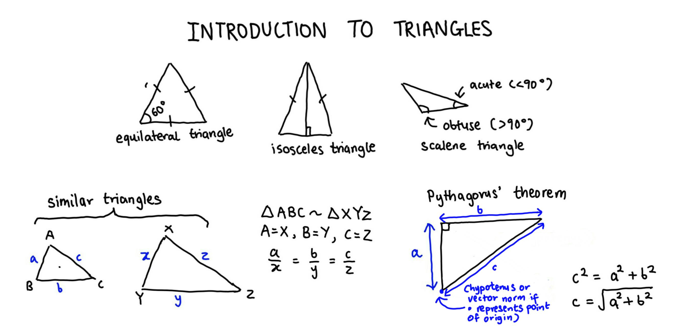

---
title: Algebra revision     
author: Erika Duan  
date: "`r Sys.Date()`"  
output: 
  github_document:
    toc: TRUE
    pandoc_args: --webtex  
---  

```{r setup, include=FALSE}
knitr::opts_chunk$set(echo=TRUE, results='hide', fig.align='center')   
knitr::knit_engines$set(python = reticulate::eng_python)   
```

```{r, echo=FALSE, message=FALSE, warning=FALSE}  
# Load required R packages -----------------------------------------------------
if (!require("pacman")) install.packages("pacman") 
p_load(tidyverse,
       scales,
       reticulate,
       knitr) 

conda_list() # List all available conda environments    
use_condaenv("r-reticulate")
```

```{r, echo=FALSE}
# Set plugin to knit Python code chunks ----------------------------------------
py_run_string("import os as os")
py_run_string("os.environ['QT_QPA_PLATFORM_PLUGIN_PATH'] = 'C:/Users/user/Anaconda3/envs/r-reticulate/Library/plugins/platforms'")    
```


# Resources   

This algebra revision section is taken from the unit on algebra [trigonometry](https://www.mathsisfun.com/algebra/trigonometry-index.html) from MathsisFun.com. All credit should be attributed to these sources.        


# Introduction to triangles     

A brief revision of triangles is shown below. 

```{r, echo=FALSE, results='markup', fig.align='center', out.width='90%'}
   
```

Triangles and angles are an important mathematical concept to revise, as vector similarity is calculated based on concepts from geometry and trigonometry. The definition of vector norms (the distance of a vector from its origin) and how they behave is also derived from trigonometry insights.    


# Triangle inequality theorem      

Any side of a triangle must be shorter than the other two sides added together. If the side is equal to the other two sides, the length of one side is 0 and the object is a line.   

```{r, echo=FALSE, results='markup', fig.align='center', out.width='80%'}
knitr::include_graphics("../02_figures/01_angles-revision-2.jpg")   
```


# Further reading   

+ A [revision](https://www.mathsisfun.com/algebra/trigonometry-index.html) of basic trigonometry concepts from mathsisfun.com.   