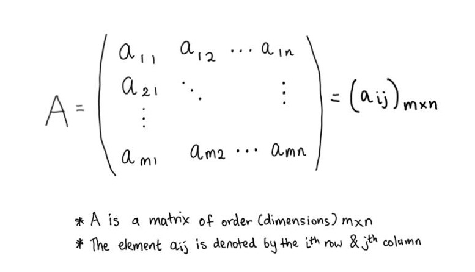
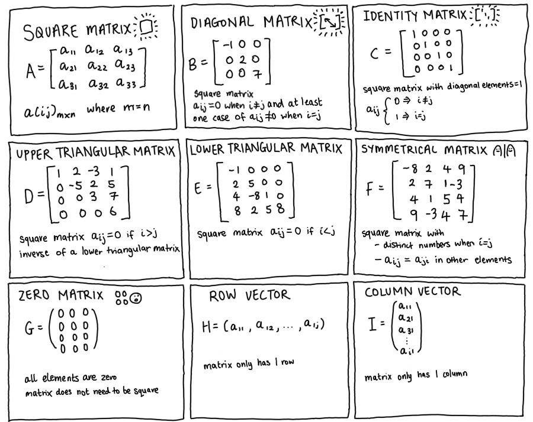

Introduction to matrices in R and Python
================

  - [Matrix structure](#matrix-structure)
      - [Subsetting matrices in R](#subsetting-matrices-in-r)
      - [Subsetting matrices in Python](#subsetting-matrices-in-python)
      - [Creating matrices in R](#creating-matrices-in-r)
      - [Creating matrices in Python](#creating-matrices-in-python)
  - [Coding resources](#coding-resources)

# Matrix structure



Different types of matrices exist. Each type has a specific structure
and form of symmetry.



## Subsetting matrices in R

In R, we can create matrices using `matrix` or `as.matrix` and subset
individual elements based on position \[i, j\].  
Subsetting matrix elements will return a numerical vector or another
matrix, depending on how many rows or columns are selected.

``` r
#-----creating a matrix from a vector-----  
m <- matrix(data = c(0, 2, 4, 8,
                     -3, 1, 3, 5,
                     -4, 7, 26, -1)  ,
            nrow = 3, 
            ncol = 4, 
            byrow = T)

m[1, 1] 
#> 0 

m[3, ] 
#> -4 7 26 -1 

m[, 3] 
#> 4 3 26

# returns a numerical vector

m[, c(1, 3)] 
#>    [,1] [,2]
#> [1,]    0    4
#> [2,]   -3    3
#> [3,]   -4   26

# returns a matrix
```

## Subsetting matrices in Python

In Python, matrices can be stored as nested lists (not advisable for
matrix subsetting purposes) or as a numpy array using the `NumPy`
package (advised format).

**Notes:**

  - Subsetting a matrix element from a nested list in Python requires a
    sequence of square brackets i.e. \[row number\]\[position of a value
    in that row\].  
  - In contrast, subsetting a matrix in R requires a single square
    bracket i.e. \[row position:column position\].

<!-- end list -->

``` python
#-----subsetting matrices stored as a nested list-----  
m = [[1, 4, 5], 
    [-5, 8, 9]] 
    
print(m)
#> [[1, 4, 5], [-5, 8, 9]]

type(m) 
#> <class 'list'>  

m[0]
#> [1, 4, 5]  

m[0][1]
#> [4]  

m[-1] 
#> [-5, 8, 9]] 

# no direct way to subset a column from a nested list  
```

## Creating matrices in R

In R, the function `matrix` requires a vector input and arguments
specifying how that vector will be reshaped into a matrix (using `nrow`,
`ncol` and `byrow` arguments).

**Notes:**

  - The argument `byrow` is set to `TRUE` by default but it is safest to
    explicitly call this argument.
  - Vector names are not carried over `matrix` conversions.
  - You can store matrix row and column names using the `dimnames`
    attribute. Alternatively, it may be easier to store the matrix as a
    `list` with 3 objects - the data, row names and column names.

<!-- end list -->

``` r
#-----creating a matrix from a vector-----  
vector_1 <- c(0, 2, 4, 5,
              -3, 1, 3, 5,
              -4, 7, 26, -1)  

matrix(vector_1,
       nrow = 3,
       ncol = 4, 
       byrow = T) 
#>      [,1] [,2] [,3] [,4]
#> [1,]    0    2    4    5
#> [2,]   -3    1    3    5
#> [3,]   -4    7   26   -1

names(vector_1) <- c(LETTERS[1:length(vector_1)]) 

(vector_1)
#> A  B  C  D  E  F  G  H  I  J  K  L 
#> 0  2  4  5 -3  1  3  5 -4  7 26 -1 

matrix(vector_1,
       nrow = 3,
       ncol = 4, 
       byrow = T) 
#>      [,1] [,2] [,3] [,4]
#> [1,]    0    2    4    5
#> [2,]   -3    1    3    5
#> [3,]   -4    7   26   -1

# vector names are not stored 
```

The function `as.matrix` works on data frames and the dimensions of the
data frame override `nrow`, `ncol` and `byrow` arguments.

``` r
#-----converting a data frame into a matrix-----  
df_1 <- data.frame("apple_sales" = c(1, 3, 5, 6), # 1st column  
                   "banana_sales" = c(4, 9, 3, 5), # 2nd column  
                   "carrot_sales" = c(2, 2, 0, 1), # 3rd column  
                   "daikon_sales" = c(0, 1, 0, 1)) # 4th column    

matrix_1 <- as.matrix(df_1)  

(matrix_1)  
#>      apple_sales banana_sales carrot_sales daikon_sales
#> [1,]           1            4            2            0
#> [2,]           3            9            2            1
#> [3,]           5            3            0            0
#> [4,]           6            5            1            1

#-----using dimnames to name matrix rows and columns-----
dimnames(matrix_1) <- list(row_names = c("1st_Qr",
                                         "2nd_Qr",
                                         "3rd_Qr",
                                         "4th_Qr"),
                           col_names = c("apples",
                                         "bananas",
                                         "carrots",
                                         "daikons"))  

(matrix_1) 
#>          col_names
#> row_names apples bananas carrots daikons
#>    1st_Qr      1       4       2       0
#>    2nd_Qr      3       9       2       1
#>    3rd_Qr      5       3       0       0
#>    4th_Qr      6       5       1       1  

# it may be easier to create a list to store row and column names

colnames(matrix_1) <- NULL

rownames(matrix_1) <- NULL

matrix_2 <- list(data = matrix_1,
                 row_names = c("1st_Qr",
                               "2nd_Qr",
                               "3rd_Qr",
                               "4th_Qr"),
                 col_names = c("apples",
                               "bananas",
                               "carrots",
                               "daikons"))  

names(matrix_2) 
#> "data"      "row_names" "col_names"
```

## Creating matrices in Python

In python, it is more efficient to create and store matrices as numpy
arrays. This makes the matrix easier to subset and/or transform.

**Notes:**

  - To create matrices, the easiest way is to create a `np.array` from a
    nested list.  
  - Matrices can also be created using the `.reshape()` method.  
  - Functions like `np.zeros`, `np.ones` and `np.identity` allow you to
    create special matrix structures.

<!-- end list -->

``` python
#-----creating a numpy array matrix-----   
import numpy as np  

matrix_1 = np.array([[1, 2, 3],
                     [4, -5, 6]])
                    
print(matrix_1) 
#> [[ 1  2  3]
#>  [ 4 -5  6]]

print(type(matrix_1))   
#> <class 'numpy.ndarray'>    

matrix_2 = np.arange(start = -2, stop = 16, step = 2).reshape(3,3)

print(matrix_2)
#> [[-2  0  2]
#>  [ 4  6  8]
#>  [10 12 14]]

#-----creating a zero matrix-----
zeros_matrix = np.zeros(shape = (2, 3),
                        dtype = float)

print(zeros_matrix)
#> [[0. 0. 0.]
#>  [0. 0. 0.]]

#-----creating a matrix of ones-----
ones_array = np.ones((1, 5))

print(ones_array)
#> [[1. 1. 1. 1. 1.]]

#-----creating an identity matrix-----  
matrix_identity = np.identity(n = 3) 

print(matrix_identity)
#> [[1. 0. 0.]
#>  [0. 1. 0.]
#>  [0. 0. 1.]]
```

Subsetting and slicing matrices can be performed when they are stored as
numpy arrays. The resulting product is also stored as a numpy array.

``` python
#-----subsetting matrices stored as numpy arrays-----  
m = np.array([[1, 4, 5], [-5, 8, 9], [0, 1, -1]]) 

print(m)
#> [[ 1  4  5]
#>  [-5  8  9]
#>  [ 0  1 -1]]

m[0]
#> array([-5,  8,  9]) 

m[:, 0]
#> array([ 1, -5,  0])

m[0:(1 + 1), 1:(2 + 1)] 
#> array([[4, 5],
#>        [8, 9]])

# remember slicing from a to b is written in Python as [a:(b + 1)]  
```

# Coding resources

**Online articles:**

  - [Performing matrix operations in
    Python](https://www.programiz.com/python-programming/matrix)  
  - [Subsetting a column from a nested list in
    Python](https://stackoverflow.com/questions/44360162/how-to-access-a-column-in-a-list-of-lists-in-python)
