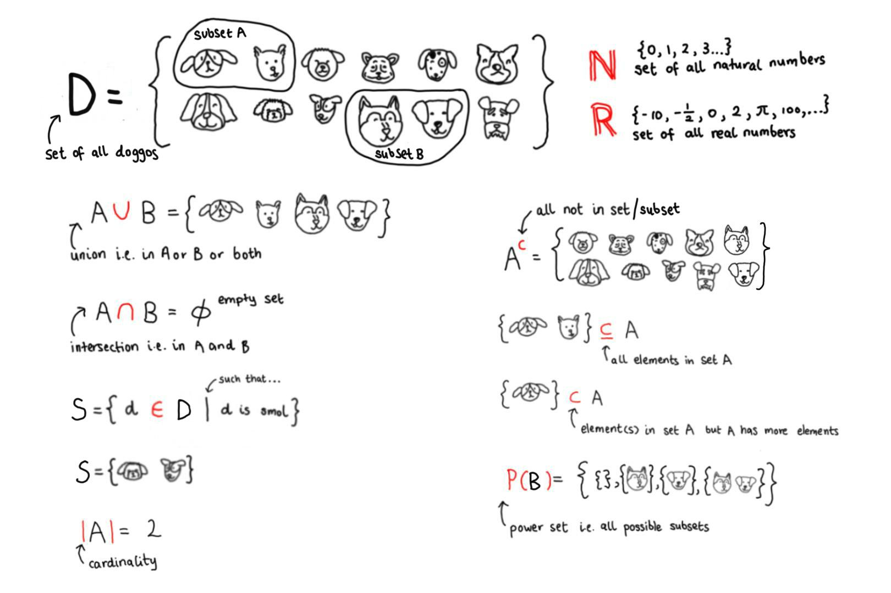

```{r setup, include = FALSE}
knitr::opts_chunk$set(echo = TRUE, results = 'hide')
knitr::knit_engines$set(python = reticulate::eng_python)
```

```{r, echo = FALSE, message = FALSE, warning = FALSE}  
#-----load required R packages-----
if (!require("pacman")) install.packages("pacman") 
p_load(tidyverse,
       reticulate) 

conda_list() # list all available conda environments

use_condaenv("Anaconda3")
```


# What is a mathematical set?  

A [set](https://en.wikipedia.org/wiki/Set_(mathematics)) is a collection of **distinct** mathematical objects.     
It is helpful for denoting:

+ Belonging i.e. $a \in A$ or element a is an object within set A.     
+ Inclusion i.e. $A \subset B$ or set A is a smaller subset within set B.           

Sets do not need to be ordered and are contained within `{}`. This nonemclature is preserved in Python.     
Two sets are equal if and only if they contain the same elements.  

```{python}
#-----create a set in Python-----   
set_1 = {1, 3, 4, 3, 5, 8, 8}
set_1
#> {1, 3, 4, 5, 8}  
```


## Set notation  

We create subsets by asserting new subset properties i.e. a condition $S(x)$ only holds true for a subset of elements within a set.   

```{r, echo = FALSE, fig.align = 'center', out.width = '60%'} 

```

