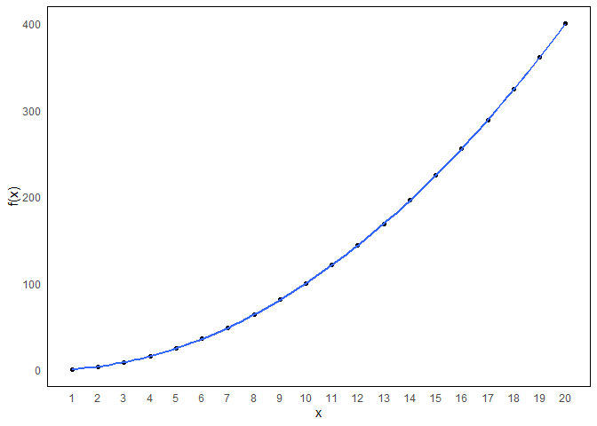

Introduction to sets
================
Erika Duan
2020-12-27

  - [Resources](#resources)
  - [What is a mathematical set?](#what-is-a-mathematical-set)
      - [Set notation](#set-notation)
      - [Relations](#relations)
      - [Functions](#functions)

# Resources

This section on mathematical sets is taken from [Introduction to Linear
Algebra for Applied Machine Learning with
Python](https://pabloinsente.github.io/intro-linear-algebra#sets) by
Pablo Caceres. All credit should be attributed to Pablo Caceres.

# What is a mathematical set?

A [set](https://en.wikipedia.org/wiki/Set_\(mathematics\)) is a
collection of **distinct** mathematical objects.  
It is helpful for denoting:

  - Belonging i.e.  or
    element a is an object within set A.  
  - Inclusion i.e.  or set A is a smaller subset within set B.

Sets do not need to be ordered and are contained within `{}`. This
nonemclature is preserved in Python.  
Two sets are equal if and only if they contain the same elements.

``` python
#-----create a set in Python-----   
set_1 = {1, 3, 4, 3, 5, 8, 8}
set_1
#> {1, 3, 4, 5, 8}  
```

## Set notation

Set notation is used to describe object belonging.  
We can also use set notation to create subsets by asserting new subset
properties i.e. by specifying a condition which only holds true for a
subset of elements within a larger set.


## Relations

Pairs of sets can be unordered or ordered:

  - For an unordered set pair, .  
  - For an ordered set pair with binary relationships,  \\neq (y,x)").

Sets of ordered pairs can be denoted using the concept of relations.
Relations have a domain and range.

**Domain:** the values of x such that at least one element of y has an
(x, y) ordered relationship.  
\\}")

**Range:** the values of y such that at least one element of x has an
(x, y) ordered relationship.  
\\}")

## Functions

We can also consider functions as a relationship between ordered set
pairs.  
A function transforms an element x to a corresponding value of y,
i.e. for each ,  exists
such that \\in f").

This can also be denoted as a relation between ordered set pairs such
that:

  -  or
  -  = y")

In machine learning, we are interested in learning functional
relationships from data, where the domain is a vector of variables that
is transformed onto a vector of target values.

``` r
#-----create a simple function in R-----  
f1 <- tibble(x = c(seq(1, 20)),
             fx = x^2)  

#-----plot function-----
f1 %>%
  ggplot(aes(x, fx)) +
  geom_point() +
  geom_smooth(formula = y ~ x^2, color = "salmon") + # plot a line of best fit according to a formula  
  scale_x_continuous(breaks = seq(min(f1$x), max(f1$x))) +
  labs(y = "f(x)") + 
  theme_minimal() +
  theme(panel.border = element_rect(fill = NA, color = "black"),
        panel.grid = element_blank())
```



``` python
#-----create a simple function in Python-----  
import numpy as np  
import pandas as pd  
import matplotlib.pyplot as plt  
import seaborn as sns  

x = pd.Series(np.arange(1, 20+1, 1))  
fx = x.apply(lambda x: x ** 2)

f2 = pd.DataFrame({'x_values' : x, 'fx_values' : fx})

#-----plot function-----
sns.set_style("white") 

sns.scatterplot(data = f2, x = 'x_values', y = 'fx_values')
sns.lineplot(data = f2, x = 'x_values', y = 'fx_values', color = 'salmon')
```

``` python
plt.xlabel('x')
plt.ylabel('f(x)')
plt.show()  
```


