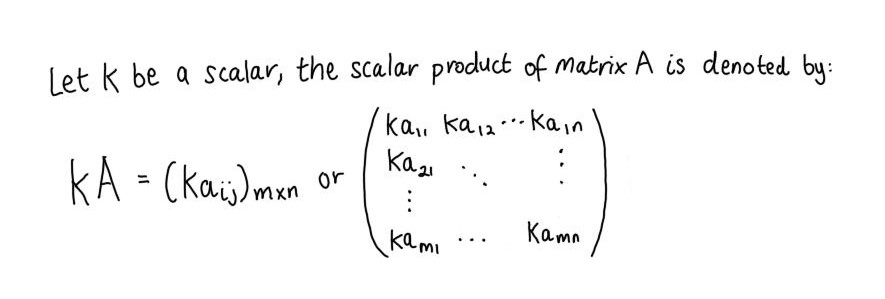
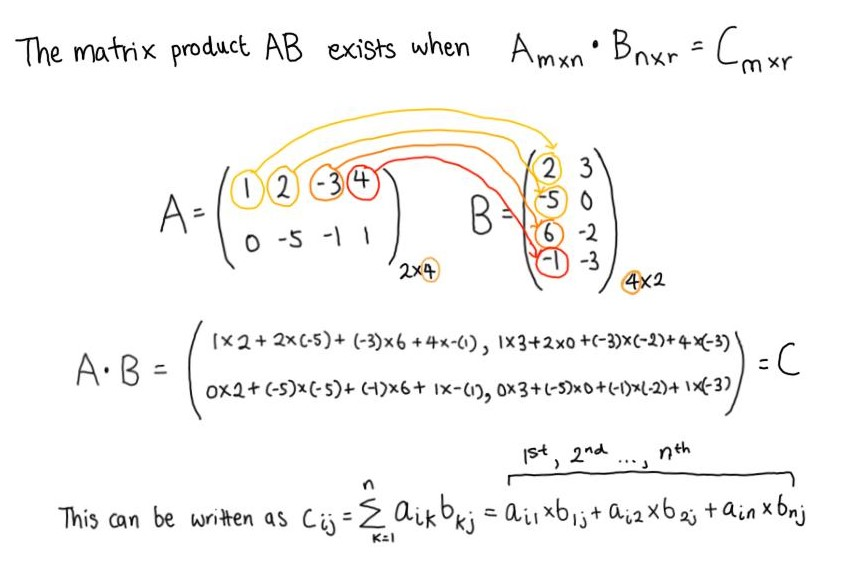
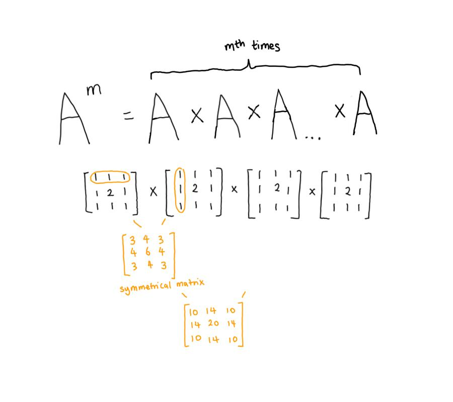

```{r, echo = FALSE, message = FALSE, results = 'hide'}
#-----load required R packages-----
if (!require("pacman")) install.packages("pacman") 

p_load(tidyverse,
       compare,
       reticulate,
       expm,
       knitr,
       DT) 

#-----configuring reticulate for python/anaconda-----
py_discover_config() #discover python version 

#-----specify the python path-----
use_python(python = "C:/Users/user/ANACON~1",
           required = T)
```


# Equality of 2 matrices  

Two matrices are equal if they have the same dimensions and their corresponding elements are equal.  


## Checking matrices equality in R  

In R, this can be checked using a Boolean expression (i.e. using `==`) or the `compare` package. Both methods will produce logical statements that are either TRUE or FALSE.    

```{r, eval = FALSE}
#-----matrix equality test-----
a <- matrix(data = c(4, -2, 7,
                    -2, -1, -2),
            nrow = 2,
            ncol = 3,
            byrow = T)

b <- a   

a == b 
#>      [,1] [,2] [,3]
#> [1,] TRUE TRUE TRUE
#> [2,] TRUE TRUE TRUE

# prints a Boolean matrix

summary(a == b) 
#>     V1             V2             V3         
#>  Mode:logical   Mode:logical   Mode:logical  
#>  TRUE:2         TRUE:2         TRUE:2   

# logical outputs are summed by matrix column  
 
colSums(a == b)  
#> [1] 2 2 2

# displays sums by column of all TRUE values (i.e. TRUE == 1) 

compare::compare(a, b,
                 equal = T) 
#> TRUE

#-----unequal matrices-----  
c <- matrix(data = c(4, -2, 8,
                    -2, -1, -2),
            nrow = 2,
            ncol = 3,
            byrow = T)

summary(a == c) 
#>     V1             V2              V3         
#>  Mode:logical   Mode:logical   Mode :logical  
#>  TRUE:2         TRUE:2         FALSE:1        
#>                                TRUE :1  

colSums(a == c)  
#> [1] 2 2 1
```


## Checking matrices equality in Python    

In Python, this can be checked using logical comparison (i.e. using `==`) or by using the method `np.array_equal` or `np.array_equiv`.  

```{python, eval = FALSE}  
#-----matrix equality test-----
import numpy as np  

matrix_1 = np.array([[1, 2, 3],
                    [4, -5, 6]]) 
                    
matrix_2 = np.copy(matrix_1)  

matrix_1 == matrix_2
#> array([[ True,  True,  True],
#>        [ True,  True,  True]])

np.array_equal(matrix_1, matrix_2) # test if same shape, same elements values
#> True 

np.array_equiv(matrix_1, matrix_2)  # test if broadcastable shape, same elements values
#> True

#-----unequal matrices-----  
matrix_3 = np.array([[1, 2, 3],
                     [4, -5, 9]])  
                    
np.array_equal(matrix_1, matrix_3)
#> False
```


# Scalar multiplication   

The scalar product of a matrix is given below.   

```{r, echo = FALSE, fig.align = 'center', fig.show = 'hold', out.width = '70%'}

```

**Note:** The same principle holds for division, as it is an inverse multiplication operation i.e: $M\times \frac{1}{n} = \frac{M}{n}$.     


## Scalar multiplication in R    

```{r, eval = FALSE}
#-----scalar multiplication-----
a <- matrix(data = c(3, 4, 5, -2,
                     1, 0, -3, 2),
            nrow = 2,
            byrow = T)

(a)
#>      [,1] [,2] [,3] [,4]
#> [1,]    3    4    5   -2
#> [2,]    1    0   -3    2

((1/2) * a)  
#>      [,1] [,2] [,3] [,4]
#> [1,]  1.5    2  2.5   -1
#> [2,]  0.5    0 -1.5    1

(a/2)
#>      [,1] [,2] [,3] [,4]
#> [1,]  1.5    2  2.5   -1
#> [2,]  0.5    0 -1.5    1

# a/2 is the same as the scalar multiple (1/2) * a  
```


## Scalar multiplication in Python  

```{python, eval = FALSE}  
#-----scalar multiplication-----  
import numpy as np  

matrix_1 = np.array([[1, 2, 3],
                    [4, -5, 6]])
                    
print(matrix_1) 
#> [[ 1  2  3]
#>  [ 4 -5  6]]

matrix_2 = matrix_1 * 3

print(matrix_2)
#> [[  3   6   9]
#>  [ 12 -15  18]]  

matrix_3 = matrix_1 / (1/3)

print(matrix_3)
#> [[  3.   6.   9.]
#>  [ 12. -15.  18.]] 

np.array_equal(matrix_2, matrix_3) 
#> True
```


# Addition of 2 matrices   

The rules of addition apply if two matrices have the same order (m and n are the same).   

```{r, echo = FALSE, fig.align = 'center', fig.show = 'hold', out.width = '70%'}
knitr::include_graphics("../02_figures/02_matrices-addition.jpg")
```


## Adding and subtracting matrices in R     

```{r, eval = FALSE}
#-----addition or subtraction of 2 matrices-----  
a <- matrix(data = c(0, 2, 4,
                     -1, -3 , -5),
            nrow = 2,
            byrow = T)

((3 * a) - (2 * a))

#>      [,1] [,2] [,3]
#> [1,]    0    2    4
#> [2,]   -1   -3   -5

#----when two matrices do not have the same order-----  
a <- matrix(data = c(0, 2, 4,
                     -1, -3 , -5),
            nrow = 2,
            byrow = T)

b <- matrix(data = c(0, 2, 4, 3, 
                     -1, -3 , -5, 2),
            nrow = 2,
            byrow = T)

(a + b)

#> Error in a + b : non-conformable arrays  
```


## Adding and subtracting matrices in Python   

```{python, eval = FALSE}    
#-----addition or subtraction of 2 matrices-----
import numpy as np  

matrix_1 = np.array([[1, 2, 3],
                    [4, -5, 6]]) 

matrix_2 = np.arange(start = 3, stop = 8 + 1, step = 1).reshape(2, 3)
print(matrix_2)  

#> [[3 4 5]
#>  [6 7 8]]

print(matrix_1 + matrix_2)

#> [[ 4  6  8]
#>  [10  2 14]]  

#-----when two matrices do not have the same order-----  
matrix_3 = np.arange(start = 3, stop = 6 + 1, step = 1).reshape(2, 2)

print(matrix_2 + matrix_3)  

#> ValueError: operands could not be broadcast together with shapes (2,3) (2,2) 
```


# Multiplication of two matrices   
  
Multiplication is only possible if the number of the number of columns of matrix A is equivalent to the number of columns of matrix B.   

```{r, echo = FALSE, fig.align = 'center', fig.show = 'hold', out.width = '70%'}

```


## Multiplying matrices in R  

```{r, eval = FALSE}
#-----when matrices can be multiplied-----
a <- matrix(data = c(1, 1, 1, 1,
                     1, 1, 1, 1),
            nrow = 2,
            ncol = 4,
            byrow = T)

b <- matrix(data = c(2, 2,
                     2, 2, 
                     2, 2,
                     2, 2),
            nrow = 4,
            ncol = 2, 
            byrow = T) 

nrow(a) == ncol(b) # must be true

#> TRUE

a %*% b # %*% is the matrix multiplication symbol    

#>      [,1] [,2]
#> [1,]    8    8
#> [2,]    8    8
```

```{r, echo = FALSE, fig.align = 'center', fig.show = 'hold', out.width = '70%'}
knitr::include_graphics("../02_figures/02_matrices-multiplication-reverse-order.jpg")
```

```{r, eval = FALSE}
#-----in matrices A * B does not equal to B * A-----
b %*% a   

#>      [,1] [,2] [,3] [,4]
#> [1,]    4    4    4    4
#> [2,]    4    4    4    4
#> [3,]    4    4    4    4
#> [4,]    4    4    4    4
```


## Multiplying matrices in Python   

The numpy function `np.dot()` returns the dot product of two arrays. When a and b are two dimensional vectors, the dot product is equivalent to matrix multiplication. For n-dimensional arrays, the dot product is a sum product over the last axis of a and the second-last axis of b.   

```{python, eval = FALSE}   
#-----when matrices can be multiplied-----  
import numpy as np  

matrix_1 = np.array([[3, 3, 3],
                     [3, 3, 3]])  
                     
matrix_2 = np.ones(shape = (3, 2)) 
print(matrix_2)   

#> [[1. 1.]
#>  [1. 1.]
#>  [1. 1.]]  

matrix_3 = np.dot(matrix_1, matrix_2)  
print(matrix_3)

#> [[9. 9.]
#>  [9. 9.]] 

# since python 3.5, the operator @ can be used to substitute np.dot()  
print(matrix_1 @ matrix_2)  

#> [[9. 9.]
#>  [9. 9.]]
```

As a proof of principle, we can also perform matrix multiplication in Python using a `for loop` and nested lists.  

```{python, eval = FALSE}  
#-----write matrices as nested lists----- 
a = [[3, 3, 3], 
     [3, 3, 3]] 

b = [[1, 1],
     [1, 1], 
     [1, 1]] 
     
len(a) # defines matrix row  
len(a[0]) # defines matrix column  

#> 2 
#> 3

len(a[0]) == len(b)  # matrix multiplication requires this to be true 

#> True  

#-----matrix multiplication for loop construction-----  

# pre-specify matrix multiplication product dimensions 
result = [[0, 0],
          [0, 0]]

# iterate through rows of a
for i in range(len(a)):
   # iterate through columns of b
   for j in range(len(b[0])):
       # iterate through rows of b
       for k in range(len(b)):
           result[i][j] += a[i][k] * b[k][j]

for r in result:
   print(r)

#-----deconstructing += usage in Python-----  

# a += b is the shorthand for a = a + b    

c = [1, 2, 3]
d = [-1, -1, -1]

d += c
print(d)

#> [-1, -1, -1, 1, 2, 3]
```


# Integral power of matrices   

The integral power of matrices is a simple definition. By definition, only integrals of square matrices exist as m (the number of rows) has to be equal to n (the number of columns).       

```{r, echo = FALSE, fig.align = 'center', fig.show = 'hold', out.width = '70%'}
  
```


## Performing matrix integrals in R    

Matrix integrals cannot be easily implemented in base R. However, the `expm` package contains functions which allow such convenient matrix calculations. It also contains `sqrtm` for performing matrix square roots and `expm` for performing matrix exponentials.        

```{r, eval = FALSE} 
#-----matrix integrals in base R-----
a <- matrix(data = c(1, 1, 1,
                     1, 2, 1,
                     1, 1, 1),
            nrow = 3,
            ncol = 3,
            byrow = T)    


matrix_1 <- (a) ^ 4 
# this only performs a power operation for all elements inside the matrix

matrix_2 <- a %*% a %*% a %*% a  

#-----matrix integrals using the expm package-----  
library(expm)  

matrix_3 <- a %^% 4 

summary(matrix_3 == matrix_2)    

#>     V1             V2             V3         
#>  Mode:logical   Mode:logical   Mode:logical  
#>  TRUE:3         TRUE:3         TRUE:3 
```


## Performing matrix integrals in Python    

```{python, eval = FALSE}  
#-----matrix integrals using numpy-----  
import numpy as np    

matrix_1 = np.array([[1, 1, 1],
                     [1, 3, 1],
                     [1, 1, 1]]) 

matrix_2 = matrix_1 ** 3  
# this only performs a power operation for all elements inside the matrix  

matrix_3 = np.linalg.matrix_power(matrix_1, 3)
print(matrix_3)  

#> [[11 21 11]
#>  [21 43 21]
#>  [11 21 11]]  
```


# Matrix transpose   

The transpose of matrix A, written as $A^T$ or $A^t$, is defined below.    

```{r, echo = FALSE, fig.align = 'center', fig.show = 'hold', out.width = '70%'}
  
```


## Calculating the matrix transpose in R   

Matices and data frames can both be transposed in R using the function `t()`.  

```{r, eval = FALSE}
#-----calculating the matrix transpose in R-----  
a <- matrix(data = c(1, 2, 3, 4, 5, 6, 7, 8),
            nrow = 4,
            ncol = 2,
            byrow = T) 
(a)

#>      [,1] [,2]
#> [1,]    1    2
#> [2,]    3    4
#> [3,]    5    6
#> [4,]    7    8

transpose_a <- t(a)
(transpose_a)  

#>      [,1] [,2] [,3] [,4]
#> [1,]    1    3    5    7
#> [2,]    2    4    6    8
```

```{r}
#-----example data frame in R-----  
iris <- datasets::iris %>%
  slice(c(5, 25, 75, 100, 150)) %>%
  select(ncol(iris), everything()) 

kable(iris)
```

```{r}
#-----transposing a data frame in R----- 
iris_transpose <- t(iris) 

kable(iris_transpose)
```


## Calculating the matrix transpose in Python    

The method `transpose` can be used to create a matrix transpose in Python. Numpy arrays and nested lists can both be manipulated using this method.    

```{python, eval = FALSE}  
import numpy as np

matrix_1 = np.array([[1, 2, 3, 4], 
                     [5, 6, 7, 8]]) 
                     
matrix_2 = matrix_1.transpose()
print(matrix_2)  

#> [[1 5]
#>  [2 6]
#>  [3 7]
#>  [4 8]]
```


# Coding resources  

**Online articles:**  

+ [How to write a nested loop for matrix multiplication in Python](https://www.programiz.com/python-programming/examples/multiply-matrix)  