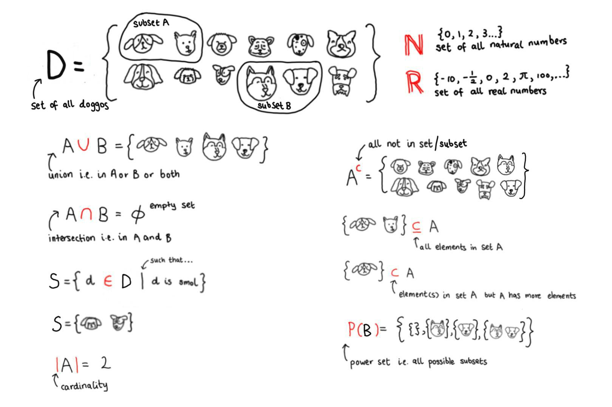

Introduction to sets
================
Erika Duan
2021-07-14

-   [Resources](#resources)
-   [What is a mathematical set?](#what-is-a-mathematical-set)
    -   [Set notation](#set-notation)
    -   [Relations](#relations)
    -   [Functions](#functions)
-   [Further reading](#further-reading)

# Resources

This section on mathematical sets is taken from [Introduction to Linear
Algebra for Applied Machine Learning with
Python](https://pabloinsente.github.io/intro-linear-algebra#vectors) by
Pablo Caceres. All credit should be attributed to Pablo Caceres.

# What is a mathematical set?

A [set](https://en.wikipedia.org/wiki/Set_(mathematics)) is a collection
of **distinct** mathematical objects.  
It is helpful for denoting:

-   Belonging
    i.e. 
    or element a is an object within set A.  
-   Inclusion
    i.e. 
    or set A is a smaller subset within set B.

Sets do not need to be ordered and are contained within `{}`. This
nomenclature is preserved in Python.  
Two sets are equal if and only if they contain the same elements.

``` python
# Create a set in Python -------------------------------------------------------   
set_1 = {1, 3, 4, 3, 5, 8, 8}
set_1
#> {1, 3, 4, 5, 8}  
```

## Set notation

Set notation is used to describe object belonging within a group.

We also use set notation to create subsets (or subgroups) by specifying
conditions which only hold true for a subset of elements within a larger
group. For example,

generates a new subset S from the set of all dogs D, where all dogs in S
are puppers.



## Relations

Pairs of sets can be unordered or ordered:

-   For an unordered set pair,
    .  
-   For an ordered set pair,
     \neq (y, x)").

Relations are defined as sets of ordered pairs and denoted using
. Relations have a
domain and range.

**Domain:** the **values of x** such that at least one element of
 has an
")
ordered relationship.  
\}")

**Range:** the **values of y** such that at least one element of x has
an (x, y) ordered relationship.  
\}")

## Functions

We can also consider functions as the relation between ordered set
pairs.  
A function transforms an element
 to its corresponding
value of , i.e. for each
, a
unique element of

exists such that
\in f").

This can also be formally denoted as:

-   
    or
-    = y")

In machine learning, we are interested in approximating or learning
functions. I.e. we are interesting in deriving the relation

where the domain comprises a matrix of predictor variables that is
transformed by a relation into a vector of response variables.

``` r
# Simulate a simple functional relationship in R -------------------------------  
# The true functional relationship is y = x ^ 2   
x1 <- seq(1, 20, 1)
simulate_y <- function(x) (x ^ 2) + rnorm(1, 0, 4)

set.seed(111)
y1 <- simulate_y(x1)

df1 <- tibble(x = x1, 
              y = y1)

# Plot function using ggplot ---------------------------------------------------
df1 %>%
  ggplot(aes(x, y)) +
  geom_point() +
  # Plot a line of best fit according to a formula
  geom_smooth(formula = y ~ x^2, color = "salmon", lwd = 0.5) +   
  scale_x_continuous(breaks = seq(min(df1$x), max(df1$x))) +
  labs(y = "f(x)",
       title = "A function will never map x to more than one solution for y.") + 
  theme_minimal() +
  theme(plot.title = element_text(hjust = 0.5),
        panel.border = element_rect(fill = NA, color = "black"),
        panel.grid = element_blank())
```


``` python
# Simulate a simple functional relationship in Python --------------------------  
# The true functional relationship is y = x ^ 2   
import numpy as np  
import pandas as pd  
import matplotlib.pyplot as plt  
import seaborn as sns  

x2 = pd.Series(np.arange(1, 20+1, 1))  
y2 = x2.apply(lambda x: x ** 2 + np.random.normal(0, 4)) 
func_relationship = x2.apply(lambda x: x ** 2) 

df2 = pd.DataFrame({'x' : x2,
                    'fx' : y2,
                    'funs' : func_relationship})

# Plot function using sns and plt ----------------------------------------------
sns.set_style("white") 

sns.scatterplot(data = df2, x = 'x', y = 'fx')
sns.lineplot(data = df2, x = 'x', y = 'funs', color = 'salmon', lw = 0.5)
plt.xticks(np.arange(1, 20 ,1))
plt.xlabel('x')
plt.ylabel('f(x)')
plt.title('Plotting in Python requires hardcoding of the true function.')
plt.show()  
```


# Further reading

-   An introduction to
    [functions](https://courses.lumenlearning.com/boundless-algebra/chapter/introduction-to-functions/#:~:text=Functions%20are%20a%20relation%20between,is%20open%20on%20two%20ends)
    from Boundless Algebra.
