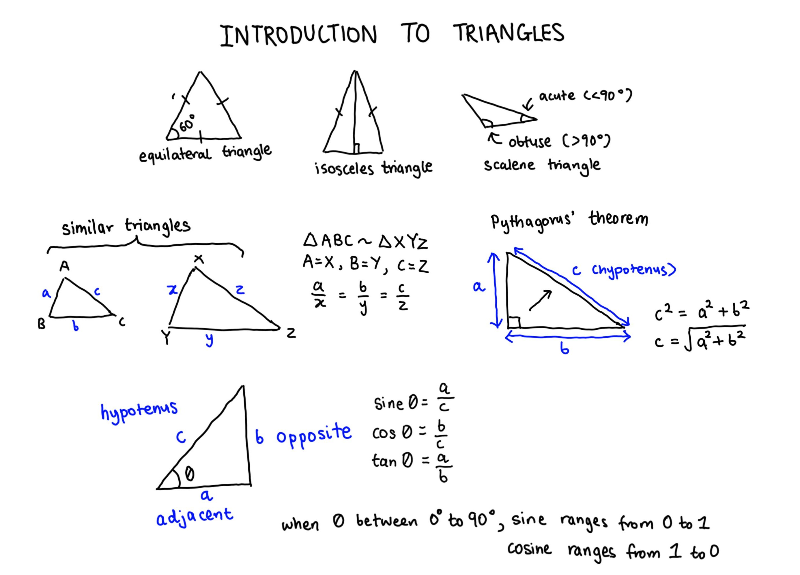
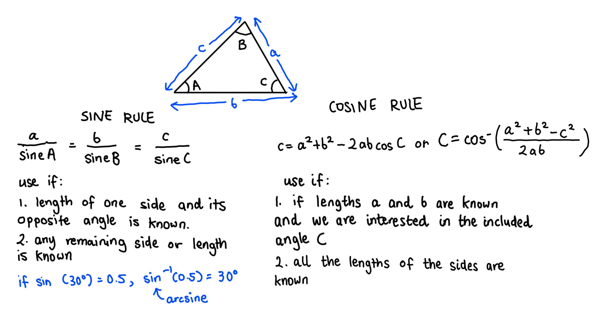
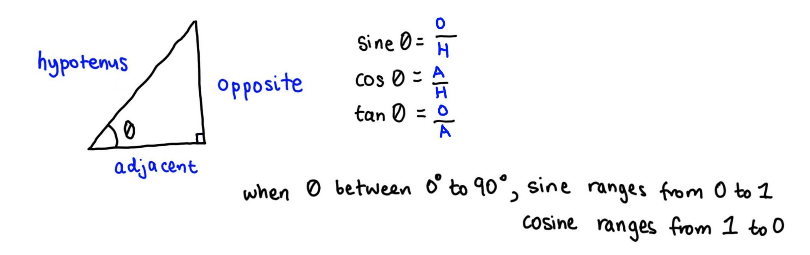
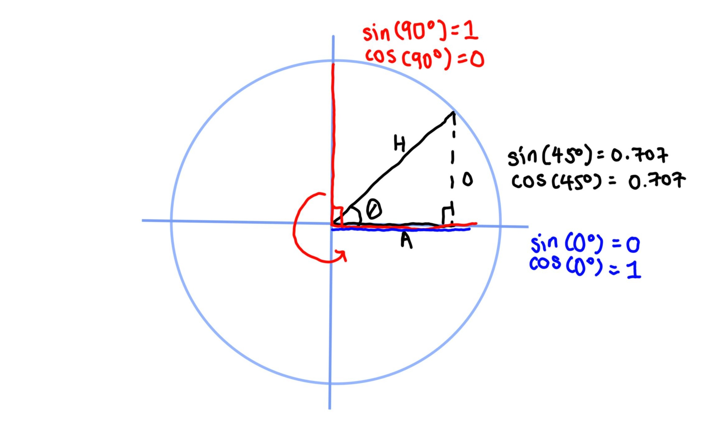
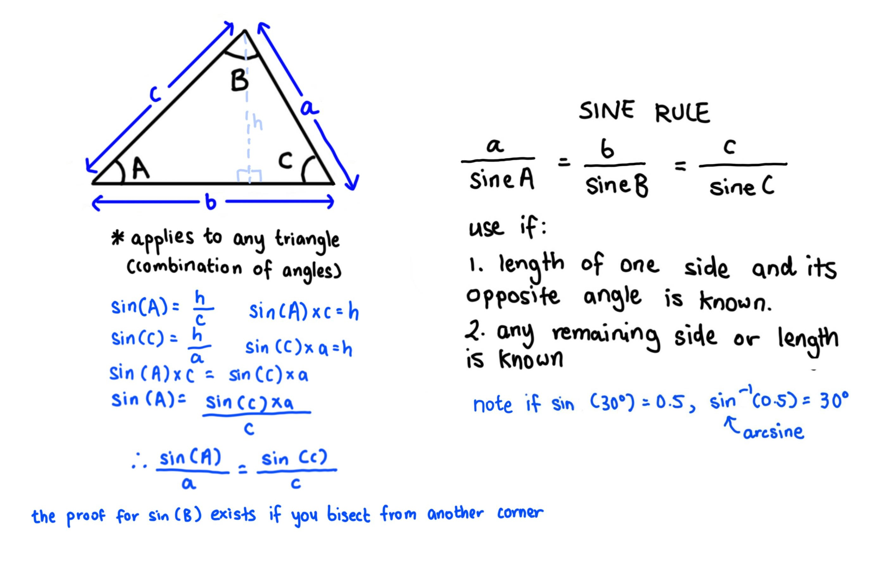
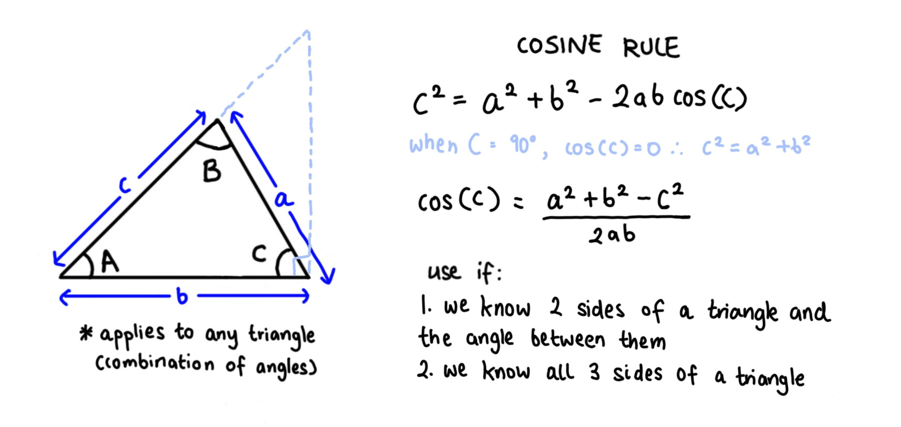
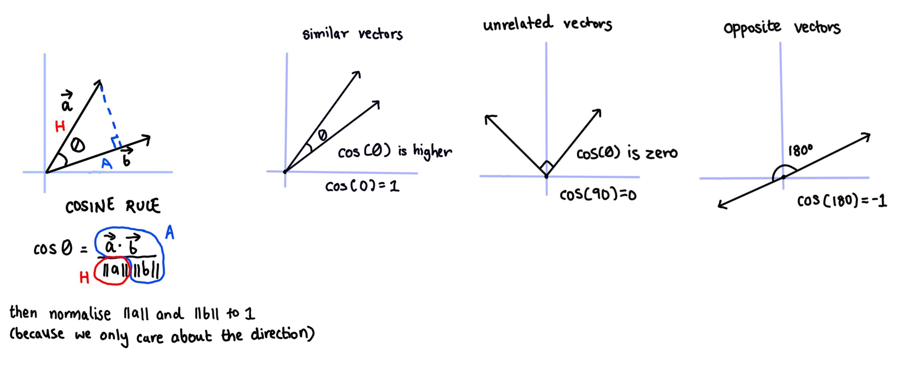
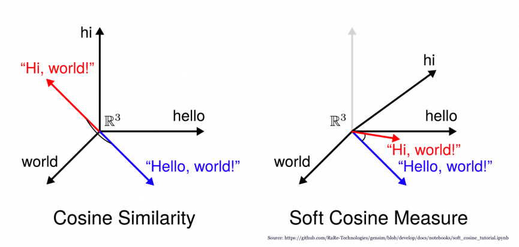

```{r setup, include = FALSE}
knitr::opts_chunk$set(echo = TRUE, results = 'hide', fig.align = 'center')
knitr::knit_engines$set(python = reticulate::eng_python)
```

```{r, echo = FALSE, message = FALSE, warning = FALSE}  
#-----load required R packages-----
if (!require("pacman")) install.packages("pacman") 
p_load(tidyverse,
       scales,
       reticulate,
       knitr) 

conda_list() # list all available conda environments
use_condaenv("Anaconda3")

py_run_string("import os as os")
py_run_string("os.environ['QT_QPA_PLATFORM_PLUGIN_PATH'] = 'C:/Users/user/Anaconda3/Library/plugins/platforms'")
```


# Resources   

This geometry revision section is taken from the unit on [triangles](https://www.khanacademy.org/math/geometry-home/triangle-properties) from the Khan Academy and the unit on [trigonometry](https://www.mathsisfun.com/algebra/trigonometry-index.html) from MathsisFun.com. All credit should be attributed to these sources.           


# Introduction to triangles     

A brief revision of triangles is shown below. 

```{r, echo = FALSE, results = 'markup', fig.align = 'center', out.width = '80%'}
   
```

Triangles and angles are an important mathematical concept to revise, as vector similarity is calculated based on concepts from geometry and trigonometry. The definition of vector norms i.e. $||x||$ and how they behave is also derived from insights from trigonometry.     


# Triangle inequality theorem      

Any side of a triangle must be shorter than the other two sides added together. If the side is equal to the other two sides, the length of one side is 0 and the object is a line.   

```{r, echo = FALSE, results = 'markup', fig.align = 'center', out.width = '80%'}
   
```


# Sine, Cosine and Tangent    

Sine, Cosine and Tangent are just a ratio of two specific sides of a right angled triangle. 

```{r, echo = FALSE, results = 'markup', fig.align = 'center', out.width = '80%'}
   
```

We are therefore only interested in values $0\leq \measuredangle \leq 90$ and the values for Sine and Cosine will always be between 0 and 1 (as the hypotenus is always equal to or larger than the opposite and the adjacent).  

```{r, echo = FALSE, results = 'markup', fig.align = 'center', out.width = '70%'}
   
```

```{python}
#-----draw sine and cosine function in Python-----   
import numpy as np
import matplotlib.pyplot as plt
import seaborn as sns  

x = np.arange(-2*np.pi, 2*np.pi, 0.1) 
sine = np.sin(x)
cosine = np.cos(x)

# Python allows you to directly plot NumPy array values  

sns.set_style('whitegrid', {
              'grid.linestyle': '--'})

sns.lineplot(x = x, y = sine, label = "Sine wave", lw = 3)
sns.lineplot(x = x, y = cosine, label = "Cosine wave", lw = 3)

plt.xlabel("x")  
plt.ylabel("sin(x) and cos(x)")
plt.legend(loc = "upper right")
plt.show()
```


```{r, out.width = '60%'}
#-----draw sine and cosine function in R-----
x <- c(seq(-2*pi, 2*pi, length.out = 100))

sine <- sin(x) # calculate sine
cosine <- cos(x) # calculate cosine  

trig_plot <- tibble(x,
                    sine,
                    cosine)  

ggplot(trig_plot, aes(x, sine)) +
  geom_line(colour = "steelblue", size = 2) +
  geom_line(aes(x, cosine), colour = "firebrick", size = 2) +
  geom_hline(yintercept = 0) + 
  geom_vline(xintercept = 0) +  
  scale_x_continuous(breaks = seq(-2 * pi, 2 * pi , pi / 2),
                     labels = c("-2\u03c0", "-3/2\u03c0", "-1\u03c0", "-1/2\u03c0", "0", "1/2\u03c0", "1\u03c0", "3/2\u03c0", "2\u03c0")) + 
  labs(y = "sin(x) and cos(x)") +   
  theme_bw() + 
  theme(panel.grid.minor = element_blank(),
        panel.grid.major = element_line(linetype = "dotted")) +
  annotate("text", x = 4, y = 1, label = "Sine wave", colour = "steelblue") +
  annotate("text", x = 4, y = 0.9, label = "Cosine wave", colour = "firebrick")
```


# The Sine rule  

The [Sine rule](https://www.mathsisfun.com/algebra/trig-sine-law.html) is useful for solving triangle angles and lengths, but does not have any direct application to machine learning algorithms.  

```{r, echo = FALSE, results = 'markup', fig.align = 'center', out.width = '80%'}
   
```


# The Cosine rule  

In contrast, the [Cosine rule](https://www.mathsisfun.com/algebra/trig-cosine-law.html) is particularly useful for calculating object similarity in machine learning, as it can be applied to calculate the angle between two lengths, given that all lengths are known.   

In trigonometry, the Cosine rule can be derived to find either an unknown length given that two sides and the angle between them are known, or an unknown angle given that all sides of the triangle are known.     

```{r, echo = FALSE, results = 'markup', fig.align = 'center', out.width = '80%'}
   
```


# Cosine similarity  

In machine learning, [cosine similarity](https://en.wikipedia.org/wiki/Cosine_similarity) is a similarity measurement between two non-zero vectors that is equal to the cosine of the angle between them. This is the same as calculating the inner product of two vectors normalised to have norms of 1 (i.e. cosine similarity only cares about vector direction and not magnitude).    

$similarity = \cos\theta=\frac{\langle x, y\rangle}{\lVert x\rVert \lVert y \rVert} = \frac{\displaystyle\sum_{i=1}^nA_iB_i}{\sqrt{\displaystyle\sum_{i=1}^nA^2_i} \times \sqrt{\displaystyle\sum_{i=1}^nB^2_i}}$   

In text mining, each unique term is assigned a different dimension, so cosine similarity calculations tend to be applied to very high dimensions. A document is then viewed as a vector whose direction is determined by the proportion of unique terms that it contains.     

```{r, echo = FALSE, results = 'markup', fig.align = 'center', out.width = '90%'}
   
```

```{python}
#-----calculate cosine similarity in Python via sklearn----- 
import pandas as pd
from sklearn.feature_extraction.text import TfidfVectorizer 
from sklearn.metrics.pairwise import cosine_similarity

documents = ["learning Python and R are not so hard",
             "do I need to learn Python to be a data scientist",
             "R is my favourite data science language",
             "I use excel spreadsheets"]
             
tfidf_vectorizer = TfidfVectorizer()
tfidf_matrix = tfidf_vectorizer.fit_transform(documents) # TF-IDF sparse matrix

doc_term_matrix = tfidf_matrix.todense()
doc_term_df = pd.DataFrame(doc_term_matrix,
                           columns = tfidf_vectorizer.get_feature_names())

doc_term_df
#>         and       are        be  ...  spreadsheets        to      use
#> 0  0.388614  0.388614  0.000000  ...       0.00000  0.000000  0.00000
#> 1  0.000000  0.000000  0.312451  ...       0.00000  0.624903  0.00000
#> 2  0.000000  0.000000  0.000000  ...       0.00000  0.000000  0.00000
#> 3  0.000000  0.000000  0.000000  ...       0.57735  0.000000  0.57735
#> 
#> [4 rows x 22 columns]

cosine_similarity(tfidf_matrix, tfidf_matrix)
#> array([[1.       , 0.0754757, 0.       , 0.       ],
#>        [0.0754757, 1.       , 0.0819141, 0.       ],
#>        [0.       , 0.0819141, 1.       , 0.       ],
#>        [0.       , 0.       , 0.       , 1.       ]])
```


# Soft cosine similarity      

An obvious weakness of the cosine similarity matrix is that $n$ terms are arbitarily assigned a dimension in ${\rm I\!R}^n$, regardless of similarities or differences in their semantics. Soft cosine similarity first implements word to vector embeddings, which allows terms with similar meanings be more closely localised together within the vector space.     

According to [Wikipedia](https://en.wikipedia.org/wiki/Cosine_similarity#Soft_cosine_measure), to calculate the soft cosine, an additional matrix $s$ is used to indicate similarity between features, as calculated through the Levenshtein distance, WordNet similarity or other measures. In practice, we use pre-built word embedding models like `word2vec`, `fasttext` and others, which have been built by training large corpuses of publicly available text data.      

```{r, echo = FALSE, results = 'markup', fig.align = 'center', out.width = '80%', fig.cap = ''}
   
```


# Further reading  

+ A great [post](https://blog.christianperone.com/2013/09/machine-learning-cosine-similarity-for-vector-space-models-part-iii/) explaining the maths behind vector dot products and cosine similarity.      

+ A [post](https://www.machinelearningplus.com/nlp/cosine-similarity/) explaining the different between cosine similarity and soft cosine similarity.    

+ A [guide](https://www.machinelearningplus.com/nlp/gensim-tutorial/) to the Python Gensim package, which is useful for creating word to vector embeddings.     