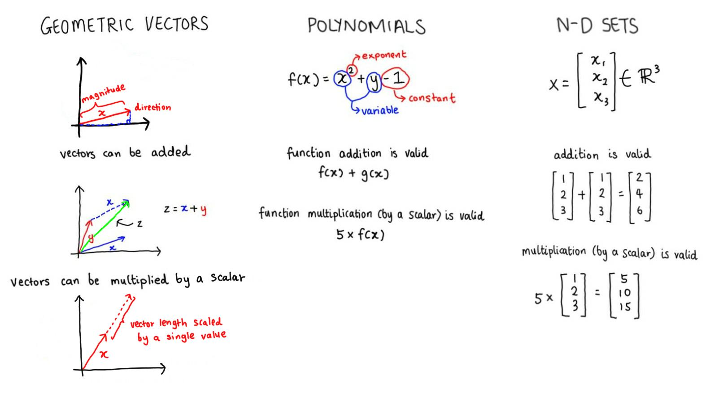
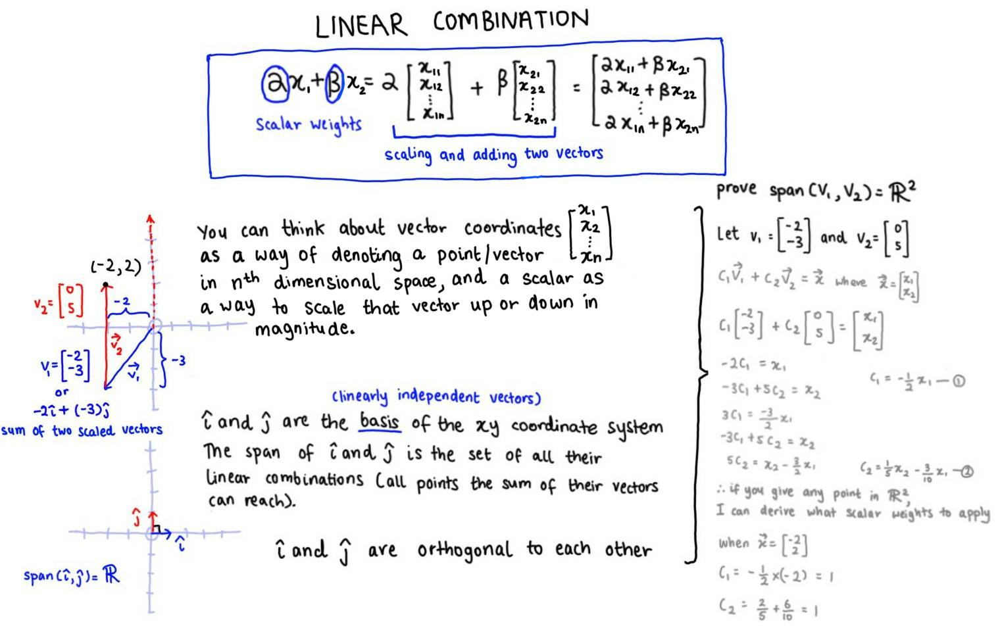
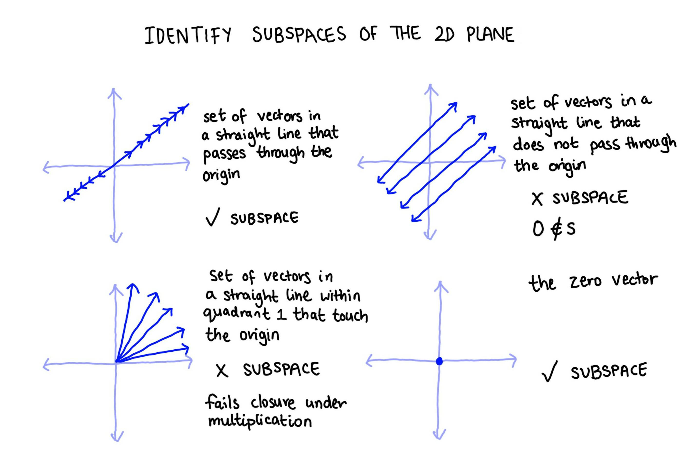
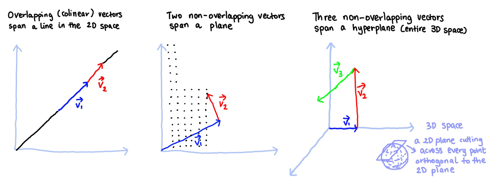
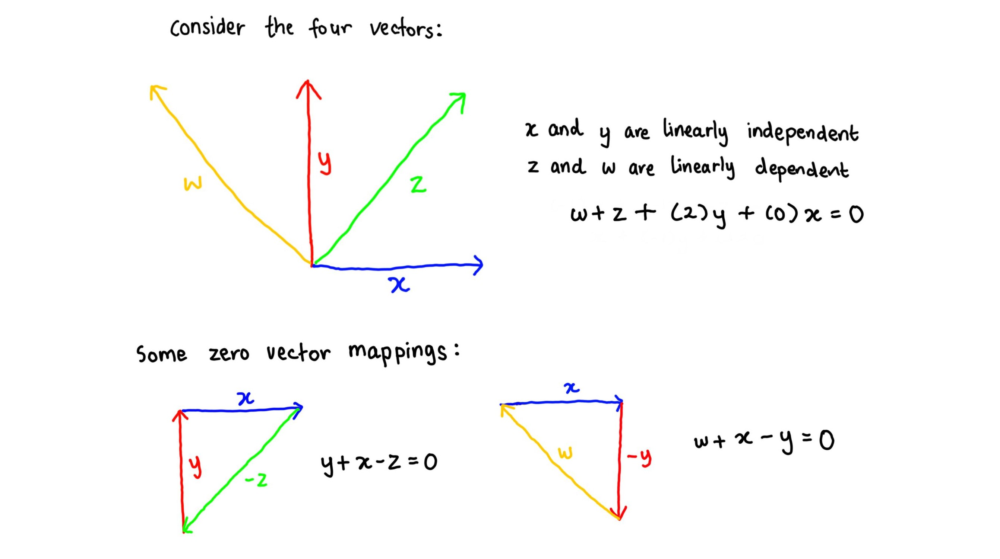

Introduction to vectors
================
Erika Duan
2021-02-14

-   [Resources](#resources)
-   [What is a vector?](#what-is-a-vector)
-   [Special vectors](#special-vectors)
-   [Vector dimensions and the coordinate
    system](#vector-dimensions-and-the-coordinate-system)
-   [Basic vector operations](#basic-vector-operations)
    -   [Vector-vector addition](#vector-vector-addition)
    -   [Vector-scalar multiplication](#vector-scalar-multiplication)
    -   [Vector linear combination](#vector-linear-combination)
    -   [Vector-vector multiplication (the
        dot-product)](#vector-vector-multiplication-the-dot-product)
-   [Vector space, span and subspace](#vector-space-span-and-subspace)
    -   [Vector span](#vector-span)
    -   [Vector subspace](#vector-subspace)
-   [Linear dependence and linear
    independence](#linear-dependence-and-linear-independence)
-   [Vector null space](#vector-null-space)
-   [Further reading](#further-reading)

# Resources

This section on vectors is taken from [Introduction to Linear Algebra
for Applied Machine Learning with
Python](https://pabloinsente.github.io/intro-linear-algebra#vectors) by
Pablo Caceres, [Linear combinations and
span](https://www.youtube.com/watch?v=Qm_OS-8COwU) by Khan Academy and
[Essence of linear
algebra](https://www.3blue1brown.com/essence-of-linear-algebra-page) by
3Blue1Brown. All credit should be attributed to these sources.

# What is a vector?

A vector is an ordered and finite list of numbers (i.e. not character
elements) and can be viewed as the most basic object in machine
learning. You can think of simple machine learning methods as
mathematical approaches to extracting information about many vectors
co-existing within one space defined by
 dimensions.

Vectors can have any number of dimensions and are mathematical objects
that can be added or multipled i.e. transformed into another vector.

Different types of vectors exist:

-   Geometrical vectors - lines with directions.  
-   [Polynomials](https://www.mathsisfun.com/algebra/polynomials.html) -
    an algebraic expression that has multiple terms (constants,
    variables and exponents) like
    =x^{2}+y+1").  
-   Elements of
     -
    sets of real numbers. A vector in
    
    has the shape below.  
    



``` python
#-----create 1 dimensional vector in Python via Numpy-----
import numpy as np 

x = np.array([np.arange(1, 10+1)])
x.shape
#> (1, 10) 
```

``` python
#-----create 3-dimensional vector in Python via Numpy-----
# note the placement of double square brackets [[y1],[y2],[y3]]

y = np.array([[1, 2, 3],
              [4, 5, 6],
              [7, 8, 9]])  
y.shape   
#> (3, 3)  
```

# Special vectors

Special vectors include:

-   Zero vectors - a vector which is only composed of zeros.  
      
-   Unit vectors - a vector containing a single element of 1 with
    remaining elements of zero. Useful for reducing the dimensions of a
    vector.  
      
-   Sparse vectors - sparse vectors predominantly contain elements of
    zero. To maximise computational efficiency, we can represent sparse
    matrices by storing only its non-zero elements in a
    `[[row], [column], [value]]` triplet array.  
    

# Vector dimensions and the coordinate system

Vectors can have any number of dimensions. During our studies, we tend
to encounter the 2-dimensional cartesian plane and 3-dimensional space,
as these can be visualised as geometric vectors. In machine learning,
however, we encounter problems involving tens, hundreds or even
thousands of dimensions.

The notation of a vector
 with
 dimensions is written
below.  


Vector dimensions map into coordinate systems, which have an origin at
(0, 0, …, 0).  

can therefore also be described as a position within a 3-dimensional
coordinate system i.e. starting at (0, 0, 0), move 1 unit in the 1st
perpendicular axis, move 2 units in the 2nd perpendicular axis and then
move 3 units in the 3rd perpendicular axis.

# Basic vector operations

## Vector-vector addition

Vector-vector addition is performed element-wise and it only applies for
vectors of the same size.


Vector-vector addition has the following properties:

-   It is commutative.
      
-   It is associative.
     + z = x + (y + z)")  
-   Addition of the zero vector has no effect.
      
-   Subtracting the vector from itself returns the zero vector.
    

``` python
#-----create and add two vectors in Python via Numpy----  
x = np.array([[1, 1],
              [2, 2],
              [3, 3]])  

x.shape # 3-dimensional NumPy array  
#> (3, 2)
```

``` python
y = np.array([[1, 0],
              [0, 1],
              [1, 1]])

x + y
#> array([[2, 1],
#>        [2, 3],
#>        [4, 4]])
```

``` python
np.add(x, y)
#> array([[2, 1],
#>        [2, 3],
#>        [4, 4]])
```

``` r
#-----create and add two vectors in R-----  
# vectors of n dimensions can be stored inside arrays   
# arrays are not typically used for analysis in R i.e. its 2D array matrix form is used instead       

x <- array(c(1, 1,
             2, 2,
             3, 3), 
           dim = c(2, 1, 3))

str(x)  
#>  num [1:2, 1, 1:3] 1 1 2 2 3 3  

y <- array(c(1, 0,
             0, 1,
             1, 1), 
           dim = c(2, 1, 3))  

str(x + y) 
#>  num [1:2, 1, 1:3] 2 1 2 3 4 4    
```

## Vector-scalar multiplication

Vector-scalar multiplication is also an element-wise operation.


Vector-scalar multiplication has the following properties:

-   It is associative.
    \times x = \alpha \times (\beta \times x)")  
-   It is left-distributive.
    x = \alpha x + \beta x")  
-   It is right-distributive.
     = x\alpha + x\beta")  
-   It is right-distributive for vector addition.
    =\alpha x+ \alpha y")

``` python
#-----vector-scalar multiplication in Python via Numpy-----
alpha = 4 

x = np.array([[1, 1],
              [2, 2],
              [3, 3]])  
             
alpha * x    
#> array([[ 4,  4],
#>        [ 8,  8],
#>        [12, 12]])
```

``` r
#-----vector-scalar multiplication in R-----  
alpha <- 4
x <- array(c(1, 1,
             2, 2,
             3, 3), 
           dim = c(2, 1, 3))

str(alpha * x)  
#> num [1:2, 1, 1:3] 4 4 8 8 12 12    
```

## Vector linear combination

A linear combination utilises the both rules of vector-vector addition
and vector-scalar multiplication.

There are a few different ways of thinking about linear combinations:

-   Graphically as the addition of two vectors to form a new vector in
    the Cartesian plane. The linear combination of the basis vectors
    
    and
    
    can be used to create any point in the 2-dimensional Cartesian
    plane.  
-   Mathmatically as the proof that any new vector can be created by a
    scalar combination of two existing basis vectors.



Another way to express linear combinations is with summation notation as
.
Note that two linearly independent vectors do not need to be orthogonal
to each other for the span of their linear combinations to be
.

``` python
#-----linear combination in Python via Numpy-----  
a, b = -2, 3 # input scalar values  

x = np.array([[2],
              [3]])

y = np.array([[4],
              [5]])  

a*x + b*y
#> array([[8],
#>        [9]]) 

#> [[-4 + 12],
#>  [-6 + 15]]  
```

``` r
#-----linear combinations in R----- 
a <- -2
b <- 3

x <- array(c(2, 3), 
           dim = c(2, 1, 1))

y <- array(c(4, 5), 
           dim = c(2, 1, 1))

str(a*x + b*y)
#>  num [1:2, 1, 1] 8 9     
```

## Vector-vector multiplication (the dot-product)

Finding the dot product involves taking the transpose of the first
vector and then calculating the sum of the product of each vector
dimension. Later in this section on vectors, we will explore why the
dot-product can be described as the projection of a vector onto a second
vector multiplied by the length of the second vector.

 + (x_2\times y_2)
\end{bmatrix}")



**Note:** The dot product of two vectors will always return a scalar
(i.e. a single value).

``` python
#-----vector-vector multiplication in Python via Numpy-----  
x = np.array([[-2],
              [2]])  

y = np.array([[4],
              [-3]])  

np.transpose(x) # can also be written as x.T
#> array([[-2,  2]])    
```

``` python
np.transpose(x) @ y
#> array([[-14]])   
```

``` r
#-----vector-vector multiplication in R-----  
# t() only works on matrices so we need to create x and y as matrices rather than arrays    

x <- matrix(c(-2, 2), nrow = 2)
y <- matrix(c(4, -3), nrow = 2)

t(x) 
#>      [,1] [,2]
#> [1,]   -2    2  

t(x) %*% y
#>      [,1]
#> [1,]  -14
```

# Vector space, span and subspace

A vector space is the set of proper vectors (objects which follow the
rules defined for vector behaviour) and all possible linear combinations
of the vector set.

## Vector span

If we take the vectors

and

and the scalars
 and
, the
vector span is defined as the set of all possible linear combinations of
.



## Vector subspace

A vector subspace is a vector space that lies within a larger vector
space.

For a vector subspace 
to be valid, it has to meet three conditions:

-   Contains the zero vector.
      
-   Exhibits closure under multiplication
    i.e.   
-   Exhibits closure under addition
    i.e. 

[Closure](https://www.mathsisfun.com/sets/closure.html) can be thought
of as the inability to jump out from one space into another. For
example, in the set of odd numbers, odd numbers only exhibit closure
under multiplication.


There are two ways to think about vector subspaces:

**Geometrically for 2D or 3D vectors**

You can think about closure under multiplication or addition as the
addition of two vectors in the Cartesian plane. This is slightly harder
to visualise in 3D and impossible for vectors of higher dimensions.

**Mathematically evaluating individual vectors**

You can ask whether the vector

is a valid subpace of
.

-   Because the span of a vector is the set of all its linear
    combinations, the span of
    
    does contain zero
    i.e.   
-   Closure by multiplication implies that if we take vector
     and multiply it by
    any real scalar, the resulting vector will stay in the span of
    . This is also true
    as
    
    will only stretch the length and/or change the direction of
    , so the resulting
    vector remains in the span of
    .  
-   Closure by addition implies that if we add together any vectors
    belonging to , the
    resulting vector remains in the span of
    .
    If we add
    ,
    the vector does not gain any new dimensions and remains in the span
    of
    .

# Linear dependence and linear independence

A set of vectors is linearly dependent if at least one vector can be
obtained as a linear combination of other vectors in the set. Another
way to define linear dependence is to consider a set of vectors

and scalars
.

Linearly dependent vectors exist if we can obtain

using at least one vector where
.

This implies that there is a vector in the same direction as a linear
combination of other vectors, and we can therefore rescale a vector that
is equal in length but opposite in direction to the linear combination
of those other vectors to obtain
.

A set of vectors is linearly independent if no vector can be obtained as
a linear combination of other vectors in the set.


To summarise, linearly dependent vectors contain redundant information
and the span of linearly dependent vectors cannot cover the whole set of
values in
.
In contrast, linearly independent vectors do not contain redundant
information.

# Vector null space

The null space of a set of vectors are all the linear combinations that
map back into the zero vector.



In the example above, we can form the following two combinations of
vectors that will map into the zero vector (0,0).

# Further reading

-   The dot products and duality [Youtube
    video](https://www.youtube.com/watch?v=LyGKycYT2v0&list=PLZHQObOWTQDPD3MizzM2xVFitgF8hE_ab&index=9)
    from the 3Blue1Brown linear algebra series.  
-   A great [post](https://physics.info/vector-multiplication/) on
    vector multiplication from the Physics perspective.  
-   The Khan academy
    [topic](https://www.khanacademy.org/math/linear-algebra/vectors-and-spaces/dot-cross-products/v/vector-dot-product-and-vector-length)
    on vector dot and cross products.  
-   A great [in-depth
    explanation](https://mathinsight.org/dot_product#:~:text=This%20leads%20to%20the%20definition,%E2%88%A5b%E2%88%A5cos%CE%B8.)
    of the purpose and definition of the dot product.
