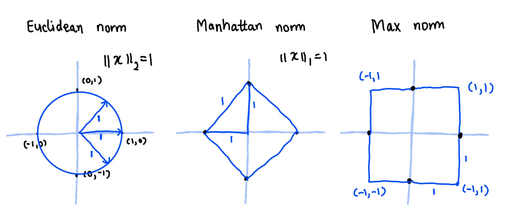
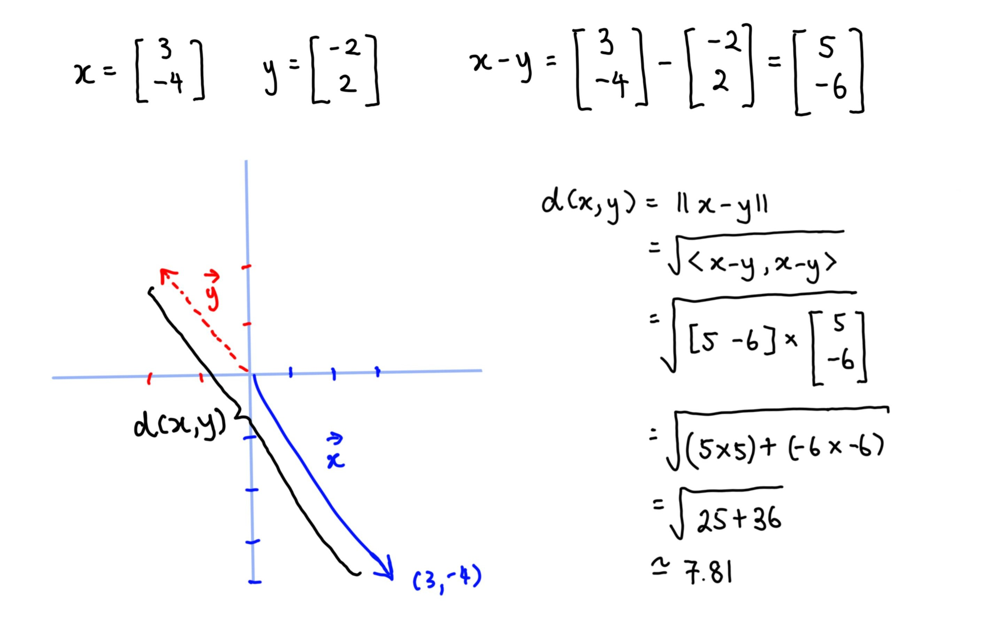
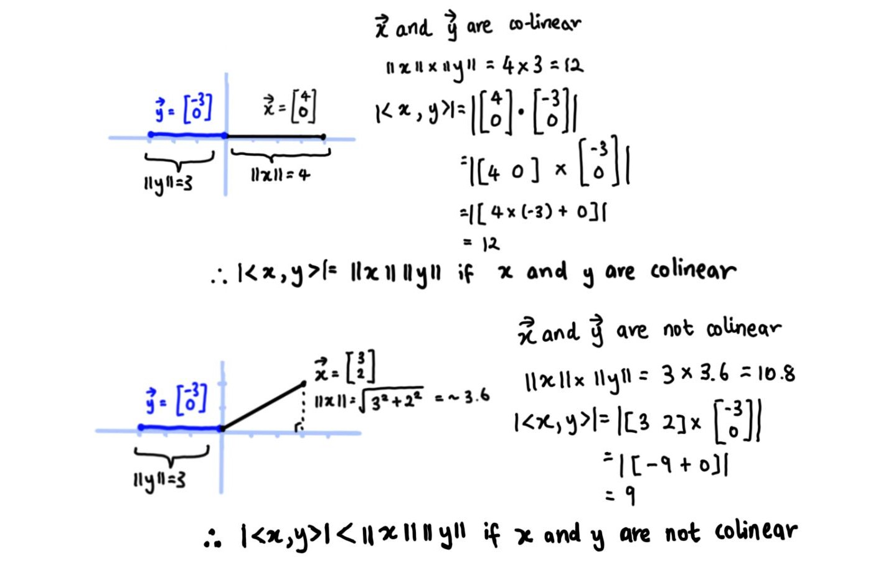
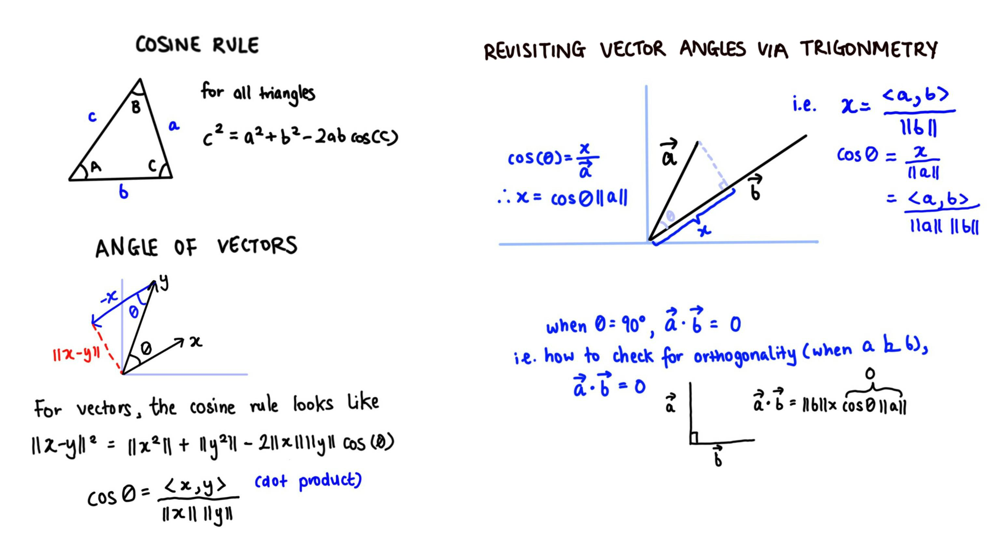
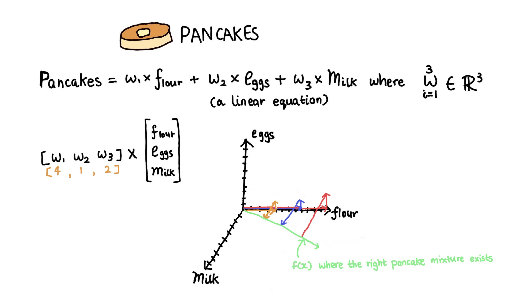
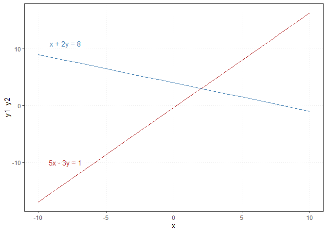

Working with vectors
================
Erika Duan
2021-01-19

  - [Resources](#resources)
  - [Vector norms](#vector-norms)
      - [Euclidean norm](#euclidean-norm)
      - [Manhattan norm](#manhattan-norm)
      - [Max norm](#max-norm)
  - [Vector inner product, length and
    distance](#vector-inner-product-length-and-distance)
  - [Vector angles](#vector-angles)
  - [Vector orthogonality](#vector-orthogonality)
  - [Systems of linear equations](#systems-of-linear-equations)
  - [Further reading](#further-reading)

# Resources

This section on vectors is taken from [Introduction to Linear Algebra
for Applied Machine Learning with
Python](https://pabloinsente.github.io/intro-linear-algebra#vector-norms)
by Pablo Caceres and [Lecture 8 - Norms of Vectors and
Matrices](https://www.youtube.com/watch?v=NcPUI7aPFhA) from Matrix
Methods in Data Analysis, Signal Processing, and Machine Learning, MIT
OpenCourseWare. All credit should be attributed to these sources.

# Vector norms

To measure vectors, you can think about the norm (i.e. length) of the
vector as the distance between its origin and end points.


Norms are functions that map vectors to non-negative values. They are
used to assign  to a vector
.

A norm has to satisfy the following three properties:

  - It is absolutely homogenous. For all scalars that are real values,
    the length scales proportionally with the value of the scalar.
      
  - It exhibits triangular inequality. In geometric terms, the sum of
    the lengths of any two sides must be greater or at least equal to
    the length of the third side. .  
  - It is positively defined. The length of x has to be a positive value
    and a length of zero only occurs if x = 0.  
      
    

The three main types of vector norms are illustrated below.



## Euclidean norm

The Euclidean or 
norm is defined below.   
  

The euclidean norm can also be thought of as the square root of the dot
product of a vector by itself.

In 2D, the Euclidean norm is .  
This is equivalent to the Pythagoras theorem for calculating the
hypotenuse of a triangle with sides
 and
.

``` python
#-----calculate L2 norm in Python via NumPy-----  
import numpy as np  

x = np.array([[3],
              [-4]])  
              
np.linalg.norm(x, 2) 
#> 5.0  
```

``` r
#-----calculate L2 norm in R-----  
x <- matrix(c(3, -4), nrow = 2)

norm(x, type = "2")
#> [1] 5 
```

## Manhattan norm

The Manhattan or 
norm is analogous to measuring distances whilst moving in only vertical
and horizontal lines. It is defined below.  
  
  

The manhattan norm is preferred for discriminating between elements that
are exactly zero and elements that are small but not zero (or in machine
learning, for calculating a distance matrix between categorical data
points).

``` python
#-----calculate L1 norm in Python via NumPy-----  
x = np.array([[3],
              [-4]])  
              
np.linalg.norm(x, 1) 
#> 7.0 

# |3| + |-4| = 7  
```

``` r
#-----calculate L1 norm in R-----  
x <- matrix(c(3, -4), nrow = 2)

norm(x, type = "O")
#> [1] 7   
```

## Max norm

The Max norm or infinity norm is the absolute value of the largest
element in the vector. It is defined below.  
  
  

The max norm is a useful norm type as when the number of dimensions
increases, the vector length will be disproportionately influenced by
the largest vector shown from the equation below.  
  
  

``` python
#-----calculate max norm in Python via NumPy-----  
x = np.array([[3],
              [-4]])  
              
np.linalg.norm(x, np.inf) 

#> 4.0 
```

``` r
#-----calculate max norm in R-----
x <- matrix(c(3, -4), nrow = 2)

norm(x, type = "O")
#> [1] 4  
```

# Vector inner product, length and distance

For practicality, you can conside the vector inner product and vector
length as equivalent to the vector dot product and vector norm.  
Every dot product is an inner product. The scalar inner product is
defined below.  
  
  

In , the inner product is a dot product defined below.  
  
  

Because length is a concept from geometry, you can say that geometric
vectors have lengths and that vectors in  have norms.

Distance is therefore a relational concept, as it refers to the length
(or norm) of the difference between two vectors. For example, consider
the vectors  and
. We define the distance
") as below.  
  
 := \\lVert x - y \\rVert = \\sqrt{\\langle x-y, x -y \\rangle}")  

This definition for distance is flexible. When the inner product is
specifically the dot product, the distance equals to the Euclidean
distance.  


``` python
#-----calculate L2 distance between two vectors in Python via NumPy-----  
x = np.array([[3],
              [2]])   

y = np.array([[-2],
              [2]])

x - y 
#> array([[5],
#>        [0]])
```

``` python
distance = np.linalg.norm(x - y, 2)

print("L2 distance between x and y: {}".format(distance))
#> L2 distance between x and y: 5.0   
```

``` r
#-----calculate L2 distance between two vectors in R-----
x <- matrix(c(3, 2), nrow = 2)

y <- matrix(c(-2, 2), nrow = 2)   

x - y
#>      [,1]
#> [1,]    5
#> [2,]    0 

norm(x - y, type = "2")
#> [1] 5    
```

# Vector angles

The Cauchy–Schwarz inequality is used to define the behaviour of angles
between a pair of vectors, and is stated below.  


It describes an important behaviour of vectors, namely that the dot
product of two vectors is always smaller than or equal to the product of
their lengths.

When two vectors are co-linear (i.e. lie on the same line), .



We can think of the definition of the angle between two vectors as a
generalisation of the Cosine rule.  


Because ,
we can further define the range of values for which
 is valid.

  
  

A maximum of 1 represents a co-linear scenario where the vector dot
product is positive. A minimum of -1 also represents a situation where
the vector dot product is in the oppositive direction (but equal in
magnitude). All other values fall in between this range and a value of 0
represents an orthogonal vector pair.

**Note:** The distance between two vectors can be a negative number
(this simply denotes vector direction).

``` python
#-----calculate cos(theta) of two vectors in Python via NumPy-----  
import math

x = np.array([[1],
              [5]]) 

y = np.array([[8],
              [2]])

cos_theta = (np.transpose(x) @ y)/ (np.linalg.norm(x, 2) * np.linalg.norm(y, 2))  

print("cos(theta) of vectors x and y: {}".format(cos_theta))
#> cos(theta) of vectors x and y: [[0.42808634]]  

#-----calculate radians and convert to degrees-----   
```

``` python
math.acos(cos_theta) # returns theta in radians   
#> 1.1284221038181517
```

``` python
math.acos(cos_theta) * ((180)/np.pi) # convert theta to angle  
#> 64.6538240580533  

# 1 radians = 180/np.pi degrees
```

``` r
#-----calculate cos(theta) of two vectors in R-----    
x <- matrix(c(1, 5), nrow = 2)  

y <- matrix(c(8, 2), nrow = 2)
  
cos_theta <- (t(x) %*% y) / (norm(x, type = "2") * norm(y, type = "2")) 

#-----calculate radians and convert to degrees-----    
radians <- acos(cos_theta)

degrees <- radians * 180/pi
degrees
#>          [,1]
#> [1,] 64.65382
```

# Vector orthogonality

Vector orthogonality is used to describe vector perpendicularity to
vectors in any number of dimensions. Mathematically, a pair of vectors
 and
 are orthogonal
() if:

  -   
  - In a 2D plane, this also means that the angle between
     and
     is 90 degrees as
    
    and .

<!-- end list -->

``` python
#-----create function to assess vector orthogonality in Python-----  
# 90 degrees is 90 * np.pi/180 radians

def is_orthogonal(x, y):
  assert(type(x).__module__ == np.__name__), "Vector x is not a NumPy array"   
  assert(type(y).__module__ == np.__name__), "Vector y is not a NumPy array"   
  assert(x.ndim == 2), "Vector x should be 2D"    
  assert(y.ndim == 2), "Vector y should be 2D"   

  cos_theta = (np.transpose(x) @ y) / (np.linalg.norm(x, 2) * np.linalg.norm(y, 2))
  radians = math.acos(cos_theta)
  
  if radians == 90 * np.pi/180:
    return(True)
  else: 
    return(False)
  
x = np.array([[2],
              [0]]) 
              
y = np.array([[0],
              [2]])

is_orthogonal(x, y)
#> True
```

``` r
#-----create function to assess vector orthogonality in R-----  
is_orthogonal <- function(x, y) {
  stopifnot(class(x)=="matrix")
  stopifnot(class(y)=="matrix")
  
  cos_theta <- (t(x) %*% y) / (norm(x, type = "2") * norm(y, type = "2"))
  radians <- acos(cos_theta)
  
  if_else(radians == 90 * pi/180, return(TRUE), return(FALSE))
}

x <- matrix(c(2, 0), nrow = 2)
y <- matrix(c(0, 2), nrow = 2)

is_orthogonal(x, y)
#> [1] TRUE  
```

# Systems of linear equations

Linear algebra is used to solve systems of linear equations, or to work
out the right combination (i.e. weights) of linear segments to obtain an
outcome.

For example, the question of what ingredient proportions are acceptable
for making pancakes can be reconstructed as a linear equation.



A system of linear equations involve multiple equations that need to be
solved simultaneously.  
  


In the example above, we have a linear algebra system with two unknowns,
 and
. Geometrically, both
equations can be re-written to produce a straight line in the 2D
plane.  
  


The point where two both linears equations intersect is the solution to
the linear system.

``` python
#-----plot system of linear equations in Python-----    
import numpy as np
import matplotlib.pyplot as plt
import seaborn as sns    

x = np.arange(-10, 10, 1)
y_1 = (-1/2 * x) + 4  
y_2 = (5/3 * x) - (1/3)    

# Python allows you to directly plot NumPy array values  

sns.set_style('whitegrid', {
              'grid.linestyle': '--'})

sns.lineplot(x, y_1, label = "x + 2y = 8", lw = 2)    
sns.lineplot(x, y_2, label = "5x - 3y = 1", lw = 2)   
```

``` python
plt.xlabel("x")  
plt.ylabel("y1, y2")
plt.legend(loc = "upper right")
plt.show()
```


``` r
#-----plot system of linear equations in R-----  
x = seq(-10, 10, 1)
y_1 = (-1/2 * x) + 4  
y_2 = (5/3 * x) - (1/3) # brackets for readability   

linalg_plot <- tibble(x,
                      y_1,
                      y_2)   

ggplot(linalg_plot, aes(x, y_1)) +
  geom_line(colour = "steelblue") +
  geom_line(aes(x, y_2), colour = "firebrick") + 
  labs(y = "y1, y2") +   
  theme_bw() + 
  theme(panel.grid.minor = element_blank(),
        panel.grid.major = element_line(linetype = "dotted")) +
  annotate("text", x = -8, y = 11, label = "x + 2y = 8", colour = "steelblue") +
  annotate("text", x = -8, y = -10, label = "5x - 3y = 1", colour = "firebrick")
```



# Further reading

  - The Khan academy
    [topic](https://www.khanacademy.org/math/linear-algebra/vectors-and-spaces/dot-cross-products/v/vector-dot-product-and-vector-length)
    on vector dot and cross products.  
  - The Khan academy
    [topic](https://www.khanacademy.org/math/algebra2/x2ec2f6f830c9fb89:trig/x2ec2f6f830c9fb89:radians/v/introduction-to-radians)
    on radians.
