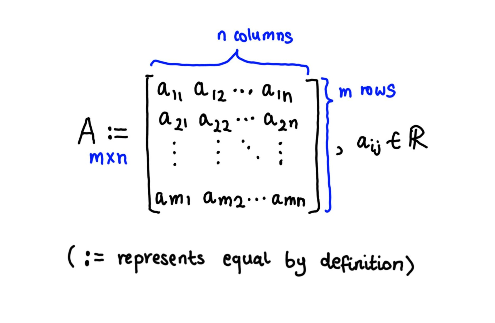
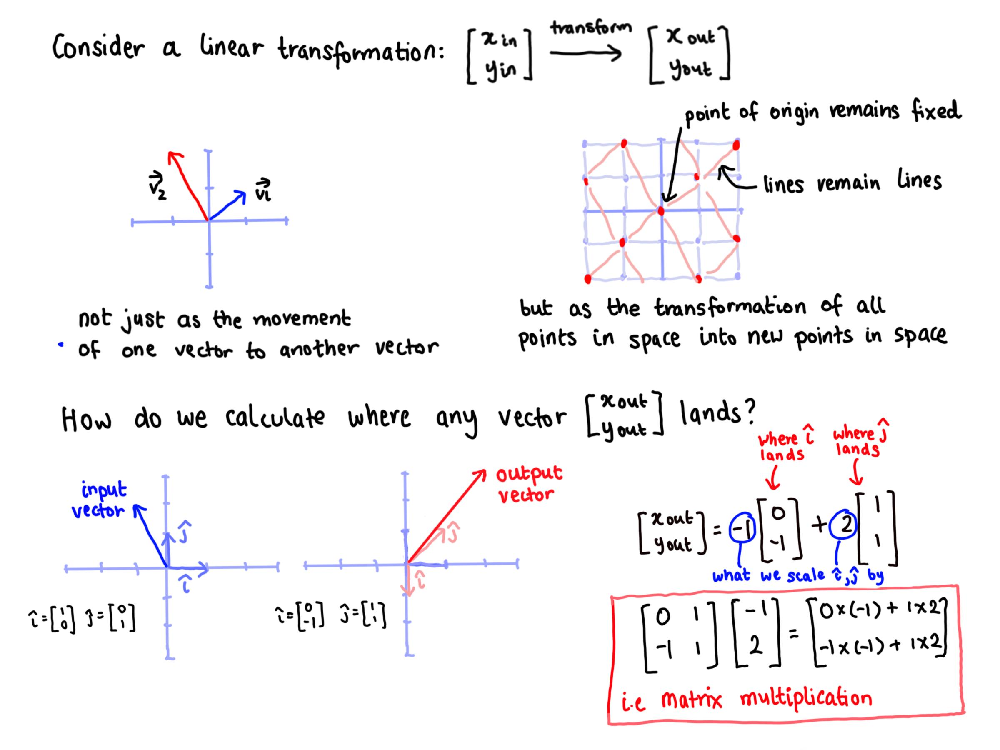

```{r setup, include=FALSE}
knitr::opts_chunk$set(echo = TRUE, results = 'hide', fig.align = 'center')
knitr::knit_engines$set(python = reticulate::eng_python)
```

```{r, echo=FALSE, message=FALSE, warning=FALSE}  
# Load required R packages -----------------------------------------------------
if (!require("pacman")) install.packages("pacman") 
p_load(tidyverse,
       reticulate,
       knitr) 

conda_list() # List all available conda environments    
use_condaenv("r-reticulate")
```

```{r, echo = FALSE}
# Set plugin to knit Python code chunks ----------------------------------------
py_run_string("import os as os")
py_run_string("os.environ['QT_QPA_PLATFORM_PLUGIN_PATH'] = 'C:/Users/user/Anaconda3/envs/r-reticulate/Library/plugins/platforms'")    
```


# Resources   

This section on matrices is taken from [Introduction to Linear Algebra for Applied Machine Learning with Python](https://pabloinsente.github.io/intro-linear-algebra#matrices) by Pablo Caceres and and [Essence of linear algebra](https://www.3blue1brown.com/essence-of-linear-algebra-page) by 3Blue1Brown. All credit should be attributed to these sources.          


# What is a matrix?  

A matrix can be thought of as a two dimensional container which stores a set of vectors (i.e. an ordered collection of column vectors). A matrix $A \in {\rm I\!R} ^{m\times n}$ is defined below, where $m$ represents the number of rows and $n$ represents the number of columns.      

```{r, echo = FALSE, results = 'markup', fig.align = 'center', out.width = '70%'}
     
```


# How to conceptualise matrices  

```{r, echo = FALSE, results = 'markup', fig.align = 'center', out.width = '90%'}
     
```

Sparse vectors - sparse vectors predominantly contain elements of zero. To maximise computational efficiency, we can represent sparse matrices by storing only its non-zero elements in a `[[row], [column], [value]]` triplet array.   
$y = 
 \begin{bmatrix}
  0, 0, 3, 0, 0, 0 \\
  0, 0, 0, 0, 0, 0 \\
  0, 0, 0, 0, 1, 0
 \end{bmatrix}   
 y_{sparse} = 
 \begin{bmatrix}
  0, 2, 3 \\
  2, 4, 1 
 \end{bmatrix}$   


```{r}

```


# Further reading  

+ The 3Blue1Brown [YouTube video](https://www.youtube.com/watch?time_continue=6&v=kYB8IZa5AuE&feature=emb_logo) on linear transformations and matrices.         
+ XXX    
