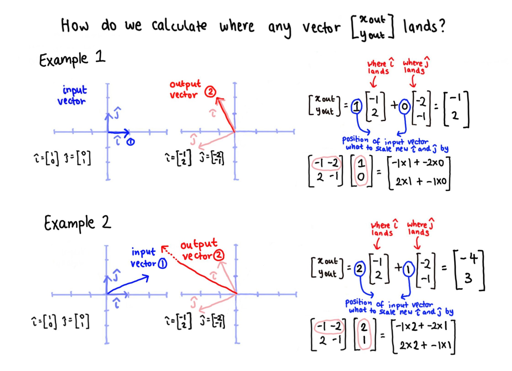
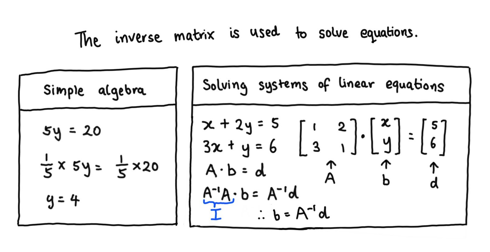
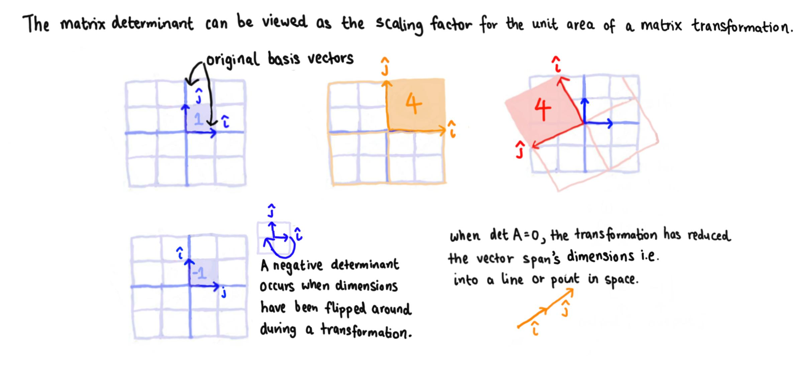

```{r setup, include=FALSE}
knitr::opts_chunk$set(echo=TRUE, results='hide', fig.align='center')
knitr::knit_engines$set(python=reticulate::eng_python)
```

```{r, echo=FALSE, message=FALSE, warning=FALSE}  
# Load required R packages -----------------------------------------------------
if (!require("pacman")) install.packages("pacman") 
p_load(tidyverse,
       reticulate,
       knitr) 

conda_list() # List all available conda environments    
use_condaenv("r-reticulate")
```

```{r, echo=FALSE}
# Set plugin to knit Python code chunks ----------------------------------------
py_run_string("import os as os")
py_run_string("os.environ['QT_QPA_PLATFORM_PLUGIN_PATH'] = 'C:/Users/user/Anaconda3/envs/r-reticulate/Library/plugins/platforms'")    
```


# Resources   

This section on matrices is taken from [Introduction to Linear Algebra for Applied Machine Learning with Python](https://pabloinsente.github.io/intro-linear-algebra#matrices) by Pablo Caceres, [Essence of linear algebra](https://www.3blue1brown.com/essence-of-linear-algebra-page) by 3Blue1Brown and my university lecture notes from [Regression Modelling](https://programsandcourses.anu.edu.au/course/STAT6038#:~:text=Regression%20Modelling%20is%20a%20course,for%20examining%20relationships%20between%20variables.&text=The%20R%20statistical%20computing%20package,integral%20part%20of%20the%20course). All credit should be attributed to these sources.       


# What is a matrix?  

A matrix can be thought of as a two dimensional structure which stores a set of transposed vectors (where each vector represents a single unit of data).   
A matrix $A \in {\rm I\!R} ^{n\times p}$ is defined below, where $n$ represents the number of rows and $p$ represents the number of columns.    

```{r, echo=FALSE, results='markup', fig.align='center', out.width='70%'}
knitr::include_graphics("../02_figures/04_matrices-structure.jpg")     
```

**Note:** A matrix with one column is a vector.    

```{python, eval=FALSE}
# Create a matrix in Python via Numpy ------------------------------------------
import numpy as np  

A = np.array([[1, 3, 4], # First row  
              [2, 0, 1]]) # Second row  
             
A.ndim
#> 2 

A.shape
#> (2, 3)
```

```{r}
# Create a matrix in R ---------------------------------------------------------
A <- matrix(c(1, 3, 4,
              2, 0, 1),
            nrow = 2) 

# Dimensions need to be set by nrow or ncol arguments 
# byrow = T does not need to be set for non-square matrices  

dim(A)
#> [1] 2 3  
```


# Types of matrices  

+ Square matrix - a matrix with dimensions $n \times n$.   
$\begin{bmatrix}
  1 & 0 & 2 \\
  0 & 4 & 5 \\
  1 & 3 & 7 
 \end{bmatrix}$

+ Symmetrical matrix - a square matrix where $A = A^\mathsf{T}$.  
$\begin{bmatrix}
  1 & 0 & 2 \\
  0 & 4 & 3 \\
  2 & 3 & 7 
 \end{bmatrix}$

+ Diagonal matrix - a symmetrical matrix where off-diagonal elements are all zero.   
$\begin{bmatrix}
  1 & 0 & 0 \\
  0 & 4 & 0 \\
  0 & 0 & 7 
 \end{bmatrix}$
 
```{python, eval=FALSE} 
# Construct diagonal matrix in Python via NumPy --------------------------------
np.diag([1, 2, 3, 4])
#> array([[1, 0, 0, 0],
#>        [0, 2, 0, 0],
#>        [0, 0, 3, 0],
#>        [0, 0, 0, 4]])
```

+ Identity matrix - the matrix equivalent of 1 i.e. $x \times 1 = x$ versus $AI= IA = A$.  
$\begin{bmatrix}
  1 & 0 & 0 \\
  0 & 1 & 0 \\
  0 & 0 & 1 
 \end{bmatrix}$  
 
```{python, eval=FALSE} 
# Construct diagonal matrix in Python via NumPy --------------------------------
np.identity(3)
#> array([[1., 0., 0.],
#>        [0., 1., 0.],
#>        [0., 0., 1.]]) 

# Demonstrate identity matrix behaviour ----------------------------------------  
I = np.identity(3)  
A = np.diag([1, 2, 3])

A @ I  
#> array([[1., 0., 0.],
#>        [0., 2., 0.],
#>        [0., 0., 3.]])  

A @ I == I @ A
#> array([[ True,  True,  True],
#>        [ True,  True,  True],
#>        [ True,  True,  True]])
```

+ Sparse vectors - sparse vectors predominantly contain elements of zero. To maximise computational efficiency, we can represent sparse matrices by storing only its non-zero elements in a `[[row], [column], [value]]` triplet array.   
$y = 
\begin{bmatrix}
 0 & 0 & 3 & 0 & 0 & 0 \\
 0 & 0 & 0 & 0 & 0 & 0 \\
 0 & 0 & 0 & 0 & 1 & 0
\end{bmatrix}   
y_{sparse} = 
\begin{bmatrix}
 0 & 2 & 3 \\
 2 & 4 & 1 
\end{bmatrix}$    


# Basic matrix operations   


## Matrix-matrix addition   

We add and subtract matrices in an element-wise manner. This also means that matrices must have the same dimension for addition and subtraction to be possible.    
$A + B :=      
\begin{bmatrix}
 a_{11} + b_{11} & \cdots & a_{1p} + b_{1p} \\  
 \ddots & \vdots & \ddots \\
 a_{n1} + b_{n1} & \cdots & a_{np} + b_{np} 
\end{bmatrix}$   

```{python, eval=FALSE}
# Add matrices in Python via Numpy ---------------------------------------------
A = np.array([[1, 3, 4], 
              [2, 0, 1],
              [5, 5, 5]]) 

B = np.ones(shape=[3,3])  

A + B == np.add(A, B)
#> array([[ True,  True,  True],
#>        [ True,  True,  True],
#>        [ True,  True,  True]])  
```

```{r}
# Add matrices in R ------------------------------------------------------------
A <- matrix(seq(1, 9, 1),
            nrow = 3,
            byrow = T) # Values are populated by row

B <- matrix(rep(1, 9),
            nrow = 3)

A + B
#>      [,1] [,2] [,3]
#> [1,]    2    3    4
#> [2,]    5    6    7
#> [3,]    8    9   10

# Test rules of matrix-matrix addition -----------------------------------------
# Matrix addition is element-based and addition is commutative and associative 
A + B == B + A
#>      [,1] [,2] [,3]
#> [1,] TRUE TRUE TRUE
#> [2,] TRUE TRUE TRUE
#> [3,] TRUE TRUE TRUE 

C <- matrix(rep(1:3, 3),
            nrow = 3,
            byrow = T)  

(A + B) + C == A + (B + C)
#>      [,1] [,2] [,3]
#> [1,] TRUE TRUE TRUE
#> [2,] TRUE TRUE TRUE
#> [3,] TRUE TRUE TRUE
```


## Matrix-scalar multiplication   

Matrix-scalar multiplication is also an element-wise operation (and therefore also commutative).    
If $A = [a_{ij}]$, then $kA = Ak = [ka_{ij}]$.  

```{python, eval=FALSE}
# Matrix-scalar multiplication in Python via NumPy -----------------------------
A = np.ones(shape = [2, 2])
A.fill(5)

# Matrix-scalar multiplication is conducted using * or np.multiply()  

2 * A  
#> array([[10., 10.],
#>        [10., 10.]])  
```

```{r}
# Matrix-scalar multiplication in R --------------------------------------------  
A <- matrix(rep(2, 4),
            nrow = 2)  

5 * A == A * 5
#>      [,1] [,2]
#> [1,] TRUE TRUE
#> [2,] TRUE TRUE  
```


## Matrix-vector multiplication   

Matrix-vector multiplication can be described as taking the dot product between a matrix and a vector (i.e. between all columns of the matrix and all elements of the vector). This is possible because matrix-scalar multiplication and matrix-matrix addition are both commutative.    

$A \cdot x := 
\begin{bmatrix}
 a_{11} & a_{1p} \\  
 a_{n1} & a_{np}  
\end{bmatrix} 
\begin{bmatrix}
 x_{1} \\  
 x_{p}   
\end{bmatrix} = 
\begin{bmatrix}
 a_{11} \times x_1 + a_{1p} \times x_p \\  
 a_{n1} \times x_1 + a_{np} \times x_p    
\end{bmatrix} = x_1 
\begin{bmatrix}
 a_{11} \\  
 a_{n1}   
\end{bmatrix} + x_p  
\begin{bmatrix}
 a_{1p} \\  
 a_{np}   
\end{bmatrix}$      

```{python, eval=FALSE}
# Matrix-vector multiplication in Python via NumPy -----------------------------
A = np.array([[1, 2], # First row
              [5, 7]]) # Second row    
              
x = np.array([1, 0]) # Column vector  

# Matrix-vector multiplication is conducted using @ or np.dot()   

A @ x
#> array([1, 5])  

A @ x == np.dot(A, x)
#> array([ True,  True])   

# Matrix-vector multiplication is non-commutative  

np.dot(x, A)
#> array([1, 2]) 

# This output is possible as x is now treated as a row vector  
```

```{r}
# Matrix-vector multiplication in R -------------------------------------------- 
A <- matrix(seq(1, 4, 1),
            nrow = 2,
            byrow = T)  

x <- matrix(c(1, 0),
            nrow = 2)

A %*% x   
#>      [,1]  
#> [1,]    1  
#> [2,]    3  
```

Matrix-vector multiplication can also be thought of in terms of linear transformations. Linear transformations (or linear algebra itself) involves transforming lines in space into another form of lines in space (where the point of origin does not move and all lines remain parallel and evenly spaced with respect to each other).     

```{r, echo=FALSE, results='markup', fig.align='center', out.width='80%'}
knitr::include_graphics("../02_figures/04_matrices-linear-transformation-1.jpg")     
```

Matrix-vector multiplication can be viewed as the transformation of one point in space (represented by the original vector) into another point in space (represented by the output vector), where the transformation involves scaling the original vector by the coordinates representing each basis vector in the transformed space.  

```{r, echo=FALSE, results='markup', fig.align='center', out.width='80%'}
     
```

In this context, a matrix can be thought of as a contained set of instructions to transform any point in space. 


## Matrix-matrix multiplication   

Matrix-matrix multiplication can be viewed as a series of dot products between matrices $A \in {\rm I\!R} ^{n\times p}$ and $B \in {\rm I\!R} ^{p\times m}$, with the 1st row of A times the 1st column of B as the first dot product and etc.   

```{r, echo=FALSE, results='markup', fig.align='center', out.width='90%'}
knitr::include_graphics("../02_figures/04_matrices-composition.jpg")     
```

$A \cdot B := 
\begin{bmatrix}
 a_{11} & a_{1p} \\  
 a_{n1} & a_{np}  
\end{bmatrix} 
\begin{bmatrix}
 b_{11} & b_{1m} \\  
 b_{p1} & b_{pm}  
\end{bmatrix} = 
\begin{bmatrix}  
 a_{11} \times b_{11} + a_{1p} \times b_{p1} & a_{11} \times b_{1m} + a_{1p} \times b_{pm} \\  
 a_{n1} \times b_{11} + a_{np} \times b_{p1} & a_{n1} \times b_{1m} + a_{np} \times b_{pm}    
\end{bmatrix}$   

Matrix-matrix multiplication has the following properties:  

+ It is not commutative i.e. $AB \neq BA$.   
+ It is associative i.e. $(AB)C = A(BC)$.   
+ It is associative with scalar multiplication i.e. $k(AB) = (kA)B$.   
+ It is distributive with addition i.e. $A(B+C) = AB + AC$.    
+ Its product transpose is $(AB)^\mathsf{T} = B^\mathsf{T}A^\mathsf{T}$.    

```{python, eval=FALSE}
# Matrix-matrix multiplication in Python via NumPy -----------------------------
A = np.array([[1, 2],
              [3, 4]])

B = np.array([[0, 3],
              [0, 2]])
              
A @ B
#> array([[ 0,  7],
#>        [ 0, 17]])

B @ A
#> array([[ 9, 12],
#>        [ 6,  8]])
```

```{r}
# Matrix-matrix multiplication in R --------------------------------------------
A <- matrix(seq(1, 4, 1),
            nrow = 2,
            byrow = T)  

B <- matrix(c(0, 3, 0, 2),
            nrow = 2,
            byrow = T)

A %*% B == B %*% A 
#>       [,1]  [,2]
#> [1,] FALSE FALSE
#> [2,] FALSE FALSE 

# Matrix-matrix multiplication is associative ----------------------------------
# Output dimensions will always be preserved based on matrices input dimensions   
C <- matrix(c(2, 5),
            nrow = 2)  

A %*% B
#>      [,1] [,2]
#> [1,]    0    7
#> [2,]    0   17 

B %*% C 
#>      [,1]  
#> [1,]   15  
#> [2,]   10  

(A %*% B) %*% C == A %*% (B %*% C) 
#>      [,1]
#> [1,] TRUE
#> [2,] TRUE

# Matrix-matrix multiplication is distributive with addition ------------------- 
D <- matrix(c(2, 5),
            nrow = 1)  

D %*% A
#>      [,1] [,2]
#> [1,]   17   24

D %*% B 
#>      [,1] [,2]  
#> [1,]    0   16  

D %*% (A + B)
#>      [,1] [,2]
#> [1,]   17   40  

D %*% (A + B) == D %*% A + D %*% B
#>      [,1] [,2]
#> [1,] TRUE TRUE  

# Addition describes a change in the position of points in space 
# Addition scales consistently for linear systems  
# Multiplication is a linear and consistent transformation of dimensional form   
```


## Matrix transpose   

The transpose of a matrix $A \in {\rm I\!R} ^{n\times p}$ is $A^\mathsf{T} \in {\rm I\!R} ^{p\times n}$. 
We obtain the transpose of a matrix by switching row-wise elements into new column-wise elements.    

$A = 
\begin{bmatrix} 
 1 & 2 & 3\\  
 4 & 5 & 6  
\end{bmatrix} 
A^\mathsf{T} =
\begin{bmatrix}
 1 & 4 \\  
 2 & 5 \\
 3 & 6 
\end{bmatrix}$    


```{python, eval=FALSE}
# Obtain the matrix transpose in Python via NumPy ------------------------------
A = np.array([[1, 2, 3],
              [4, 5, 6]])
              
A.T
#> array([[1, 4],
#>        [2, 5],
#>        [3, 6]])

A.T == np.transpose(A)
#> array([[ True,  True],
#>        [ True,  True],
#>        [ True,  True]])
```

```{r}
# Obtain the matrix transpose in R ---------------------------------------------
A <- matrix(seq(1, 6, 1),
           nrow = 3)

t(A)
#>      [,1] [,2] [,3]
#> [1,]    1    2    3
#> [2,]    4    5    6

B <- matrix(seq(1, 4, 1),
            nrow = 2,
            byrow = T)

t(B)
#>      [,1] [,2]
#> [1,]    1    3
#> [2,]    2    4

t(A %*% B)
#>      [,1] [,2] [,3]
#> [1,]   13   17   21
#> [2,]   18   24   30 

t(A %*% B) == t(B) %*% t(A)
#>      [,1] [,2] [,3]
#> [1,] TRUE TRUE TRUE
#> [2,] TRUE TRUE TRUE
```


# Solving systems of equations using the inverse matrix   


## Matrix determinant 


## Matrix rank  


## Applying the matrix inverse   

The inverse of a matrix $A \in {\rm I\!R} ^{n\times n}$ is another matrix $A^{-1} \in {\rm I\!R} ^{n\times n}$ where $AA^{-1} = A^{-1}A = I$.  
The inverse matrix is useful for solving linear equations and is equivalent to $x^{-1}$ where $x \times x^{-1} = x^0 = 1$.  

```{r, echo=FALSE, results='markup', fig.align='center', out.width='70%'}
     
```

The inverse matrix can be calculated using the determinant $\bigtriangleup$.  
$\bigtriangleup = ad - bc \; where \; A = 
\begin{bmatrix}
 a & b \\  
 c & d   
\end{bmatrix}$  

$A^{-1} = \frac{1}{\bigtriangleup}  
\begin{bmatrix}
 d & -b \\  
 -c & a 
\end{bmatrix}$   

```{r, echo=FALSE, results='markup', fig.align='center', out.width='100%'}
     
```

**Note:** A matrix only has an inverse form if it contains linearly independent column vectors. If matrix $A$ contains linearly dependent column vectors, its determinant would be 0 and $A^{-1}$ would not exist.     

```{python, eval=FALSE}

```

```{r}

```


# Constructing a design matrix for statistics or machine learning problems      

A design matrix is a matrix-based construct for describing all predictor variable observations.
For example, in multiple linear regression where $Y = X\beta + \mathcal{E}$, X represents the design matrix.   

$Y = 
\begin{bmatrix}
 Y_1 \\  
 Y_2 \\
 \vdots \\
 Y_n \\
\end{bmatrix}$

$X = 
\begin{bmatrix}
 1 & X_{11} & X_{12} & \cdots & X_{1,p-1} \\  
 1 & X_{21} & X_{22} & \cdots & X_{2, p-1} \\
 \vdots & \vdots & \vdots & \vdots & \vdots \\
 1 & X_{n1} & X_{n21} & \cdots & X_{n, p-1} \\
\end{bmatrix}   
\beta = 
\begin{bmatrix}
 \beta_0 \\   
 \beta_1 \\  
 \beta_2 \\  
 \vdots \\  
 \beta_{p-1} \\   
\end{bmatrix}$   

$\mathcal{E} = 
\begin{bmatrix}
 \epsilon_0 \\  
 \epsilon_1 \\
 \vdots \\
 \epsilon_{n} \\
\end{bmatrix}$      


# Further reading   

+ The 3Blue1Brown [YouTube video](https://www.youtube.com/watch?time_continue=6&v=kYB8IZa5AuE&feature=emb_logo) on linear transformations and matrices.     