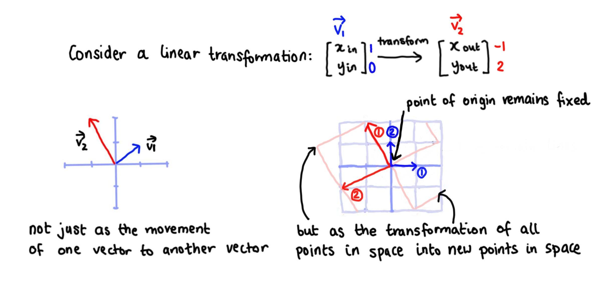

Introduction to matrices
================
Erika Duan
2021-07-16

-   [Resources](#resources)
-   [What is a matrix?](#what-is-a-matrix)
-   [Types of matrices](#types-of-matrices)
-   [Basic matrix operations](#basic-matrix-operations)
    -   [Matrix-matrix addition](#matrix-matrix-addition)
    -   [Matrix-scalar multiplication](#matrix-scalar-multiplication)
    -   [Matrix-vector multiplication](#matrix-vector-multiplication)
    -   [Matrix-matrix multiplication](#matrix-matrix-multiplication)
    -   [Matrix transpose](#matrix-transpose)
    -   [Matrix identity](#matrix-identity)
    -   [Matrix inverse](#matrix-inverse)
-   [Further reading](#further-reading)

# Resources

This section on matrices is taken from [Introduction to Linear Algebra
for Applied Machine Learning with
Python](https://pabloinsente.github.io/intro-linear-algebra#matrices) by
Pablo Caceres, [Essence of linear
algebra](https://www.3blue1brown.com/essence-of-linear-algebra-page) by
3Blue1Brown and my university lecture notes from [Regression
Modelling](https://programsandcourses.anu.edu.au/course/STAT6038#:~:text=Regression%20Modelling%20is%20a%20course,for%20examining%20relationships%20between%20variables.&text=The%20R%20statistical%20computing%20package,integral%20part%20of%20the%20course).
All credit should be attributed to these sources.

# What is a matrix?

A matrix can be thought of as a two dimensional structure which stores a
set of transposed vectors (where each vector represents a single unit of
data).  
A matrix

is defined below, where 
represents the number of rows and
 represents the number
of columns.


**Note:** A matrix with one column is a vector.

``` python
# Create a matrix in Python via Numpy ------------------------------------------
import numpy as np  

A = np.array([[1, 3, 4], # First row  
              [2, 0, 1]]) # Second row  
             
A.ndim
#> 2 

A.shape
#> (2, 3)
```

``` r
# Create a matrix in R ---------------------------------------------------------
A <- matrix(c(1, 3, 4,
              2, 0, 1),
            nrow = 2) 

# Dimensions need to be set by nrow or ncol arguments 
# byrow = T does not need to be set for non-square matrices  

dim(A)
#> [1] 2 3  
```

# Types of matrices

-   Square matrix - a matrix with dimensions
    .  
    

-   Symmetrical matrix - a square matrix where
    .  
    

-   Diagonal matrix - a symmetrical matrix where off-diagonal elements
    are all zero.  
    

-   Identity matrix - the matrix equivalent of 1
    i.e. 
    versus
    .  
    

-   Sparse vectors - sparse vectors predominantly contain elements of
    zero. To maximise computational efficiency, we can represent sparse
    matrices by storing only its non-zero elements in a
    `[[row], [column], [value]]` triplet array.  
    

# Basic matrix operations

## Matrix-matrix addition

We add and subtract matrices in an element-wise manner. This also means
that matrices must have the same dimension for addition and subtraction
to be possible.  


``` python
# Add matrices in Python via Numpy ---------------------------------------------
A = np.array([[1, 3, 4], 
              [2, 0, 1],
              [5, 5, 5]]) 

B = np.ones(shape=[3,3])  

A + B == np.add(A, B)
#> array([[ True,  True,  True],
#>        [ True,  True,  True],
#>        [ True,  True,  True]])  
```

``` r
# Add matrices in R ------------------------------------------------------------
A <- matrix(seq(1, 9, 1),
            nrow = 3,
            byrow = T) # Values are populated by row

B <- matrix(rep(1, 9),
            nrow = 3)

A + B
#>      [,1] [,2] [,3]
#> [1,]    2    3    4
#> [2,]    5    6    7
#> [3,]    8    9   10

# Test rules of matrix-matrix addition -----------------------------------------
# Matrix addition is element-based and addition is commutative and associative 
A + B == B + A
#>      [,1] [,2] [,3]
#> [1,] TRUE TRUE TRUE
#> [2,] TRUE TRUE TRUE
#> [3,] TRUE TRUE TRUE 

C <- matrix(rep(1:3, 3),
            nrow = 3,
            byrow = T)  

(A + B) + C == A + (B + C)
#>      [,1] [,2] [,3]
#> [1,] TRUE TRUE TRUE
#> [2,] TRUE TRUE TRUE
#> [3,] TRUE TRUE TRUE
```

## Matrix-scalar multiplication

Matrix-scalar multiplication is also an element-wise operation (and
therefore also commutative).  
If
![A = \[a\_{ij}\]](https://latex.codecogs.com/png.latex?A%20%3D%20%5Ba_%7Bij%7D%5D "A = [a_{ij}]"),
then
![kA = Ak = \[ka\_{ij}\]](https://latex.codecogs.com/png.latex?kA%20%3D%20Ak%20%3D%20%5Bka_%7Bij%7D%5D "kA = Ak = [ka_{ij}]").

``` python
# Matrix-scalar multiplication in Python via NumPy -----------------------------
A = np.ones(shape = [2, 2])
A.fill(5)

# Matrix-scalar multiplication is conducted using * or np.multiply()  

2 * A  
#> array([[10., 10.],
#>        [10., 10.]])  
```

``` r
# Matrix-scalar multiplication in R --------------------------------------------  
A <- matrix(rep(2, 4),
            nrow = 2)  

5 * A == A * 5
#>      [,1] [,2]
#> [1,] TRUE TRUE
#> [2,] TRUE TRUE  
```

## Matrix-vector multiplication

Matrix-vector multiplication can be described as taking the dot product
between a matrix and a vector (i.e. between all columns of the matrix
and all elements of the vector). This is possible because matrix-scalar
multiplication and matrix-matrix addition are both commutative.


``` python
# Matrix-vector multiplication in Python via NumPy -----------------------------
A = np.array([[1, 2], # First row
              [5, 7]]) # Second row    
              
x = np.array([1, 0]) # Column vector  

# Matrix-vector multiplication is conducted using @ or np.dot()   

A @ x
#> array([1, 5])  

A @ x == np.dot(A, x)
#> array([ True,  True])   

# Matrix-vector multiplication is non-commutative  

np.dot(x, A)
#> array([1, 2]) 

# This output is possible as x is now treated as a row vector  
```

``` r
# Matrix-vector multiplication in R -------------------------------------------- 
A <- matrix(seq(1, 4, 1),
            nrow = 2,
            byrow = T)  

x <- matrix(c(1, 0),
            nrow = 2)

A %*% x   
#>      [,1]  
#> [1,]    1  
#> [2,]    3  
```

Matrix-vector multiplication can also be thought of in terms of linear
transformations. Linear transformations (or linear algebra itself)
involves transforming lines in space into another form of lines in space
(where the point of origin does not move and all lines remain parallel
and evenly spaced with respect to each other).



Matrix-vector multiplication can be viewed as the transformation of one
point in space (represented by the original vector) into another point
in space (represented by the output vector), where the transformation
involves scaling the original vector by the coordinates representing
each basis vector in the transformed space.


In this context, a matrix can be thought of as a contained set of
instructions to transform any point in space.

## Matrix-matrix multiplication

Matrix-matrix multiplication can be viewed as a series of dot products
between matrices

and
,
with the 1st row of A times the 1st column of B as the first dot product
and etc.

![A \\cdot B := \\begin{bmatrix}  a\_{11} & a\_{1p} \\\\  a\_{n1} & a\_{np} \\end{bmatrix} \\begin{bmatrix}  b\_{11} & b\_{1m} \\\\  b\_{p1} & b\_{pm} \\end{bmatrix} = \\begin{bmatrix}  a\_{11} \\times b\_{11} + a\_{1p} \\times b\_{p1} & a\_{11} \\times b\_{1m} + a\_{1p} \\times b\_{pm} \\\\  a\_{n1} \\times b\_{11} + a\_{np} \\times b\_{p1} & a\_{n1} \\times b\_{1m} + a\_{np} \\times b\_{pm} \\end{bmatrix}](https://latex.codecogs.com/png.latex?A%20%5Ccdot%20B%20%3A%3D%20%5Cbegin%7Bbmatrix%7D%20%20a_%7B11%7D%20%26%20a_%7B1p%7D%20%5C%5C%20%20a_%7Bn1%7D%20%26%20a_%7Bnp%7D%20%5Cend%7Bbmatrix%7D%20%5Cbegin%7Bbmatrix%7D%20%20b_%7B11%7D%20%26%20b_%7B1m%7D%20%5C%5C%20%20b_%7Bp1%7D%20%26%20b_%7Bpm%7D%20%5Cend%7Bbmatrix%7D%20%3D%20%5Cbegin%7Bbmatrix%7D%20%20a_%7B11%7D%20%5Ctimes%20b_%7B11%7D%20%2B%20a_%7B1p%7D%20%5Ctimes%20b_%7Bp1%7D%20%26%20a_%7B11%7D%20%5Ctimes%20b_%7B1m%7D%20%2B%20a_%7B1p%7D%20%5Ctimes%20b_%7Bpm%7D%20%5C%5C%20%20a_%7Bn1%7D%20%5Ctimes%20b_%7B11%7D%20%2B%20a_%7Bnp%7D%20%5Ctimes%20b_%7Bp1%7D%20%26%20a_%7Bn1%7D%20%5Ctimes%20b_%7B1m%7D%20%2B%20a_%7Bnp%7D%20%5Ctimes%20b_%7Bpm%7D%20%5Cend%7Bbmatrix%7D "A \cdot B := \begin{bmatrix}  a_{11} & a_{1p} \\  a_{n1} & a_{np} \end{bmatrix} \begin{bmatrix}  b_{11} & b_{1m} \\  b_{p1} & b_{pm} \end{bmatrix} = \begin{bmatrix}  a_{11} \times b_{11} + a_{1p} \times b_{p1} & a_{11} \times b_{1m} + a_{1p} \times b_{pm} \\  a_{n1} \times b_{11} + a_{np} \times b_{p1} & a_{n1} \times b_{1m} + a_{np} \times b_{pm} \end{bmatrix}")

Matrix-matrix multiplication has the following properties:

-   It is not commutative
    i.e. .  
-   It is associative
    i.e. C = A(BC)").  
-   It is associative with scalar multiplication
    i.e.  = (kA)B").  
-   It is distributive with addition
    i.e.  = AB + AC").  
-   Its product transpose is
    ^\mathsf{T} = B^\mathsf{T}A^\mathsf{T}").

``` python
# Matrix-matrix multiplication in Python via NumPy -----------------------------
A = np.array([[1, 2],
              [3, 4]])

B = np.array([[0, 3],
              [0, 2]])
              
A @ B
#> array([[ 0,  7],
#>        [ 0, 17]])

B @ A
#> array([[ 9, 12],
#>        [ 6,  8]])
```

``` r
# Matrix-matrix multiplication in R --------------------------------------------
A <- matrix(seq(1, 4, 1),
            nrow = 2,
            byrow = T)  

B <- matrix(c(0, 3, 0, 2),
            nrow = 2,
            byrow = T)

A %*% B == B %*% A 
#>       [,1]  [,2]
#> [1,] FALSE FALSE
#> [2,] FALSE FALSE 

# Matrix-matrix multiplication is associative ----------------------------------
# Output dimensions will always be preserved based on matrices input dimensions   
C <- matrix(c(2, 5),
            nrow = 2)  

A %*% B
#>      [,1] [,2]
#> [1,]    0    7
#> [2,]    0   17 

B %*% C 
#>      [,1]  
#> [1,]   15  
#> [2,]   10  

(A %*% B) %*% C == A %*% (B %*% C) 
#>      [,1]
#> [1,] TRUE
#> [2,] TRUE

# Matrix-matrix multiplication is distributive with addition ------------------- 
D <- matrix(c(2, 5),
            nrow = 1)  

D %*% A
#>      [,1] [,2]
#> [1,]   17   24

D %*% B 
#>      [,1] [,2]  
#> [1,]    0   16  

D %*% (A + B)
#>      [,1] [,2]
#> [1,]   17   40  

D %*% (A + B) == D %*% A + D %*% B
#>      [,1] [,2]
#> [1,] TRUE TRUE  

# Addition describes a change in the position of points in space 
# Addition scales consistently for linear transformations  
# Multiplication is a linear and consistent transformation of dimensional form   
```

## Matrix transpose

## Matrix identity

## Matrix inverse

# Further reading

-   The 3Blue1Brown [YouTube
    video](https://www.youtube.com/watch?time_continue=6&v=kYB8IZa5AuE&feature=emb_logo)
    on linear transformations and matrices.
