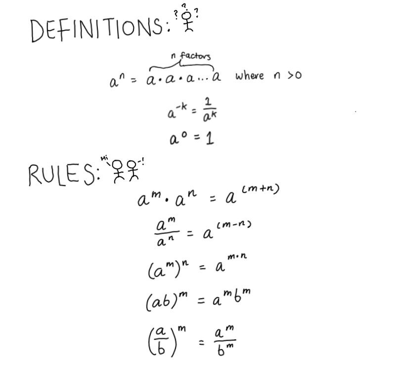
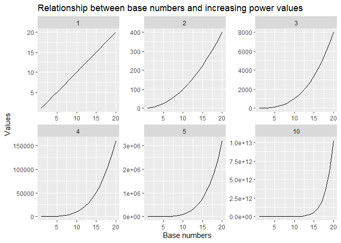

Introduction to algebra and linear equations in R and Python
================

  - [Algebraic rules for exponents](#algebraic-rules-for-exponents)
      - [Using exponents in R](#using-exponents-in-r)
      - [Using exponents in Python](#using-exponents-in-python)

# Algebraic rules for exponents

The rules for solving algebraic equations using exponents are listed
below.



## Using exponents in R

Exponents are annotated using `^` in R.

``` r
(2 ^ 4) * (2 ^ 12) == 2 ^ 16
#> [1] TRUE

(2 ^ 4) / (2 ^ 12) == 2 ^ -8 
#> [1] TRUE

(2 ^ 4) ^ 12 == 2 ^ 48 
#> [1] TRUE  

(2 * 4) ^ 2 == (2 ^ 2) * (4 ^ 2)
#> [1] TRUE 
```

Increasing the power of a base number greatly increases the resulting
value (how greatly the values increase will be covered later under the
derivatives rule).

``` r
base_numbers <- c(seq(from = 1,
                      to = 20,
                      by = 1))  

power <- c(1, 2, 3, 4, 5, 10)

# use expand.grid to compute every possible combination of 2 factors of vectors  

power_table <- expand.grid(base_numbers,
                           power) %>%
  rename(base_numbers = "Var1",
         power = "Var2") %>%
  mutate(values = base_numbers ^ power)
  
# graph using ggplot2 with power as a facet

power_table %>%
  ggplot(aes(x = base_numbers,
             y = values)) +
  geom_line() +
  facet_wrap(~ power,
             scales = "free") + 
  labs(title = "Relationship between base numbers and increasing power values",
       x = "Base numbers",
       y = "Values")
```

<!-- -->

## Using exponents in Python
