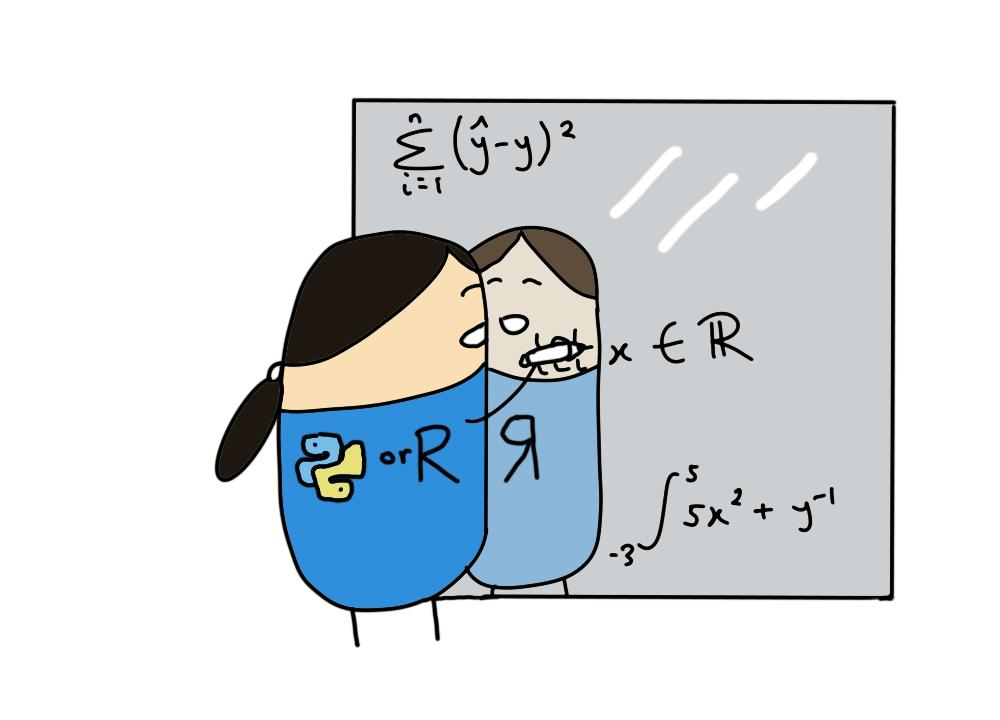

# Introductory mathematics in R and Python    
This repository contains tutorials on the introductory mathematical concepts required for studying statistics and machine learning. Code to solve mathematical problems is written in `R`, `Python` and `Julia`.      

## Tutorials    

### General concepts  
+ [Numbers](./tutorials/numbers-introduction.md) (Updated)   
+ Exponents and logarithms  
+ Logarithms and information theory   
+ Geometry      
+ Cosine similarity applications   
+ Distance metrics    
+ Summations   
+ Functions   
+ [Algebra](./tutorials/algebra-introduction.md) (Updated)    

### Linear algebra   
+ [Linear systems](./tutorials/linear_algebra-linear_systems.md)   
+ [Introduction to vectors](./tutorials/linear_algebra-vectors.md)    
+ Vector norms and embeddings       
+ [Introduction to matrices](./tutorials/linear_algebra-matrices.md)      
+ [Linear transformations](./tutorials/linear_algebra-linear_transformations.md)      
+ Applications of eigenvalues and eigenvectors        

### Calculus   
+ [Derivatives](./tutorials/calculus-derivatives.md)   
+ Integration     
+ Differential equations      
+ Multivariable functions       
+ Differentiation of multivariable functions     
  
### Statistical mathematics    
+ [Set theory](./tutorials/set_theory-introduction.md)   
+ [Combinatorics](./tutorials/combinatorics-introduction.md)   
+ [Probability theory](./tutorials/probability-introduction.md)   
+ [Conditional probability](./tutorials/probability-conditional_probability.md)   
+ Bayes theorem    
 
## Contributors
+ [Erika Duan](https://github.com/erikaduan/)  
+ [Chuanxin Liu](https://github.com/codetrainee)   

## Project setup   
This project was created using the following setup:     
+ R package dependencies are managed using renv for R version 4.1.2 (2021-11-01).   
+ Python virtual environment and package dependencies are managed using [`poetry`](https://python-poetry.org/docs/basic-usage/) for `Python 3.9.6`. A local version of `Python 3.9.6` was installed and activated using `pyenv local 3.9.6` via the terminal.      
+ The Julia version used is `julia version 1.7.3`.    

## Guide to writing mathematical proofs    
Writing mathematical proofs are a great way to help you reason why mathematical concepts should behave consistently (and not just because your textbook says so). There are multiple approaches to proving a mathematical statement or concept. Sadly, there is no magical rule to selecting the correct method for each scenario - mathematicians often have to try multiple approaches before they find the right one.        

**Direct proof**   
+ Occurs when you need to prove that A and B are equivalent.   
+ Start by assuming A is true.   
+ Construct a definition statement for A (use a fixed but arbitary example of A).   
+ Extend and simplify mathematical definitions derived from A to reach B.   
+ When you are asked if A and **only** A is true, then B is true, first suppose A to reach B. Then suppose B to reach A.   

**Induction proof**  
+ Occurs when you need to prove that something is true for all cases.  
+ Start by proving the base case when $n = 1$.  
+ Assume that the case is also true for some integer $k$.  
+ Prove that the case for $k + 1$ also holds i.e. prove the next incremental step up a ladder stretching to infinity.  

**Uniqueness proof**  
+ Occurs when you need to prove that a solution is unique.  
+ Show that there is one solution first.   
+ Show that there is a second solution and that the first and second solutions must be equal.   

**Proof by contradiction**   
+ Start by assuming that the incorrect state is true i.e. that eigenvectors are linearly dependent.    
+ Prove that the assumption does not hold and contradicts itself.    
+ Therefore prove that the reverse state is actually true.   

## References  
+ A guide to [linear algebra](https://pabloinsente.github.io/intro-linear-algebra) for applied machine learning by Pablo Caceres
+ The [Mathematics for Machine Learning textbook](https://mml-book.github.io/book/mml-book.pdf) by Marc Peter Deisenroth, A Aldo Faisal and Cheng Soon Ong - Cambridge University Press
+ The [Probability for Data Science textbook](https://probability4datascience.com/) by Stanley H Chan - Michigan Publishing
+ The [Probabilistic modelling tutorials](https://betanalpha.github.io/writing/) by Michael Betancourt - GitHub
+ Writing [mathematical operations in LaTex/R](https://en.wikibooks.org/wiki/LaTeX/Mathematics#Fractions_and_Binomials) - Wikibooks  
+ Introduction to university mathematics [YouTube lecture series ]https://www.youtube.com/playlist?list=PL4d5ZtfQonW1xKVEtYJd1iu9m52ATG7SV by the Department of Mathematics - Oxford University.  
