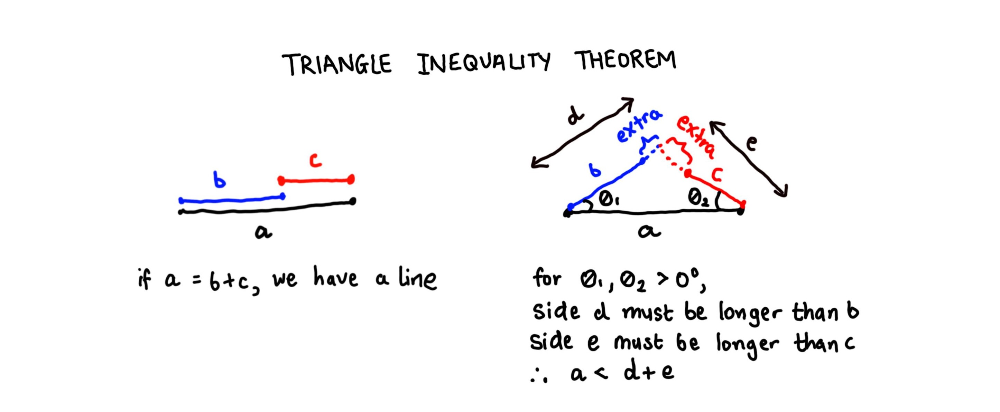

Geometry revision
================
Erika Duan
2021-07-14

-   [Resources](#resources)
-   [Introduction to triangles](#introduction-to-triangles)
-   [Triangle inequality theorem](#triangle-inequality-theorem)
-   [Sine, Cosine and Tangent](#sine-cosine-and-tangent)
-   [The Sine rule](#the-sine-rule)
-   [The Cosine rule](#the-cosine-rule)
-   [Further reading](#further-reading)

# Resources

This geometry revision section is taken from the unit on
[triangles](https://www.khanacademy.org/math/geometry-home/triangle-properties)
from the Khan Academy and the unit on
[trigonometry](https://www.mathsisfun.com/algebra/trigonometry-index.html)
from MathsisFun.com. All credit should be attributed to these sources.

# Introduction to triangles

A brief revision of triangles is shown below.


Triangles and angles are an important mathematical concept to revise, as
vector similarity is calculated based on concepts from geometry and
trigonometry. The definition of vector norms (the distance of a vector
from its origin) and how they behave is also derived from trigonometry
insights.

# Triangle inequality theorem

Any side of a triangle must be shorter than the other two sides added
together. If the side is equal to the other two sides, the length of one
side is 0 and the object is a line.



# Sine, Cosine and Tangent

Sine, Cosine and Tangent are just a ratio of two specific sides of a
right angled triangle.


Let us examine the values
.
The values for Sine and Cosine will always be between 0 and 1 (as the
hypotenus is always equal to or larger than the opposite and the
adjacent sides).


``` r
# Draw sine and cosine function in R -------------------------------------------
x <- c(seq(-2*pi, 2*pi, length.out = 100))

sine <- sin(x) # Calculate sine
cosine <- cos(x) # Calculate cosine  

trig_plot <- tibble(x,
                    sine,
                    cosine)  

ggplot(trig_plot, aes(x, sine)) +
  geom_line(colour = "steelblue", size = 2) +
  geom_line(aes(x, cosine), colour = "firebrick", size = 2) +
  geom_hline(yintercept = 0) + 
  geom_vline(xintercept = 0) +  
  scale_x_continuous(breaks = seq(-2 * pi, 2 * pi , pi / 2),
                     labels = c("-2\u03c0", "-3/2\u03c0", "-1\u03c0", "-1/2\u03c0", "0", "1/2\u03c0", "1\u03c0", "3/2\u03c0", "2\u03c0")) + 
  labs(y = "sin(x) and cos(x)") +   
  theme_bw() + 
  theme(panel.grid.minor = element_blank(),
        panel.grid.major = element_line(linetype = "dotted")) +
  annotate("text", x = 4, y = 1, label = "Sine wave", colour = "steelblue") +
  annotate("text", x = 4, y = 0.9, label = "Cosine wave", colour = "firebrick")
```


``` python
# Draw sine and cosine function in Python --------------------------------------   
import numpy as np
import matplotlib.pyplot as plt
import seaborn as sns  

x = np.arange(-2*np.pi, 2*np.pi, 0.1) 
sine = np.sin(x)
cosine = np.cos(x)

# Python allows you to directly plot from NumPy arrays  

sns.set_style('whitegrid', {
              'grid.linestyle': '--'})

sns.lineplot(x = x, y = sine, label = "Sine wave", lw = 3)
sns.lineplot(x = x, y = cosine, label = "Cosine wave", lw = 3)

plt.xlabel("x")  
plt.ylabel("sin(x) and cos(x)")
plt.legend(loc = "upper right")
plt.show()
```


# The Sine rule

The [Sine rule](https://www.mathsisfun.com/algebra/trig-sine-law.html)
applies to all similar triangle types and is useful for solving triangle
angles and lengths. It does not have any direct application to machine
learning algorithms.


# The Cosine rule

In contrast, the [Cosine
rule](https://www.mathsisfun.com/algebra/trig-cosine-law.html) applies
to all triangle types (i.e. not just right-angled triangles) and is
useful for calculating object similarity in machine learning.

In trigonometry, the Cosine rule can be derived to find either an
unknown length given that two sides and the angle between them are
known, or an unknown angle given that all sides of the triangle are
known.


# Further reading

-   A
    [revision](https://www.mathsisfun.com/algebra/trigonometry-index.html)
    of basic trigonometry concepts from mathsisfun.com.
