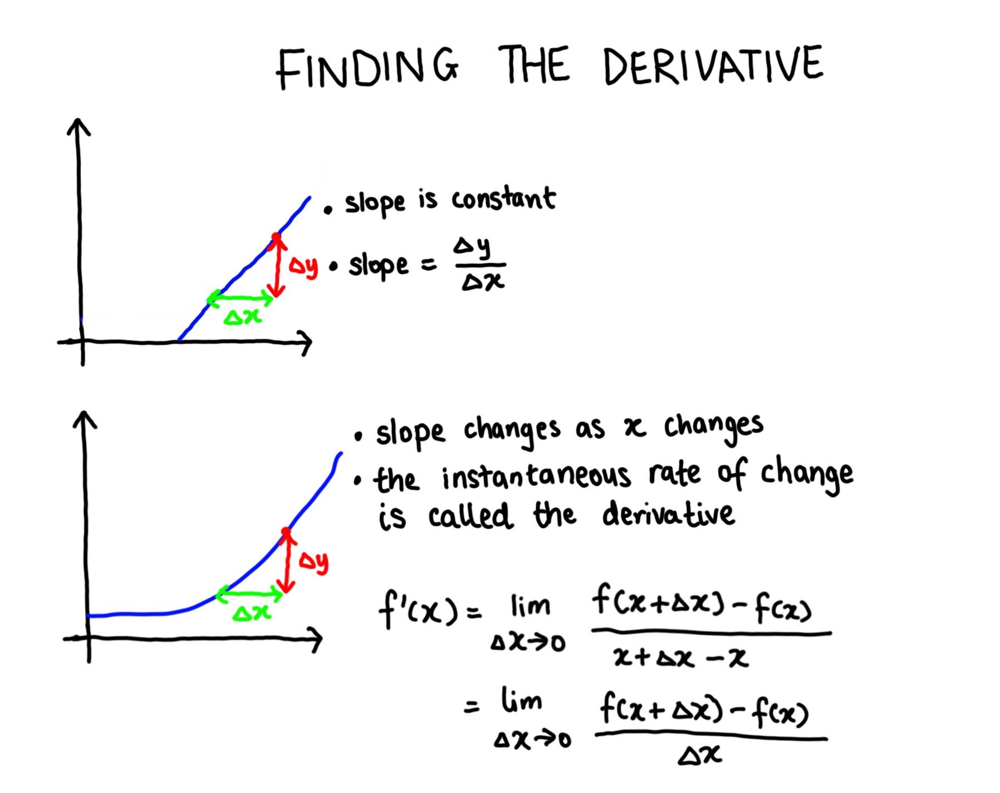

```{r setup, include = FALSE}
knitr::opts_chunk$set(echo = TRUE, results = 'hide', fig.align = 'center')
knitr::knit_engines$set(python = reticulate::eng_python)
```

```{r, echo = FALSE, message = FALSE, warning = FALSE}  
#-----load required R packages-----
if (!require("pacman")) install.packages("pacman") 
p_load(tidyverse,
       patchwork,
       reticulate) 

conda_list() # list all available conda environments    
use_condaenv("r-reticulate")
```

```{r, echo = FALSE}
#-----set plugin to knit Python code chunks-----
py_run_string("import os as os")
py_run_string("os.environ['QT_QPA_PLATFORM_PLUGIN_PATH'] = 'C:/Users/user/Anaconda3/envs/r-reticulate/Library/plugins/platforms'")    
```


# Resources   

This section on derivatives is taken from the Organic Chemistry Tutor Youtube series on [derivatives](https://www.youtube.com/watch?v=-aTLjoDT1GQ) and the unit on [derivatives](https://www.mathsisfun.com/calculus/derivatives-introduction.html) from Mathsisfun.com. All credit should be attributed to these sources.       


# Why do we care about derivatives?    

It is important to understand how things change, like the change in the rate of bacterial growth, the change in household energy or water consumption per month, the change in bank interest accumulation over time and etc. There are actually very few situations where the rate of change is constant.   

Instead, the concept of derivatives was created to calculate the instantaneous rate of change at any point across a dimension. To find the instantaneous rate of change at a point, we can approximate the slope of the line between $x$ and $x+\triangle x$, when $\triangle x \to 0$.      

```{r, echo = FALSE, results = 'markup', fig.align = 'center', out.width = '60%'}
     
```


# Derivative rules    

The derivative of a function can be solved mathematically by simplifying the equation above and then shrinking $\triangle x \to 0$ or by applying the following derivative rules.   

```{r, echo = FALSE, results = 'markup', fig.align = 'center', out.width = '60%'}
knitr::include_graphics("../02_figures/05_calculus-derivative-rules.jpg")     
```

```{r}
#-----use the power rule to calculate the derivative in Python----- 
```


```{r}
#-----use the power rule to calculate the derivative in R----- 
# create a function
function_1 <- function(x) 2*(x^3)

fx_1 <- function_1(seq(1, 10, 1))

# manually derive the first derivative    
derivative_1 <- function(x) 6*(x^2)

d_dx_1 <- vapply(seq(1, 10, 1), derivative_1, numeric(1))

# check using the R function D()
function_1 <- expression(2*(x^3))

D(function_1, 'x')
#> 2 * (3 * x^2)  
```

```{r}
#-----use the product rule to calculate the derivative in Python----- 
```

```{r}
#-----use the product rule to calculate the derivative in R----- 
# create a function
function_2 <- function(x, y) {
  (2*x) * (y^2)
}

fx_2 <- function_2(x = seq(1, 10, 1), y = seq(0.1, 1, 0.1))

# manually derive the first derivative   
derivative_2 <- function(x, y) {
  (2*x) * (2*y) + (y^2) * (2)
}

d_dx_2 <- mapply(derivative_2, seq(1, 10, 1), seq(0.1, 1, 0.1))  

# check using the R function D()
function_2 <- expression((2*x) * (y^2))

D(function_2, 'y')
#> (2 * x) * (2 * y)
D(function_2, 'x')
#> 2 * (y^2)
```

```{r}
#-----use the chain rule to calculate the derivative in Python----- 
```

```{r}
#-----use the chain rule to calculate the derivative in R----- 
# create a function   
function_3 <- function(x) log10(2*(x^3))
fx_3 <- function_3(seq(1, 10, 1))

# manually derive the first derivative  
derivative_3 <- function(x) 1/(log(10) * 2*(x^3)) * (6 * x^2)
  
d_dx_3 <- vapply(seq(1, 10, 1), derivative_3, numeric(1))  

# check using the R function D()  
function_3 <- expression(log10(2*(x^3)))
                         
D(function_3, 'x')
#> 2 * (3 * x^2)/(2 * (x^3) * log(10))  
```


# Visualising the first and second derivatives    

The purpose of the **first derivative** is to calculate the instantaneous rate of change of the function of interest.    

The purpose of the **second derivative** is to calculate the instantaneous rate of change of the first derivation. More importantly, the sign of the second derivative tells us whether the slope of the tangent line to the function of interest is increasing or decreasing.      

```{r}
#-----visualise the first and second derivatives of a function in Python-----
```

```{r}
#-----visualise the first and second derivations of a function in R-----  
# create a function
function_4 <- function(x) x^2 - x - 6

# create a tibble of x values  
df_4 <- tibble(x = seq(-9, 10, 1)) 

# derive the first derivative  
D(expression(x^2 - x - 6), 'x')
#> 2 * x - 1  

# derive the second derivative 
D(D(expression(x^2 - x - 6), 'x'), 'x')
#> 2  

#-----plot the function, first derivative and second derivative-----  
function_4 <- df_4 %>%
  ggplot(aes(x)) +
  geom_function(fun = function(x) x^2 - x - 6) +
  labs(x = "x",
       y = "f(x)",
       title = "Function")

first_derivative_4 <- df_4 %>%
  ggplot(aes(x)) +
  geom_function(fun = function(x) 2*x - 1) +
  labs(x = "x",
       y = "f'(x)",
       title = "First derivative")

second_derivative_4 <- df_4 %>%
  ggplot(aes(x)) +
  geom_function(fun = function(x) 2) +
  labs(x = "x",
       y = "f''(x)",
       title = "Second derivative") 

function_4 / first_derivative_4 / second_derivative_4
```


# Calculating the maximum likelihood  

```{r}

```

```{r}

```


# Further reading  

+ An [introduction](https://www.mathsisfun.com/calculus/derivatives-introduction.html) to finding and calculating derivatives from mathsisfun.com.       
+ The Organic Chemistry Tutor [Youtube video](https://www.youtube.com/watch?v=-aTLjoDT1GQ) explaining the definition of a derivative, with calculation examples.   
+ The StatQuest YouTube videos [here](https://www.youtube.com/watch?v=XepXtl9YKwc) and [here](https://www.youtube.com/watch?v=Dn6b9fCIUpM) explaining how to find the maximum likelihood for the normal distribution.       