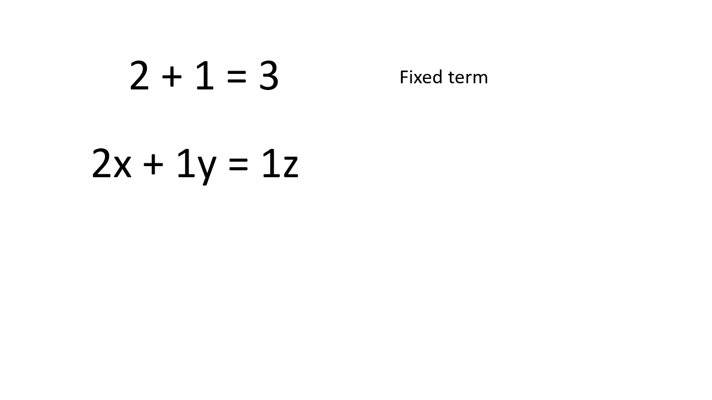

# Introduction to algebra
Erika Duan
2023-07-22

- [Elementary algebra](#elementary-algebra)
- [Simplifying algebraic terms](#simplifying-algebraic-terms)
- [Factorisation](#factorisation)
- [Manipulating inequalities](#manipulating-inequalities)
- [Resources](#resources)

<div>

> **Summary**
>
> This tutorial introduces basic algebra concepts and illustrates some
> algebraic tricks, such as factorisation and working with inequalities,
> that are useful for solving mathematical problems related to calculus
> and statistical mathematics in later tutorials.

</div>

# Elementary algebra

Elementary algebra, also referred to as just algebra, is commonly
associated with tasks like *Find x if
.*
However, it is more useful to think of algebra as a form of expression
that allows us to represent infinitely possible terms using a finite
one.

For example, the terms
,

and

are equivalent and infinite variations of this expression exist, with
the simplest being
.
When we read the term
,
we can intuit that 2 parts of
 and 1 part of
 are always required
(usually to make up another quantity).

Mathematics involves being precise with descriptions, and it is much
easier to write

than to write ‘*all possible values where we have 2 parts of one
component and one part of a different component*’.



An algebraic term can therefore be decomposed into three components:

- Variable(s): a variable is a varying quantity of an entity, usually
  represented by concise symbols such as
  ,
  ,
   or
   where
  .  
- Operator(s): the arithmetic operation applied to variables. *For
  example, in additive models, the relationship between parameters
  
  is additive and the dependent variable
   therefore increases
  by  for per
  unit increase in
  .*  
- Relative quantity of variable(s): *For example, let
   represent the number
  of eggs and  represent
  the number of cups of sugar required to make a dessert. The term
  
  describes a 1:1 ratio of eggs to sugar whereas the term
  
  describes a 2:1 ratio of eggs to sugar and will result in a very
  different taste.*

# Simplifying algebraic terms

A few rules of algebraic manipulation are:

- We can simplify product terms using product expansion. *For example,
   = 4x + 10y").*  
- We cannot further simplify a term if it is the input of another
  mathematical operator. *For example,
  ^2 = 6z \not\equiv")
  (2x + 5y)^2 = 3z\$.*  
- We can add or subtract fractions by multiplying the fractions to form
  a common denominator. For example,
  .

::: panel-tabset \## R

``` r
# Solve algebraic term in R ----------------------------------------------------
4 <= 4
#> [1] TRUE

4 < 4
#> [1] FALSE

class(4 < 4)
#> [1] "logical"
```

# Factorisation

Factorisation is the reverse process to product expansion and can be
thought of as breaking down a fully expanded algebraic term into the
product of its factors. *For example, the factors of

are  and
 as
").*

The reason why factorisation is useful is that it allows us to solve for
special function properties, for example to identify whether a quadratic
function intersects the x-axis.

Quadratic equations with the form

can be simplified through factorisation using:

- 
- 

# Manipulating inequalities

Algebraic terms using inequalities are common when we want to prove the
existence of an upper or lower bound. *For example, if A is an event in
the probability space, we know that the probability of event A occurring
is between 0 and 1 inclusive i.e.*
 \leq 1").

There are three rules for manipulating inequalities:

- Adding or subtracting the same quantity from both sides of an
  inequality leaves the inequality symbol unchanged.
- Multiplying or dividing both sides of an inequality by a positive
  number leaves the inequality symbol unchanged.
- Multiplying or dividing both sides of an inequality by a negative
  number reverses the inequality symbol.


<div class="panel-tabset">

## R

In R, inequality statements are outputted as Boolean values i.e. `TRUE`
or `FALSE`.

``` r
# Compute inequality in R ------------------------------------------------------
4 <= 4
#> [1] TRUE

4 < 4
#> [1] FALSE

class(4 < 4)
#> [1] "logical"
```

## Python

In Python, inequality statements are also outputted as Boolean values
i.e. `True` or `False`.

``` python
# Compute inequality in Python -------------------------------------------------
4 <= 4
#> True 
```

``` python
type(4 <= 4)
#> <class 'bool'>  
```

## Julia

In Julia, inequality statements are also outputted as Boolean values
i.e. `true` or `false`.

``` julia
# Compute inequality in Julia --------------------------------------------------
4 <= 4
#> true 

typeof(4 <= 4) 
#> true
#> Bool

a = 1
b = 2
c = 3

a < b, a + c < b + c
#> (true, true) 
```

</div>

# Resources

- [Entry](https://plato.stanford.edu/entries/algebra/) on algebra from
  the Stanford Encyclopedia of Philosophy.  
- Khan academy [YouTube
  series](https://www.khanacademy.org/math/algebra-basics/alg-basics-algebraic-expressions#alg-basics-intro-to-variables)
  on algebra basics.  
- A
  [factsheet](https://www.mathcentre.ac.uk/resources/uploaded/mc-bus-manipinequ-2009-1.pdf)
  on manipulating inequalities from the Uk Maths Centre.
