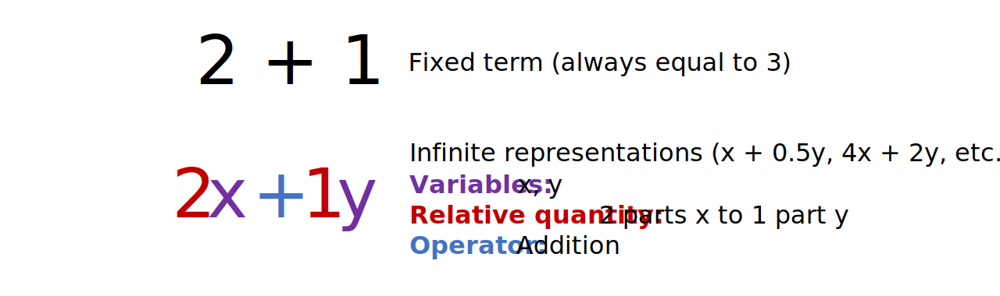
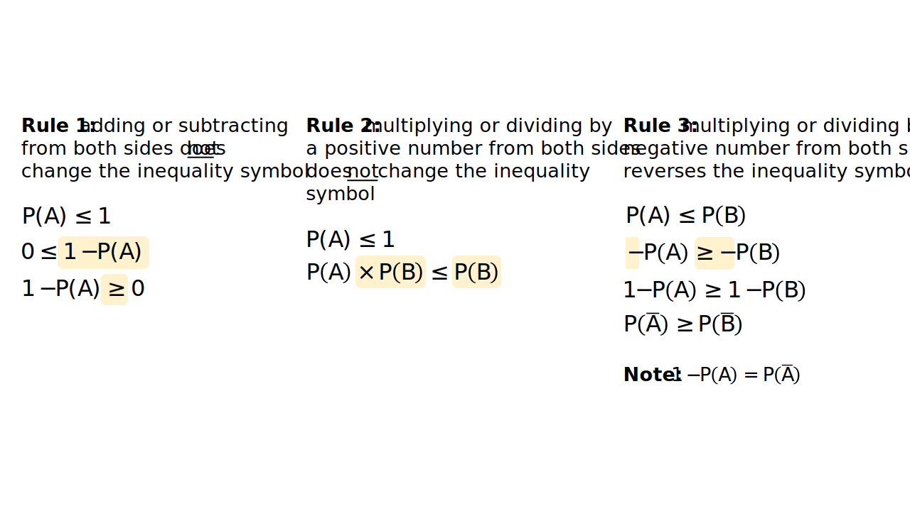

Introduction to algebra
================
Erika Duan
2/26/23

-   <a href="#elementary-algebra" id="toc-elementary-algebra">Elementary
    algebra</a>
-   <a href="#manipulating-inequalities"
    id="toc-manipulating-inequalities">Manipulating inequalities</a>
-   <a href="#simplifying-fractions"
    id="toc-simplifying-fractions">Simplifying fractions</a>
-   <a href="#factorisation" id="toc-factorisation">Factorisation</a>
-   <a href="#resources" id="toc-resources">Resources</a>

<div>

> **Summary**
>
> This tutorial lists some common algebraic tricks, such as
> factorisation and working with inequalities, which are useful for
> solving mathematical problems in later tutorials.

</div>

# Elementary algebra

Elementary algebra is commonly associated with questions like *Solve for
x when
.*
It is more useful, however, to think of elementary algebra as a form of
expression that allows us to represent infinitely possible terms using
finite ones.

For example, the terms
,

and

are equivalent and there are theoretically infinite variations of this
expression, with the simplest being
.
When we read the term
,
we can intuit that 2 parts of
 and 1 part of
 are always required to
make up a final quantity.



An algebraic term can therefore be decomposed into three parts:

-   A single **variable** or multiple variables. A variable is a varying
    quantity of an entity, usually represented by concise symbols
    ,
     or
     where
    .
-   The relative **quantity** of each variable. *For example, let
     represent the
    number of eggs and 
    represent the number of cups of sugar required to make a dessert.*
    The term
    
    describes a 1:1 ratio of eggs to sugar whereas the term
    
    describes a 2:1 ratio of eggs to sugar and will result in a very
    different taste.
-   The arithmetic **operator(s)** applied between variables. *For
    example, in additive models, the relationship between parameters
    
    is additive and the dependent variable
     therefore increases
    by  amount for
    one unit increase in
    .*

# Manipulating inequalities

Algebraic terms using inequalities are common when we want to prove the
existence of an upper or lower bound. *For example, if A is an event in
the probability space, we know that the probability of event A occurring
is between 0 and 1 inclusive i.e.*
 \leq 1").

There are three rules for manipulating inequalities:

-   Adding or subtracting the same quantity from both sides of an
    inequality leaves the inequality symbol unchanged.
-   Multiplying or dividing both sides of an inequality by a positive
    number leaves the inequality symbol unchanged.
-   Multiplying or dividing both sides of an inequality by a negative
    number reverses the inequality symbol.



<div class="panel-tabset">

## R

In R, inequality statements are outputted as Boolean values i.e. `TRUE`
or `FALSE`.

``` r
# Compute inequality in R ------------------------------------------------------
4 <= 4
#> [1] TRUE

4 < 4
#> [1] FALSE

class(4 < 4)
#> [1] "logical"
```

## Python

In Python, inequality statements are also outputted as Boolean values
i.e. `True` or `False`.

``` python
# Compute inequality in Python -------------------------------------------------
4 <= 4
#> True 

type(4 <= 4)
#> <class 'bool'>  
```

## Julia

In Julia, inequality statements are also outputted as Boolean values
i.e. `true` or `false`.

``` julia
# Compute inequality in Julia --------------------------------------------------
4 <= 4
#> true 

typeof(4 <= 4) 
#> true
#> Bool

a = 1
b = 2
c = 3

a < b, a + c < b + c
#> (true, true) 
```

</div>

# Simplifying fractions

# Factorisation

# Resources

-   [Entry](https://plato.stanford.edu/entries/algebra/) on algebra from
    the Stanford Encyclopedia of Philosophy.  
-   Khan academy [YouTube
    series](https://www.khanacademy.org/math/algebra-basics/alg-basics-algebraic-expressions#alg-basics-intro-to-variables)
    on algebra basics.  
-   A
    [factsheet](https://www.mathcentre.ac.uk/resources/uploaded/mc-bus-manipinequ-2009-1.pdf)
    on manipulating inequalities from the Uk Maths Centre.
