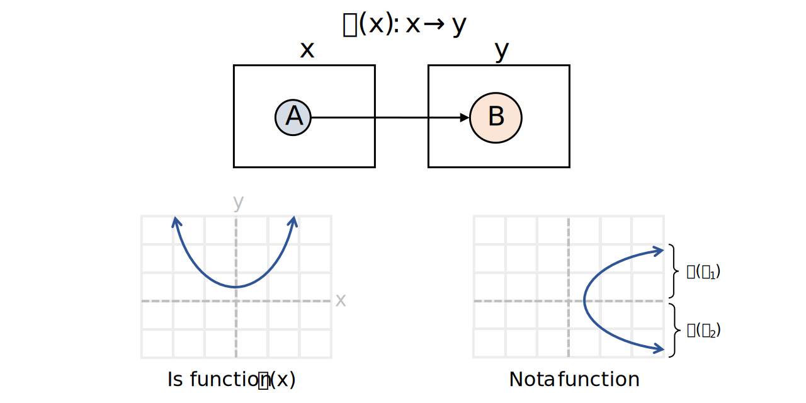

```{r setup, include=FALSE}
# Set up global environment configuration --------------------------------------
knitr::opts_chunk$set(echo=TRUE,
                      results='hide',
                      fig.show='hold',
                      fig.align='center',
                      message=FALSE,
                      warning=FALSE,
                      out.width='80%')

knitr::knit_engines$set(python = reticulate::eng_python)
```

```{r, echo=FALSE}
# Check version of Python used by reticulate -----------------------------------
reticulate::py_config()
```

# Functions   

```{r, echo=FALSE, results='markup'}

```


