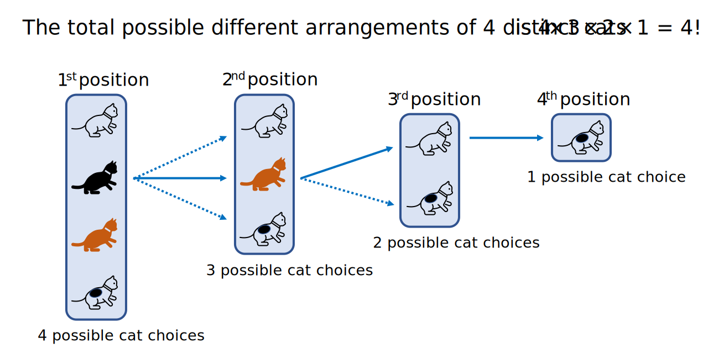
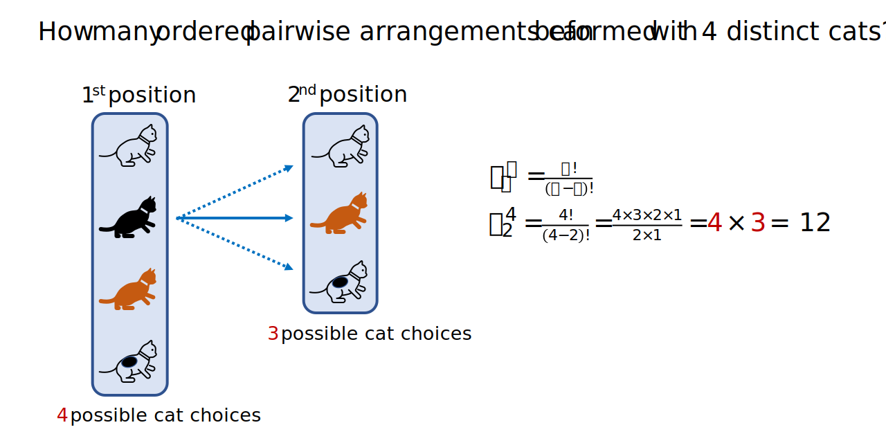
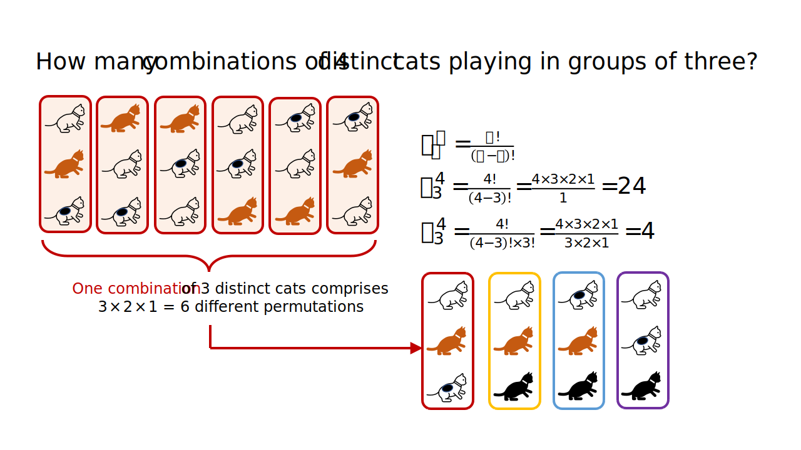
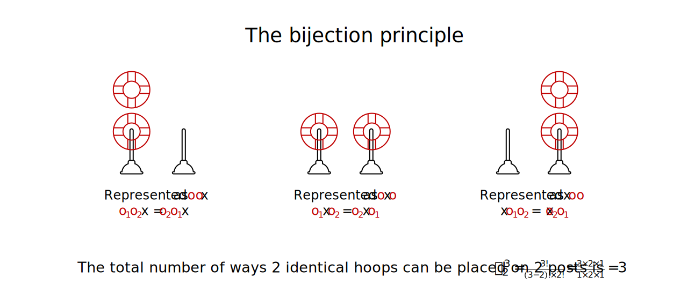
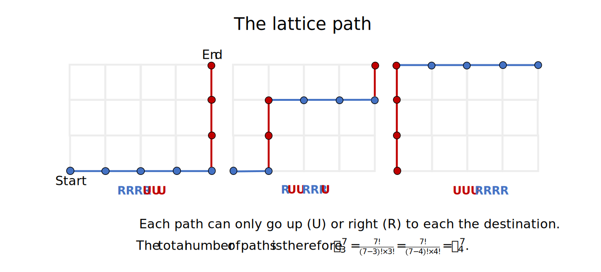
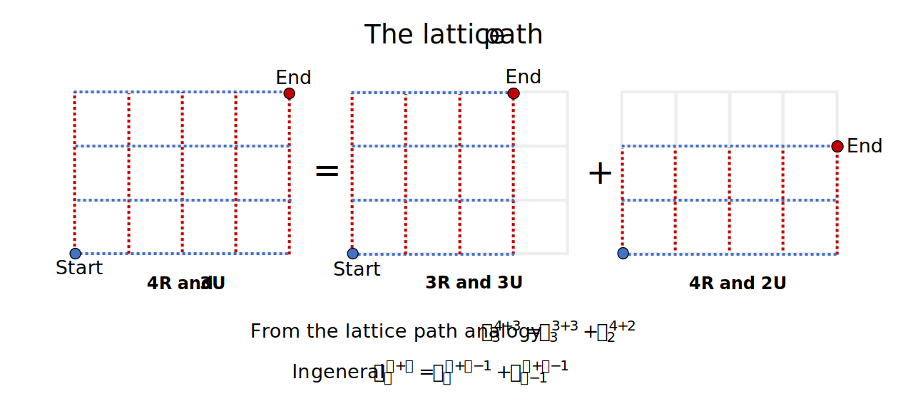
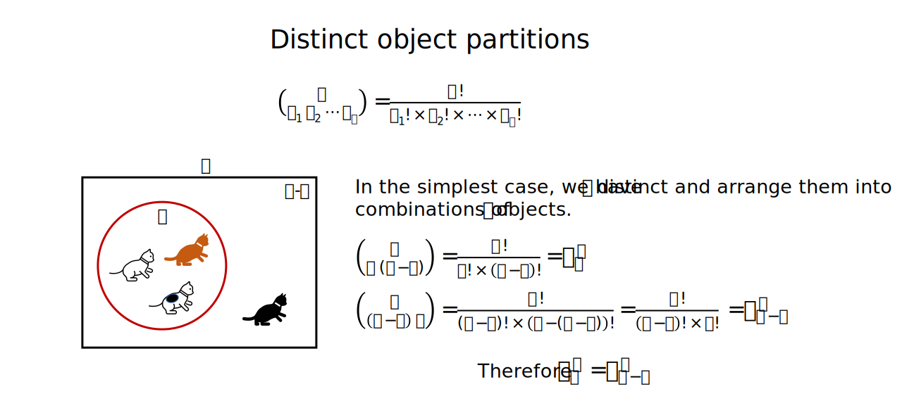
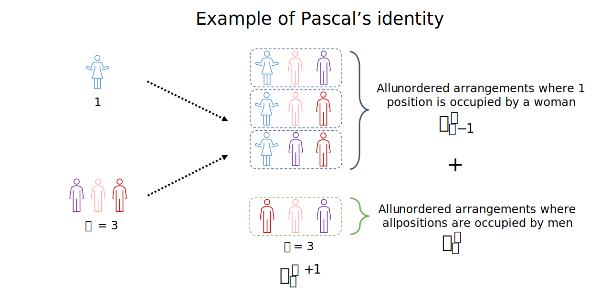

Introduction to combinatorial analysis
================
Erika Duan
3/10/23

-   <a href="#the-mn-rule" id="toc-the-mn-rule">The mn rule</a>
-   <a href="#factorials" id="toc-factorials">Factorials</a>
-   <a href="#permutations" id="toc-permutations">Permutations</a>
-   <a href="#combinations" id="toc-combinations">Combinations</a>
    -   <a href="#combinations-and-the-bijection-principle"
        id="toc-combinations-and-the-bijection-principle">Combinations and the
        bijection principle</a>
    -   <a href="#combinations-and-lattice-paths"
        id="toc-combinations-and-lattice-paths">Combinations and lattice
        paths</a>
-   <a href="#distinct-object-partions"
    id="toc-distinct-object-partions">Distinct object partions</a>
-   <a href="#pascals-identity" id="toc-pascals-identity">Pascal’s
    identity</a>
-   <a href="#vandermondes-identity"
    id="toc-vandermondes-identity">Vandermonde’s identity</a>
-   <a href="#resources" id="toc-resources">Resources</a>

<div>

> **Summary**
>
> This tutorial explains how to use factorials, permutations and
> combinations to count object combination possibilities. It also covers
> more advanced combinatorial analysis methods involving distinct object
> partitions, non-distinct object combinations and the Pascal and
> Vandermonde identities. Combinatorial analysis is a prerequisite for
> calculating event probabilities and the total possible sample space
> using the sample-point method.

</div>

# The mn rule

The

rule is a simple rule for finding the total number of all possible
ordered pairs
")
from two different sets 
and .

When you have one scenario containing
 possible elements
i.e. 
and one scenario containing with
 possible elements
i.e. ,
the total number of possible joint scenarios is the total number of
ordered pairs
")
where

and
.

This is equal to
.


This rule is best illustrated by the scenario of rolling two dice. The
total number of possible ordered pairs of two dice rolls is
,
as each dice roll generates 6 possible simple events
i.e. 
and
.

This can also be denoted by
 : a \in \{1, \cdots, 6\}, b \in \{1, \cdots, 6\}\}")
where
.

# Factorials

The definition of an n-factorial is
! \times (n-2)! \times \cdots \times 1").
The total number of all possible arrangements of
** distinct objects** in
a row is equal to .



For example, take a scenario where we have four different cats. The
total number of possible ways that these 4 cats can sit in a row is
equal to
.
This is intuitively explained by the fact that once a cat has occupied
the first position, there are only 3 remaining cats who can occupy the
second position, and only 2 remaining cats who occupy the third
position.

<div class="panel-tabset">

## R

In R, the function `factorial()` accepts a numerical vector as its
argument.

``` r
# Calculate factorials in R ----------------------------------------------------
factorial(4)
#> [1] 24

factorial(4) == 4 * 3 * 2 * 1
#> [1] TRUE
```

## Python

In Python, the function `factional()` exists in the math module and has
a fast C type internal implementation.

``` python
# Calculate factorials in Python -----------------------------------------------
import math 
math.factorial(4)
#> 24

# Factorials can also be calculated using a for loop ---------------------------
# Method is slower than math.factorial()  

n = 4 # State n-th factorial
fact = 1
 
for i in range(1, n + 1): # To output n, Python slices to n + 1
    fact = fact * i
 
f"The factorial of {n} is {fact}"  

# The code above is equivalent to the following operations  
# fact = 1 * 1
# fact = 1 * 2
# fact = 2 * 3
# fact = 6 * 4
```

## Julia

In Julia, the function `factorial()` is in-built and accepts an integer
as its argument.

``` julia
# Calculate factorials in Julia ------------------------------------------------
factorial(4)  
#> 24

factorial(4) == 4 * 3 * 2 * 1
#> true
```

</div>

# Permutations

A permutation of objects occurs when you have
 distinct objects and
must find the total number of **ordered** object arrangements occupying
 positions, where
.

 \times \cdots \times (n - r + 1)")



Intuitively, this makes sense as you only have

available for  distinct
objects to occupy, so there are
 objects occupying the
first position,
 objects
occupying the second position and

objects occupying the

position.

For example, when
 and
, we
have 4 distinct objects occupying the first position and 3 distinct
objects occupying the second (and final) position. Therefore
.

Finding the product of different permutations is useful when counting
the number of times that one of two top candidates appear in a selection
panel of two candidates from a total of five candidates. This can be
framed as finding the total different arrangements of 1) selecting 1 top
candidate from 2 top candidates and 2) selecting 1 mediocre candidate
from 3 mediocre candidates.

!} \times \frac{3!}{(3-1)!} = 2 \times 3 = 6")

# Combinations

A combination of objects occurs when you have
 distinct objects and
must find the total number of **unordered** object arrangements
occupying  positions,
where
.
*For example, we consider “ACT” and “CAT” to be different ordered word
arrangements (two permutations). When order does not matter, “ACT” and
“CAT” contain the same distinct letters and are counted as the same
combination.*

!r!}")

Intuitively, this is because the total possible arrangement of
 distinct objects is
. Therefore,
.



## Combinations and the bijection principle

What happens when we are interested in the number of ways that
**identical objects** can be distributed to different locations? We can
adapt this question as a combination calculation even though it involves
positioning identical rather than distinct objects.

Consider the different ways that 2 identical hoops can be placed on two
posts:

-   We represent the scenario where both are placed on the first post as
    “oo+”.  
-   We represent the scenario where one hoop is placed on the first hoop
    and one ring is placed on the second hoop as “o+o”.  
-   We represent the scenario where two hoops are placed on the second
    hoop as “+oo”.  
-   The boundary between the two posts is therefore represented as the
    third distinct object “+”.



Because the hoops are identical, the order of individual hoop placements
on the same post does not matter (as they correspond to the same
combination). Therefore, the total possible ways that two identical
hoops can be placed through two posts is equal to
!\times2!} = \frac{3\times2\times1}{1\times2\times1} = 3").

## Combinations and lattice paths

The **bijection principle** can also be applied to the identification of
lattice pathway solutions.

 The properties of
combination addition can also be derived from the study of lattice
paths. Consider the lattice graph above, which has end coordinates of
")
along the Cartesian plane. The sum of all solutions leading to
coordinates
")
and
")
is equal to all the solutions leading to coordinates
").



Therefore,

where
,

and
.

# Distinct object partions

The conditions for calculating the total number of ways of partitioning
 distinct objects into
 distinct groups are:

-   A total of  distinct
    objects are partitioned into
     distinct groups.  
-   Each object only appears in exactly one group.  
-   This implies that the sum of objects in all groups is equal to
    .  
-   The groups are denoted by
    
    where
    .



# Pascal’s identity

Pascal’s identity can be derived from an extension of the lattice path
analogy, where the sum of all solutions leading to coordinates
")
and
")
is equal to all the solutions leading to coordinates
").

If we substitute

and ,
we obtain the formula for Pascal’s identity.


where

and


Pascal’s identity can also be derived by considering the following
scenario. Suppose we need to count the total possible unordered
arrangements of a committee, when selecting
 persons from
 men and 1 woman.



# Vandermonde’s identity

The formula for Vandermonde’s identity can be derived by considering an
extension of the previous scenario. Suppose we need to count the total
possible unordered arrangements of a committee, when selecting
 persons from
 men and
 woman.


# Resources

-   A
    [tutorial](https://www.mathsisfun.com/combinatorics/combinations-permutations.html)
    comparing permutations and combinations from
    [Mathsisfun.com](https://www.mathsisfun.com/).
