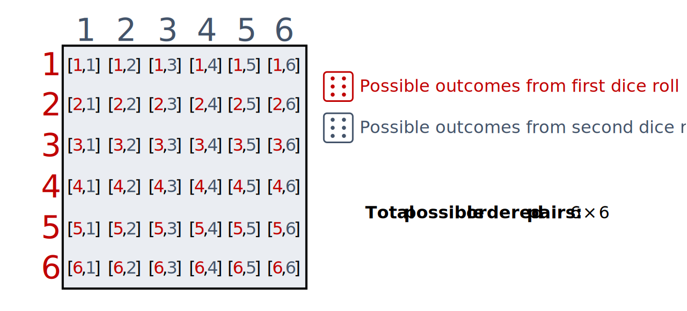

Introduction to combinatorial analysis
================
Erika Duan
3/10/23

-   <a href="#the-mn-rule" id="toc-the-mn-rule">The mn rule</a>
-   <a href="#factorials" id="toc-factorials">Factorials</a>
-   <a href="#resources" id="toc-resources">Resources</a>

> **Summary**
>
> This tutorial explains how to use factorials, permutations and
> combinations to count object combination possibilities. It also covers
> more advanced scenarios involving distinct object partitioning,
> non-distinct object combinations, lattice path applications and
> Pascal’s identity applications. Combinatorial analysis is a
> prerequisite for calculating event probabilities using the
> sample-point method.

# The mn rule

The

rule is a simple rule for finding the total number of possible ordered
pairs
")
from two different sets 
and .

When you have one scenario containing
 possible elements
i.e. 
and one scenario containing with
 possible elements
i.e. ,
the total number of possible joint scenarios is the total number of
ordered pairs
")
where

and
.

This is equal to
.

This rule is best illustrated by the scenario of rolling two dice. The
total number of possible ordered pairs of two dice rolls is
,
as each dice roll generates 6 possible simple events
i.e. 
and
.

This can also be denoted by
 : a \in \{1, \cdots, 6\}, b \in \{1, \cdots, 6\}\}")
where
.

# Factorials

# Resources

-   
