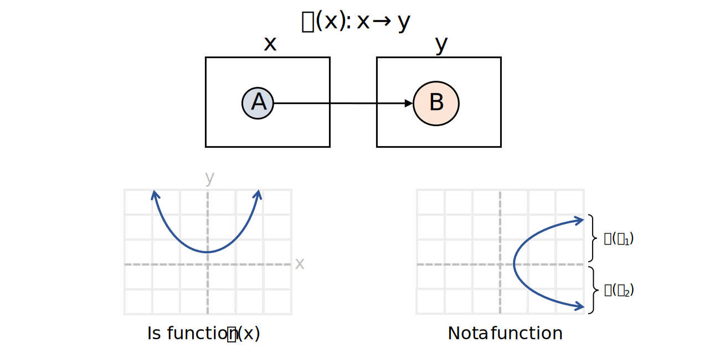

```{r setup, include=FALSE}
# Set up global environment configuration --------------------------------------
knitr::opts_chunk$set(echo=TRUE,
                      results='hide',
                      fig.show='hold',
                      fig.align='center',
                      message=FALSE,
                      warning=FALSE,
                      out.width='80%')

knitr::knit_engines$set(python = reticulate::eng_python)
```

```{r, echo=FALSE}
# Install R packages -----------------------------------------------------------
# The native pipe operator requires R version 4.1+ 
packages <- c("ggplot2",
              "dplyr",
              "patchwork")

installed_packages <- packages %in% rownames(installed.packages())

if (any(installed_packages == FALSE)) {
  install.packages(packages[!installed_packages])
}

# Attach R packages to the global environment
library("dplyr")
library("ggplot2")
library("patchwork")

# Check version of Python used by reticulate -----------------------------------
reticulate::py_config()
```


# Properties of functions  

A **function** can be thought of as a rule that maps each element $x$ in set A to exactly one element $y=f(x)$ in set B.    

+ The domain of $f: A \to B$ is the set A, which is usually $\mathbb{R}$ or $\mathbb{R}^n$.  
+ The domain can be restricted by the function form. For $f(x) = \sqrt{x_2-4}$, the domain is $\{x \in \mathbb{R} | x \geq 2$ or $x \leq -2 \}$ or $(- \infty, -2] \cup [2, \infty )$.    
+ The co-domain of $f: A \to B$ is the set B, which is usually $\mathbb{R}$ or $\mathbb{R}^n$.   
+ The range of $f: A \to B$ is $R(f) = \{y | y = f(x)$ for some $x \in A\}$. 
+ The range is more restricted than the co-domain. For $f(x) = sin(x)$, the co-domain is $\mathbb{R}$ and the range is $[-1, 1]$.   
    
```{r, echo=FALSE, results='markup'}

```

For $f(x)$ and $g(x)$, if the range of $g(x)$ is in the domain of $f(x)$, the **function composite** $(f\circ g)(x) = f(g(x))$ exists. For example, if $f(x) = log(x)$ and $g(x) = \sqrt{x+1}$, then $(f\circ g)(x)=log(\sqrt{x+1})$ and $(g\circ f)(x) = \sqrt{log(x)+1}$.    


# Finding the function limit  

The limit of a function $lim_{x \to a} f(x) = L$ comprises values of $f(x)$ for values of $x$ close to but not equal to $a$. This is equivalent to saying that $f(x)$ approaches the limit $L$ as $x$ approaches $a$.    

The **formal definition** of a function limit involves:   

+ Choose $\epsilon$ and $\delta$ such that $\epsilon > 0$ and $\delta > 0$.    
+ Solve $0 < |x-a| < \delta$.   
+ Confirm that when $x \neq a$, $|f(x) - L| < \epsilon$.    

This method is not used in practice as it is very laborious to find $\delta$. For example, in order to verify that $lim_{x \to a} x^2 = 4$, we need to:     

+ Factorise $|x^2 - 4| < \epsilon$ into $|x - 2||x + 2| < \epsilon$.  
+ Manually calculate what happens to the $|x + 2|$ when $|x - 2| < 1$. When $|x - 2| < 1$, $1 < x < 3$ and therefore $3 < x + 2 < 5$.   
+ Substitute $3 < x + 2 < 5$ into $|x - 2||x + 2| < \epsilon$. Therefore $|x - 2||x + 2| < 5|x - 2| < \epsilon$.  
+ Therefore, when $5|x - 2| < \epsilon$, $|x + 2| < 1$ and $|x + 2| < \tfrac{\epsilon}{5}$.  
+ Therefore $\delta = min(1, \tfrac{\epsilon}{5})$.   

As a matter of pragmatism, to find the function limit, we simplify the function or composite function using the limit laws.   

```{r, echo=FALSE, results='markup'}

```

**Note:** For non-arbitrary or non-split functions, a consequence of the limit laws is that $lim_{x \to a} f(x) = f(a)$ when $a$ is in the domain of $f(x)$.    

Types of limits:  

+ Left limit: if $f(x)$ is defined for all $x < a$ where $x$ is near $a$.    
+ Right limit: if $f(x)$ is defined for all $x > a$ where $x$ is near $a$.   
+ Limit at infinity: if $f(x)$ is defined for all sufficiently large positive values of $x$ and $f(x)$ is close enough to L.     
+ Limit at negative infinity: if $f(x)$ is defined for all sufficiently small positive values of $x$ and $f(x)$ is close enough to L. 

```{r, echo=FALSE, results='markup'}
knitr::include_graphics("../figures/functions-limit_types.svg")
```

**Note:** Not all functions have limits. For $lim_{x \to \infty} (x+1)$, the limit is $\infty$ and is therefore undefined. A function only has a limit if the left limit and right limit are defined and equal to each other.     

<details><summary>R code</summary>  
<p>   

```{r}
# Plot f(x) = x^2 --------------------------------------------------------------
set.seed(111)

p1 <- ggplot(data.frame(x = runif(1000, -20, 20)), aes(x)) +
  geom_function(fun = ~ (.x)^2) +
  xlim(-4, 4) + 
  ylim(-1, 4) + 
  labs(title = "f(x) = x^2") +  
  theme_minimal() + 
  theme(panel.border = element_rect(fill = NA),
        panel.grid.minor = element_blank(),
        panel.grid.major = element_line(linetype = "dotted")) +
  annotate("text", x = 1.4, y = -0.2, label = "D: (-infinity, infinity)") +
  annotate("text", x = 1.4, y = -0.5, label = "R: [0, infinity)") +
  annotate("text", x = 1.4, y = -0.8, label = "Undefined limit at infinity")  

# Plot f(x) = abs(x)/x ---------------------------------------------------------
set.seed(111)

p2 <- ggplot(data.frame(x = runif(1000, -20, 20)), aes(x)) +
  geom_function(fun = ~ abs(.x)/.x) +
  geom_vline(xintercept = 0, linetype = "dotted") + 
  xlim(-4, 4) + 
  ylim(-1, 4) + 
  labs(title = "f(x) = abs(x)/x") +  
  theme_minimal() + 
  theme(panel.border = element_rect(fill = NA),
        panel.grid.minor = element_blank(),
        panel.grid.major = element_line(linetype = "dotted")) +
  annotate("text", x = 1.8, y = -0.2, label = "D: (-infinity, infinity)") +
  annotate("text", x = 1.8, y = -0.5, label = "R: -1 or 1") +
  annotate("text", x = 1.8, y = -0.8, label = "Undefined limit at infinity")

# Plot ggplot figures side by side --------------------------------------------- 
p1 + p2
```

</p>  
</details><p>  


# The Squeeze theorem   

The **Squeeze theorem** allows us to define the limit of a function based on an understanding of the lower and upper boundaries of a related function.  

Let $f(x)$, $g(x)$ and $h(x)$ exist where $f(x) \leq g(x) \leq h(x)$. For all values of $x$ sufficiently close to $a$, suppose that $lim_{x \to a} f(x) = lim_{x \to a} h(x) = L$, then $lim_{x \to a} g(x) = L$.   

For example, to find $lim_{x \to a} x sin(\tfrac{1}{x})$, we start by knowing that $-1\leq sin(x) \leq1$ and therefore that $-x\leq xsin(x) \leq x$ for all $x \neq 0, x >0$. The right limit of $-x$ as it approaches 0 is 0 and the right limit of $x$ as it approaches 0 is also 0. Therefore $lim_{x \to a} x sin(\tfrac{1}{x}) = 0$ by the Squeeze theorem.   

<details><summary>R code</summary>  
<p>   

```{r}
# Plot f(x) = x * sin(x) -------------------------------------------------------
set.seed(111)

p1 <- ggplot(data.frame(x = runif(1000, -20, 20)), aes(x)) +
  geom_function(fun = ~ (.x) * sin(.x)) +
  labs(title = "f(x) = x sin(x)") +  
  theme_minimal() + 
  theme(panel.border = element_rect(fill = NA),
        panel.grid.minor = element_blank(),
        panel.grid.major = element_line(linetype = "dotted")) +
  annotate("text", x = 1.4, y = -18, label = "Limit as x approaches 0: 0")  

# Plot f(x) = sin(x)/x ---------------------------------------------------------
set.seed(111)

p2 <- ggplot(data.frame(x = runif(1000, -20, 20)), aes(x)) +
  geom_function(fun = ~ sin(.x)/.x) +
  labs(title = "f(x) = sin(x)/x") +  
  theme_minimal() + 
  theme(panel.border = element_rect(fill = NA),
        panel.grid.minor = element_blank(),
        panel.grid.major = element_line(linetype = "dotted")) +
  annotate("text", x = 1.8, y = -0.8, label = "Limit as x approaches 0: 1")

# Plot ggplot figures side by side --------------------------------------------- 
p1 + p2
```

</p>  
</details><p>  


# Continuity  

A function is **continuous** at point $a$ if:  

+ $f(a)$ is defined i.e. $a \in$ domain of $f(x)$ and $lim_{x \to a} f(x) = f(a)$.      
+ $lim_{x \to a} f(x)$ exists i.e. the right limit and left limit both exist and are equal to each other as $x$ approaches $a$ for $f(x)$.  
+ By geometric intuition, if $f(x)$ is continuous as point $x = a$, the points $(x, f(x))$ continue to approach the point $(a, f(a))$ and there is no gap in the graph.   

If $f(x), g(x)$ are continuous on some domain and $c$ is a constant, then the functions formed from $f(x) \pm g(x)$, $cf(x)$, $(f\circ g)(x)$, and $\tfrac{f(x)}{g(x)}$ are all continuous.   

If $lim_{x \to a} g(x) = b$, then $lim_{x \to a} f(g(x)) = f(lim_{x \to a}g(x)) = f(b)$.  

<details><summary>R code</summary>  
<p>   

```{r}
# Plot f(x) = 1/x --------------------------------------------------------------
set.seed(111)

p1 <- ggplot(data.frame(x = runif(1000, -20, 20)), aes(x)) +
  geom_function(fun = ~ 1/(.x)) +
  xlim(-6, 6) + 
  ylim(-6, 6) + 
  labs(title = "f(x) = 1/x") +  
  theme_minimal() + 
  theme(panel.border = element_rect(fill = NA),
        panel.grid.minor = element_blank(),
        panel.grid.major = element_line(linetype = "dotted")) +
  annotate("text", x = 0, y = -5, label = "f(x) is continuous but undefined at x = 0")  

p1
```

</p>  
</details><p>  

**Note:** Rather than saying that $f(x) = 1/x$ is discontinuous because f(0) is undefined, we can say that $f(x) = 1/x$ is continuous for $x \neq 0$.  


# Intermediate value theorem  

The intermediate value theorem extends ideas from the Squeeze theorem. It is mainly used to judge whether a solution will exist between a specific interval of values in the domain.  

Let $f(x)$ be continuous along the closed interval $[a, b]$ where $v$ is a number between $f(a)$ and $f(b)$. There exists a number $c \in [a,b]$ such that $f(c) = v$.  

```{r, echo=FALSE, results='markup'}
knitr::include_graphics("../figures/functions-intermediate_value_theorem.svg")
```


# Resources  
+ Lectures and exercises from the Khan academy [functions unit](https://www.khanacademy.org/math/algebra/x2f8bb11595b61c86:functions).    