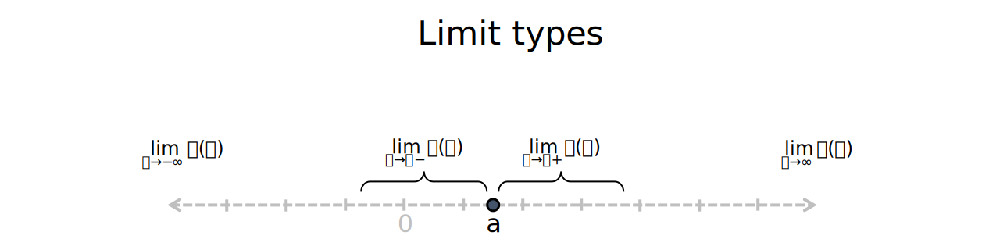
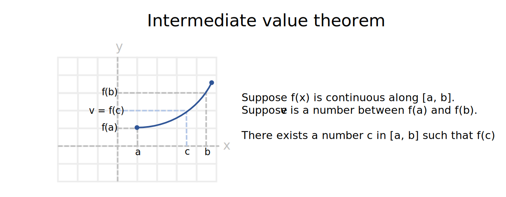

Introduction to functions
================
Erika Duan
2022-09-25

-   [Properties of functions](#properties-of-functions)
-   [Finding the function limit](#finding-the-function-limit)
-   [The Squeeze theorem](#the-squeeze-theorem)
-   [Continuity](#continuity)
-   [Intermediate value theorem](#intermediate-value-theorem)
-   [Resources](#resources)

# Properties of functions

A **function** can be thought of as a rule that maps each element
 in set A to exactly
one element
")
in set B.

-   The domain of
    
    is the set A, which is usually
    
    or
    .  
-   The domain can be restricted by the function form. For
     = \sqrt{x_2-4}"),
    the domain is
    
    or
    
    or
    ![(- \\infty, -2\] \\cup \[2, \\infty )](https://latex.codecogs.com/svg.format?%28-%20%5Cinfty%2C%20-2%5D%20%5Ccup%20%5B2%2C%20%5Cinfty%20%29 "(- \infty, -2] \cup [2, \infty )").  
-   The co-domain of
    
    is the set B, which is usually
    
    or
    .  
-   The range of
    
    is
     = \{y | y = f(x)")
    for some
    .
-   The range is more restricted than the co-domain. For
     = sin(x)"),
    the co-domain is
    
    and the range is
    ![\[-1, 1\]](https://latex.codecogs.com/svg.format?%5B-1%2C%201%5D "[-1, 1]").


For ") and
"), if the
range of ")
is in the domain of
"), the
**function composite**
(x) = f(g(x))")
exists. For example, if
 = log(x)")
and
 = \sqrt{x+1}"),
then
(x)=log(\sqrt{x+1})")
and
(x) = \sqrt{log(x)+1}").

# Finding the function limit

The limit of a function
 = L")
comprises values of
") for
values of  close to but
not equal to . This is
equivalent to saying that
")
approaches the limit 
as  approaches
.

The **formal definition** of a function limit involves:

-   Choose
    
    and
    
    such that
    
    and
    .  
-   Solve
    .  
-   Confirm that when
    ,
     - L| < \epsilon").

This method is not used in practice as it is very laborious to find
. For
example, in order to verify that
,
we need to:

-   Factorise
    
    into
    .  
-   Manually calculate what happens to the
    
    when
    .
    When
    ,
    
    and therefore
    .  
-   Substitute
    
    into
    .
    Therefore
    .  
-   Therefore, when
    ,
    
    and
    .  
-   Therefore
    ").

As a matter of pragmatism, to find the function limit, we simplify the
function or composite function using the limit laws.


**Note:** For non-arbitrary or non-split functions, a consequence of the
limit laws is that
 = f(a)")
when  is in the domain
of ").

Types of limits:

-   Left limit: if
    ") is
    defined for all
    
    where  is near
    .  
-   Right limit: if
    ") is
    defined for all
    
    where  is near
    .  
-   Limit at infinity: if
    ") is
    defined for all sufficiently large positive values of
     and
    ") is
    close enough to L.  
-   Limit at negative infinity: if
    ") is
    defined for all sufficiently small positive values of
     and
    ") is
    close enough to L.



**Note:** Not all functions have limits. For
"),
the limit is
 and
is therefore undefined. A function only has a limit if the left limit
and right limit are defined and equal to each other.

<details>
<summary>
R code
</summary>
<p>

``` r
# Plot f(x) = x^2 --------------------------------------------------------------
set.seed(111)

p1 <- ggplot(data.frame(x = runif(1000, -20, 20)), aes(x)) +
  geom_function(fun = ~ (.x)^2) +
  xlim(-4, 4) + 
  ylim(-1, 4) + 
  labs(title = "f(x) = x^2") +  
  theme_minimal() + 
  theme(panel.border = element_rect(fill = NA),
        panel.grid.minor = element_blank(),
        panel.grid.major = element_line(linetype = "dotted")) +
  annotate("text", x = 1.4, y = -0.2, label = "D: (-infinity, infinity)") +
  annotate("text", x = 1.4, y = -0.5, label = "R: [0, infinity)") +
  annotate("text", x = 1.4, y = -0.8, label = "Undefined limit at infinity")  

# Plot f(x) = abs(x)/x ---------------------------------------------------------
set.seed(111)

p2 <- ggplot(data.frame(x = runif(1000, -20, 20)), aes(x)) +
  geom_function(fun = ~ abs(.x)/.x) +
  geom_vline(xintercept = 0, linetype = "dotted") + 
  xlim(-4, 4) + 
  ylim(-1, 4) + 
  labs(title = "f(x) = abs(x)/x") +  
  theme_minimal() + 
  theme(panel.border = element_rect(fill = NA),
        panel.grid.minor = element_blank(),
        panel.grid.major = element_line(linetype = "dotted")) +
  annotate("text", x = 1.8, y = -0.2, label = "D: (-infinity, infinity)") +
  annotate("text", x = 1.8, y = -0.5, label = "R: -1 or 1") +
  annotate("text", x = 1.8, y = -0.8, label = "Undefined limit at infinity")

# Plot ggplot figures side by side --------------------------------------------- 
p1 + p2
```


</p>
</details>
<p>

# The Squeeze theorem

The **Squeeze theorem** allows us to define the limit of a function
based on an understanding of the lower and upper boundaries of a related
function.

Let "),
") and
") exist
where
 \leq g(x) \leq h(x)").
For all values of 
sufficiently close to ,
suppose that
 = lim_{x \to a} h(x) = L"),
then
 = L").

For example, to find
"),
we start by knowing that
 \leq1")
and therefore that
 \leq x")
for all
.
The right limit of 
as it approaches 0 is 0 and the right limit of
 as it approaches 0 is
also 0. Therefore
 = 0")
by the Squeeze theorem.

<details>
<summary>
R code
</summary>
<p>

``` r
# Plot f(x) = x * sin(x) -------------------------------------------------------
set.seed(111)

p1 <- ggplot(data.frame(x = runif(1000, -20, 20)), aes(x)) +
  geom_function(fun = ~ (.x) * sin(.x)) +
  labs(title = "f(x) = x sin(x)") +  
  theme_minimal() + 
  theme(panel.border = element_rect(fill = NA),
        panel.grid.minor = element_blank(),
        panel.grid.major = element_line(linetype = "dotted")) +
  annotate("text", x = 1.4, y = -18, label = "Limit as x approaches 0: 0")  

# Plot f(x) = sin(x)/x ---------------------------------------------------------
set.seed(111)

p2 <- ggplot(data.frame(x = runif(1000, -20, 20)), aes(x)) +
  geom_function(fun = ~ sin(.x)/.x) +
  labs(title = "f(x) = sin(x)/x") +  
  theme_minimal() + 
  theme(panel.border = element_rect(fill = NA),
        panel.grid.minor = element_blank(),
        panel.grid.major = element_line(linetype = "dotted")) +
  annotate("text", x = 1.8, y = -0.8, label = "Limit as x approaches 0: 1")

# Plot ggplot figures side by side --------------------------------------------- 
p1 + p2
```


</p>
</details>
<p>

# Continuity

A function is **continuous** at point
 if:

-   ") is
    defined
    i.e. 
    domain of
    ") and
     = f(a)").  
-   ")
    exists i.e. the right limit and left limit both exist and are equal
    to each other as 
    approaches  for
    ").  
-   By geometric intuition, if
    ") is
    continuous as point
    ,
    the points
    )")
    continue to approach the point
    )")
    and there is no gap in the graph.

If
, g(x)")
are continuous on some domain and
 is a constant, then
the functions formed from
 \pm g(x)"),
"),
(x)"),
and
}{g(x)}")
are all continuous.

If
 = b"),
then
) = f(lim_{x \to a}g(x)) = f(b)").

<details>
<summary>
R code
</summary>
<p>

``` r
# Plot f(x) = 1/x --------------------------------------------------------------
set.seed(111)

p1 <- ggplot(data.frame(x = runif(1000, -20, 20)), aes(x)) +
  geom_function(fun = ~ 1/(.x)) +
  xlim(-6, 6) + 
  ylim(-6, 6) + 
  labs(title = "f(x) = 1/x") +  
  theme_minimal() + 
  theme(panel.border = element_rect(fill = NA),
        panel.grid.minor = element_blank(),
        panel.grid.major = element_line(linetype = "dotted")) +
  annotate("text", x = 0, y = -5, label = "f(x) is continuous but undefined at x = 0")  

p1
```


</p>
</details>
<p>

**Note:** Rather than saying that
 = 1/x")
is discontinuous because f(0) is undefined, we can say that
 = 1/x")
is continuous for
.

# Intermediate value theorem

The intermediate value theorem extends ideas from the Squeeze theorem.
It is mainly used to judge whether a solution will exist between a
specific interval of values in the domain.

Let ") be
continuous along the closed interval
![\[a, b\]](https://latex.codecogs.com/svg.format?%5Ba%2C%20b%5D "[a, b]")
where  is a number
between ")
and ").
There exists a number
![c \\in \[a,b\]](https://latex.codecogs.com/svg.format?c%20%5Cin%20%5Ba%2Cb%5D "c \in [a,b]")
such that
 = v").



# Resources

-   Lectures and exercises from the Khan academy [functions
    unit](https://www.khanacademy.org/math/algebra/x2f8bb11595b61c86:functions).
