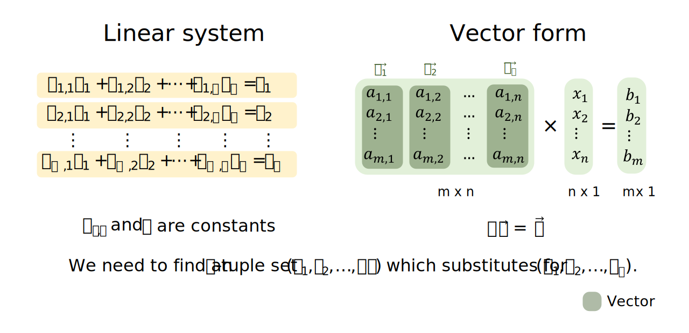
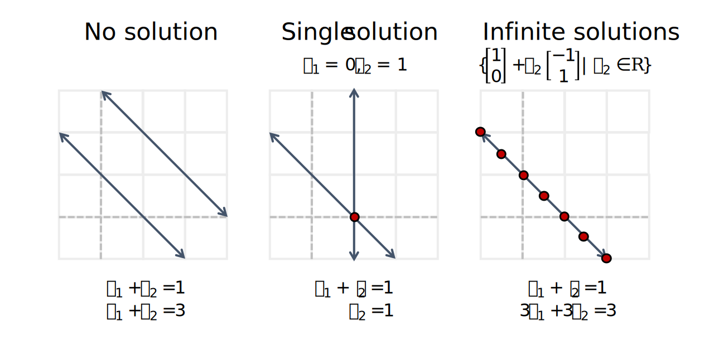
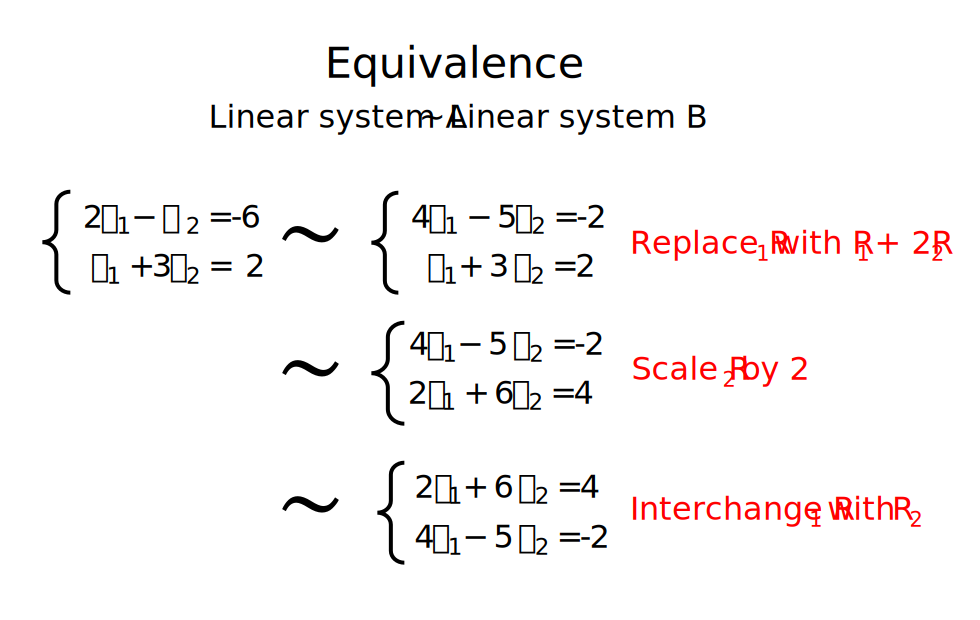
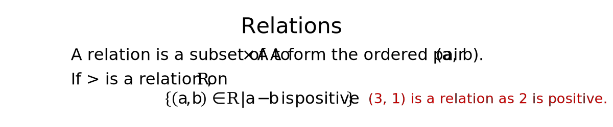
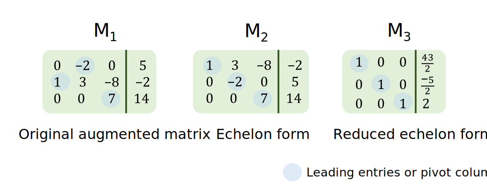
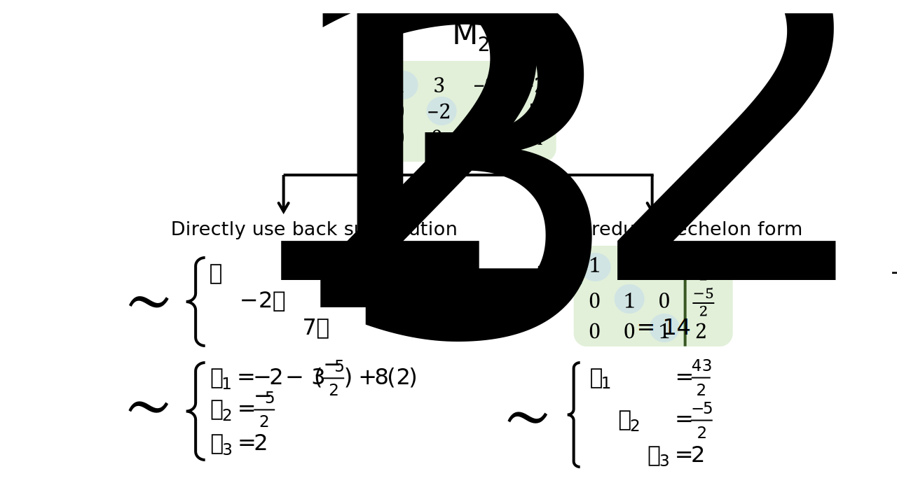
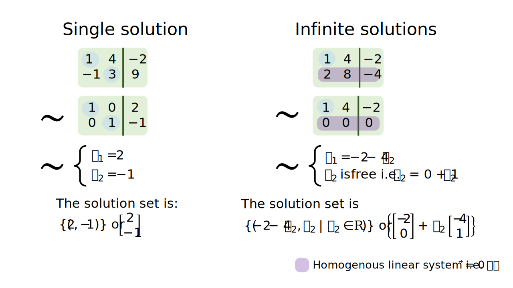
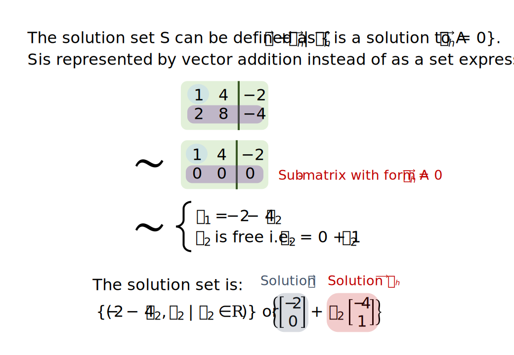
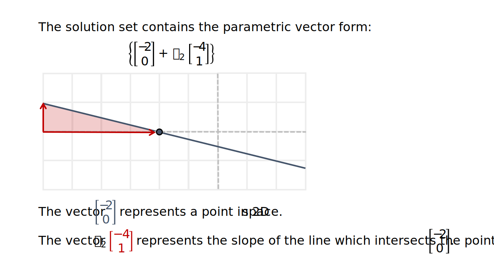
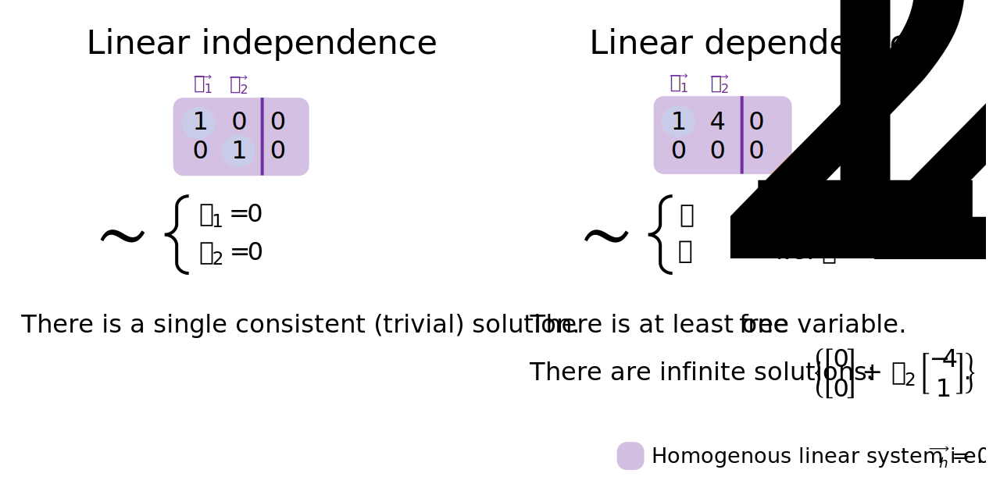

```{r setup, include=FALSE}
# Set up global environment configuration --------------------------------------
knitr::opts_chunk$set(echo=TRUE,
                      results='hide',
                      fig.show='hold',
                      fig.align='center',
                      message=FALSE,
                      warning=FALSE,
                      out.width='80%')

knitr::knit_engines$set(python = reticulate::eng_python)
```

```{r, echo=FALSE}
# Check version of Python used by reticulate -----------------------------------
reticulate::py_config()
```


# A single linear equation   

There is a fundamental relationship between the linear equation $ax + by = c$, which contains two unknown variables, and lines. A line represents the space occupied by all possible solutions to the linear equation $ax + by = c$.           

This means that linear equations can be described using geometric as well as mathematical intuition, for equations with $\leq$ 3 unknown variables i.e. for scenarios in 1D to 3D space. For example, the solution for $3x - 2y = 2$ can be rearranged into the form $y = \tfrac{3}{2}x - 1$, which is a line with slope $\tfrac{3}{2}$ and y-intercept $-1$.  

A single linear equation can be inconsistent (where no solution exists) or consistent (where a single solution or infinite solutions exist). For any consistent linear equation, the solution set also has a geometric form. For example, the solutions to $3x-2y=2$ map to a single line within a 2D plane. Any point on this line is an individual solution and the line of infinite solutions is a copy of $\mathbb{R}^1$ inside $\mathbb{R}^2$.  

The geometric intuition that solutions exist as a copy of $\mathbb{R}^{n-1}$ inside $\mathbb{R}^n$ is true for all linear equations. For example, the solution to the linear system $3x=2$ is a copy of $\mathbb{R}^0$ inside $\mathbb{R}^1$ and maps to a single point along a 1D line.    

```{r, echo=FALSE, results='markup'}
knitr::include_graphics("../figures/linear_systems-consistent_solutions.svg")
```

**Note:** In linear algebra, it is preferable to write linear equations in the form $ax_1 + bx_2 = c$ instead of $ax + by = c$, as we often deal with dimensions greater than 3 (commonly represented by the x, y, z coordinates).    

**Note:** Linear equations with the form $c_1x_1 + c_2x_2 = 0$ rather than $c_1x_1 + c_2x_2 = k$ have the distinct property that they also pass the point of origin i.e. they also contain a trivial solution $x_1 = x_2 = 0$.          


# A system of linear equations   

In linear algebra, we aim to find a solution set $S = \{s_1, s_2, \cdots\, s_n\}$ to the unknown variables $\{x_1, x_2, \cdots\, x_n\}$ given that multiple observations (or solution constraints) are described. Each observation or solution constraint is incorporated as an additional linear equation containing different scalars of the same unknown variables. A set of linear equations that must be simultaneously solved is called a **linear system**.      

In statistics, a linear system is used to describe multiple observations of a phenomenon and $X$ and $\vec y$ are treated as random variables. Given observed values of $X$ and $\vec y$, we solve for $\vec b$ where $X \vec b + \vec \epsilon = \vec y$. $X$ and $\vec y$ are random variables because we attribute a component of randomness to the observed $X$ and $\vec y$ values. We are therefore never interested in modelling a single solution to our linear system i.e. we do not want to generate a perfect curve which fits through all points of $X$ and $\vec y$. In statistics, the latter task is known as model overfitting.    

In contrast, in mathematical modelling, a linear system contains multiple fixed observations and we solve for $\{x_1, x_2, ..., x_n\}$ or $\vec x$ where $\vec a_1x_1  + \vec a_2x_2 + \cdots + \vec a_nx_n = \vec b$ or $A\vec x = \vec b$ where $a_{i,j}, b \in \mathbb{R}$. The linear system is true when a set of values $\{c_1, c_2, ..., c_n\}$ substitutes for $\{x_1, x_2, ..., x_n\}$.     

```{r, echo=FALSE, results='markup'}

```

For any linear system, we have three possible scenarios:   

+ The linear system is inconsistent (at least one equation is inconsistent with respect to other equations) and we have an **empty** set of solutions i.e. $S = \{\}$.     
+ The linear system is consistent and has only one solution set i.e. $S = \{(c_1, c_2, \cdots, c_n)\}$ where $c_1, c_2, \cdots, c_n$ are fixed scalars.     
+ The linear system is consistent and has infinite solutions (or the solution set has infinitely many elements) i.e. $S = \{(c_1, c_2, x_3 + c_3) | x_3 \in \mathbb{R}\}$ where $c_1, c_2, c_3$ are fixed scalars and $x_3$ represents any real number.    

**Note:** Infinite solutions always occur when you have less observations than unknown variables i.e. the $n<p$ [problem](https://stats.stackexchange.com/questions/385711/what-is-the-problem-with-p-n) in statistics. In a linear system, $m$ is used to represent the number of observations collected and $n$ is used to represent the number of unknown variables present.       

Using linear systems with two unknown variables as an example, we can see that solutions to linear systems have two properties:  
+ Solutions can be solved through mathematical simplification.    
+ Solutions have a geometric intuition. In 2D, solutions can be represented as two lines which never intersect (no solution), two lines which only intersect once (single solution), or two lines superimposed on each other (infinite solutions).      

```{r, echo=FALSE, results='markup'}

```


# Equivalent linear systems       

Two linear systems are row equivalent if they have the same n-tuple solution set i.e. if $\{s_1, \cdots, s_n\} = \{t_1, \cdots, t_n \}$. Row equivalence implies that we can convert one linear system into an equivalent linear system to find the simplest linear system to solve for.    

The process of converting a linear system into an equivalent simpler linear system can be considered as an algorithm. To construct this algorithm, we need to identify the elementary equation operations which maintain equivalency between two linear systems i.e. prove that all types of EEOs maintain equivalency between linear systems A and B.  

```{r, echo=FALSE, results='markup'}

```

The three elementary equation operations (EEOs) are:  
+ **Replacement** - replace an equation by the sum of itself and the multiple of another equation.   
+ **Interchange** - interchange the listed order of two equations.   
+ **Scaling** - replace an equation with a multiple of itself.   

If we know that there is a finite and reversible sequence of elementary equation operations to transform A into B, then the best algorithm will select the minimal sequence of EEOs to reach B, where B is the simplest equivalent linear system to solve. This is how the row reduction (or Gauss Jordan elimination) algorithm works.    


# Equivalence relations   

Let A be a set. A relation on A is any subset of $A \times A$, or any set of ordered pairs $(a,b)$ where $a,b \in A$, which satisfies the conditions of a statement or function being applied on $a$ to $b$.   

```{r, echo=FALSE, results='markup'}

```

**Equivalence relations** refers to relations that are:  

+ Reflexive - for any $a \in A$, $a$ applies to $a$.   
+ Symmetric - for any $a, b \in A$, if $a$ applies to $b$, then $b$ applies to $a$.  
+ Transitive - for any $a, b, c \in A$, if $a$ applies to $b$ and $b$ applies to $c$, then $a$ applies to $c$.  

For example, suppose that matrix A is equivalent to matrix B and C. There exists a finite sequence of EROs which transforms A into B and A into C. Because EROs are reversible, the finite sequence of EROs which transforms B into A and then A into C yields a finite sequence of EROs which transforms B into C. Therefore row equivalence is also transitive.  

Row equivalence is therefore an equivalence relation on the set of all linear systems in the same set of variables i.e. $\{x_1, x_2, \cdots, x_n\}$. This also means that row equivalence is also an equivalence relation on the set of all $m \times n$ matrices.   


# Augmented matrices and matrix echelon forms      

A linear system can be represented by an augmented matrix $\left[\begin{array}{cccc|c}\vec v_1 & \vec v_2 & \cdots\ & \vec v_p & \vec b \end{array}\right]$ for linear systems with form $A\vec x = \vec b$ and by a coefficient matrix $\left[\begin{array}{cccc}\vec v_1 & \vec v_2 & \cdots\ & \vec v_p \end{array}\right]$ for linear systems with form $A\vec x = \vec 0$.   

Each matrix can exist in multiple echelon forms and in one unique reduced echelon form.   

The matrix equivalent of elementary equation operations (EEOs) are elementary row operations (EROs).   

```{r, echo=FALSE, results='markup'}

```

A matrix is in an **echelon form** if:  
+ All non-zero rows are above rows of all zeros.   
+ Each leading entry (or pivot column of a row) is located to the left of the leading entry of the row below it. Each leading entry in the echelon form represents a fixed or **basic variable** in the linear system.     
+ All entries in a column below a leading entry are zeros.    

A matrix is in its **reduced echelon form** if additionally:      
+ All leading entries are 1.   
+ Each leading 1 is the only non-zero entry in its column.    

When a matrix is in an echelon form, we can solve the linear system by either:   
1. Directly using back substitution to simplify the list of equations and then solve for each variable. Solutions should be presented in terms of free variables only.   
2. Further reducing the matrix to its reduced echelon form, where the solution for each variable is obvious i.e. $x_1 = b_1, x_2 = b_2, \cdots, x_n = b_n$.           

```{r, echo=FALSE, results='markup'}
  
```

**Note:** Linear systems with infinite solutions are easily identified in matrix echelon form by the presence of at least one row lacking a pivot column. Free variables correspond to variables lacking a corresponding pivot column in the matrix echelon form.      


# Row reduction algorithmn    
In the row reduction algorithm (also know as the Gauss Jordan Elimination algorithm), we aim to:   

1. Find the matrix **echelon form** by applying replacement elementary row operations i.e. $R_j = R_i$ or $R_j = kR_j$ or $R_j = R_j + kR_i$ on all columns below the leading edge in a row (to convert those values into zeros). Repeat this step for each leading edge of each row.   
2. Find the matrix **reduced echelon form** by identifying the right most leading edge and using a scaling elementary row operation to convert it into 1. Apply replacement elementary row operations i.e. $R_i = R_i + kR_j$ on all columns above the leading 1 (to convert those values into zeros). Repeat this step for each leading edge of each row.    

<details><summary>Python code</summary>  
<p> 

```{python, eval=FALSE}
# To be completed --------------------------------------------------------------
import numpy as np
A=np.array([[1,-1,1,3],[2,1,8,18],[4,2,-3,-2]])

def RowSwap(A,k,l):
# =============================================================================
#     A is a NumPy array.  RowSwap will return duplicate array with rows
#     k and l swapped.
# =============================================================================
    m = A.shape[0]  # m is number of rows in A
    n = A.shape[1]  # n is number of columns in A
    
    B = np.copy(A).astype('float64')
        
    for j in range(n):
        temp = B[k][j]
        B[k][j] = B[l][j]
        B[l][j] = temp
        
    return B

def RowScale(A,k,scale):
# =============================================================================
#     A is a NumPy array.  RowScale will return duplicate array with the
#     entries of row k multiplied by scale.
# =============================================================================
    m = A.shape[0]  # m is number of rows in A
    n = A.shape[1]  # n is number of columns in A
    
    B = np.copy(A).astype('float64')

    for j in range(n):
        B[k][j] *= scale
        
    return B

def RowAdd(A,k,l,scale):
# =============================================================================
#     A is a numpy array.  RowAdd will return duplicate array with row
#     l modifed.  The new values will be the old values of row l added to 
#     the values of row k, multiplied by scale.
# =============================================================================
    m = A.shape[0]  # m is number of rows in A
    n = A.shape[1]  # n is number of columns in A
    
    B = np.copy(A).astype('float64')
        
    for j in range(n):
        B[l][j] += B[k][j]*scale
        
    return B
    
    
B1 = RowSwap(A,0,2)
B2 = RowScale(A,2,0.5)
B3 = RowAdd(A,0,1,2)

## Add -2 times row 0 to row 1
A1 = RowAdd(A,0,1,-2)
print(A1,'\n')

## Add -4 times row 0 to row 2
A2 = RowAdd(A1,0,2,-4)
print(A2,'\n')

## Add -2 times row 1 to row 2
A3 = RowAdd(A2,1,2,-2)
print(A3,'\n')

## Multiply row 1 by 1/3
A4 = RowScale(A3,1,1.0/3)
print(A4,'\n')

## Multiply row 2 by 1/19
A5 = RowScale(A4,2,1.0/-19.)
print(A5)
```

```{python, eval=FALSE}
# To be completed --------------------------------------------------------------
n = int(input('Enter number of unknowns: '))
a = np.zeros((n,n+1))
x = np.zeros(n)
print('Enter Augmented Matrix Coefficients:')
for i in range(n):
    for j in range(n+1):
        a[i][j] = float(input( 'a['+str(i)+']['+ str(j)+']='))
for i in range(n):
    if a[i][i] == 0.0:
        sys.exit('Divide by zero detected!')
         
    for j in range(i+1, n):
        ratio = a[j][i]/a[i][i]
         
        for k in range(n+1):
            a[j][k] = a[j][k] - ratio * a[i][k]
 
x[n-1] = a[n-1][n]/a[n-1][n-1]
 
for i in range(n-2,-1,-1):
    x[i] = a[i][n]
     
    for j in range(i+1,n):
        x[i] = x[i] - a[i][j]*x[j]
     
    x[i] = x[i]/a[i][i]
 
print('\nThe solution is: ')
for i in range(n):
    print('X%d = %0.2f' %(i,x[i]), end = '\t')
```

</p>  
</details><p>   

**Note:** Each matrix is row equivalent to exactly one matrix in reduced echelon form. This will be proved in the [next lecture](https://github.com/erikaduan/introductory_maths/blob/master/tutorials/linear_algebra-vectors.md) on vectors, where matrix representation of linearly independent versus dependent vectors is discussed.    


# Homogenous linear systems and infinite solutions     
It is easier to work with homogeneous linear systems, with the form $A\vec x = \vec 0$, as these systems can only have either a single trivial solution $\{x_1, x_2 \cdots, x_n\} = \{0, 0, \cdots, 0\}$ or infinite solutions i.e. $\{x_1, x_2 \cdots, x_n\} = \{2x_2, x_2, \cdots, -x_2\}$. This observation is obvious when you consider that the reduced echelon form of A can only equate to $\vec 0$ or a vector containing free variables (as infinite solutions are defined with respect to all free variables only).       

We can re-write infinite solutions to any linear system $A\vec x = \vec b$ as the addition of a positional vector $\vec p$ to the infinite solution set of a homogeneous linear system $A\vec x = \vec 0$.      

If $A\vec x = \vec b$ has infinite solutions:  
+ One solution is $\vec p$ i.e. a single vector of real numbers or a point in $\mathbb{R}^m$.  
+ The remaining solutions exist in the vector span of $\{\vec v_1, ... , \vec v_h\}$ where $A\vec v_h = \vec 0$ and $\vec x = \vec p + \vec v_h$.     
+ The solution set of $A\vec x = \vec b$ can therefore also be presented in the parametric vector form $\{\vec p + c_1\vec v_1 + ... + c_h\vec v_{h}\}$ where $c_1, \cdots, c_h$ represents free variables in $\mathbb{R}$.   

```{r, echo=FALSE, results='markup'}

```

Solving a linear system can therefore also be viewed as either finding a parametric description of the solution set or determining that the system is inconsistent.  

```{r, echo=FALSE, results='markup'}

```

When an infinite solution is expressed as a parametric vector form, we can form some geometric intuition about the space that it occupies. For an infinite solution, the solution is a copy of $\mathbb{R}^h$ in $\mathbb{R}^n$ that intersects with the point represented by $\vec p$.  

```{r, echo=FALSE, results='markup'}

```

**Note:** All solutions to a homogeneous linear system will contain the origin point. This is true for homogeneous linear systems with a single trivial solution or infinite solutions.    


# Homogenous linear systems and linear independence    
A homogeneous linear system $A\vec x=\vec0$ is linearly independent if it only has one trivial solution i.e. only the solution $x_1 = x_2 = \cdots = x_n = 0$ exists. A linear system with a single solution does not contain any free variables. Therefore, the coefficient matrix corresponding to $A\vec x=\vec0$ must contain only basic variables i.e. contain a pivot column in every row.     

If a homogeneous linear system has infinite solutions, its coefficient matrix must contain at least one free variable and the linear system is therefore linearly dependent.   

```{r, echo=FALSE, results='markup'}

```

Linear independence and linear dependence are easier to conceptualise when we view the coefficient matrix A as a collection of $n$ column vectors, each with dimensions $m \times 1$, i.e. $A = \begin{bmatrix} \vec a_1 & \vec a_2 & \cdots & \vec a_n \end{bmatrix}$.   

The concept of representing linear systems using vectors is covered in the [next tutorial](https://github.com/erikaduan/introductory_maths/blob/master/tutorials/linear_algebra-vectors.md) on vectors.   


# Resources    
+ [YouTube video series](https://www.youtube.com/watch?v=ZKUqtErZCiU&list=PLHXZ9OQGMqxfUl0tcqPNTJsb7R6BqSLo6) by Dr Trefor Bazett on linear systems.    
+ [Blog post](https://bvanderlei.github.io/jupyter-guide-to-linear-algebra/Gaussian_Elimination.html) containing Python code to perform elementary row operations.  
+ [Solution](https://levelup.gitconnected.com/gaussian-elimination-algorithm-in-python-4e90cb3a0fd9) for the row reduction algorithm in Python.  
+ [YouTube video](https://www.youtube.com/watch?v=4P1YUKPIc4w) on the properties of homogeneous linear systems.  
+ YouTube videos introducing [relations](https://www.youtube.com/watch?v=dbihQ6tiRJ0) and [equivalence relations](https://www.youtube.com/watch?v=ZgcTX16borA).   