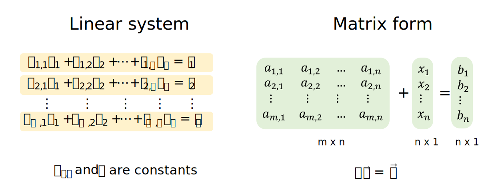

```{r setup, include=FALSE}
# Set up global environment configuration --------------------------------------
knitr::opts_chunk$set(echo=TRUE,
                      results='hide',
                      fig.show='hold',
                      fig.align='center',
                      message=FALSE,
                      warning=FALSE)

knitr::knit_engines$set(python = reticulate::eng_python)
```

```{r, echo=FALSE}
# Install R packages -----------------------------------------------------------
# The native pipe operator requires R version 4.1+ 
packages <- c("ggplot2",
              "dplyr",
              "patchwork")

installed_packages <- packages %in% rownames(installed.packages())

if (any(installed_packages == FALSE)) {
  install.packages(packages[!installed_packages])
}

# Attach R packages to the global environment
library("dplyr")
library("ggplot2")
library("patchwork")

# Check version of Python used by reticulate -----------------------------------
reticulate::py_config()
```


# A single linear equation      

There is a fundamental relationship between the equation $ax+by=c$ and lines. Lines represent the vector subspace of all solutions found for the linear equation $ax+by=c$.         

This means that we can describe linear equations with both mathematical and geometric intuition (depending on the dimensions of the vector space). For example, the solution for $3x+\tfrac{1}{2}y=2$ is represented by every point in the line below.     

```{r, results='hold', out.width="60%"}
# Plot the domain of f(x) = sqrt(3-x) in R -------------------------------------
a <- 3
b <- 0.5
c <- 2

x <- seq(-4, 4, by = 1)
y <- (a*x + c) / b

ggplot(data.frame(x, y), aes(x, y)) +
  geom_hline(yintercept = 0, colour = "linen", linetype = "dashed") + 
  geom_vline(xintercept = 0, colour = "linen", linetype = "dashed") + 
  geom_line() + 
  labs(title = "3x + y/2 = 2") +  
  theme_minimal() + 
  theme(panel.border = element_rect(fill = NA),
        panel.grid.minor = element_blank(),
        panel.grid.major = element_line(linetype = "dotted"))
```

For a single consistent and non-trivial linear equation, the set of solutions also has a consistent vector subspace form.    

```{r, echo=FALSE, results='markup', out.width="90%"}
knitr::include_graphics("../figures/linear_systems-consistent_solutions.svg")
```

For example, $3x_1 - 2x_2 = 9$ describes a line. Any point on this line is a single solution and is a copy of $\mathbb{R}^1$ inside $\mathbb{R}^2$. This illuminates that infinite solutions can exist for linear equations and there is a real life context where we need to determine which optimal single solution to choose. This is the essence of why linear algebra is important.   


# A system of linear equations   

What happens when we have a collection of linear equations, or a linear system? In statistics, a linear system is used to contain multiple observations of a phenomenon i.e. for modelling purposes and we solve for the coefficients $\hat{\beta}$ where $Y = X\beta + \epsilon$. In mathematical modelling, we solve for an n-tuple $(s_1, s_2, ..., s_n)$, where the linear system is true when $(s_1, s_2, ..., s_n)$ substitutes for $(x_1, x_2, ..., x_n)$.       

```{r, echo=FALSE, results='markup', out.width="90%"}

```

We have three scenarios:  

+ The linear system is inconsistent (at least one equation is untrue in relation to all other equations) and we have an **empty** set of solutions.   
+ The linear system is consistent and has one solution set i.e. $\{(a, b, c)\}$.  
+ The linear system is consistent and has infinite solution (or the solution set has infinitely many elements) i.e. $\{(a, b, x_3 - 2) | x_3 \in \mathbb{R}\}$ where $a, b \in \mathbb{R}$. This occurs by default when you have less observations than variables i.e. the $n<p$ [problem](https://stats.stackexchange.com/questions/385711/what-is-the-problem-with-p-n) in statistics.  

In 2D, we can see that solutions have two properties:  
+ Solutions can be solved using a consistent mathematical approach.  
+ Solutions have a geometric intuition. For example in 2D, solutions can be represented as two lines which never intersect, two lines which intersect once, or two lines superimposed on each other i.e. infinite intersection points.    

```{r, results='hold', out.width="60%"}
# Plot inconsistent linear system in R -----------------------------------------
data.frame(x <- seq(-10, 10, by = 1), 
           y1 <- (-2*x - 5) / 3,
           y2 <- (-4*x + 2) / 6) %>% 
  ggplot(aes(x)) +
  geom_hline(yintercept = 0, colour = "linen", linetype = "dashed") + 
  geom_vline(xintercept = 0, colour = "linen", linetype = "dashed") + 
  geom_line(aes(y = y1)) + 
  geom_line(aes(y = y2)) + 
  labs(title = "Inconsistent") +  
  theme_minimal() + 
  theme(panel.border = element_rect(fill = NA),
        panel.grid.minor = element_blank(),
        panel.grid.major = element_line(linetype = "dotted"))

# Plot consistent linear system with single solution in R ----------------------
data.frame(x1 <- 8/4,
           y1 <- seq(-10, 10, by = 1),
           x2 <- seq(-10, 10, by = 1), 
           y2 <- 2/3) %>% 
  ggplot(aes(x2, y1)) +
  geom_hline(yintercept = 0, colour = "linen", linetype = "dashed") + 
  geom_vline(xintercept = 0, colour = "linen", linetype = "dashed") + 
  geom_line(aes(x = x1)) + 
  geom_line(aes(y = y2)) + 
  labs(title = "Consistent single solution") +  
  theme_minimal() + 
  theme(panel.border = element_rect(fill = NA),
        panel.grid.minor = element_blank(),
        panel.grid.major = element_line(linetype = "dotted"))

# Plot consistent linear system with infinite solutions in R -------------------
data.frame(x <- seq(-10, 10, by = 1),
           y1 <- (-2*x + 5) / 3,
           y2 <- (-4*x + 10) / 6) %>% 
  ggplot(aes(x)) +
  geom_hline(yintercept = 0, colour = "linen", linetype = "dashed") + 
  geom_vline(xintercept = 0, colour = "linen", linetype = "dashed") + 
  geom_line(aes(y = y1)) + 
  geom_line(aes(y = y2)) + 
  labs(title = "Consistent infinite solutions") +  
  theme_minimal() + 
  theme(panel.border = element_rect(fill = NA),
        panel.grid.minor = element_blank(),
        panel.grid.major = element_line(linetype = "dotted")) 
```

**Question:** How can you prove that the solution set to a linear system is either empty (inconsistent), has one solution or has infinite solutions?    


# Equivalent systems  

Two linear systems are equivalent if they have the same n-tuple solution set. That equivalence exists implies that we can convert one linear system into an equivalent simpler linear system, to more easily find its solution set.  

The process of converting a linear system into an equivalent simpler linear system can be considered as an algorithm. To construct this algorithm, we would need to understand the operational constraints for maintaining equivalency i.e. identify the set of possible elementary equation operations.   

```{r, echo=FALSE, results='markup', out.width="90%"}
knitr::include_graphics("../figures/linear_systems-equivalence.svg")
```

The three elementary equation operations (EEOs) are:  
+ Replacement - replace an equation by the sum of itself and the multiple of another equation.   
+ Interchange - interchange the listed order of two equations.   
+ Scaling - replace an equation with a multiple of itself.   

If we know that there is a finite sequence of elementary equation operations to transform A into B, then the best algorithm will select the minimal sequence of elementary equation operations to transform A into B, where B is the most easily solvable linear system. This is the essence of the row reduction (or Gauss Jordan elimination) algorithm.   


# Row reduction algorithm     

Linear systems can be represented by matrices (the coefficient matrix or the augmented matrix).  Matrices can exist in an echelon form and a reduced echelon form.  

The matrix equivalent of elementary equation operations are elementary row operations (EROs).   

```{r, echo=FALSE, results='markup', out.width="90%"}
knitr::include_graphics("../figures/linear_systems-echelon_forms.svg")
```

A matrix is an echelon form if:  
+ All non-zero rows are above rows of all zeros. Rows of all zeros are used to represent the presence of **free variables** in a matrix i.e. when $n<p$.      
+ Each leading entry (or pivot column of a row) is located to the right of the leading entry of the row above it. Each leading entry represents a **basic variable** in the linear system.     
+ All entries in a column below a leading entry are zeros.    

A matrix is in reduced echelon form if additionally:      
+ All leading entries are 1.   
+ Each leading 1 is the only non-zero entry in its column.    

When a matrix is in the echelon form, we can solve the linear system by either:  
1. Directly using back substitution to simply the list of equations and solve for each variable.   
2. Further reducing the matrix to its reduced echelon form (where the solution for each variable is obvious).    

```{r, echo=FALSE, results='markup', out.width="90%"}
knitr::include_graphics("../figures/linear_systems-echelon_solutions.svg")  
```

**Note:** Linear systems with infinite solutions are easily identified in matrix form, by the presence of at least one row which lacks a leading edge. Free variables correspond to variable(s) without a positional leading edge or pivot column in the linear system.  


# Row reduction algorithmn    

In the row reduction algorithm (also know as the Gauss Jordan Elimination algorithm), we aim to:   

1. Find the matrix **echelon form** by applying replacement elementary row operations i.e. $R_j + kR_i$) on all columns below the leading edge in a row. Repeat this step for each leading edge of each row.   
2. Find the matrix **reduced echelon form** by identifying the right most leading edge and using a scaling elementary row operation to convert it into 1. Apply replacement elementary row operations i.e. $R_i + kR_j$) on all columns above the leading 1. Repeat this step for each leading 1 of each row.   

**Note:** Each matrix is row equivalent to exactly one matrix in reduced echelon form.   

```{python, eval=FALSE}
# To be completed --------------------------------------------------------------
import numpy as np
A=np.array([[1,-1,1,3],[2,1,8,18],[4,2,-3,-2]])

def RowSwap(A,k,l):
# =============================================================================
#     A is a NumPy array.  RowSwap will return duplicate array with rows
#     k and l swapped.
# =============================================================================
    m = A.shape[0]  # m is number of rows in A
    n = A.shape[1]  # n is number of columns in A
    
    B = np.copy(A).astype('float64')
        
    for j in range(n):
        temp = B[k][j]
        B[k][j] = B[l][j]
        B[l][j] = temp
        
    return B

def RowScale(A,k,scale):
# =============================================================================
#     A is a NumPy array.  RowScale will return duplicate array with the
#     entries of row k multiplied by scale.
# =============================================================================
    m = A.shape[0]  # m is number of rows in A
    n = A.shape[1]  # n is number of columns in A
    
    B = np.copy(A).astype('float64')

    for j in range(n):
        B[k][j] *= scale
        
    return B

def RowAdd(A,k,l,scale):
# =============================================================================
#     A is a numpy array.  RowAdd will return duplicate array with row
#     l modifed.  The new values will be the old values of row l added to 
#     the values of row k, multiplied by scale.
# =============================================================================
    m = A.shape[0]  # m is number of rows in A
    n = A.shape[1]  # n is number of columns in A
    
    B = np.copy(A).astype('float64')
        
    for j in range(n):
        B[l][j] += B[k][j]*scale
        
    return B
    
    
B1 = RowSwap(A,0,2)
B2 = RowScale(A,2,0.5)
B3 = RowAdd(A,0,1,2)

## Add -2 times row 0 to row 1
A1 = RowAdd(A,0,1,-2)
print(A1,'\n')

## Add -4 times row 0 to row 2
A2 = RowAdd(A1,0,2,-4)
print(A2,'\n')

## Add -2 times row 1 to row 2
A3 = RowAdd(A2,1,2,-2)
print(A3,'\n')

## Multiply row 1 by 1/3
A4 = RowScale(A3,1,1.0/3)
print(A4,'\n')

## Multiply row 2 by 1/19
A5 = RowScale(A4,2,1.0/-19.)
print(A5)
```

```{python, eval=FALSE}
# To be completed --------------------------------------------------------------
n = int(input('Enter number of unknowns: '))
a = np.zeros((n,n+1))
x = np.zeros(n)
print('Enter Augmented Matrix Coefficients:')
for i in range(n):
    for j in range(n+1):
        a[i][j] = float(input( 'a['+str(i)+']['+ str(j)+']='))
for i in range(n):
    if a[i][i] == 0.0:
        sys.exit('Divide by zero detected!')
         
    for j in range(i+1, n):
        ratio = a[j][i]/a[i][i]
         
        for k in range(n+1):
            a[j][k] = a[j][k] - ratio * a[i][k]
 
x[n-1] = a[n-1][n]/a[n-1][n-1]
 
for i in range(n-2,-1,-1):
    x[i] = a[i][n]
     
    for j in range(i+1,n):
        x[i] = x[i] - a[i][j]*x[j]
     
    x[i] = x[i]/a[i][i]
 
print('\nThe solution is: ')
for i in range(n):
    print('X%d = %0.2f' %(i,x[i]), end = '\t')
```


# Single versus infinite solutions   
How can we easily identify systems with infinite compared to single solutions?   

Consider the examples depicted [above](#a-system-of-linear-equations) in 2D space where:   

+ A single solution is geometrically equivalent to the intersection of two lines i.e. a point in 2D space or a copy of $\mathbb{R}^0$ in $\mathbb{R}^2$.  
+ An infinite solution is geometrically equivalent to a line in 2D space i.e. a copy of $\mathbb{R}^1$ in $\mathbb{R}^2$.   

We first apply the row reduction algorithm to find the reduced echelon form of the augmented matrices for both examples. 

We can also represent the solution as a parametric vector form where:  

+ A reduced echelon matrix form with all leading ones will always contain a consistent single solution i.e. the number of leading ones is equal to the number of variables in the linear system. Variables are therefore all **basic variables**.   
+ A reduced echelon matrix form with at least one row of all zeros will always contain a consistent infinite solution. Variables lacking a leading one in their corresponding variable position are **free variables**.   

```{r, echo=FALSE, results='markup', out.width="90%"}
knitr::include_graphics("../figures/linear_systems-infinite_solutions.svg")
```

If $A\vec x=\vec b$ has infinite solutions:  
+ One solution is $\vec p$ i.e. a single vector of real numbers or a point in $\mathbb{R}^n$.  
+ Other solutions are represented as $A\vec x = \vec 0$, where the solution set is the vector span of $\{\vec v_1, ... , \vec v_{h} \}$.  
+ The solution set of $A\vec x = \vec b$ is $\{\vec p+c_1\vec v_1+ ... +c_h\vec v_{h}|c_1, ... ,c_h\in  \mathbb{R}\}$.   

**Note:** Instead of finding one of three possible solutions, solving a linear system can be viewed as either finding a **parametric** description of the solution set or determining that the system is inconsistent.  

```{r, echo=FALSE, results='markup', out.width="90%"}
knitr::include_graphics("../figures/linear_systems-parametric_solutions.svg")
```

When the solution is expressed as a parametric vector form, we can form some geometric intuition about the vector span of the solution. For an infinite solution, the solution is an $\mathbb{R}^{n-p}$ object which intersects with the point represented by $\vec p$.  

```{r, echo=FALSE, results='markup', out.width="90%"}
knitr::include_graphics("../figures/linear_systems-parametric_solution_example.svg")
```

**Note:** The solution to a linear system will only contain the origin point if and only if the linear system is homogeneous i.e. the entire linear system has form $A\vec v=\vec0$.   


# Resources   

+ [YouTube video series](https://www.youtube.com/watch?v=ZKUqtErZCiU&list=PLHXZ9OQGMqxfUl0tcqPNTJsb7R6BqSLo6) by Dr Trefor Bazett on linear systems.         
+ [Blog post](https://bvanderlei.github.io/jupyter-guide-to-linear-algebra/Gaussian_Elimination.html) containing Python code to perform elementary row operations.  
+ [Solutions](https://levelup.gitconnected.com/gaussian-elimination-algorithm-in-python-4e90cb3a0fd9) for the row reduction algorithm in Python.  