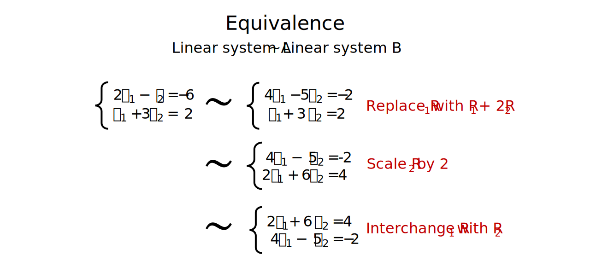
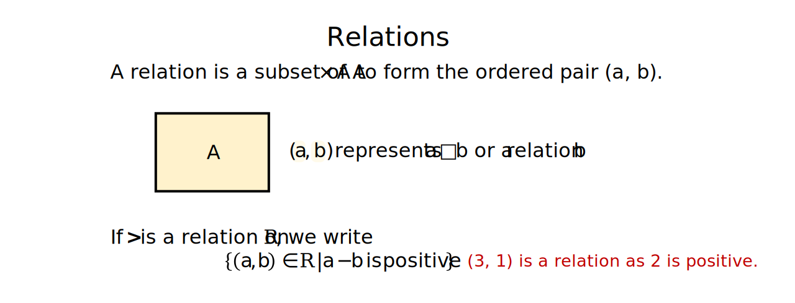
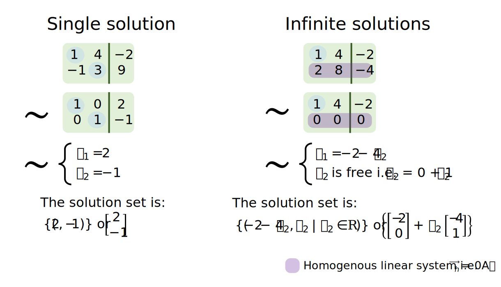

```{r setup, include=FALSE}
# Set up global environment configuration --------------------------------------
knitr::opts_chunk$set(echo=TRUE,
                      results='hide',
                      fig.show='hold',
                      fig.align='center',
                      message=FALSE,
                      warning=FALSE,
                      out.width='80%')

knitr::knit_engines$set(python = reticulate::eng_python)
```

```{r, echo=FALSE}
# Install R packages -----------------------------------------------------------
# The native pipe operator requires R version 4.1+ 
packages <- c("ggplot2",
              "dplyr",
              "patchwork")

installed_packages <- packages %in% rownames(installed.packages())

if (any(installed_packages == FALSE)) {
  install.packages(packages[!installed_packages])
}

# Attach R packages to the global environment
library("dplyr")
library("ggplot2")
library("patchwork")

# Check version of Python used by reticulate -----------------------------------
reticulate::py_config()
```


# A single linear equation    
There is a fundamental relationship between the linear equation $ax+by=c$, which contains two unknown variables, and lines. A line represents the space occupied by all possible solutions to the linear equation $ax+by=c$.           

This means that we can describe linear equations using geometric as well as mathematical intuition for up to 3D spaces. For example, the solution for $3x-2y=2$ can be rearranged into the form $y=\tfrac{3}{2}x-1$, which is a line with slope $\tfrac{3}{2}$ and y-intercept $-1$.  

A single linear equation can be inconsistent (where no solution exists) or consistent (where a single solution or infinite solutions exist). For any consistent linear equation with non-trivial (non-zero variable) solutions, the solution set also has a geometric form. For example, the solutions to $3x-2y=2$ map to a line in 2D space. Any point on this line is an individual solution and a copy of $\mathbb{R}^1$ inside $\mathbb{R}^2$.  

This geometric intuition also illustrates that infinite solutions exist for single linear equations, with the exception of solutions that are a copy of $\mathbb{R}^0$ inside $\mathbb{R}^1$ i.e. solutions with the form $3x=2$.      

```{r, echo=FALSE, results='markup'}
knitr::include_graphics("../figures/linear_systems-consistent_solutions.svg")
```

**Note:** In linear algebra, it is preferable to write linear equations in the form $ax_1+bx_2=c$ instead of $ax+by=c$, as we often deal with dimensions greater than 3 (alternatively represented by the x, y, z coordinates).    

**Note:** Linear equations with the form $c_1x_1+c_2x_2=0$ rather than $c_1x_1+c_2x_2=k$ have the distinct property that they also pass the point of origin (a trivial solution also exists).        

<details><summary>R code</summary>  
<p>   

```{r, results='hold'}
# Plot 3x - 2y = 2 -----------------------------------------------------------
x <- seq(-4, 4, by = 1)
y <- 3/2*x - 1

p1 <- ggplot(data.frame(x, y), aes(x, y)) +
  geom_hline(yintercept = 0, colour = "steelblue", linetype = "dashed") + 
  geom_vline(xintercept = 0, colour = "steelblue", linetype = "dashed") + 
  geom_line() + 
  coord_cartesian(xlim = c(-4, 4), 
                  ylim = c(-4, 4)) +
  labs(title = "3x - 2y = 2") +  
  theme_minimal() + 
  theme(panel.border = element_rect(fill = NA),
        panel.grid.minor = element_blank(),
        panel.grid.major = element_line(linetype = "dotted"))

# Plot 3x - 2y = 0 -----------------------------------------------------------
x <- seq(-4, 4, by = 1)
y <- 3/2*x

p2 <- ggplot(data.frame(x, y), aes(x, y)) +
  geom_hline(yintercept = 0, colour = "steelblue", linetype = "dashed") + 
  geom_vline(xintercept = 0, colour = "steelblue", linetype = "dashed") + 
  geom_line() + 
  coord_cartesian(xlim = c(-4, 4), 
                  ylim = c(-4, 4)) +
  labs(title = "3x - 2y = 0") +  
  theme_minimal() + 
  theme(panel.border = element_rect(fill = NA),
        panel.grid.minor = element_blank(),
        panel.grid.major = element_line(linetype = "dotted"))

# Plot ggplot figures side by side --------------------------------------------- 
p1 + p2
```

</p>  
</details><p>    


# A system of linear equations   

In linear algebra, we are often searching for a single solution set $S = \{s_1, s_2, \cdots\, s_n\}$ given that multiple observations or constraints are known. Each observation or constraint is incorporated as an additional linear equation to be simultaneously solved. A collection of linear equations to be simultaneously solved is known as a **linear system**.      

In statistics, a linear system is used to contain multiple observations of a phenomenon and $X$ and $Y$ are treated as random variables, we solve for the coefficient estimates $\hat{\beta}$ where $Y = X\beta + \epsilon$. $X$ and $Y$ are treated as random variables because we expect a degree of randomness to contribute to observed $X$ and $Y$ values, so we do not expect a single solution i.e. a perfect curve fitting through all points of $X$ and $Y$ to be of optimal predictive use. In statistics, this concept is known as model overfitting.          

In contrast, in mathematical modelling, a linear system is used to contain multiple observations which are fixed (i.e. definitely true) and we solve for $(x_1, x_2, ..., x_n)$ where $\vec a_1x_1  + \vec a_2x_2 + \cdots+\vec a_nx_n=\vec b$ and $a_{i,j}, b \in \mathbb{R}$. The linear system is true when the solution set $(s_1, s_2, ..., s_n)$ substitutes for $(x_1, x_2, ..., x_n)$.   

```{r, echo=FALSE, results='markup'}
knitr::include_graphics("../figures/linear_systems-linear_forms.svg")
```

For any linear system, we have three possible scenarios:   

+ The linear system is inconsistent (at least one equation is inconsistent with respect to other equations) and we have an **empty** set of solutions.   
+ The linear system is consistent and has only one solution set i.e. a set of fixed values $\{(c_1, c_2, \cdots, c_n)\}$.   
+ The linear system is consistent and has infinite solutions (or the solution set has infinitely many elements) i.e. $\{(c_1, c_2, x_3 - 2) | x_3 \in \mathbb{R}\}$ where $c_1, c_2$ are fixed values and $x_3 \in \mathbb{R}$.   

**Note:* Infinite solutions always occur when you have less observations than variables i.e. the $n<p$ [problem](https://stats.stackexchange.com/questions/385711/what-is-the-problem-with-p-n) in statistics where n represents the number of observations recorded and p represents the number of variables measured.    

Using linear systems with two unknown variables as examples, we can see that solutions to linear systems have two properties:  
+ Solutions can be solved through mathematical simplification.  
+ Solutions have a geometric intuition. For example in 2D, solutions can be represented as two lines which never intersect, two lines which only intersect once, or two lines superimposed on each other i.e. a single line with infinite intersection points.    

<details><summary>R code</summary>  
<p> 

```{r, results='hold'}
# Plot inconsistent linear system in R -----------------------------------------
data.frame(x <- seq(-10, 10, by = 1), 
           y1 <- (-2*x - 5) / 3,
           y2 <- (-4*x - 2) / 6) %>% 
  ggplot(aes(x)) +
  geom_hline(yintercept = 0, colour = "linen", linetype = "dashed") + 
  geom_vline(xintercept = 0, colour = "linen", linetype = "dashed") + 
  geom_line(aes(y = y1)) + 
  geom_line(aes(y = y2)) + 
  coord_cartesian(xlim = c(-4, 4), 
                  ylim = c(-4, 4)) +
  labs(title = "No solution") +  
  theme_minimal() + 
  theme(panel.border = element_rect(fill = NA),
        panel.grid.minor = element_blank(),
        panel.grid.major = element_line(linetype = "dotted"))

# Plot consistent linear system with single solution in R ----------------------
data.frame(x1 <- 8/4,
           y1 <- seq(-10, 10, by = 1),
           x2 <- seq(-10, 10, by = 1), 
           y2 <- 2/3) %>% 
  ggplot(aes(x2, y1)) +
  geom_hline(yintercept = 0, colour = "linen", linetype = "dashed") + 
  geom_vline(xintercept = 0, colour = "linen", linetype = "dashed") + 
  geom_line(aes(x = x1)) + 
  geom_line(aes(y = y2)) + 
  coord_cartesian(xlim = c(-4, 4), 
                  ylim = c(-4, 4)) +
  labs(title = "Single solution") +  
  theme_minimal() + 
  theme(panel.border = element_rect(fill = NA),
        panel.grid.minor = element_blank(),
        panel.grid.major = element_line(linetype = "dotted"))  

# Plot consistent linear system with infinite solutions in R -------------------
data.frame(x <- seq(-10, 10, by = 1),
           y1 <- (-2*x + 5) / 3,
           y2 <- (-4*x + 10) / 6) %>% 
  ggplot(aes(x)) +
  geom_hline(yintercept = 0, colour = "linen", linetype = "dashed") + 
  geom_vline(xintercept = 0, colour = "linen", linetype = "dashed") + 
  geom_line(aes(y = y1), colour = "steelblue", lwd=2) + 
  geom_line(aes(y = y2)) + 
  labs(title = "Infinite solutions") +  
  theme_minimal() + 
  theme(panel.border = element_rect(fill = NA),
        panel.grid.minor = element_blank(),
        panel.grid.major = element_line(linetype = "dotted")) 
```

</p>  
</details><p>


# Equivalent linear systems        
Two linear systems are row equivalent if they have the same n-tuple solution set. Row equivalence implies that we can convert one linear system into an equivalent linear system to find the simplest linear system to solve for.    

The process of converting a linear system into an equivalent simpler linear system can be considered as an algorithm. To construct this algorithm, we need to identify the operations which maintain equivalency i.e. prove that all elementary equation operations maintain equivalency between linear systems A and B.     

```{r, echo=FALSE, results='markup'}

```

The three elementary equation operations (EEOs) are:  
+ **Replacement** - replace an equation by the sum of itself and the multiple of another equation.   
+ **Interchange** - interchange the listed order of two equations.   
+ **Scaling** - replace an equation with a multiple of itself.   

If we know that there is a finite and reversible sequence of elementary equation operations to transform A into B, then the best algorithm will select the minimal sequence of elementary equation operations to reach B, where B is the simplest equivalent linear system to solve. This is how the row reduction (or Gauss Jordan elimination) algorithm works.    


# Equivalence relations  
Let A be a set. A relation on A is any subset of $A \times A$ (any set of ordered pairs $(a,b)$ where the first and second elements of each pair come from A) which satisfies the conditions of a function being mapped from $a \to b$.       

```{r, echo=FALSE, results='markup'}

```

**Equivalence relations** refers to relations that are:  

+ Reflexive - for any $a \in A$, $a$ maps to $a$.   
+ Symmetric - for any $a, b \in A$, if $a$ maps to $b$, then $b$ maps to $a$.  
+ Transitive - for any $a, b, c \in A$, if $a$ maps to $b$ and $b$ to $c$, then $a$ maps to $c$.  

Row equivalence is therefore an equivalence relation on the set of all linear systems in the same set of variables i.e. $\{x_1, x_2, \cdots, x_n\}$. This also means that row equivalence is an equivalence relation on the set of all $m \times n$ matrices.    


# Augmented matrices and matrix echelon forms      
Linear systems can be represented by matrices (as the augmented matrix or coefficient matrix for linear systems with $A\vec x = \vec 0$ form).  Matrices can exist in an echelon form and a reduced echelon form.  

The matrix equivalent of elementary equation operations are elementary row operations (EROs).   

```{r, echo=FALSE, results='markup'}
knitr::include_graphics("../figures/linear_systems-echelon_forms.svg")
```

A matrix is an echelon form if:  
+ All non-zero rows are above rows of all zeros.   
+ Each leading entry (or pivot column of a row) is located to the left of the leading entry of the row below it. Each leading entry in the echelon form represents a fixed or **basic variable** in the linear system.     
+ All entries in a column below a leading entry are zeros.    

A matrix is in reduced echelon form if additionally:      
+ All leading entries are 1.   
+ Each leading 1 is the only non-zero entry in its column.    

When a matrix is in echelon form, we can solve the linear system by either:   
1. Directly using back substitution to simplify the list of equations and then solve for each variable. Solutions should be presented in the form of constants and free variables only.    
2. Further reducing the matrix to its reduced echelon form (where the solution for each variable is obvious).    

```{r, echo=FALSE, results='markup'}
knitr::include_graphics("../figures/linear_systems-echelon_solutions.svg")  
```

**Note:** Linear systems with infinite solutions are easily identified in matrix form by the presence of at least one row which lacks a pivot column. Free variables correspond to variables without a positional leading edge or pivot column in the echelon form of the augmented matrix.  


# Row reduction algorithmn    
In the row reduction algorithm (also know as the Gauss Jordan Elimination algorithm), we aim to:   

1. Find the matrix **echelon form** by applying replacement elementary row operations i.e. $R_j + kR_i$) on all columns below the leading edge in a row. Repeat this step for each leading edge of each row.   
2. Find the matrix **reduced echelon form** by identifying the right most leading edge and using a scaling elementary row operation to convert it into 1. Apply replacement elementary row operations i.e. $R_i + kR_j$) on all columns above the leading 1. Repeat this step for each leading 1 of each row.   

**Note:** Each matrix is row equivalent to exactly one matrix in reduced echelon form.   

<details><summary>Python code</summary>  
<p> 

```{python, eval=FALSE}
# To be completed --------------------------------------------------------------
import numpy as np
A=np.array([[1,-1,1,3],[2,1,8,18],[4,2,-3,-2]])

def RowSwap(A,k,l):
# =============================================================================
#     A is a NumPy array.  RowSwap will return duplicate array with rows
#     k and l swapped.
# =============================================================================
    m = A.shape[0]  # m is number of rows in A
    n = A.shape[1]  # n is number of columns in A
    
    B = np.copy(A).astype('float64')
        
    for j in range(n):
        temp = B[k][j]
        B[k][j] = B[l][j]
        B[l][j] = temp
        
    return B

def RowScale(A,k,scale):
# =============================================================================
#     A is a NumPy array.  RowScale will return duplicate array with the
#     entries of row k multiplied by scale.
# =============================================================================
    m = A.shape[0]  # m is number of rows in A
    n = A.shape[1]  # n is number of columns in A
    
    B = np.copy(A).astype('float64')

    for j in range(n):
        B[k][j] *= scale
        
    return B

def RowAdd(A,k,l,scale):
# =============================================================================
#     A is a numpy array.  RowAdd will return duplicate array with row
#     l modifed.  The new values will be the old values of row l added to 
#     the values of row k, multiplied by scale.
# =============================================================================
    m = A.shape[0]  # m is number of rows in A
    n = A.shape[1]  # n is number of columns in A
    
    B = np.copy(A).astype('float64')
        
    for j in range(n):
        B[l][j] += B[k][j]*scale
        
    return B
    
    
B1 = RowSwap(A,0,2)
B2 = RowScale(A,2,0.5)
B3 = RowAdd(A,0,1,2)

## Add -2 times row 0 to row 1
A1 = RowAdd(A,0,1,-2)
print(A1,'\n')

## Add -4 times row 0 to row 2
A2 = RowAdd(A1,0,2,-4)
print(A2,'\n')

## Add -2 times row 1 to row 2
A3 = RowAdd(A2,1,2,-2)
print(A3,'\n')

## Multiply row 1 by 1/3
A4 = RowScale(A3,1,1.0/3)
print(A4,'\n')

## Multiply row 2 by 1/19
A5 = RowScale(A4,2,1.0/-19.)
print(A5)
```

```{python, eval=FALSE}
# To be completed --------------------------------------------------------------
n = int(input('Enter number of unknowns: '))
a = np.zeros((n,n+1))
x = np.zeros(n)
print('Enter Augmented Matrix Coefficients:')
for i in range(n):
    for j in range(n+1):
        a[i][j] = float(input( 'a['+str(i)+']['+ str(j)+']='))
for i in range(n):
    if a[i][i] == 0.0:
        sys.exit('Divide by zero detected!')
         
    for j in range(i+1, n):
        ratio = a[j][i]/a[i][i]
         
        for k in range(n+1):
            a[j][k] = a[j][k] - ratio * a[i][k]
 
x[n-1] = a[n-1][n]/a[n-1][n-1]
 
for i in range(n-2,-1,-1):
    x[i] = a[i][n]
     
    for j in range(i+1,n):
        x[i] = x[i] - a[i][j]*x[j]
     
    x[i] = x[i]/a[i][i]
 
print('\nThe solution is: ')
for i in range(n):
    print('X%d = %0.2f' %(i,x[i]), end = '\t')
```

</p>  
</details><p>  


# Homogenous linear systems    
It is easier to work with homogeneous linear systems, with the form $A\vec x = \vec 0$, as it is immediately obvious that these systems must either have a single trivial solution $\{x_1, x_2 \cdots, x_n\} = \{0, 0, \cdots, 0\}$ or infinite solutions (defined in relation to its free variables).     

We can therefore define infinite solutions to a non-homogeneous linear system $A\vec x=\vec b$ as the addition of a positional vector $\vec p$ to the solution set of the homogeneous linear system $A\vec x=\vec 0$.    

If $A\vec x=\vec b$ has infinite solutions:  
+ One solution is $\vec p$ i.e. a single vector of real numbers or a point in $\mathbb{R}^m$.  
+ The remaining solutions exist in the vector span of $\{\vec v_1, ... , \vec v_{h} \}$ where $A\vec v_h = \vec 0$ and $\vec q = \vec p + \vec v_h$.     
+ The solution set of $A\vec x=\vec b$ can therefore also be presented in the parametric vector form $\{\vec p+c_1\vec v_1+ ... +c_h\vec v_{h}|c_1, ... ,c_h\in  \mathbb{R}\}$.     

```{r, echo=FALSE, results='markup'}

```

Solving a linear system can therefore also be viewed as either finding a parametric description of the solution set or determining that the system is inconsistent.  

```{r, echo=FALSE, results='markup'}
knitr::include_graphics("../figures/linear_systems-parametric_solutions.svg")
```

When an infinite solution is expressed as a parametric vector form, we can form some geometric intuition about its vector span. For an infinite solution, the solution is an $\mathbb{R}^{n-m}$ object which intersects with the point represented by $\vec p$.  

```{r, echo=FALSE, results='markup'}
knitr::include_graphics("../figures/linear_systems-parametric_solution_example.svg")
```

**Note:** All solutions to a homogeneous linear system will contain the origin point i.e. this is true for linear systems with single trivial solutions or infinite solutions.      


# Linear independence and homogenous linear systems   
A homogeneous linear system $A\vec v=\vec0$ is linearly independent if it only has one trivial solution. The homogeneous linear system does not contain any free variables and the set of solutions $\{s_1, s_2, \cdots, s_n\}$ therefore has linear independence.       

If a homogeneous linear system has infinite solutions, at least one free variable is present. The solution set of $\{s_1, s_2, \cdots, s_n\}$ therefore has linear dependence.   

Linear dependence is therefore represented by the presence of one or more free variables in a linear system and its equivalent augmented matrix. When the solution set $\{s_1, s_2, \cdots, s_n\}$ is infinite, at least one $x_i$ variable is non-zero in the homogeneous linear system $x_1\vec a_1+x_2\vec a_2+\cdots+x_n\vec a_n=\vec 0$.     

```{r, echo=FALSE, results='markup'}
knitr::include_graphics("../figures/linear_systems-linear_dependence_a.svg")
```


# Resources    
+ [YouTube video series](https://www.youtube.com/watch?v=ZKUqtErZCiU&list=PLHXZ9OQGMqxfUl0tcqPNTJsb7R6BqSLo6) by Dr Trefor Bazett on linear systems.    
+ [Blog post](https://bvanderlei.github.io/jupyter-guide-to-linear-algebra/Gaussian_Elimination.html) containing Python code to perform elementary row operations.  
+ [Solution](https://levelup.gitconnected.com/gaussian-elimination-algorithm-in-python-4e90cb3a0fd9) for the row reduction algorithm in Python.  
+ [YouTube video](https://www.youtube.com/watch?v=4P1YUKPIc4w) on the properties of homogeneous linear systems.  
+ YouTube videos introducing [relations](https://www.youtube.com/watch?v=dbihQ6tiRJ0) and [equivalence relations](https://www.youtube.com/watch?v=ZgcTX16borA).   