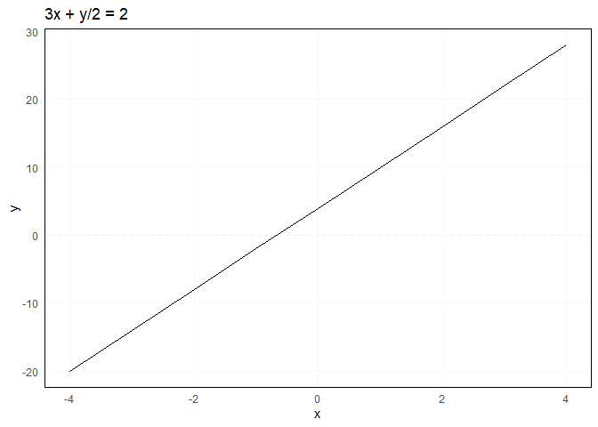

Linear systems
================
Erika Duan
2022-07-31

-   [A single linear equation](#a-single-linear-equation)
-   [A system of linear equations](#a-system-of-linear-equations)
-   [Equivalent systems](#equivalent-systems)
-   [Row reduction algorithm](#row-reduction-algorithm)
-   [Row reduction algorithmn](#row-reduction-algorithmn)
-   [Resources](#resources)

# A single linear equation

There is a fundamental relationship between the equation

and lines. Lines represent the vector subspace of all solutions found
for the linear equation
.

This means that we can describe linear equations with both mathematical
and geometric intuition (depending on the dimensions of the vector
space). For example, the solution for

is represented by every point in the line below.

``` r
# Plot the domain of f(x) = sqrt(3-x) in R -------------------------------------
a <- 3
b <- 0.5
c <- 2

x <- seq(-4, 4, by = 1)
y <- (a*x + c) / b

ggplot(data.frame(x, y), aes(x, y)) +
  geom_hline(yintercept = 0, colour = "linen", linetype = "dashed") + 
  geom_vline(xintercept = 0, colour = "linen", linetype = "dashed") + 
  geom_line() + 
  labs(title = "3x + y/2 = 2") +  
  theme_minimal() + 
  theme(panel.border = element_rect(fill = NA),
        panel.grid.minor = element_blank(),
        panel.grid.major = element_line(linetype = "dotted"))
```



For a single consistent and non-trivial linear equation, the set of
solutions also has a consistent vector subspace form.


For example,

describes a line. Any point on this line is a single solution and is a
copy of

inside
.
This illuminates that infinite solutions can exist for linear equations
and there is a real life context where we need to determine which
optimal single solution to choose. This is the essence of why linear
algebra is important.

# A system of linear equations

What happens when we have a collection of linear equations, or a linear
system? A linear system is used to contain multiple observations of a
phenomenon i.e. for modelling purposes.


We have three scenarios:

-   The linear system is inconsistent (at least one equation is untrue
    in relation to all other equations) and we have an **empty** set of
    solutions.  
-   The linear system is consistent and has one solution set
    i.e. \}").  
-   The linear system is consistent and has infinite solution (or the
    solution set has infinitely many elements)
    i.e.  | x_3 \in \mathbb{R}\}").
    This occurs by default when you have less observations than
    variables i.e. the
    
    [problem](https://stats.stackexchange.com/questions/385711/what-is-the-problem-with-p-n)
    in statistics.

In 2D, we can see that solutions have two properties:  
+ Solutions can be solved using a consistent mathematical approach.  
+ Solutions have a geometric intuition. For example in 2D, solutions can
be represented as two lines which never intersect, two lines which
intersect once, or two lines superimposed on each other i.e. multiple
‘intersections’.

``` r
# Plot inconsistent linear system in R -----------------------------------------
data.frame(x <- seq(-10, 10, by = 1), 
           y1 <- (-2*x - 5) / 3,
           y2 <- (-4*x + 2) / 6) %>% 
  ggplot(aes(x)) +
  geom_hline(yintercept = 0, colour = "linen", linetype = "dashed") + 
  geom_vline(xintercept = 0, colour = "linen", linetype = "dashed") + 
  geom_line(aes(y = y1)) + 
  geom_line(aes(y = y2)) + 
  labs(title = "Inconsistent") +  
  theme_minimal() + 
  theme(panel.border = element_rect(fill = NA),
        panel.grid.minor = element_blank(),
        panel.grid.major = element_line(linetype = "dotted"))

# Plot consistent linear system with single solution in R ----------------------
data.frame(x1 <- 8/4,
           y1 <- seq(-10, 10, by = 1),
           x2 <- seq(-10, 10, by = 1), 
           y2 <- 2/3) %>% 
  ggplot(aes(x2, y1)) +
  geom_hline(yintercept = 0, colour = "linen", linetype = "dashed") + 
  geom_vline(xintercept = 0, colour = "linen", linetype = "dashed") + 
  geom_line(aes(x = x1)) + 
  geom_line(aes(y = y2)) + 
  labs(title = "Consistent single solution") +  
  theme_minimal() + 
  theme(panel.border = element_rect(fill = NA),
        panel.grid.minor = element_blank(),
        panel.grid.major = element_line(linetype = "dotted"))

# Plot consistent linear system with infinite solutions in R -------------------
data.frame(x <- seq(-10, 10, by = 1),
           y1 <- (-2*x + 5) / 3,
           y2 <- (-4*x + 10) / 6) %>% 
  ggplot(aes(x)) +
  geom_hline(yintercept = 0, colour = "linen", linetype = "dashed") + 
  geom_vline(xintercept = 0, colour = "linen", linetype = "dashed") + 
  geom_line(aes(y = y1)) + 
  geom_line(aes(y = y2)) + 
  labs(title = "Consistent infinite solutions") +  
  theme_minimal() + 
  theme(panel.border = element_rect(fill = NA),
        panel.grid.minor = element_blank(),
        panel.grid.major = element_line(linetype = "dotted")) 
```


**Question:** How can you prove that the solution set to a linear system
is either empty (inconsistent), has one solution or has infinite
solutions?

# Equivalent systems

Two linear systems are equivalent if they have the same n-tuple solution
set. That equivalence exists implies that we can convert one linear
system into an equivalent simpler linear system, to more easily find its
solution set.

The process of converting a linear system into an equivalent simpler
linear system can be considered as an algorithm. To construct this
algorithm, we would need to understand the operational constraints for
maintaining equivalency i.e. identify the set of possible elementary
equation operations.


The three elementary equation operations (EEOs) are:  
+ Replacement - replace an equation by the sum of itself and the
multiple of another equation.  
+ Interchange - interchange the listed order of two equations.  
+ Scaling - replace an equation with a multiple of itself.

If we know that there is a finite sequence of elementary equation
operations to transform A into B, then the best algorithm will select
the minimal sequence of elementary equation operations to transform A
into B, where B is the most easily solvable linear system. This is the
essence of the row reduction (or Gauss Jordan elimination) algorithm.

# Row reduction algorithm

Linear systems can be represented by matrices (the coefficient matrix or
the augmented matrix). Matrices can exist in an echelon form and a
reduced echelon form.

The matrix equivalent of elementary equation operations are elementary
row operations (EROs).


A matrix is an echelon form if:  
+ All non-zero rows are above rows of all zeros. Rows of all zeros are
used to satisfy matrix representations of situations where
.  
+ Each leading entry (or pivot column) of a row is located to the left
of the leading entry of the row below it.  
+ All entries in a column below a leading entry are zeros.

A matrix is in reduced echelon form if additionally  
+ All leading entries are 1.  
+ Each leading 1 is the only non-zero entry in its column.

When a matrix is in the echelon form, we can solve the linear system by
either:  
1. Directly using back substitution to solve for each variable.  
2. Further reducing the matrix to its reduced echelon form (where the
solution for each variable is obvious).


# Row reduction algorithmn

In the row reduction algorithm (also know as the Gauss Jordan
Elimination algorithm), we aim to:

1.  Find the matrix **echelon form** by applying replacement elementary
    row operations
    i.e. )
    on all columns below the leading edge in a row. Repeat this step for
    each leading edge of each row.  
2.  Find the matrix **reduced echelon form** by identifying the right
    most leading edge and using a scaling elementary row operation to
    convert it into 1. Apply replacement elementary row operations
    i.e. )
    on all columns above the leading 1. Repeat this step for each
    leading 1 of each row.

``` python
# Import NumPy -----------------------------------------------------------------
import numpy as np
A=np.array([[1,-1,1,3],[2,1,8,18],[4,2,-3,-2]])

def RowSwap(A,k,l):
# =============================================================================
#     A is a NumPy array.  RowSwap will return duplicate array with rows
#     k and l swapped.
# =============================================================================
    m = A.shape[0]  # m is number of rows in A
    n = A.shape[1]  # n is number of columns in A
    
    B = np.copy(A).astype('float64')
        
    for j in range(n):
        temp = B[k][j]
        B[k][j] = B[l][j]
        B[l][j] = temp
        
    return B

def RowScale(A,k,scale):
# =============================================================================
#     A is a NumPy array.  RowScale will return duplicate array with the
#     entries of row k multiplied by scale.
# =============================================================================
    m = A.shape[0]  # m is number of rows in A
    n = A.shape[1]  # n is number of columns in A
    
    B = np.copy(A).astype('float64')

    for j in range(n):
        B[k][j] *= scale
        
    return B

def RowAdd(A,k,l,scale):
# =============================================================================
#     A is a numpy array.  RowAdd will return duplicate array with row
#     l modifed.  The new values will be the old values of row l added to 
#     the values of row k, multiplied by scale.
# =============================================================================
    m = A.shape[0]  # m is number of rows in A
    n = A.shape[1]  # n is number of columns in A
    
    B = np.copy(A).astype('float64')
        
    for j in range(n):
        B[l][j] += B[k][j]*scale
        
    return B
    
    
    B1 = RowSwap(A,0,2)
B2 = RowScale(A,2,0.5)
B3 = RowAdd(A,0,1,2)

## Add -2 times row 0 to row 1
A1 = RowAdd(A,0,1,-2)
print(A1,'\n')

## Add -4 times row 0 to row 2
A2 = RowAdd(A1,0,2,-4)
print(A2,'\n')

## Add -2 times row 1 to row 2
A3 = RowAdd(A2,1,2,-2)
print(A3,'\n')

## Multiply row 1 by 1/3
A4 = RowScale(A3,1,1.0/3)
print(A4,'\n')

## Multiply row 2 by 1/19
A5 = RowScale(A4,2,1.0/-19.)
print(A5)
```

``` python
import numpy as np
import sys
 
n = int(input('Enter number of unknowns: '))
a = np.zeros((n,n+1))
x = np.zeros(n)
print('Enter Augmented Matrix Coefficients:')
for i in range(n):
    for j in range(n+1):
        a[i][j] = float(input( 'a['+str(i)+']['+ str(j)+']='))
for i in range(n):
    if a[i][i] == 0.0:
        sys.exit('Divide by zero detected!')
         
    for j in range(i+1, n):
        ratio = a[j][i]/a[i][i]
         
        for k in range(n+1):
            a[j][k] = a[j][k] - ratio * a[i][k]
 
x[n-1] = a[n-1][n]/a[n-1][n-1]
 
for i in range(n-2,-1,-1):
    x[i] = a[i][n]
     
    for j in range(i+1,n):
        x[i] = x[i] - a[i][j]*x[j]
     
    x[i] = x[i]/a[i][i]
 
print('\nThe solution is: ')
for i in range(n):
    print('X%d = %0.2f' %(i,x[i]), end = '\t')
```

**Note:** Each matrix is row equivalent to exactly one matrix in reduced
echelon form.

# Resources

-   [YouTube video
    series](https://www.youtube.com/watch?v=ZKUqtErZCiU&list=PLHXZ9OQGMqxfUl0tcqPNTJsb7R6BqSLo6)
    introducing linear systems concepts.  
-   [Blog
    post](https://bvanderlei.github.io/jupyter-guide-to-linear-algebra/Gaussian_Elimination.html)
    containing Python code to perform elementary row operations.  
-   [Solutions](https://levelup.gitconnected.com/gaussian-elimination-algorithm-in-python-4e90cb3a0fd9)
    for the row reduction algorithm in Python.
