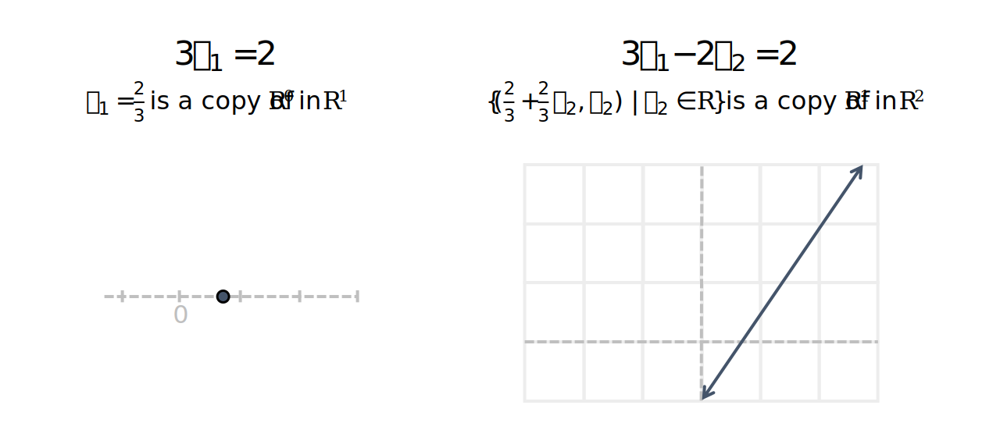
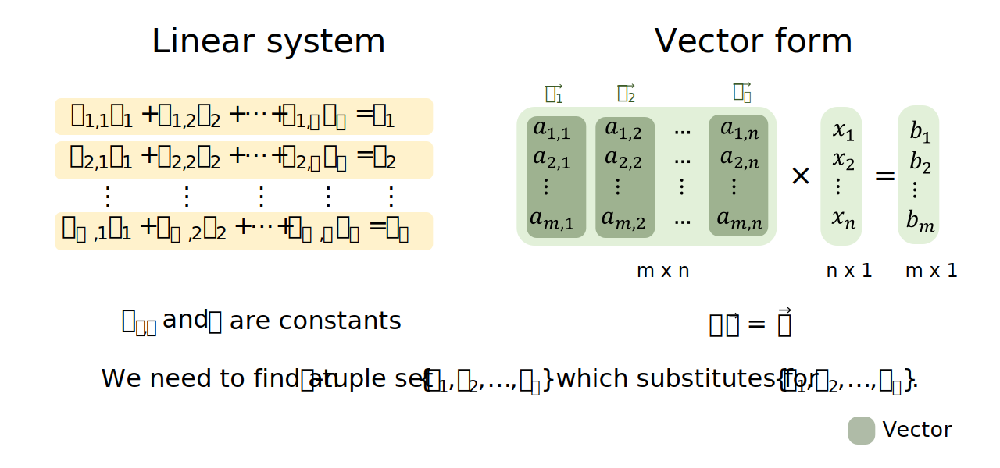
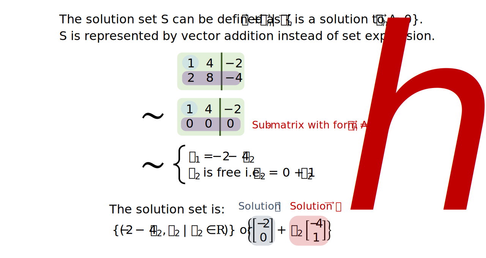
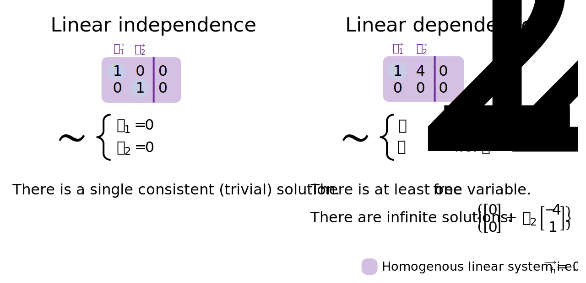

Introduction to linear systems
================
Erika Duan
2022-08-07

-   [A single linear equation](#a-single-linear-equation)
-   [A system of linear equations](#a-system-of-linear-equations)
-   [Equivalent systems](#equivalent-systems)
-   [Augmented matrices and matrix echelon
    forms](#augmented-matrices-and-matrix-echelon-forms)
-   [Row reduction algorithmn](#row-reduction-algorithmn)
-   [Homogenous linear systems](#homogenous-linear-systems)
-   [Linear independence and homogenous linear
    systems](#linear-independence-and-homogenous-linear-systems)
-   [Resources](#resources)

# A single linear equation

There is a fundamental relationship between the equation

and lines. Lines represent the vector subspace of all solutions found
for the linear equation
.

This means that we can describe linear equations with both mathematical
and geometric intuition (depending on the dimensions of the vector
space). For example, the solution for

or

is represented by every point in the line below.

Linear equations with the form

rather than

have an additional property that they also pass the point of origin.

For a single consistent and non-trivial linear equation, the set of
solutions also has a consistent vector span. For example,

describes a line. Any point on this line is a solution and is a copy of

inside
.
This illustrates that infinite solutions can exist for linear equations.
In scenarios with infinite solutions, we may want to provide additional
context to identify an optimal solution out of infinite possible
solutions. This is the utility of linear algebra.



**Note:** In linear algebra, it is preferable to write

instead of

as we usually deal with dimensions greater than 3 (alternatively
designated by the x, y, z coordinates).

<details>
<summary>
R code
</summary>
<p>

``` r
# Plot 3x + 0.5y = 2 -----------------------------------------------------------
a <- 3
b <- 0.5
c <- 2

x <- seq(-4, 4, by = 1)
y <- (a*x + c) / b

p1 <- ggplot(data.frame(x, y), aes(x, y)) +
  geom_hline(yintercept = 0, colour = "steelblue", linetype = "dashed") + 
  geom_vline(xintercept = 0, colour = "steelblue", linetype = "dashed") + 
  geom_line() + 
  labs(title = "3x + y/2 = 2") +  
  theme_minimal() + 
  theme(panel.border = element_rect(fill = NA),
        panel.grid.minor = element_blank(),
        panel.grid.major = element_line(linetype = "dotted"))

# Plot 3x + 0.5y = 0 -----------------------------------------------------------
a <- 3
b <- 0.5
c <- 0

x <- seq(-4, 4, by = 1)
y <- (a*x + c) / b

p2 <- ggplot(data.frame(x, y), aes(x, y)) +
  geom_hline(yintercept = 0, colour = "steelblue", linetype = "dashed") + 
  geom_vline(xintercept = 0, colour = "steelblue", linetype = "dashed") + 
  geom_line() + 
  labs(title = "3x + y/2 = 0") +  
  theme_minimal() + 
  theme(panel.border = element_rect(fill = NA),
        panel.grid.minor = element_blank(),
        panel.grid.major = element_line(linetype = "dotted"))

# Plot ggplot figures side by side --------------------------------------------- 
p1 + p2
```


</p>
</details>
<p>

# A system of linear equations

What happens when we have a collection of linear equations, or a linear
system? In statistics, a linear system is used to contain multiple
observations of a phenomenon for modelling purposes and we solve for the
coefficient estimates

where

and  and
 are treated as random
variables.

In contrast, in mathematical modelling, a linear system is used to
contain multiple observations which are fixed and we solve for
")
where

and
.
The linear system is true when the solution set
")
substitutes for
").



For a system of linear equations, we have three possible scenarios:

-   The linear system is inconsistent (at least one equation is false
    with respect to other equations) and we have an **empty** set of
    solutions.  
-   The linear system is consistent and has one solution set
    i.e. \}")
    where a, b and c are constants.  
-   The linear system is consistent and has infinite solution (or the
    solution set has infinitely many elements)
    i.e.  | x_3 \in \mathbb{R}\}")
    where a and b are constants and
    .
    Infinite solutions always occur when you have less observations than
    variables i.e. the
    
    [problem](https://stats.stackexchange.com/questions/385711/what-is-the-problem-with-p-n)
    in statistics.

In 2D, we can see that solutions have two properties:  
+ Solutions can be solved (through simplification) using a consistent
mathematical approach.  
+ Solutions have a geometric intuition. For example in 2D, solutions can
be represented as two lines which never intersect, two lines which
intersect once, or two lines superimposed on each other i.e. infinite
intersection points.

<details>
<summary>
R code
</summary>
<p>

``` r
# Plot inconsistent linear system in R -----------------------------------------
data.frame(x <- seq(-10, 10, by = 1), 
           y1 <- (-2*x - 5) / 3,
           y2 <- (-4*x + 2) / 6) %>% 
  ggplot(aes(x)) +
  geom_hline(yintercept = 0, colour = "linen", linetype = "dashed") + 
  geom_vline(xintercept = 0, colour = "linen", linetype = "dashed") + 
  geom_line(aes(y = y1)) + 
  geom_line(aes(y = y2)) + 
  labs(title = "Inconsistent") +  
  theme_minimal() + 
  theme(panel.border = element_rect(fill = NA),
        panel.grid.minor = element_blank(),
        panel.grid.major = element_line(linetype = "dotted"))

# Plot consistent linear system with single solution in R ----------------------
data.frame(x1 <- 8/4,
           y1 <- seq(-10, 10, by = 1),
           x2 <- seq(-10, 10, by = 1), 
           y2 <- 2/3) %>% 
  ggplot(aes(x2, y1)) +
  geom_hline(yintercept = 0, colour = "linen", linetype = "dashed") + 
  geom_vline(xintercept = 0, colour = "linen", linetype = "dashed") + 
  geom_line(aes(x = x1)) + 
  geom_line(aes(y = y2)) + 
  labs(title = "Consistent single solution") +  
  theme_minimal() + 
  theme(panel.border = element_rect(fill = NA),
        panel.grid.minor = element_blank(),
        panel.grid.major = element_line(linetype = "dotted"))

# Plot consistent linear system with infinite solutions in R -------------------
data.frame(x <- seq(-10, 10, by = 1),
           y1 <- (-2*x + 5) / 3,
           y2 <- (-4*x + 10) / 6) %>% 
  ggplot(aes(x)) +
  geom_hline(yintercept = 0, colour = "linen", linetype = "dashed") + 
  geom_vline(xintercept = 0, colour = "linen", linetype = "dashed") + 
  geom_line(aes(y = y1)) + 
  geom_line(aes(y = y2)) + 
  labs(title = "Consistent infinite solutions") +  
  theme_minimal() + 
  theme(panel.border = element_rect(fill = NA),
        panel.grid.minor = element_blank(),
        panel.grid.major = element_line(linetype = "dotted")) 
```


</p>
</details>
<p>

# Equivalent systems

Two linear systems are equivalent if they have the same n-tuple solution
set. That equivalence exists implies that we can convert one linear
system into an equivalent simpler linear system, to more easily find its
solution set.

The process of converting a linear system into an equivalent simpler
linear system can be considered as an algorithm. To construct this
algorithm, we would need to understand the operational constraints for
maintaining equivalency i.e. identify the set of possible elementary
equation operations.


The three elementary equation operations (EEOs) are:  
+ Replacement - replace an equation by the sum of itself and the
multiple of another equation.  
+ Interchange - interchange the listed order of two equations.  
+ Scaling - replace an equation with a multiple of itself.

If we know that there is a finite sequence of elementary equation
operations to transform A into B, then the best algorithm will select
the minimal sequence of elementary equation operations to transform A
into B, where B is the most easily solvable linear system. This is the
essence of the row reduction (or Gauss Jordan elimination) algorithm.

# Augmented matrices and matrix echelon forms

Linear systems can be represented by matrices (the coefficient matrix or
the augmented matrix). Matrices can exist in an echelon form and a
reduced echelon form.

The matrix equivalent of elementary equation operations are elementary
row operations (EROs).


A matrix is an echelon form if:  
+ All non-zero rows are above rows of all zeros. When rows of all zeros
exist, they represent the presence of **free variables** in a solution
i.e. when .  
+ Each leading entry (or pivot column of a row) is located to the right
of the leading entry of the row above it. Each leading entry in the
echelon form represents a fixed or **basic variable** in the linear
system.  
+ All entries in a column below a leading entry are zeros.

A matrix is in reduced echelon form if additionally:  
+ All leading entries are 1.  
+ Each leading 1 is the only non-zero entry in its column.

When a matrix is in the echelon form, we can solve the linear system by
either:  
1. Directly using back substitution to simply the list of equations and
solve for each variable. Solutions should be presented in the form of
constants or free variables only.  
2. Further reducing the matrix to its reduced echelon form (where the
solution for each variable is obvious).


**Note:** Linear systems with infinite solutions are easily identified
in matrix form, by the presence of at least one row which lacks a
leading edge. Free variables correspond to variables without a
positional leading edge or pivot column in the echelon form of the
augmented matrix.

# Row reduction algorithmn

In the row reduction algorithm (also know as the Gauss Jordan
Elimination algorithm), we aim to:

1.  Find the matrix **echelon form** by applying replacement elementary
    row operations
    i.e. )
    on all columns below the leading edge in a row. Repeat this step for
    each leading edge of each row.  
2.  Find the matrix **reduced echelon form** by identifying the right
    most leading edge and using a scaling elementary row operation to
    convert it into 1. Apply replacement elementary row operations
    i.e. )
    on all columns above the leading 1. Repeat this step for each
    leading 1 of each row.

**Note:** Each matrix is row equivalent to exactly one matrix in reduced
echelon form.

<details>
<summary>
Python code
</summary>
<p>

``` python
# To be completed --------------------------------------------------------------
import numpy as np
A=np.array([[1,-1,1,3],[2,1,8,18],[4,2,-3,-2]])

def RowSwap(A,k,l):
# =============================================================================
#     A is a NumPy array.  RowSwap will return duplicate array with rows
#     k and l swapped.
# =============================================================================
    m = A.shape[0]  # m is number of rows in A
    n = A.shape[1]  # n is number of columns in A
    
    B = np.copy(A).astype('float64')
        
    for j in range(n):
        temp = B[k][j]
        B[k][j] = B[l][j]
        B[l][j] = temp
        
    return B

def RowScale(A,k,scale):
# =============================================================================
#     A is a NumPy array.  RowScale will return duplicate array with the
#     entries of row k multiplied by scale.
# =============================================================================
    m = A.shape[0]  # m is number of rows in A
    n = A.shape[1]  # n is number of columns in A
    
    B = np.copy(A).astype('float64')

    for j in range(n):
        B[k][j] *= scale
        
    return B

def RowAdd(A,k,l,scale):
# =============================================================================
#     A is a numpy array.  RowAdd will return duplicate array with row
#     l modifed.  The new values will be the old values of row l added to 
#     the values of row k, multiplied by scale.
# =============================================================================
    m = A.shape[0]  # m is number of rows in A
    n = A.shape[1]  # n is number of columns in A
    
    B = np.copy(A).astype('float64')
        
    for j in range(n):
        B[l][j] += B[k][j]*scale
        
    return B
    
    
B1 = RowSwap(A,0,2)
B2 = RowScale(A,2,0.5)
B3 = RowAdd(A,0,1,2)

## Add -2 times row 0 to row 1
A1 = RowAdd(A,0,1,-2)
print(A1,'\n')

## Add -4 times row 0 to row 2
A2 = RowAdd(A1,0,2,-4)
print(A2,'\n')

## Add -2 times row 1 to row 2
A3 = RowAdd(A2,1,2,-2)
print(A3,'\n')

## Multiply row 1 by 1/3
A4 = RowScale(A3,1,1.0/3)
print(A4,'\n')

## Multiply row 2 by 1/19
A5 = RowScale(A4,2,1.0/-19.)
print(A5)
```

``` python
# To be completed --------------------------------------------------------------
n = int(input('Enter number of unknowns: '))
a = np.zeros((n,n+1))
x = np.zeros(n)
print('Enter Augmented Matrix Coefficients:')
for i in range(n):
    for j in range(n+1):
        a[i][j] = float(input( 'a['+str(i)+']['+ str(j)+']='))
for i in range(n):
    if a[i][i] == 0.0:
        sys.exit('Divide by zero detected!')
         
    for j in range(i+1, n):
        ratio = a[j][i]/a[i][i]
         
        for k in range(n+1):
            a[j][k] = a[j][k] - ratio * a[i][k]
 
x[n-1] = a[n-1][n]/a[n-1][n-1]
 
for i in range(n-2,-1,-1):
    x[i] = a[i][n]
     
    for j in range(i+1,n):
        x[i] = x[i] - a[i][j]*x[j]
     
    x[i] = x[i]/a[i][i]
 
print('\nThe solution is: ')
for i in range(n):
    print('X%d = %0.2f' %(i,x[i]), end = '\t')
```

</p>
</details>
<p>

# Homogenous linear systems

How can we easily identify systems with infinite compared to single
solutions? By presenting the set of solutions
")
in a parametric vector form.

It is easy to identify the parametric vector form of homogeneous linear
systems, which have the form
.
These equations either have a single trivial solution (they only
intersect at the origin) or infinite solutions (defined in relation to
its free variables).

If

has infinite solutions:  
+ At least one solution is

i.e. a single vector of real numbers or a point in
.  
+ At least one other equation can be represented as a homogeneous linear
system with form
,
where the solution set is the vector span of

where
.  
+ The solution set of

can therefore also be presented in the form
.


Solving a linear system can therefore also be viewed as either finding a
parametric description of the solution set or determining that the
system is inconsistent.



When the solution is expressed as a parametric vector form, we can form
some geometric intuition about the vector span of
.
For an infinite solution, the solution is an

object which intersects with the point represented by
.


**Note:** The solution to a linear system will only contain the origin
point if and only if the entire linear system is homogeneous i.e. the
entire linear system has form
.

# Linear independence and homogenous linear systems

A homogeneous linear system

is linearly independent if it only has one trivial solution. The set of
solutions

therefore has linear independence.

If a homogeneous linear system has infinite solutions, at least one
linear equation is equivalent to another linear equation i.e. at least
one sub-matrix of form

exists. The solution set of

therefore has linear dependence.

Linear dependence is therefore represented by the presence of one or
more free variables in a linear system and its equivalent augmented
matrix. When the parametric vector form of the solution set

is infinite, at least one
 variable is non-zero
in the homogenous linear system
.



# Resources

-   [YouTube video
    series](https://www.youtube.com/watch?v=ZKUqtErZCiU&list=PLHXZ9OQGMqxfUl0tcqPNTJsb7R6BqSLo6)
    by Dr Trefor Bazett on linear systems.  
-   [Blog
    post](https://bvanderlei.github.io/jupyter-guide-to-linear-algebra/Gaussian_Elimination.html)
    containing Python code to perform elementary row operations.  
-   [Solution](https://levelup.gitconnected.com/gaussian-elimination-algorithm-in-python-4e90cb3a0fd9)
    for the row reduction algorithm in Python.  
-   [YouTube video](https://www.youtube.com/watch?v=4P1YUKPIc4w) on the
    properties of homogeneous linear systems.
