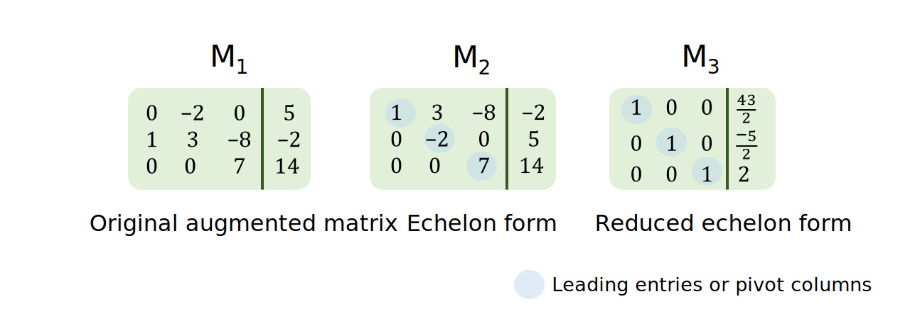
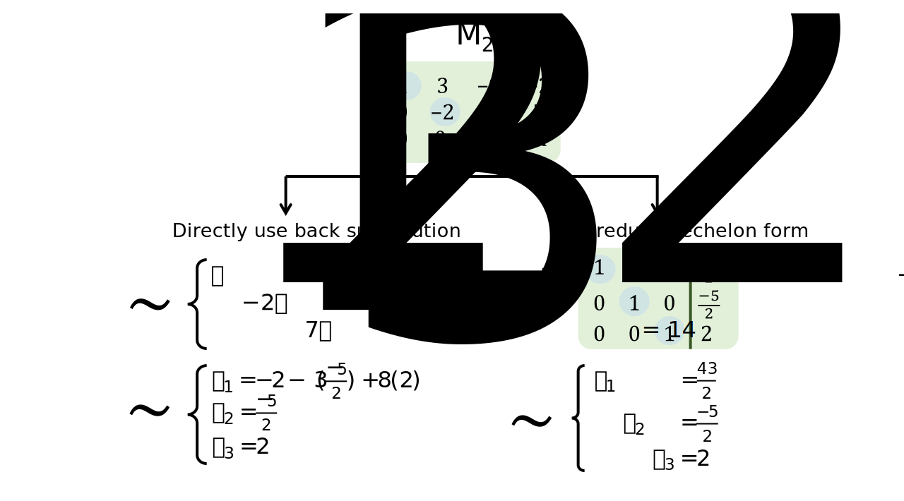

Introduction to linear systems
================
Erika Duan
2022-08-28

-   [A single linear equation](#a-single-linear-equation)
-   [A system of linear equations](#a-system-of-linear-equations)
-   [Equivalent linear systems](#equivalent-linear-systems)
-   [Equivalence relations](#equivalence-relations)
-   [Augmented matrices and matrix echelon
    forms](#augmented-matrices-and-matrix-echelon-forms)
-   [Row reduction algorithmn](#row-reduction-algorithmn)
-   [Homogenous linear systems and infinite
    solutions](#homogenous-linear-systems-and-infinite-solutions)
-   [Homogenous linear systems and linear
    independence](#homogenous-linear-systems-and-linear-independence)
-   [Resources](#resources)

# A single linear equation

There is a fundamental relationship between the linear equation
,
which contains two unknown variables, and lines. A line represents the
space occupied by all possible solutions to the linear equation
.

This means that linear equations can be described using geometric as
well as mathematical intuition, for equations with
 3 unknown
variables i.e. for scenarios in 1D to 3D space. For example, the
solution for

can be rearranged into the form
,
which is a line with slope

and y-intercept .

A single linear equation can be inconsistent (where no solution exists)
or consistent (where a single solution or infinite solutions exist). For
any consistent linear equation, the solution set also has a geometric
form. For example, the solutions to

map to a single line within a 2D plane. Any point on this line is an
individual solution and the line of infinite solutions is a copy of

inside
.

The geometric intuition that solutions exist as a copy of

inside

is true for all linear equations. For example, the solution to the
linear system
 is a copy
of

inside

and maps to a single point along a 1D line.


**Note:** In linear algebra, it is preferable to write linear equations
in the form

instead of
,
as we often deal with dimensions greater than 3 (commonly represented by
the x, y, z coordinates).

**Note:** Linear equations with the form

rather than

have the distinct property that they also pass the point of origin
i.e. they also contain a trivial solution
.

<details>
<summary>
R code
</summary>
<p>

``` r
# Plot 3x - 2y = 2 -----------------------------------------------------------
x <- seq(-4, 4, by = 1)
y <- 3/2*x - 1

p1 <- ggplot(data.frame(x, y), aes(x, y)) +
  geom_hline(yintercept = 0, colour = "steelblue", linetype = "dashed") + 
  geom_vline(xintercept = 0, colour = "steelblue", linetype = "dashed") + 
  geom_line() + 
  coord_cartesian(xlim = c(-4, 4), 
                  ylim = c(-4, 4)) +
  labs(title = "3x - 2y = 2") +  
  theme_minimal() + 
  theme(panel.border = element_rect(fill = NA),
        panel.grid.minor = element_blank(),
        panel.grid.major = element_line(linetype = "dotted"))

# Plot 3x - 2y = 0 -----------------------------------------------------------
x <- seq(-4, 4, by = 1)
y <- 3/2*x

p2 <- ggplot(data.frame(x, y), aes(x, y)) +
  geom_hline(yintercept = 0, colour = "steelblue", linetype = "dashed") + 
  geom_vline(xintercept = 0, colour = "steelblue", linetype = "dashed") + 
  geom_line() + 
  coord_cartesian(xlim = c(-4, 4), 
                  ylim = c(-4, 4)) +
  labs(title = "3x - 2y = 0") +  
  theme_minimal() + 
  theme(panel.border = element_rect(fill = NA),
        panel.grid.minor = element_blank(),
        panel.grid.major = element_line(linetype = "dotted"))

# Plot ggplot figures side by side --------------------------------------------- 
p1 + p2
```


</p>
</details>
<p>

# A system of linear equations

In linear algebra, we solve for a solution set

to unknown variables

given that multiple observations or constraints are described. Each
observation or constraint is incorporated as an additional linear
equation containing different scalars of the same unknown variables. A
set of linear equations that must be simultaneously solved is called a
**linear system**.

In statistics, a linear system is used to describe multiple observations
of a phenomenon and 
and

are treated as random variables. Within this linear system, given
observed values of  and
,
we solve for

where
.
 and

are random variables because we attribute a component of randomness to
observed  and

values. We are therefore never interested in modelling a single solution
to our linear system i.e. to generate a perfect curve which fits through
all points of  and
.
In statistics, the latter task is known as model overfitting.

In contrast, in mathematical modelling, a linear system contains
multiple fixed observations and we solve for
")
or 
where

or

and
.
The linear system is true when a set of values
")
substitutes for
").


For any linear system, we have three possible scenarios:

-   The linear system is inconsistent (at least one equation is
    inconsistent with respect to other equations) and we have an
    **empty** set of solutions
    i.e. .  
-   The linear system is consistent and has only one solution set
    i.e. \}")
    where
    
    are fixed scalars.  
-   The linear system is consistent and has infinite solutions (or the
    solution set has infinitely many elements)
    i.e.  | x_3 \in \mathbb{R}\}")
    where
    
    are fixed scalars and
     represents
    any real number.

**Note:** Infinite solutions always occur when you have less
observations than variables i.e. the

[problem](https://stats.stackexchange.com/questions/385711/what-is-the-problem-with-p-n).
In a linear system, 
represents the number of observations and
 represents the number
of unknown variables present.

Using linear systems with two unknown variables as an example, we can
see that solutions to linear systems have two properties:  
+ Solutions can be solved through mathematical simplification.  
+ Solutions have a geometric intuition. In 2D, solutions can be
represented as two lines which never intersect (no solution), two lines
which only intersect once (single solution), or two lines superimposed
on each other (infinite solutions).

<details>
<summary>
R code
</summary>
<p>

``` r
# Plot inconsistent linear system in R -----------------------------------------
p1 <- data.frame(x <- seq(-10, 10, by = 1), 
                 y1 <- (-2*x - 5) / 3,
                 y2 <- (-4*x - 2) / 6) %>% 
  ggplot(aes(x)) +
  geom_hline(yintercept = 0, colour = "linen", linetype = "dashed") + 
  geom_vline(xintercept = 0, colour = "linen", linetype = "dashed") + 
  geom_line(aes(y = y1)) + 
  geom_line(aes(y = y2)) + 
  coord_cartesian(xlim = c(-4, 4), 
                  ylim = c(-4, 4)) +
  labs(title = "No solution") +  
  theme_minimal() + 
  theme(panel.border = element_rect(fill = NA),
        panel.grid.minor = element_blank(),
        panel.grid.major = element_line(linetype = "dotted"))

# Plot consistent linear system with single solution in R ----------------------
p2 <- data.frame(x1 <- 8/4,
                 y1 <- seq(-10, 10, by = 1),
                 x2 <- seq(-10, 10, by = 1), 
                 y2 <- 2/3) %>% 
  ggplot(aes(x2, y1)) +
  geom_hline(yintercept = 0, colour = "linen", linetype = "dashed") + 
  geom_vline(xintercept = 0, colour = "linen", linetype = "dashed") + 
  geom_line(aes(x = x1)) + 
  geom_line(aes(y = y2)) + 
  coord_cartesian(xlim = c(-4, 4), 
                  ylim = c(-4, 4)) +
  labs(title = "Single solution") +  
  theme_minimal() + 
  theme(panel.border = element_rect(fill = NA),
        panel.grid.minor = element_blank(),
        panel.grid.major = element_line(linetype = "dotted"))  

# Plot consistent linear system with infinite solutions in R -------------------
p3 <- data.frame(x <- seq(-10, 10, by = 1),
                 y1 <- (-2*x + 5) / 3,
                 y2 <- (-4*x + 10) / 6) %>% 
  ggplot(aes(x)) +
  geom_hline(yintercept = 0, colour = "linen", linetype = "dashed") + 
  geom_vline(xintercept = 0, colour = "linen", linetype = "dashed") + 
  geom_line(aes(y = y1), colour = "steelblue", lwd=2) + 
  geom_line(aes(y = y2)) + 
  labs(title = "Infinite solutions") +  
  theme_minimal() + 
  theme(panel.border = element_rect(fill = NA),
        panel.grid.minor = element_blank(),
        panel.grid.major = element_line(linetype = "dotted"))   

# Plot ggplot figures side by side --------------------------------------------- 
p1 + p2 + p3
```


</p>
</details>
<p>

# Equivalent linear systems

Two linear systems are row equivalent if they have the same n-tuple
solution set i.e. if
.
Row equivalence implies that we can convert one linear system into an
equivalent linear system to find the simplest linear system to solve
for.

The process of converting a linear system into an equivalent simpler
linear system can be considered as an algorithm. To construct this
algorithm, we need to identify the operations which maintain equivalency
between two linear systems i.e. prove that all elementary equation
operations (EEOs) maintain equivalency between linear systems A and B.


The three elementary equation operations (EEOs) are:  
+ **Replacement** - replace an equation by the sum of itself and the
multiple of another equation.  
+ **Interchange** - interchange the listed order of two equations.  
+ **Scaling** - replace an equation with a multiple of itself.

If we know that there is a finite and reversible sequence of elementary
equation operations to transform A into B, then the best algorithm will
select the minimal sequence of EEOs to reach B, where B is the simplest
equivalent linear system to solve. This is how the row reduction (or
Gauss Jordan elimination) algorithm works.

# Equivalence relations

Let A be a set. A relation on A is any subset of
,
or any set of ordered pairs
")
where
,
which satisfies the conditions of a statement or function being applied
on  to
.


**Equivalence relations** refers to relations that are:

-   Reflexive - for any
    ,
     applies to
    .  
-   Symmetric - for any
    ,
    if  applies to
    , then
     applies to
    .  
-   Transitive - for any
    ,
    if  applies to
     and
     applies to
    , then
     applies to
    .

For example, suppose that matrix A is equivalent to matrix B and C.
There exists a finite sequence of EROs which transforms A into B and A
into C. Because EROs are reversible, the finite sequence of EROs which
transforms B into A and then A into C yields a finite sequence of EROs
which transforms B into C. Therefore row equivalence is also transitive.

Row equivalence is therefore an equivalence relation on the set of all
linear systems in the same set of variables
i.e. .
This also means that row equivalence is also an equivalence relation on
the set of all

matrices.

# Augmented matrices and matrix echelon forms

A linear system can be represented in matrix form, through an augmented
matrix for linear systems with form

and through a coefficient matrix for linear systems with form
.

Each matrix can exist in multiple echelon forms and in one unique
reduced echelon form.

The matrix equivalent of elementary equation operations (EEOs) are
elementary row operations (EROs).



A matrix is in an **echelon form** if:  
+ All non-zero rows are above rows of all zeros.  
+ Each leading entry (or pivot column of a row) is located to the left
of the leading entry of the row below it. Each leading entry in the
echelon form represents a fixed or **basic variable** in the linear
system.  
+ All entries in a column below a leading entry are zeros.

A matrix is in its **reduced echelon form** if additionally:  
+ All leading entries are 1.  
+ Each leading 1 is the only non-zero entry in its column.

When a matrix is in an echelon form, we can solve the linear system by
either:  
1. Directly using back substitution to simplify the list of equations
and then solve for each variable. Solutions should be presented in the
form of constants and free variables only.  
2. Further reducing the matrix to its reduced echelon form, where the
solution for each variable is obvious
i.e. .



**Note:** Linear systems with infinite solutions are easily identified
in matrix echelon form by the presence of at least one row lacking a
pivot column. Free variables correspond to variables lacking a
corresponding pivot column in the matrix echelon form.

# Row reduction algorithmn

In the row reduction algorithm (also know as the Gauss Jordan
Elimination algorithm), we aim to:

1.  Find the matrix **echelon form** by applying replacement elementary
    row operations
    i.e. 
    or
    
    or
    
    on all columns below the leading edge in a row. Repeat this step for
    each leading edge of each row.  
2.  Find the matrix **reduced echelon form** by identifying the right
    most leading edge and using a scaling elementary row operation to
    convert it into 1. Apply replacement elementary row operations
    i.e. 
    on all columns above the leading 1. Repeat this step for each
    leading edge of each row.

<details>
<summary>
Python code
</summary>
<p>

``` python
# To be completed --------------------------------------------------------------
import numpy as np
A=np.array([[1,-1,1,3],[2,1,8,18],[4,2,-3,-2]])

def RowSwap(A,k,l):
# =============================================================================
#     A is a NumPy array.  RowSwap will return duplicate array with rows
#     k and l swapped.
# =============================================================================
    m = A.shape[0]  # m is number of rows in A
    n = A.shape[1]  # n is number of columns in A
    
    B = np.copy(A).astype('float64')
        
    for j in range(n):
        temp = B[k][j]
        B[k][j] = B[l][j]
        B[l][j] = temp
        
    return B

def RowScale(A,k,scale):
# =============================================================================
#     A is a NumPy array.  RowScale will return duplicate array with the
#     entries of row k multiplied by scale.
# =============================================================================
    m = A.shape[0]  # m is number of rows in A
    n = A.shape[1]  # n is number of columns in A
    
    B = np.copy(A).astype('float64')

    for j in range(n):
        B[k][j] *= scale
        
    return B

def RowAdd(A,k,l,scale):
# =============================================================================
#     A is a numpy array.  RowAdd will return duplicate array with row
#     l modifed.  The new values will be the old values of row l added to 
#     the values of row k, multiplied by scale.
# =============================================================================
    m = A.shape[0]  # m is number of rows in A
    n = A.shape[1]  # n is number of columns in A
    
    B = np.copy(A).astype('float64')
        
    for j in range(n):
        B[l][j] += B[k][j]*scale
        
    return B
    
    
B1 = RowSwap(A,0,2)
B2 = RowScale(A,2,0.5)
B3 = RowAdd(A,0,1,2)

## Add -2 times row 0 to row 1
A1 = RowAdd(A,0,1,-2)
print(A1,'\n')

## Add -4 times row 0 to row 2
A2 = RowAdd(A1,0,2,-4)
print(A2,'\n')

## Add -2 times row 1 to row 2
A3 = RowAdd(A2,1,2,-2)
print(A3,'\n')

## Multiply row 1 by 1/3
A4 = RowScale(A3,1,1.0/3)
print(A4,'\n')

## Multiply row 2 by 1/19
A5 = RowScale(A4,2,1.0/-19.)
print(A5)
```

``` python
# To be completed --------------------------------------------------------------
n = int(input('Enter number of unknowns: '))
a = np.zeros((n,n+1))
x = np.zeros(n)
print('Enter Augmented Matrix Coefficients:')
for i in range(n):
    for j in range(n+1):
        a[i][j] = float(input( 'a['+str(i)+']['+ str(j)+']='))
for i in range(n):
    if a[i][i] == 0.0:
        sys.exit('Divide by zero detected!')
         
    for j in range(i+1, n):
        ratio = a[j][i]/a[i][i]
         
        for k in range(n+1):
            a[j][k] = a[j][k] - ratio * a[i][k]
 
x[n-1] = a[n-1][n]/a[n-1][n-1]
 
for i in range(n-2,-1,-1):
    x[i] = a[i][n]
     
    for j in range(i+1,n):
        x[i] = x[i] - a[i][j]*x[j]
     
    x[i] = x[i]/a[i][i]
 
print('\nThe solution is: ')
for i in range(n):
    print('X%d = %0.2f' %(i,x[i]), end = '\t')
```

</p>
</details>
<p>

**Note:** Each matrix is row equivalent to exactly one matrix in reduced
echelon form. This will be proved in the [next
lecture](https://github.com/erikaduan/introductory_maths/blob/master/tutorials/linear_algebra-vectors.md)
on vectors, where matrix representation of linearly independent versus
dependent vectors is discussed.

# Homogenous linear systems and infinite solutions

It is easier to work with homogeneous linear systems, with the form
,
as these systems can only have either a single trivial solution

or infinite solutions
i.e. .
This observation is obvious when you consider that the reduced echelon
form of A can only equate to
 or
a vector containing free variables (as infinite solutions are defined
with respect to all free variables only).

We can therefore re-write infinite solutions to any linear system

as the addition of a positional vector
 to
the infinite solution set of a homogeneous linear system
.

If

has infinite solutions:  
+ One solution is

i.e. a single vector of real numbers or a point in
.  
+ The remaining solutions exist in the vector span of

where

and
.  
+ The solution set of

can therefore also be presented in the parametric vector form

where

represents free variables in
.


Solving a linear system can therefore also be viewed as either finding a
parametric description of the solution set or determining that the
system is inconsistent.


When an infinite solution is expressed as a parametric vector form, we
can form some geometric intuition about the space that it occupies. For
an infinite solution, the solution is a copy of

in

that intersects with the point represented by
.


**Note:** All solutions to a homogeneous linear system will contain the
origin point. This is true for homogeneous linear systems with a single
trivial solution or infinite solutions.

# Homogenous linear systems and linear independence

A homogeneous linear system

is linearly independent if it only has one trivial solution i.e. only
the solution

exists. The reduced echelon form of matrix
 posits that a
homogeneous linear system with a single trivial solution does not
contain any free variables. Homogeneous linear systems containing free
variables are therefore not linearly independent.

If a homogeneous linear system has infinite solutions, its augmented
matrix form contains at least one free variable and the system is
linearly dependent.


Linear independence and linear dependence are easier to conceptualise
when we view the coefficient matrix A as a collection of
 column vectors
i.e. .

The concept of representing linear systems using vectors is covered in
the [next
tutorial](https://github.com/erikaduan/introductory_maths/blob/master/tutorials/linear_algebra-vectors.md)
on vectors.

# Resources

-   [YouTube video
    series](https://www.youtube.com/watch?v=ZKUqtErZCiU&list=PLHXZ9OQGMqxfUl0tcqPNTJsb7R6BqSLo6)
    by Dr Trefor Bazett on linear systems.  
-   [Blog
    post](https://bvanderlei.github.io/jupyter-guide-to-linear-algebra/Gaussian_Elimination.html)
    containing Python code to perform elementary row operations.  
-   [Solution](https://levelup.gitconnected.com/gaussian-elimination-algorithm-in-python-4e90cb3a0fd9)
    for the row reduction algorithm in Python.  
-   [YouTube video](https://www.youtube.com/watch?v=4P1YUKPIc4w) on the
    properties of homogeneous linear systems.  
-   YouTube videos introducing
    [relations](https://www.youtube.com/watch?v=dbihQ6tiRJ0) and
    [equivalence
    relations](https://www.youtube.com/watch?v=ZgcTX16borA).
