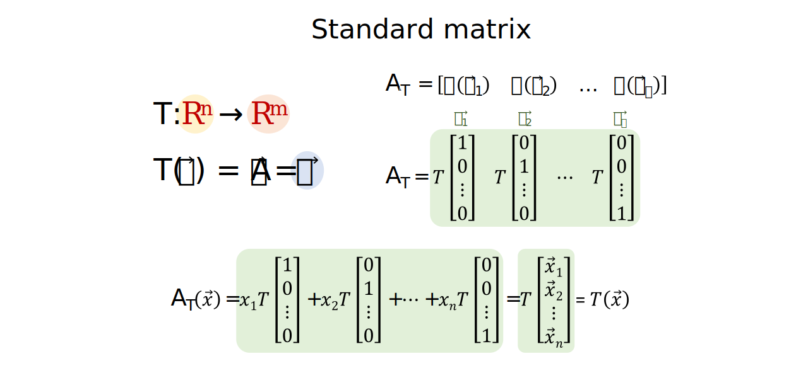
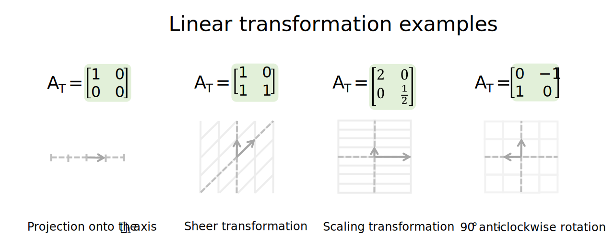
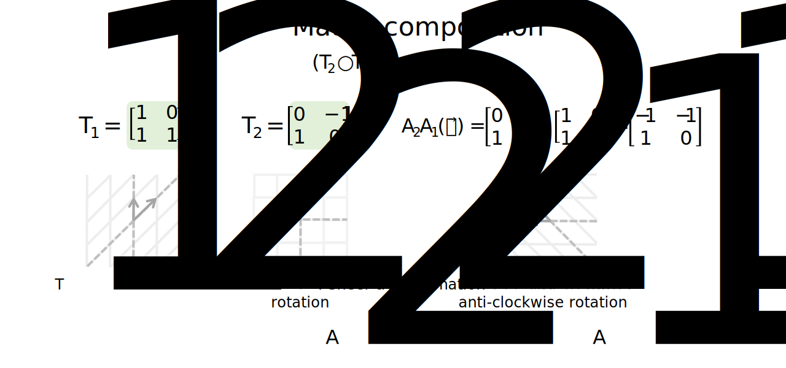
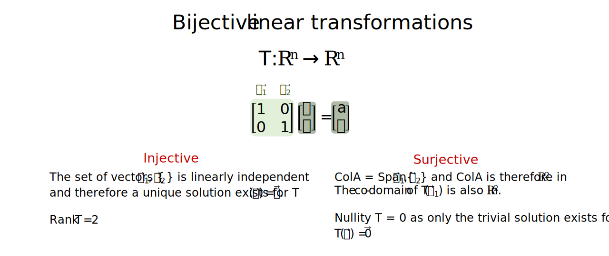

```{r setup, include=FALSE}
# Set up global environment configuration --------------------------------------
knitr::opts_chunk$set(echo=TRUE,
                      results='hide',
                      fig.show='hold',
                      fig.align='center',
                      message=FALSE,
                      warning=FALSE,
                      out.width='80%')

knitr::knit_engines$set(python = reticulate::eng_python)
```

```{r, echo=FALSE}
# Check version of Python used by reticulate -----------------------------------
reticulate::py_config()
```


# Vector transformation notation   

A key focus of linear algebra is the linear transformations of vector spaces.   

A linear transformation can be described as:  

+ A function that maps a vector $\vec x$ in $\mathbb{R}^n$ to a vector $\vec w$ in $\mathbb{R}^m$, where $T(\vec x) = \vec w$.    
+ This is denoted by $T: \mathbb{R}^n \to \mathbb{R}^m$ respectively.   
+ The domain of $T(\vec x)$ is $\mathbb{R}^n$.   
+ The co-domain of $T(\vec x)$ can be $\mathbb{R}^m$ respectively.     
+ The image of $\vec x$ under T is the set $\{\vec w \in \mathbb{R}^m | \vec w = T(\vec x)\}$ where $\vec x \in \mathbb{R}^n$.  
+ The range of $T(\vec x)$ also describes the set $\{\vec w \in \mathbb{R}^m | \vec w = T(\vec x)\}$ where $\vec x \in \mathbb{R}^n$.    

```{r, echo=FALSE, results='markup'}
knitr::include_graphics("../figures/linear_systems-linear_transformation_notation.svg")  
```

A linear transformation can also be described as a matrix transformation, where $A_T$ is the standard matrix for the linear transformation $T: \mathbb{R}^n \to \mathbb{R}^m$ and $T(\vec x) = A\vec x$ where $A_T = \begin{bmatrix}T(\vec e_1) & T(\vec e_2) & \cdots & T(\vec e_n) \end{bmatrix}$.     

```{r, echo=FALSE, results='markup'}
  
```

A linear transformation $T: \mathbb{R}^n \to \mathbb{R}^m$ must satisfy the following two properties:  

+ For vectors $\vec u, \vec v \in \mathbb{R}^n$, $T(\vec u + \vec v) = T(\vec u) + T(\vec v)$.   
+ Let $c$ be a scalar, $T(c \vec u) = cT(\vec u)$.    

Examples of linear transformations include projections onto lower dimensions, sheering transformations, scaling transformations and rotations around the point of origin.   

```{r, echo=FALSE, results='markup'}
    
```


# Linear transformation compositions  

If function $f(x)$ maps element A to B and function $g(x)$ maps element B to C, then the composition of f then g, denoted as $g \circ f$, is the function which maps element A to C and $(g \circ f)(a) = g(f(a))$.   

Similarly, if $T_1: \mathbb{R}^n \to \mathbb{R}^m$ and $T_2: \mathbb{R}^m \to \mathbb{R}^p$, the co-domain of $T_1$ equals the domain of $T_2$ and the composition $T_2 \circ T_1$ maps $\mathbb{R}^n$ to $\mathbb{R}^p$.  

The linear transformation composition $T_2 \circ T_1$ also satisfies the following two properties:  

+ $(T_2 \circ T_1)(\vec u + \vec v) = T_2(T_1(\vec u + \vec v)) = \cdots = (T_2 \circ T_1)(\vec u) + (T_2 \circ T_1)(\vec v)$.        
+ $(T_2 \circ T_1)(c\vec u) = T_2(T_1(c\vec u) = T_2(cT_1(\vec u) = cT_2(T_1(\vec u) = c(T_2 \circ T_1)(\vec u)$.  

```{r, echo=FALSE, results='markup'}
  
```

**Note:** In the example above, even though the sequence of transformations $(T_2 \circ T_1)(\vec x)$ and $(T_1 \circ T_2)(\vec x)$ produce the same grid lines in the 2D plane, the position of the basis vectors $\hat i$ and $\hat j$ are different.    


# Injective linear transformations   

A linear transformation $T: \mathbb{R}^n \to \mathbb{R}^m$ is injective (or one-to-one) if:    

+ Every vector $\vec b \in \mathbb{R}^m$ is the image of at most one vector $\vec x in \mathbb{R}^n$.  
+ Different vectors $\in \mathbb{R}^n$ have different images in $\in \mathbb{R}^m$.  
+ If $T(\vec u) = T(\vec v)$, then $\vec u = \vec v$.    

Another way of thinking about this is that $A_T$ must contain a set of independent vectors $\{\vec v_1, \cdots, \vec v_p\}$ which spans a p-dimensional space in $\in \mathbb{R}^m$. Therefore a unique set of coordinates $\{c_1, \cdots, c_p \}$ must exist which scales $\{\vec v_1, \cdots, \vec v_p\}$ to form $T(\vec x) = \vec b$ and $T(\vec x) = \vec 0$ only contains the trivial solution.          

```{r, echo=FALSE, results='markup'}
knitr::include_graphics("../figures/linear_systems-injective_transformations.svg")  
```

By extension, a linear transformation $T: \mathbb{R}^n \to \mathbb{R}^n$ is only injective if $A_T$ contains a basis for $\mathbb{R}^n$ i.e. a set of independent vectors $\{\vec v_1, \cdots, \vec v_n\}$ which span $\mathbb{R}^n$. The matrix rank, or dimensions of $ColA$, must be $n$ for $A_T$ to be injective when $T: \mathbb{R}^n \to \mathbb{R}^n$.       


# Surjective linear transformations    

A linear transformation $T: \mathbb{R}^n \to \mathbb{R}^m$ is surjective (or onto) if:     

+ The range of $T(\vec x)$, $\vec b$, spans $\mathbb{R}^m$ for $T(\vec x) = \vec b$.      
+ The equation $A(\vec x) = \vec b$ has a solution for all $\vec b \in \mathbb{R}^m$.     
+ The column space of A must span the co-domain $\in \mathbb{R}^m$ i.e. the dimensions of the basis for $ColA$ must be $m$.         

Another way of thinking about this is that $A_T$ must span $\mathbb{R}^m$ i.e. the range and co-domain of $T(\vec x)$ must both be $\in \mathbb{R}^m$. By definition, $A_T \in \mathbb{R}^m$ if it contains a set of linearly independent vectors $\{\vec v_1, \cdots, \vec v_m\}$. Therefore, $ColA \in \mathbb{R}^m$ for a surjective linear transformation $T: \mathbb{R}^n \to \mathbb{R}^m$. 

**Note:** The set of vectors $\{\vec v_1, \cdots, \vec v_m, \cdots, \vec v_p \}$ in $A_T$ does not need to be linearly independent for surjective linear transformations where $T: \mathbb{R}^n \to \mathbb{R}^m$.   

```{r, echo=FALSE, results='markup'}
knitr::include_graphics("../figures/linear_systems-surjective_transformations.svg")  
```

By extension, a linear transformation $T: \mathbb{R}^n \to \mathbb{R}^n$ is only surjective if $A_T$ contains a basis for $\mathbb{R}^n$ i.e. the image of $T(\vec x)$ is also in $\mathbb{R}^n$.  


# Bijective linear transformations  

A linear transformation $T: \mathbb{R}^n \to \mathbb{R}^n$ is therefore bijective (one-to-one and unto) if:  

+ $A_T$ contains a linearly independent set of vectors ${\vec v_1, \cdots, \vec v_n}$ and a unique set of coordinates scales ${\vec v_1, \cdots, \vec v_n}$ to form a different $\vec b$ for each unique $\vec x$, where $T(\vec x) = \vec b$.     
+ As $A_T$ contains a basis with n dimensions, the range of $T(\vec x)$ is therefore equal to the co-domain i.e. $A_T \in \mathbb{R}^n$.   

Bijective linear transformations are an example of the rank and nullity theorem.   

Given a bijective linear transformation $T: \mathbb{R}^n \to \mathbb{R}^n$ where $A_T$ has dimensions $n \times n$, the rank of $T$ is the column space of $A_T$, which is n. The nullity of $T$ is the null space of $A_T$, which is 0. $Rank\,T + Nullity\,T = n + 0 = n$.     

```{r, echo=FALSE, results='markup'}
  
```

 
# Resources   

+ Great YouTube videos on [2D](https://www.youtube.com/watch?v=kYB8IZa5AuE&list=PLZHQObOWTQDPD3MizzM2xVFitgF8hE_ab&index=3) and [3D](https://www.youtube.com/watch?v=rHLEWRxRGiM&list=PLZHQObOWTQDPD3MizzM2xVFitgF8hE_ab&index=5) linear transformations by 3Blue1Brown.       