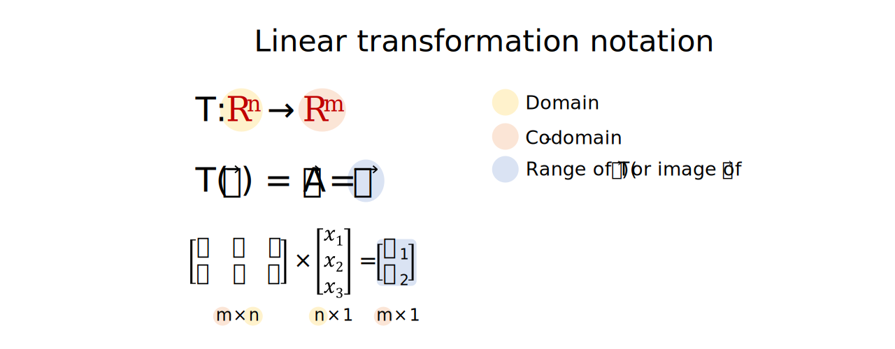
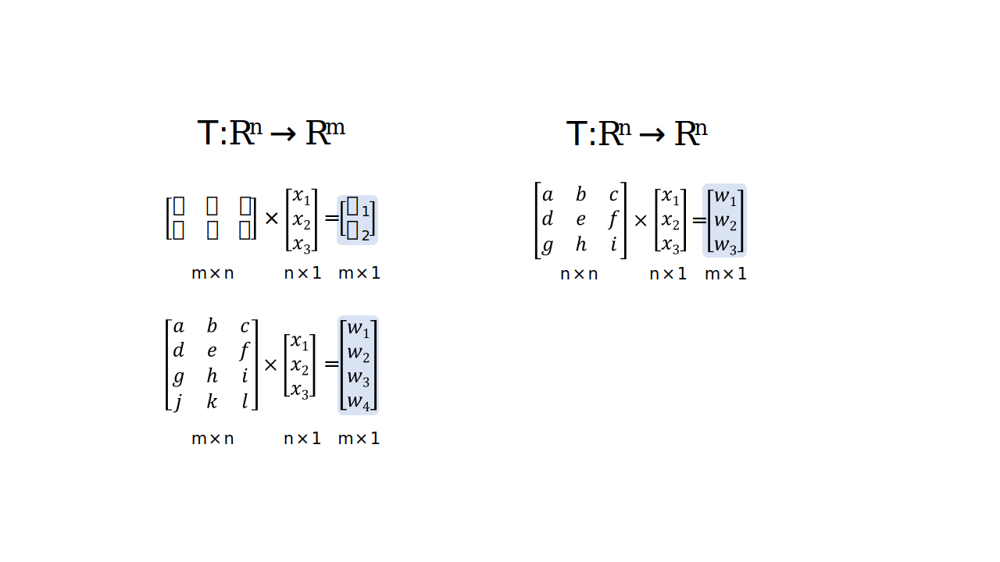

Linear transformations
================
Erika Duan
2022-08-22

-   [Vector transformation notation](#vector-transformation-notation)
-   [Dimensionality and linear
    transformations](#dimensionality-and-linear-transformations)
-   [Injective linear
    transformations](#injective-linear-transformations)
-   [Surjective linear
    transformations](#surjective-linear-transformations)
-   [Resources](#resources)

# Vector transformation notation

The essence of linear algebra involves the study of linear
transformations of vector spaces.

A linear transformation can be described as:

-   A function which maps a vector in
    
    to a vector in
    
    or
    .  
-   This is denoted by
    
    or
    
    respectively.  
-   Alternatively, we can denote linear transformations with respect to
    its vector inputs and outputs
    i.e. ,
    where
    ").  
-   The domain of
    ")
    is
    .  
-   The co-domain of
    ")
    can be
    
    or
    
    respectively.  
-   The image of
    
    under T is the set
    \}")
    where
    .  
-   The range of
    ")
    also describes the set
    \}")
    where
    .  
-   Linear transformations can also be regarded as a transformation by a
    standard matrix for T (draw this definition too)

A linear transformation

must satisfy the following two properties:

-   
-   

# Dimensionality and linear transformations

A linear transformation

can be described in the following ways:

-   
-   

A linear transformation

can be described in the following ways:

-   
-   

# Injective linear transformations

# Surjective linear transformations

# Resources

-   Great YouTube videos on
    [2D](https://www.youtube.com/watch?v=kYB8IZa5AuE&list=PLZHQObOWTQDPD3MizzM2xVFitgF8hE_ab&index=3)
    and
    [3D](https://www.youtube.com/watch?v=rHLEWRxRGiM&list=PLZHQObOWTQDPD3MizzM2xVFitgF8hE_ab&index=5)
    linear transformations by 3Blue1Brown.
