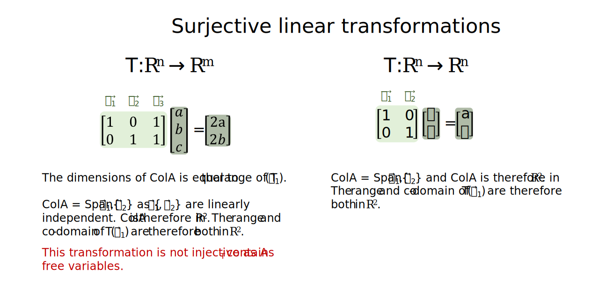

Linear transformations
================
Erika Duan
2022-09-16

-   [Vector transformation notation](#vector-transformation-notation)
-   [Linear transformation
    compositions](#linear-transformation-compositions)
-   [Injective linear
    transformations](#injective-linear-transformations)
-   [Surjective linear
    transformations](#surjective-linear-transformations)
-   [Bijective linear
    transformations](#bijective-linear-transformations)
-   [Resources](#resources)

# Vector transformation notation

A key focus of linear algebra is the linear transformations of vector
spaces.

A linear transformation can be described as:

-   A function that maps a vector
    
    in
    
    to a vector
    
    in
    ,
    where
     = \vec w").  
-   This is denoted by
    
    respectively.  
-   The domain of
    ")
    is
    .  
-   The co-domain of
    ")
    can be
    
    respectively.  
-   The image of
    
    under T is the set
    \}")
    where
    .  
-   The range of
    ")
    also describes the set
    \}")
    where
    .

A linear transformation can also be described as a matrix
transformation, where
 is the standard
matrix for the linear transformation

and
 = A\vec x")
where
 & T(\vec e_2) & \cdots & T(\vec e_n) \end{bmatrix}").

A linear transformation

must satisfy the following two properties:

-   For vectors
    ,
     = T(\vec u) + T(\vec v)").  
-   Let  be a scalar,
     = cT(\vec u)").

Examples of linear transformations include projections onto lower
dimensions, sheering transformations, scaling transformations and
rotations around the point of origin.

# Linear transformation compositions

If function
") maps
element A to B and function
") maps
element B to C, then the composition of f then g, denoted as
,
is the function which maps element A to C and
(a) = g(f(a))").

Similarly, if

and
,
the co-domain of 
equals the domain of
 and the
composition

maps

to
.

The linear transformation composition

also satisfies the following two properties:

-   (\vec u + \vec v) = T_2(T_1(\vec u + \vec v)) = \cdots = (T_2 \circ T_1)(\vec u) + (T_2 \circ T_1)(\vec v)").  
-   (c\vec u) = T_2(T_1(c\vec u) = T_2(cT_1(\vec u) = cT_2(T_1(\vec u) = c(T_2 \circ T_1)(\vec u)").

**Note:** In the example above, even though the sequence of
transformations
(\vec x)")
and
(\vec x)")
produce the same grid lines in the 2D plane, the position of the basis
vectors

and

are different.

# Injective linear transformations

A linear transformation

is injective (or one-to-one) if:

-   Every vector
    
    is the image of at most one vector
    .  
-   Different vectors
    
    have different images in
    .  
-   If
     = T(\vec v)"),
    then
    .

Another way of thinking about this is that
 must contain a
set of independent vectors

which spans a p-dimensional space in
.
Therefore a unique set of coordinates

must exist which scales

to form
 = \vec b")
and
 = \vec 0")
only contains the trivial solution.

By extension, a linear transformation

is only injective if
 contains a basis
for

i.e. a set of independent vectors

which span
.
The matrix rank, or dimensions of
, must be
 for
 to be injective
when
.

# Surjective linear transformations

A linear transformation

is surjective (or onto) if:

-   The range of
    "),
    ,
    spans
    
    for
     = \vec b").  
-   The equation
     = \vec b")
    has a solution for all
    .  
-   The column space of A must span the co-domain
    
    i.e. the dimensions of the basis for
     must be
    .

Another way of thinking about this is that
 must span

i.e. the range and co-domain of
")
must both be
.
By definition,

if it contains a set of linearly independent vectors
.
Therefore,

for a surjective linear transformation
.

**Note:** The set of vectors

in  does not need
to be linearly independent for surjective linear transformations where
.

By extension, a linear transformation

is only surjective if
 contains a basis
for

i.e. the image of
")
is also in
.

# Bijective linear transformations

A linear transformation

is therefore bijective (one-to-one and unto) if:

-    contains a
    linearly independent set of vectors
    
    and a unique set of coordinates scales
    
    to form a different
    
    for each unique
    ,
    where
     = \vec b").  
-   As  contains
    a basis with n dimensions, the range of
    ")
    is therefore equal to the co-domain
    i.e. .

Bijective linear transformations are an example of the rank and nullity
theorem.

Given a bijective linear transformation

where  has
dimensions
,
the rank of  is the
column space of ,
which is n. The nullity of
 is the null space of
, which is 0.
.

# Resources

-   Great YouTube videos on
    [2D](https://www.youtube.com/watch?v=kYB8IZa5AuE&list=PLZHQObOWTQDPD3MizzM2xVFitgF8hE_ab&index=3)
    and
    [3D](https://www.youtube.com/watch?v=rHLEWRxRGiM&list=PLZHQObOWTQDPD3MizzM2xVFitgF8hE_ab&index=5)
    linear transformations by 3Blue1Brown.
