```{r setup, include=FALSE}
# Set up global environment configuration --------------------------------------
knitr::opts_chunk$set(echo=TRUE,
                      results='hide',
                      fig.show='hold',
                      fig.align='center',
                      message=FALSE,
                      warning=FALSE,
                      out.width='80%')

knitr::knit_engines$set(python = reticulate::eng_python)
```

```{r, echo=FALSE}
# Check version of Python used by reticulate -----------------------------------
reticulate::py_config()
```


# Matrices      

A matrix with $m$ rows and $n$ columns can be used to hold the coefficients from any linear system $A\vec x = \vec b$.   

If A is a matrix of linearly independent vectors $\vec a_1, \vec a_2, \cdots, \vec a_n$, each column vector represents a scalable basis vector with dimensions $m \times 1$. $Span\{\vec a_1, \vec a_2, \cdots, \vec a_n\}$ generates subspace H, where subspace H has $n$ dimensions and $\in \mathbb{R}^m$.        

```{r, echo=FALSE, results='markup'}
knitr::include_graphics("../figures/linear_systems-matrix_transformations.svg")
```

**Note:** If matrix A is a square $n \times n$ matrix of linearly independent vectors, subspace H spanned by $\vec a_1, \vec a_2, \cdots, \vec a_n$ has n dimensions and $\in \mathbb{R}^n$.   


# Types of matrices   

Types of matrices include:  

+ Zero matrix: a matrix in which every entry is 0.   
+ Symmetrical matrix: a matrix where values on either side of the diagonal are equal to each other. 
+ Transpose matrix: If matrix A has dimensions $m\times n$, then its transpose matrix $A^T$ has dimensions $n \times m$ and every row of A is a column in $A^T$. Symmetrical matrices therefore have the property $A^T = A$.   
+ Identity matrix: a matrix with dimensions $m \times m$ where each diagonal entry is 1 and all other entries are 0. Identity matrices therefore have the property $IA = AI = A$.   

```{r, echo=FALSE, results='markup'}
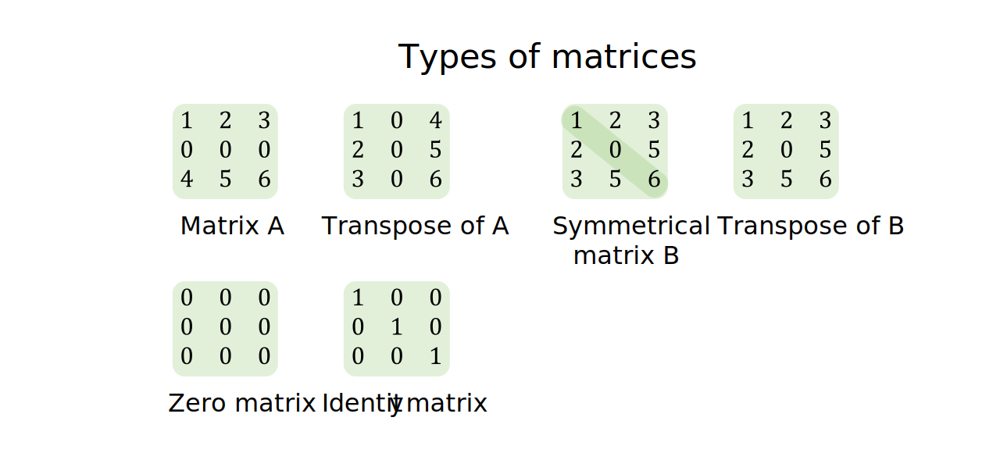
```


# Matrix column space   

For any $m\times n$ matrix A, $A = \begin{bmatrix} \vec a_1 & \vec a_2 & \cdots & \vec a_n \end{bmatrix}$. The column space of A, denoted as $ColA$, is the span of $\{\vec a_1, \vec a_2, \cdots, \vec a_n\}$.     

Therefore $ColA = \{\vec b \in \mathbb{R}^m | A\vec x = \vec b$ for some $\vec x \in \mathbb{R}^n\}$.    

If $\{\vec a_1, \vec a_2, \cdots, \vec a_n\}$ is linearly independent, $ColA$ is also a subspace of $\mathbb{R}^m$ with n-dimensions i.e. $ColA$ can be represented in matrix form with n pivot columns. If the matrix form of $ColA$ contains all pivot columns and therefore no free variables, $A\vec x = \vec b$ must have a single solution and $A\vec x = \vec 0$ only has the trivial solution.    

```{r, echo=FALSE, results='markup'}
knitr::include_graphics("../figures/linear_systems-matrix_column_space.svg")
```


# Matrix null space   

For any $m\times n$ matrix A, the null space of A, denoted as $NulA$, is specifically defined as the set of all solutions to the homogeneous linear system $A\vec x=\vec 0$.  

Therefore $NulA = \{\vec x \in \mathbb{R}^n | A\vec x = \vec 0\}$.   

As homogeneous linear systems have either a single trivial solution or infinite solutions, $NulA$ is either $\vec 0$ or a subspace of $\mathbb{R}^n$.   

When $A\vec x=\vec 0$ has infinite solutions, $NulA$ can also be expressed through its parametric form $c_1\vec v_1 + c_2\vec v_2 + \cdots + c_n\vec v_h$ as $Span\{\vec v_1, \vec v_2, \cdots, \vec v_h\}$.    

```{r, echo=FALSE, results='markup'}
knitr::include_graphics("../figures/linear_systems-matrix_null_space.svg")
```

In summary:   

+ $ColA$ represents the span of the basis vectors of matrix A. This is also called matrix rank.   
+ $NulA$ represents the set of all possible solutions to $A \vec x = \vec 0$. When the solution is presented in parametric form (when there are infinite solutions to $A\vec x = \vec 0$), $NulA$ also has a vector span in relation to its free variables. This is also called matrix nullity.    

```{r, echo=FALSE, results='markup'}
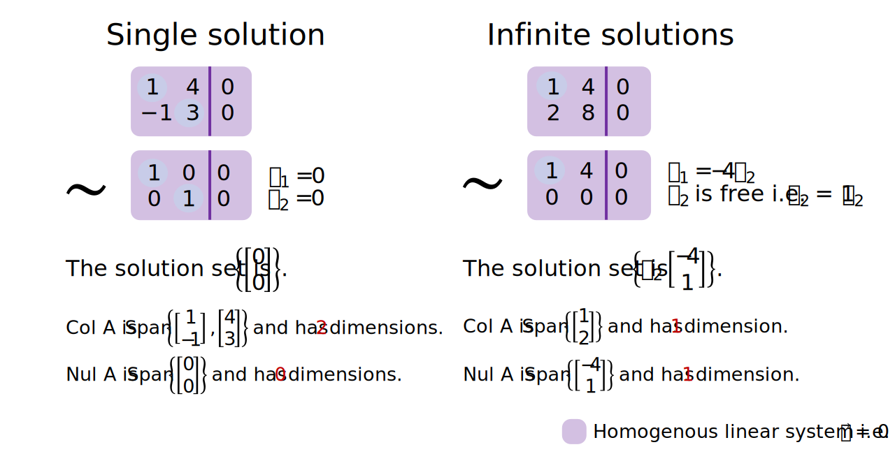
```

**Note:** From examples of homogeneous linear systems, we can see that the number of column vectors in matrix A, represented as $n$, is equal to the sum of the dimensions of $ColA$ and the dimensions of $NulA$.    


# Matrix scalar multiplication   

Matrix scalar multiplication is useful for mapping linear transformations, which is covered in the next tutorial on [linear transformations](https://github.com/erikaduan/introductory_maths/blob/master/tutorials/linear_algebra-linear_transformations.md).    

```{r, echo=FALSE, results='markup'}
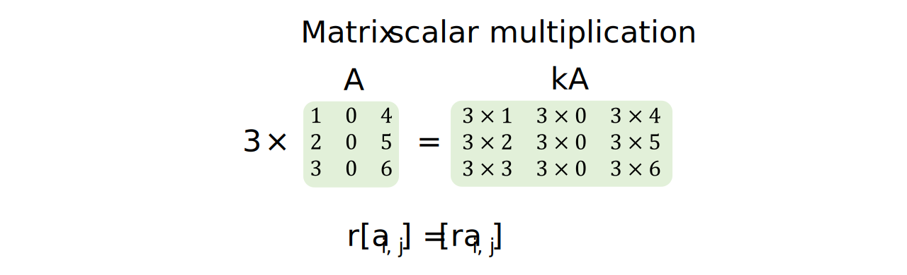
```


# Matrix addition   

The most useful properties of matrix addition are:    

+ That $A + B = B + A$. This shows that the order of matrix addition does not matter.  
+ That $k(A + B) = kA + kB$. This shows that the scalar transformation of the sum of A and B is identical to the sum of the scalar transformation of A and the scalar transformation of B. This is also crucial for understanding the form of a linear transformation.    

```{r, echo=FALSE, results='markup'}
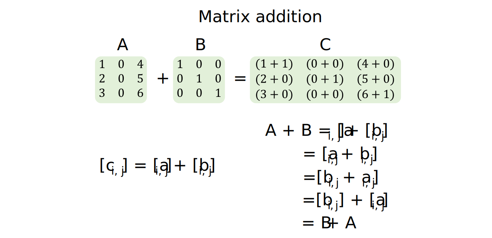
```


# Matrix multiplication   

Unlike matrix addition, the order of matrix multiplication impacts the matrix multiplication product and $A \times B \neq B \times A$.   

When A and B have the same dimensions, matrix multiplication represents the linear transformation of the original basis vectors (from A) onto the position of new basis vectors (from B), to form a new linear transformation (denoted by C) as interpreted using the standard coordinate system.   

```{r, echo=FALSE, results='markup'}
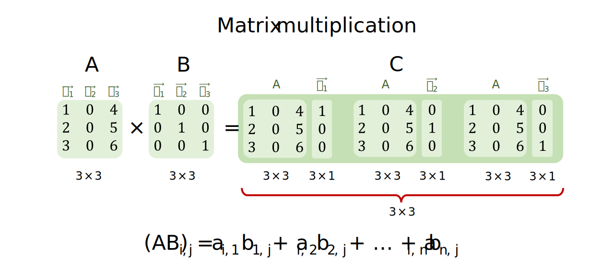
```


# The inverse matrix     

When finding inverse matrices, we only consider matrices with dimensions $n \times n$. 

The matrix inverse can be thought of as a matrix form of the multiplication inverse $\tfrac{1}{k}$ where $k \times \tfrac{1}{k} = 1$. A matrix with dimensions $n \times n$ is invertible if it has an inverse form such that $A\times A^{-1} = I$, where $I$ is the identity matrix.  

The existence of an inverse matrix $A^{-1}$ implies the following other properties:   

+ If $A\times A^{-1} = I$, $A^{-1}\times A = I$ is also true and therefor the inverse of $A^{-1}$ is A. Therefore $(A^{-1})^{-1} = A$.  
+ If matrices $M_1, M_2, \cdots, M_p$ are invertible $n \times n$ matrices, then $(M_1M_2\cdots M_p)(M_p^{-1}\cdots M_2^{-1}M_1^{-1}) = I$ and therefore the inverse of $M_1, M_2, \cdots, M_p$ can be written as $(M_1, M_2, \cdots, M_p)^{-1} = (M_p^{-1}\cdots M_2^{-1}M_1^{-1})$.   
+ If A is invertible, $A^T(A^{-1}){^T}= (A^{-1}A)^{T} = I^T = I$ and $(A^{-1}){^T}A^T= (AA^{-1})^{T} = I^T = I$. Therefore $A^T$ is also invertible and $(A^T)^{-1} = (A^{-1})^{T}$.

To develop an algorithm to find $A^{-1}$, we first consider the scenario where a single elementary row operation (ERO) is performed on the identity matrix to convert it into another row equivalent matrix.     

The ERO can be represented as matrix multiplication by the elementary matrix $E_1$ where $E_1I = E_1$. Since EROs are reversible, $E_1^{-1}$ also exists and $E_1E_1^{-1} = I$. The same ERO that transforms $I$ into $E_1$ can also be applied to matrix A to transform it into matrix B i.e. $E_1A = B$.      

If a single ERO transforms A into the identity matrix i.e. $E_1A=I$, then $E_1 = A^{-1}$. If a finite sequence of EROs transforms A into the identity matrix i.e. $(E_p\cdots E_2E_1)A=I$, then $(E_p\cdots E_2E_1)I = A^{-1}$.     

```{r, echo=FALSE, results='markup'}
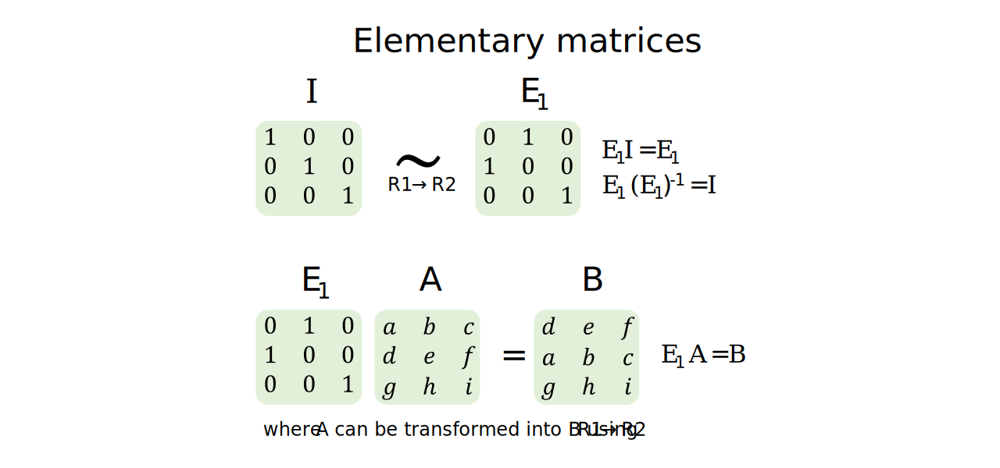   
```

Therefore a matrix is invertible if matrix $A$ is row equivalent to its identify matrix $I$ and any finite sequence of elementary row operations that transforms $A$ to $I$ also transforms $I$ to $A^{-1}$.      

Thus, the connection between linear systems and invertible matrices is that the linear system $A\vec x = \vec b$ only has a unique solution if matrix A is invertible, as the reduced echelon form of A is the identity matrix. We can therefore also solve for $\vec x$ using $\vec x = A^{-1} \vec b$.    

In the algorithm for finding the inverse matrix $A^{-1}$, we aim to:  

1. Write down the augmented matrix $\left[\begin{array}{c|c}A&I_n\end{array}\right]$.      
2. Row reduce the augmented matrix until its left-hand side is in reduced echelon form. Let this be the result $\left[\begin{array}{c|c}B&C\end{array}\right]$.    
3. If $B = I_n$, then the right-hand side of the augmented matrix is the inverse matrix i.e. $C=A^{-1}$. If the left-hand side cannot be simplified to a reduced echelon form, then matrix A is not invertible.   

```{r, echo=FALSE, results='markup'}
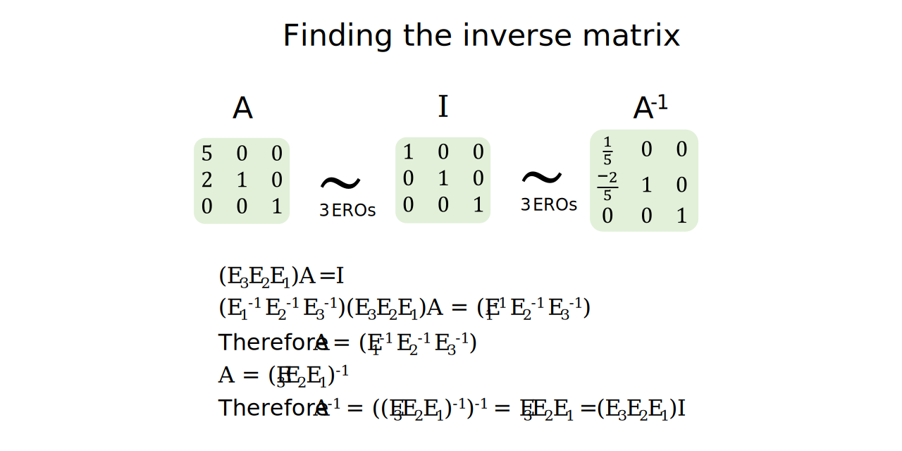
```

**Note:** If matrix A is row equivalent to the identity matrix $I_n$, then the columns of A must all contain pivot columns i.e. no free variables exist and the equation $A\vec x = \vec 0$  must only contain the trivial solution $x_1 = x_2 = \cdots = x_n = 0$.    

**Note:** A matrix that is not invertible is also called a singular matrix and an invertible matrix is therefore also called a non-singular matrix.    


# Matrix determinant  

When finding inverse matrices, we only consider matrices with dimensions $n \times n$.  

The determinant of a matrix is a scalar value and is geometrically equivalent to the area of the parallelogram formed by the basis vectors in $\mathbb{R}^2$ or the volume of the parallelepiped formed by the basis vectors in $\mathbb{R}^3$. We can therefore use the determinant to describe how large or small the basis of a subspace is relative to another basis for the same subspace.          

This also implies that for a linear transformation $T: \mathbb{R}^2 \to \mathbb{R}^2$, if S is a parallelogram in $\mathbb{R}^2$, the area of $T(S) = |detA|\times S$.    

```{r, echo=FALSE, results='markup'}
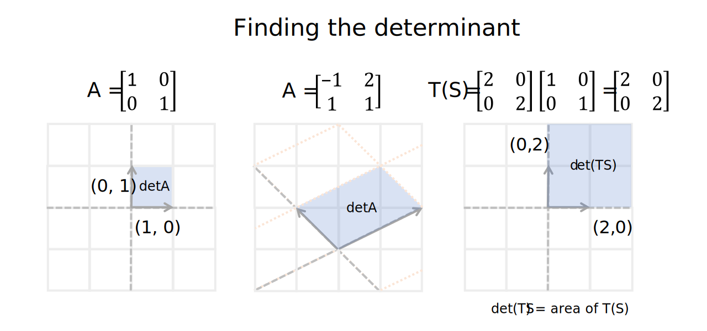  
```

The mathematical definition of the matrix determinant involves identifying all relevant $(i,j)$-cofactor submatrices of matrix A and finding the sum of the product of their determinant and $a_{ij}$ and $(-1)^(i_j)$.    

```{r, echo=FALSE, results='markup'}
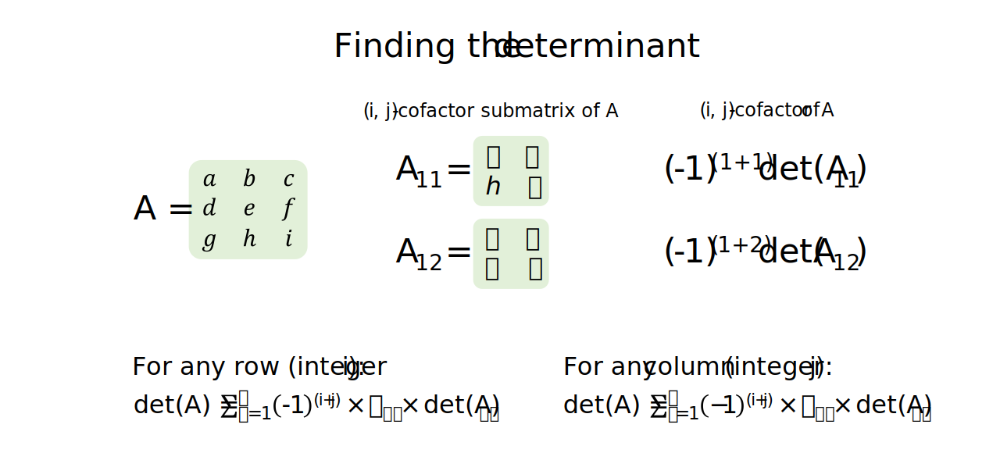  
```

Let A be an $n \times n$ matrix. We can use two approaches to calculate the determinant of an matrix:    

+ When $n\leq2$ or any row or column along matrix A contains predominantly zeros, we can use the $(i,j)$-cofactor expansion method to find $detA$.  
+ When $n\geq3$ and no rows or columns along matrix A contain predominantly zeros, we can use the row reduction method to find $detA$.  

**Deriving the row reduction method of finding detA:**   
If matrix A is in echelon form, detA is equal to the product of the entries along the matrix diagonal. This is because when you select the first column and calculate $detA =\displaystyle\sum_{i=1}^{n} (-1)^{i+1} \times a_{i1} \times detA_{i1}$, only $a_{11}$ produces a non-zero product and $detA_{11} = (-1)^2 \times a_{11}\times detA_{i1} = a_{11} \times (a_{21} \cdots \times a_{n1})$, which is the product of the entries along the matrix diagonal.    

Let matrix E be an elementary matrix with dimensions $n \times n$. $det(EA) = detE \times detA$ where $detE = 1$ for a row replacement ERO, $detE = -1$ for an interchange ERO and $detE = k$ for a scaling ERO than scales a row by $k$.   

```{r, echo=FALSE, results='markup'}
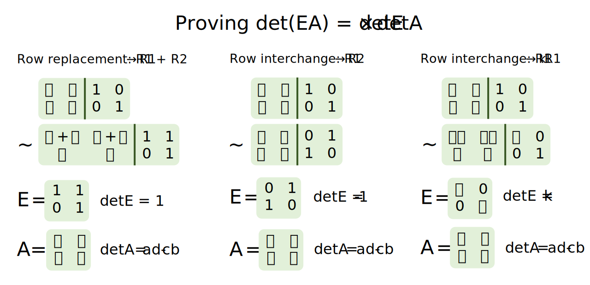  
```

To calculate determinants for large matrices, we can therefore use the row reduction algorithm to find an echelon form of matrix A **without performing any scaling operations**, where $E_p, \cdots, E_1A = R$ and $A = (E_p, \cdots, E_1)^{-1}R$.  

Therefore, $detA = (-1)^r \times$ the product of the diagonal entries in R, where $r$ is the number of row interchange operations used.   

```{r, echo=FALSE, results='markup'}
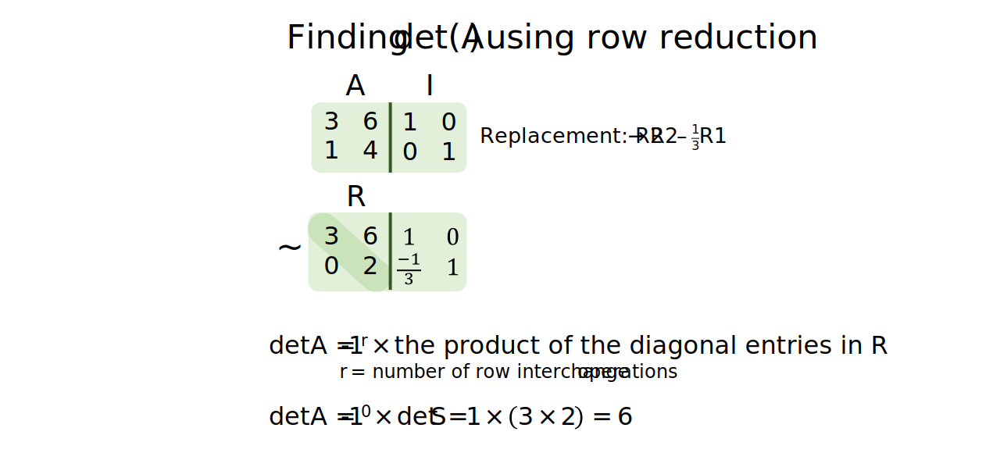  
```

**Relationship between an invertible matrix and its determinant:**   
Matrix A is invertible if $detA \neq 0$ has an invertible matrix has a row equivalent reduced echelon form where all columns are pivot columns. The row equivalent reduced echelon form of matrix A therefore does not have any zeros along its matrix diagonal and $detA \neq 0$.  

**Proving det(AB) = (detA)(detB):**   
When A is not an invertible matrix, $detA=0$ and $0\times detB = 0$. Therefore $det(AB) = detA \times detB$.   
When A and B are both invertible, $detA= E_1^{-1}\cdots E_p^{-1}I$ and $detB= F_1^{-1}\cdots F_p^{-1}I$.   
$detA \times detB = det(E_1^{-1}\cdots E_p^{-1}I)det(F_1^{-1}\cdots F_p^{-1}I)$    
$detA \times detB = det((E_1^{-1}\cdots E_p^{-1})(F_1^{-1}\cdots F_p^{-1})) = det(AB)$ as every elementary matrix is individually invertible.        

**Relationship between a transpose matrix and its determinant:**  
$detA = detA^T$ as reflected by the co-factor expansion method of finding a determinant (where co-factor expansion can occur along either a column or a row).   

**Using Cramer's rule to find the determinant:**  
Cramer's rule can be used to find the determinant when A is an invertible matrix and $detA \neq 0$.  

```{r, echo=FALSE, results='markup'}
knitr::include_graphics("../figures/linear_systems-determinant_cramer.svg")  
```

The key to proving Cramer's rule is to define $detA_1(\vec b) = AI_i(\vec x)$ and then apply the determinant property that $det(AI_i(\vec x)) = detA \times det(I_i(\vec x))$.    

```{r, echo=FALSE, results='markup'}
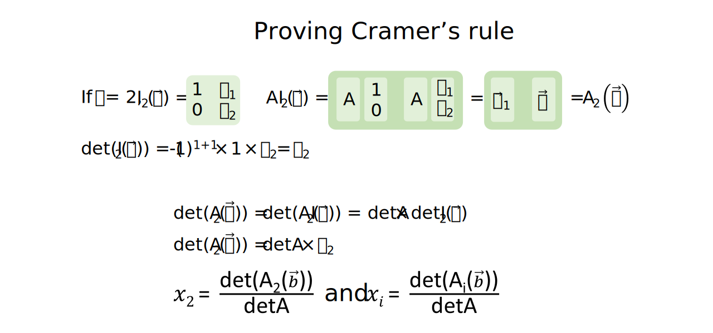  
```


# Eigenvalues and eigenvectors   

When finding eigenvalues and eigenvectors, we currently only consider matrices with dimensions $n \times n$.  

Although matrices are used to represent the coordinate system of a linear transformation, we can also categorise linear transformations by type. One method is to categorise linear transformations by whether they can be decomposed into a series of simpler transformations.   

+ For scaling transformations, the basis vectors $\{\vec v_1, \cdots, \vec v_n\}$ are each scaled by a constant $\{k_1, \cdots, k_n\}$.     
+ Other linear transformations may contain vector subspaces exists where the transformation of vector $\vec x$ scales it by a constant i.e. $A(\vec x) = \lambda \vec x$. For example, for a sheer transformation, one basis vector is always scaled by a constant $k$.  
+ A linear transformation is **diagonalisable** if it can be translated into a different basis $\in \mathbb{R}^n$, where the basis vectors are then each scaled by a constant, and then translated back into the regular basis.    

Properties of **eigenvalues**:     
+ Eigenvalues exist if a non-zero vector $\vec x$ exists for $A(\vec x) = \lambda \vec x$. 
+ Eigenvalues therefore exist if a non-trivial solution to $(A-\lambda I)\vec x = \vec 0$ exists i.e. $\vec x$ cannot be zero.  
+ Eigenvalues therefore exists if $(A-\lambda I)\vec x = \vec 0$ has infinite solutions and if $det(A-\lambda I) = 0$.  
+ $\vec x$ is therefore the eigenvector(s) corresponding to eigenvalue $\lambda$.  
+ If A is a triangular matrix (upper or lower triangular matrix or diagonal matrix), the eigenvalues of A are the entries on its main diagonal.  

```{r, echo=FALSE, results='markup'}
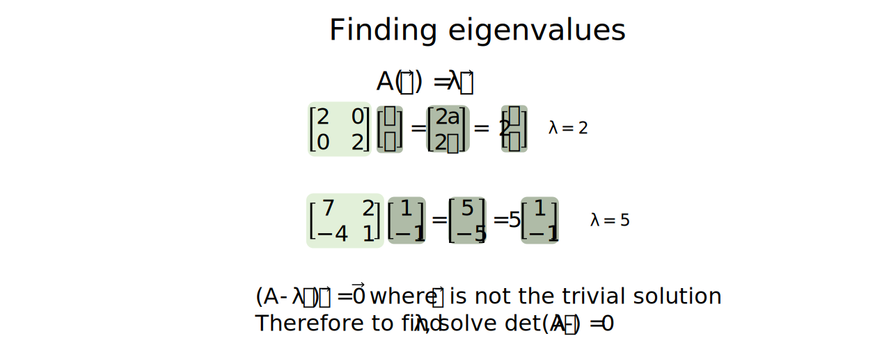  
```

Properties of **eigenvectors**:  
+ The set of eigenvectors corresponding to an eigenvalue $\lambda$ is equivalent to $Nul(A-\lambda I)$ and therefore is a subspace of $\mathbb{R}^n$.   
+ The set of eigenvectors corresponding to $\lambda$ is linearly independent i.e. is a basis for the eigenspace of A corresponding to $\lambda$.  

**Matrix diagonalisation**:  
Let matrix A have dimensions $n \times n$. Matrix A is diagonalisable if:  

+ $A = PDP^{-1}$ where $P$ is an invertible $n \times n$ matrix and D is a diagonal $n \times n$ matrix. 
+ The columns of P must form an eigenvector basis for $\mathbb{R}^n$.  
+ $\mathbb{R}^n$ is spanned by a linearly independent set of eigenvectors $\{\vec v_1, \cdots, \vec v_n\}$ and each eigenvector is associated with a real eigenvalue.     

When matrix A is diagonalisable, the sum of the dimensions of the eigenspaces according to $\lambda$ must therefore equal $n$.   

Conceptually, finding collections of linearly independent eigenvectors allows us to find the bases for subspaces in $\mathbb{R}^n$ where the linear transformation is invariant (the domain and co-domain of the linear transformation remains the same).  

Pragmatically, finding a diagonalisable matrix is also useful for quickly solving transformations involving $A^k$ calculations i.e. $A^k = PD^kP^{-1}$.   

```{r, echo=FALSE, results='markup'}
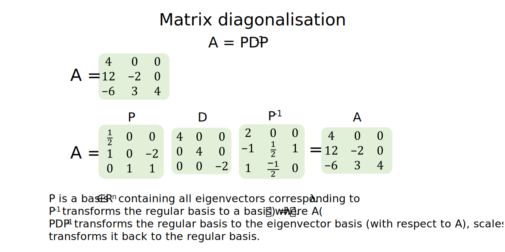  
```


# Complex eigenvalues and eigenvectors  

Matrices with complex eigenvalues and eigenvectors cannot be diagonalised. However, they can be rewritten in the form A = PCP-1, where C represents the combination of a rotational and then scaling transformation.    

```{r, echo=FALSE, results='markup'}
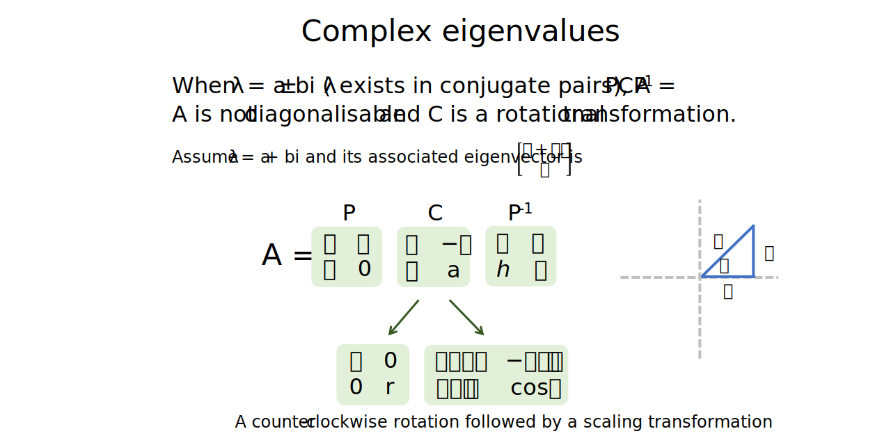  
```


# Stochastic matrix   

A stochastic matrix $T$ is a square matrix with dimensions $n\times n$ probability vectors as columns. A probability vector $\vec x$ contains non-negative entries which sum to 1. The probability of a state occurring at $t = k$ is denoted as $\vec x_k$.   

A Markov Chain is therefore a sequence of probability vectors such that $\vec x_{k+1} = T \vec x_k$.   

```{r, echo=FALSE, results='markup'}
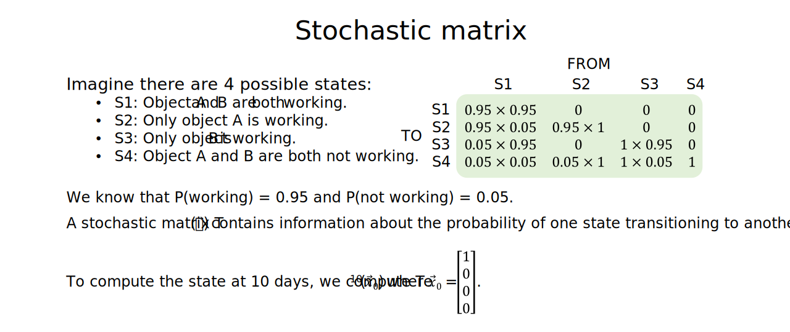  
```

In order for a system to be represented as a Markov Chain, the following assumptions must hold:  

+ At any moment, the system can only exist in one of $n$ discreet states.  
+ We consider the probability that the system is in any state at evenly spaced i.e. discrete time steps.   
+ At any time step, the probability that the system will transition to another state or remain unchanged is fixed and can be represented by the stochastic matrix $T$ i.e. a fixed matrix of transition probabilities.   

If T is the stochastic matrix, a steady-state vector $\vec q$ exists if $T(\vec x) = 1\vec x$ where $\lambda = 1$ i.e. $\vec q$ is an eigenvector for T when $\lambda = 1$.  

Note that the steady-state vector is represented as a probability matrix, so all its entries must be non-negative and sum to 1.  

**To find the steady-state vector for a stochastic matrix:**  

+ Determine whether 1 is an eigenvalue of matrix T. If not, there are no steady-states.  
+ Find the set of eigenvectors corresponding to an eigenvalue of 1.  
+ Identify any eigenvectors with non-negative entries and scale the eigenvector so that its entries sum to 1. This is the steady-state vector for the stochastic matrix $T$.   

A stochastic matrix $T$ is regular if $T_k$ exists where it does not contain any zero entries. When $T$ is regular, a unique steady-state vector $\vec q$ exists and the Markov chain converges to $\vec q$.  

```{r, echo=FALSE, results='markup'}
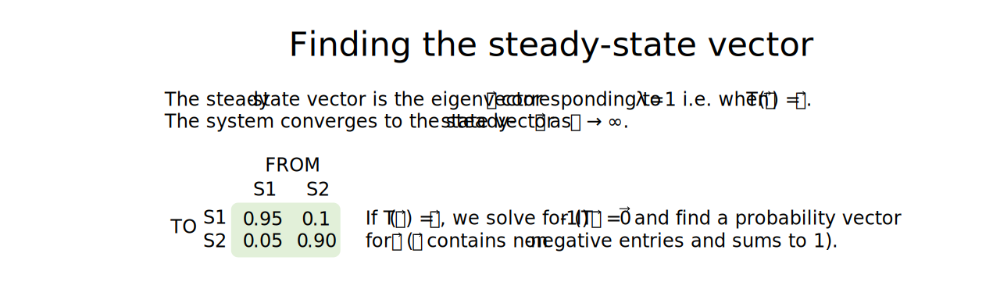  
```


# Resources   
+ A great [YouTube video](https://www.youtube.com/watch?v=kYB8IZa5AuE&list=PLZHQObOWTQDPD3MizzM2xVFitgF8hE_ab&index=3) introducing matrices by 3Blue1Brown.   
+ A great [YouTube video](https://www.youtube.com/watch?v=XkY2DOUCWMU&list=PLZHQObOWTQDPD3MizzM2xVFitgF8hE_ab&index=4) explaining the purpose of matrix multiplication by 3Blue1Brown.   
+ A [clear explanation](https://math.stackexchange.com/questions/664594/why-mathbf0-has-dimension-zero) of why the set containing only the zero vector has 0 dimensions.   