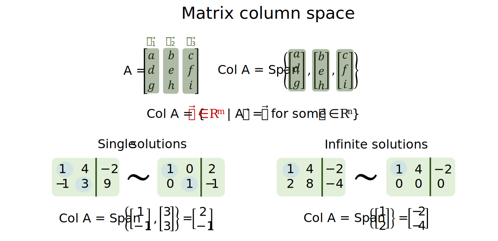

```{r setup, include=FALSE}
# Set up global environment configuration --------------------------------------
knitr::opts_chunk$set(echo=TRUE,
                      results='hide',
                      fig.show='hold',
                      fig.align='center',
                      message=FALSE,
                      warning=FALSE,
                      out.width='80%')

knitr::knit_engines$set(python = reticulate::eng_python)
```

```{r, echo=FALSE}
# Install R packages -----------------------------------------------------------
# The native pipe operator requires R version 4.1+ 
packages <- c("ggplot2",
              "dplyr")

installed_packages <- packages %in% rownames(installed.packages())

if (any(installed_packages == FALSE)) {
  install.packages(packages[!installed_packages])
}

# Attach R packages to the global environment
library("dplyr")
library("ggplot2")

# Check version of Python used by reticulate -----------------------------------
reticulate::py_config()
```


# Matrices     
A matrix with $m$ rows and $n$ columns can be used to contain the coefficients from a linear system $A\vec x = \vec b$. In other words, each vector $\vec a_i$ inside matrix $A$ stores information about where the basis vector for the i-th dimension lands.  

```{r, echo=FALSE, results='markup'}
knitr::include_graphics("../figures/linear_systems-matrix_transformations.svg")
```

# Matrix column space  
The column space of matrix A, denoted $ColA$, is therefore the subspace of $\mathbb{R}^m$ spanned by the columns i.e. basis vectors of matrix A.  

If we represent $A = \begin{bmatrix} \vec a_1 & \vec a_2 & \cdots & \vec a_n \end{bmatrix}$, then $ColA=Span\{\vec a_1, \vec a_2, \cdots, \vec a_n\}$.  

Therefore $ColA = \{\vec b \in \mathbb{R}^m | A\vec x = \vec b \,for \,some \, \vec x \in \mathbb{R}^n\}$.   

```{r, echo=FALSE, results='markup'}

```


# Matrix null space 
#TODO finish edits here
The null space of matrix A is the set of all solutions for the homogeneous equation Ax = 0, where NulA represents the set of x vectors in Rn that represents the set of variables for which the homogeneous equation Ax = 0 is true.  i.e. how much to scale each basis vector by. 

**Note:** ColA -> span of vectors, NullA -> span of all possible solutions.  


# Resources  
+ A great [YouTube series](https://www.youtube.com/watch?v=kYB8IZa5AuE&list=PLZHQObOWTQDPD3MizzM2xVFitgF8hE_ab&index=3) on matrices by 3Blue1Brown.     