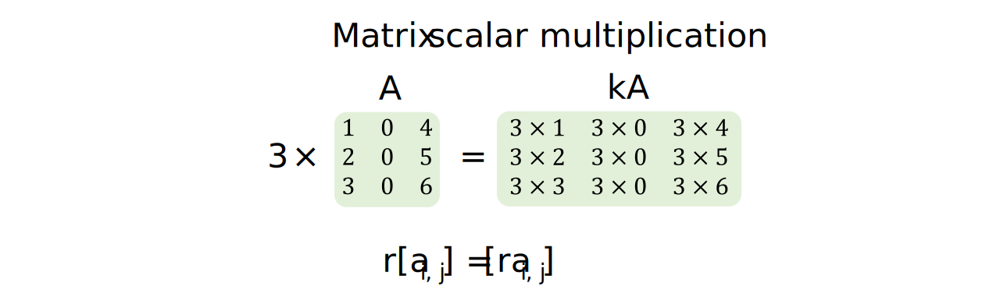

Introduction to matrices
================
Erika Duan
2022-09-10

-   [Matrices](#matrices)
-   [Types of matrices](#types-of-matrices)
-   [Matrix column space](#matrix-column-space)
-   [Matrix null space](#matrix-null-space)
-   [Matrix scalar multiplication](#matrix-scalar-multiplication)
-   [Matrix addition](#matrix-addition)
-   [Matrix multiplication](#matrix-multiplication)
-   [The inverse matrix](#the-inverse-matrix)
-   [Matrix determinant](#matrix-determinant)
-   [TODO](#todo)
-   [Resources](#resources)

# Matrices

A matrix with  rows and
 columns can be used to
hold the coefficients from any linear system
.

If A is a matrix of linearly independent vectors
,
each column vector represents a scalable basis vector with dimensions
.

generates subspace H, where subspace H has
 dimensions and
.

**Note:** If matrix A is a square

matrix of linearly independent vectors, subspace H spanned by

has n dimensions and
.

# Types of matrices

Types of matrices include:

-   Zero matrix: a matrix in which every entry is 0.  
-   Symmetrical matrix: a matrix where values on either side of the
    diagonal are equal to each other.
-   Transpose matrix: If matrix A has dimensions
    ,
    then its transpose matrix
     has
    dimensions
    
    and every row of A is a column in
    .
    Symmetrical matrices therefore have the property
    .  
-   Identity matrix: a matrix with dimensions
    
    where each diagonal entry is 1 and all other entries are 0. Identity
    matrices therefore have the property
    .

# Matrix column space

For any

matrix A,
.
The column space of A, denoted as
, is the span
of
.

Therefore

for some
.

If

is linearly independent,
 is also a
subspace of

with n-dimensions
i.e.  can be
represented in matrix form with n pivot columns. If the matrix form of
 contains all
pivot columns and therefore no free variables,

must have a single solution and

only has the trivial solution.

# Matrix null space

For any

matrix A, the null space of A, denoted as
, is
specifically defined as the set of all solutions to the homogeneous
linear system
.

Therefore
.

As homogeneous linear systems have either a single trivial solution or
infinite solutions,
 is either
 or
a subspace of
.

When

has infinite solutions,
 can also be
expressed through its parametric form

as
.

In summary:

-   
    represents the span of the basis vectors of matrix A. This is also
    called matrix rank.  
-   
    represents the set of all possible solutions to
    .
    When the solution is presented in parametric form (when there are
    infinite solutions to
    ),
     also has
    a vector span in relation to its free variables. This is also called
    matrix nullity.

**Note:** From examples of homogeneous linear systems, we can see that
the number of column vectors in matrix A, represented as
, is equal to the sum
of the dimensions of
 and the
dimensions of
.

# Matrix scalar multiplication

Matrix scalar multiplication is useful for mapping linear
transformations, which is covered in the next tutorial on [linear
transformations](https://github.com/erikaduan/introductory_maths/blob/master/tutorials/linear_algebra-linear_transformations.md).

# Matrix addition

The most useful properties of matrix addition are:

-   That
    .
    This shows that the order of matrix addition does not matter.  
-   That
     = kA + kB").
    This shows that the scalar transformation of the sum of A and B is
    identical to the sum of the scalar transformation of A and the
    scalar transformation of B. This is also crucial for understanding
    the form of a linear transformation.

# Matrix multiplication

Unlike matrix addition, the order of matrix multiplication impacts the
matrix multiplication product and
.

When A and B have the same dimensions, matrix multiplication represents
the linear transformation of the original basis vectors (from A) onto
the position of new basis vectors (from B), to form a new linear
transformation (denoted by C) as interpreted using the standard
coordinate system.

# The inverse matrix

The matrix inverse can be thought of as a matrix form of the
multiplication inverse

where
.
When finding inverse matrices, we only consider matrices with dimensions
.

A matrix with dimensions

is invertible if it has an inverse form such that
,
where  is the identity
matrix.

The existence of an inverse matrix

implies the following other properties:

-   If
    ,
    
    is also true and therefor the inverse of
    
    is A. Therefore
    ^{-1} = A").  
-   If matrices
    
    are invertible
    
    matrices, then
    (M_p^{-1}\cdots M_2^{-1}M_1^{-1}) = I")
    and therefore the inverse of
    
    can be written as
    ^{-1} = (M_p^{-1}\cdots M_2^{-1}M_1^{-1})").  
-   If A is invertible,
    {^T}= (A^{-1}A)^{T} = I^T = I")
    and
    {^T}A^T= (AA^{-1})^{T} = I^T = I").
    Therefore 
    is also invertible and
    ^{-1} = (A^{-1})^{T}").

To develop an algorithm to find
,
we first consider the scenario where a single elementary row operation
(ERO) is performed on the identity matrix to convert it into another row
equivalent matrix.

The ERO can be represented as matrix multiplication by the elementary
matrix  where
.
Since EROs are reversible,

also exists and
.
The same ERO that transforms
 into
 can also be
applied to matrix A to transform it into matrix B
i.e. .

If a single ERO transforms A into the identity matrix
i.e. ,
then
.
If a finite sequence of EROs transforms A into the identity matrix
i.e. A=I"),
then
I = A^{-1}").

Therefore a matrix is invertible if matrix
 is row equivalent to
its identify matrix 
and any finite sequence of elementary row operations that transforms
 to
 also transforms
 to
.

Thus, the connection between linear systems and invertible matrices is
that the linear system

only has a unique solution if matrix A is invertible, as the reduced
echelon form of A is the identity matrix. We can therefore also solve
for

using
.

In the algorithm for finding the inverse matrix
,
we aim to:

1.  Write down the augmented matrix
    ![\\left\[\\begin{array}{c\|c}A&I_n\\end{array}\\right\]](https://latex.codecogs.com/svg.format?%5Cleft%5B%5Cbegin%7Barray%7D%7Bc%7Cc%7DA%26I_n%5Cend%7Barray%7D%5Cright%5D "\left[\begin{array}{c|c}A&I_n\end{array}\right]").  
2.  Row reduce the augmented matrix until its left-hand side is in
    reduced echelon form. Let this be the result
    ![\\left\[\\begin{array}{c\|c}B&C\\end{array}\\right\]](https://latex.codecogs.com/svg.format?%5Cleft%5B%5Cbegin%7Barray%7D%7Bc%7Cc%7DB%26C%5Cend%7Barray%7D%5Cright%5D "\left[\begin{array}{c|c}B&C\end{array}\right]").  
3.  If
    ,
    then the right-hand side of the augmented matrix is the inverse
    matrix
    i.e. .
    If the left-hand side cannot be simplified to a reduced echelon
    form, then matrix A is not invertible.

**Note:** If matrix A is row equivalent to the identity matrix
, then the
columns of A must all contain pivot columns i.e. no free variables exist
and the equation

must only contain the trivial solution
.

**Note:** A matrix that is not invertible is also called a singular
matrix and an invertible matrix is therefore also called a non-singular
matrix.

# Matrix determinant

# TODO

# Resources

-   A great [YouTube
    video](https://www.youtube.com/watch?v=kYB8IZa5AuE&list=PLZHQObOWTQDPD3MizzM2xVFitgF8hE_ab&index=3)
    introducing matrices by 3Blue1Brown.  
-   A great [YouTube
    video](https://www.youtube.com/watch?v=XkY2DOUCWMU&list=PLZHQObOWTQDPD3MizzM2xVFitgF8hE_ab&index=4)
    explaining the purpose of matrix multiplication by 3Blue1Brown.  
-   A [clear
    explanation](https://math.stackexchange.com/questions/664594/why-mathbf0-has-dimension-zero)
    of why the set containing only the zero vector has 0 dimensions.
