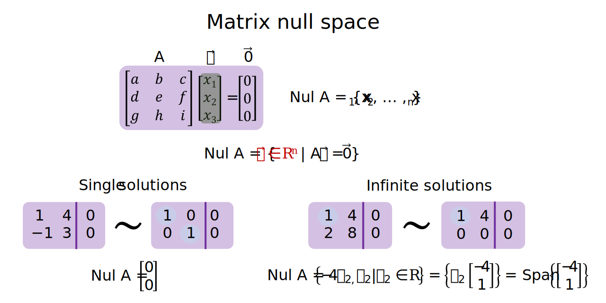
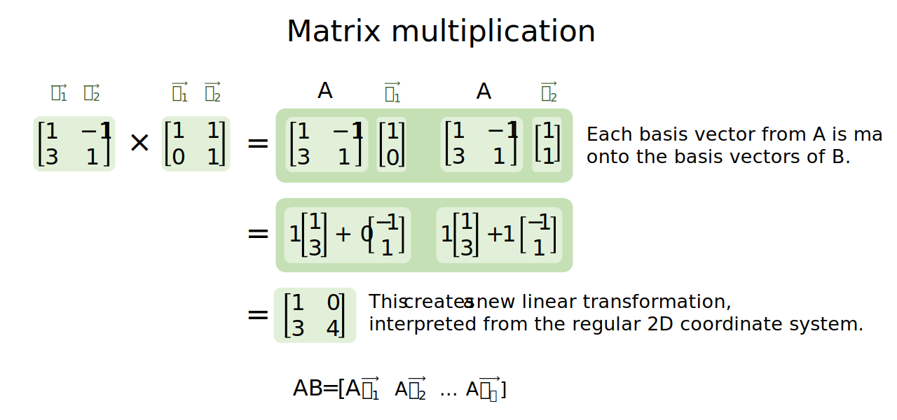

Introduction to matrices
================
Erika Duan
2022-08-21

-   [Matrices](#matrices)
-   [Types of matrices](#types-of-matrices)
-   [Matrix column space](#matrix-column-space)
-   [Matrix null space](#matrix-null-space)
-   [Matrix scalar multiplication](#matrix-scalar-multiplication)
-   [Matrix addition](#matrix-addition)
-   [Matrix multiplication](#matrix-multiplication)
-   [Finding the inverse matrix](#finding-the-inverse-matrix)
-   [Resources](#resources)

# Matrices

A matrix with  rows and
 columns can be used to
hold the coefficients from any linear system
.

For any homogeneous linear system with linearly independent vectors
,
each vector represents a scalable basis vector and

spans subspace H, where subspace H has
 dimensions.

# Types of matrices

Types of matrices include:

-   Transpose matrix: If matrix A has dimensions
    ,
    then its transpose matrix
     has
    dimensions
    
    and every row of A is a column in
    .  
-   Zero matrix: a matrix in which every entry is 0.  
-   Symmetrical matrix: a matrix where values on either side of the
    diagonal are equal to each other. Symmetrical matrices therefore
    have the property
    .  
-   Identity matrix: a matrix with dimensions
    
    where each diagonal entry is 1 and all other entries are 0.

# Matrix column space

For any

matrix A,
.
The column space of A, denoted as
, is therefore
the span of
.

Therefore
.

 is also the
subspace of

which is spanned by the basis vectors

or pivot columns of matrix A.

# Matrix null space

For any

matrix A, the null space of A, denoted as
, is the set
of all solutions to the homogeneous linear system
.

Therefore
.

As homogeneous linear systems have either a single trivial solution or
infinite solutions,
 is either
 or
a subspace of
.

When

has infinite solutions,
 can also be
expressed in the parametric form

as
.

In summary:

-   
    represents the span of the basis vectors of matrix A.  
-   
    represents the set of all possible solutions to
    .
    When the solution is presented in parametric form (when there are
    infinite solutions to
    ),
     also has
    a vector span in relation to its free variables.

**Note:** Using examples of homogeneous linear systems, we can see that
the number of column vectors in matrix A, represented as
, is equal to the sum
of the dimensions of
 and the
dimensions of
.

# Matrix scalar multiplication

This property is useful for further defining the properties of linear
transformations, which is covered in the next tutorial on linear
transformations.

# Matrix addition

Some of the most useful properties of matrix addition include:

-   That
    .
    This shows that the order of matrix addition does not matter.  
-   That
     = kA + kB").
    This shows that the scalar transformation of the sum of matrices A
    and B is identical to the sum of the scalar transformation of A and
    the scalar transformation of B. This is also crucial for defining
    the properties of linear transformations.

# Matrix multiplication

Unlike matrix addition, the order of matrix multiplication impacts the
matrix multiplication product and
.

Matrix multiplication has extra special meaning in linear algebra as it
represents the sequence of linear transformations applied to any vector
,
where
.

# Finding the inverse matrix

A matrix with dimensions

is invertible if it has an inverse form such that

and
^{-1} = A"),
where  is the identity
matrix. Therefore a matrix is invertible if matrix
 is row equivalent to
its identify matrix 
and any finite sequence of elementary row operations that transforms
 to
 also transforms
 to
.

The matrix inverse can be thought of as a matrix form of the
multiplication inverse

where
.

The connection between linear systems and invertible matrices is that
the linear system

has a unique solution if matrix A is invertible. This occurs as

can be simplified to
.

In the algorithm for finding the inverse matrix
,
we aim to:

1.  Write down the augmented matrix
    ![\\left\[\\begin{array}{c\|c}A&I_n\\end{array}\\right\]](https://latex.codecogs.com/svg.format?%5Cleft%5B%5Cbegin%7Barray%7D%7Bc%7Cc%7DA%26I_n%5Cend%7Barray%7D%5Cright%5D "\left[\begin{array}{c|c}A&I_n\end{array}\right]").  
2.  Row reduce the augmented matrix until its left-hand side is in
    reduced echelon form. Let this be the result
    ![\\left\[\\begin{array}{c\|c}B&C\\end{array}\\right\]](https://latex.codecogs.com/svg.format?%5Cleft%5B%5Cbegin%7Barray%7D%7Bc%7Cc%7DB%26C%5Cend%7Barray%7D%5Cright%5D "\left[\begin{array}{c|c}B&C\end{array}\right]").  
3.  If
    ,
    then the right-hand side of the augmented matrix is the inverse
    matrix
    
    i.e. .
    If the left-hand side cannot be simplified to a reduced echelon
    form, then matrix A is not invertible.

**Note:** If matrix A is row equivalent to the identity matrix
, then A must
have  pivot columns and
the equation

must only contain the trivial solution
.

**Note:** A matrix that is not invertible is also called a singular
matrix. An invertible matrix is also called a non-singular matrix.

# Resources

-   A great [YouTube
    video](https://www.youtube.com/watch?v=kYB8IZa5AuE&list=PLZHQObOWTQDPD3MizzM2xVFitgF8hE_ab&index=3)
    introducing matrices by 3Blue1Brown.  
-   A great [YouTube
    video](https://www.youtube.com/watch?v=XkY2DOUCWMU&list=PLZHQObOWTQDPD3MizzM2xVFitgF8hE_ab&index=4)
    explaining the purpose of matrix multiplication by 3Blue1Brown.  
-   A [clear
    explanation](https://math.stackexchange.com/questions/664594/why-mathbf0-has-dimension-zero)
    of why the set containing only the zero vector has 0 dimensions.
