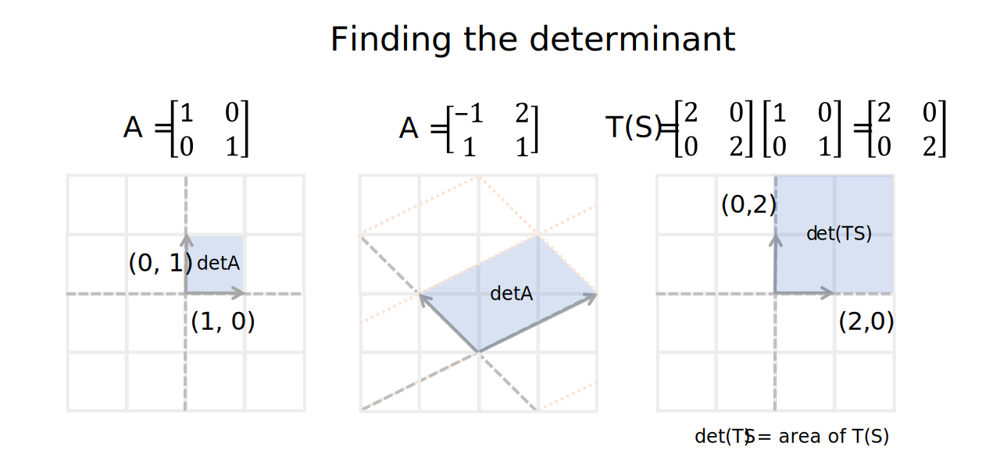
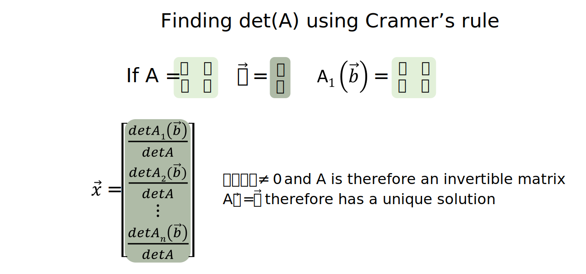
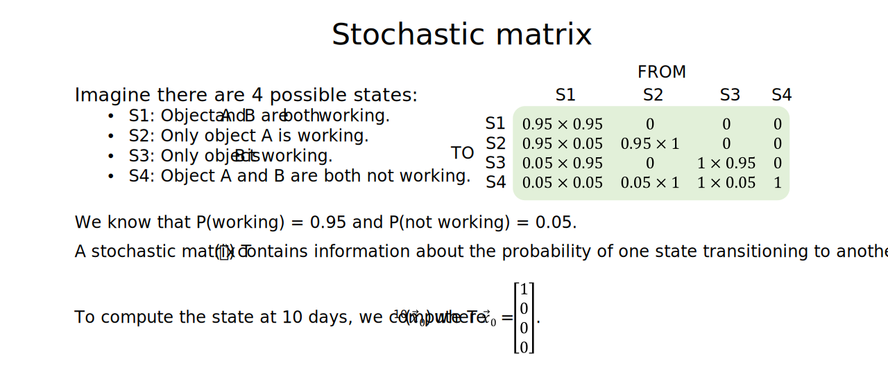
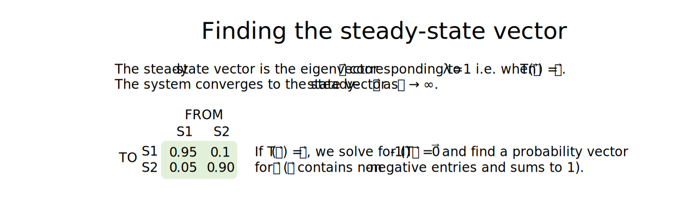

Introduction to matrices
================
Erika Duan
2022-09-18

-   [Matrices](#matrices)
-   [Types of matrices](#types-of-matrices)
-   [Matrix column space](#matrix-column-space)
-   [Matrix null space](#matrix-null-space)
-   [Matrix scalar multiplication](#matrix-scalar-multiplication)
-   [Matrix addition](#matrix-addition)
-   [Matrix multiplication](#matrix-multiplication)
-   [The inverse matrix](#the-inverse-matrix)
-   [Matrix determinant](#matrix-determinant)
-   [Eigenvalues and eigenvectors](#eigenvalues-and-eigenvectors)
-   [Complex eigenvalues and
    eigenvectors](#complex-eigenvalues-and-eigenvectors)
-   [Stochastic matrix](#stochastic-matrix)
-   [Resources](#resources)

# Matrices

A matrix with  rows and
 columns can be used to
hold the coefficients from any linear system
.

If A is a matrix of linearly independent vectors
,
each column vector represents a scalable basis vector with dimensions
.

generates subspace H, where subspace H has
 dimensions and
.

**Note:** If matrix A is a square

matrix of linearly independent vectors, subspace H spanned by

has n dimensions and
.

# Types of matrices

Types of matrices include:

-   Zero matrix: a matrix in which every entry is 0.  
-   Symmetrical matrix: a matrix where values on either side of the
    diagonal are equal to each other.
-   Transpose matrix: If matrix A has dimensions
    ,
    then its transpose matrix
     has
    dimensions
    
    and every row of A is a column in
    .
    Symmetrical matrices therefore have the property
    .  
-   Identity matrix: a matrix with dimensions
    
    where each diagonal entry is 1 and all other entries are 0. Identity
    matrices therefore have the property
    .

# Matrix column space

For any

matrix A,
.
The column space of A, denoted as
, is the span
of
.

Therefore

for some
.

If

is linearly independent,
 is also a
subspace of

with n-dimensions
i.e.  can be
represented in matrix form with n pivot columns. If the matrix form of
 contains all
pivot columns and therefore no free variables,

must have a single solution and

only has the trivial solution.

# Matrix null space

For any

matrix A, the null space of A, denoted as
, is
specifically defined as the set of all solutions to the homogeneous
linear system
.

Therefore
.

As homogeneous linear systems have either a single trivial solution or
infinite solutions,
 is either
 or
a subspace of
.

When

has infinite solutions,
 can also be
expressed through its parametric form

as
.

In summary:

-   
    represents the span of the basis vectors of matrix A. This is also
    called matrix rank.  
-   
    represents the set of all possible solutions to
    .
    When the solution is presented in parametric form (when there are
    infinite solutions to
    ),
     also has
    a vector span in relation to its free variables. This is also called
    matrix nullity.

**Note:** From examples of homogeneous linear systems, we can see that
the number of column vectors in matrix A, represented as
, is equal to the sum
of the dimensions of
 and the
dimensions of
.

# Matrix scalar multiplication

Matrix scalar multiplication is useful for mapping linear
transformations, which is covered in the next tutorial on [linear
transformations](https://github.com/erikaduan/introductory_maths/blob/master/tutorials/linear_algebra-linear_transformations.md).

# Matrix addition

The most useful properties of matrix addition are:

-   That
    .
    This shows that the order of matrix addition does not matter.  
-   That
     = kA + kB").
    This shows that the scalar transformation of the sum of A and B is
    identical to the sum of the scalar transformation of A and the
    scalar transformation of B. This is also crucial for understanding
    the form of a linear transformation.

# Matrix multiplication

Unlike matrix addition, the order of matrix multiplication impacts the
matrix multiplication product and
.

When A and B have the same dimensions, matrix multiplication represents
the linear transformation of the original basis vectors (from A) onto
the position of new basis vectors (from B), to form a new linear
transformation (denoted by C) as interpreted using the standard
coordinate system.

# The inverse matrix

When finding inverse matrices, we only consider matrices with dimensions
.

The matrix inverse can be thought of as a matrix form of the
multiplication inverse

where
.
A matrix with dimensions

is invertible if it has an inverse form such that
,
where  is the identity
matrix.

The existence of an inverse matrix

implies the following other properties:

-   If
    ,
    
    is also true and therefor the inverse of
    
    is A. Therefore
    ^{-1} = A").  
-   If matrices
    
    are invertible
    
    matrices, then
    (M_p^{-1}\cdots M_2^{-1}M_1^{-1}) = I")
    and therefore the inverse of
    
    can be written as
    ^{-1} = (M_p^{-1}\cdots M_2^{-1}M_1^{-1})").  
-   If A is invertible,
    {^T}= (A^{-1}A)^{T} = I^T = I")
    and
    {^T}A^T= (AA^{-1})^{T} = I^T = I").
    Therefore 
    is also invertible and
    ^{-1} = (A^{-1})^{T}").

To develop an algorithm to find
,
we first consider the scenario where a single elementary row operation
(ERO) is performed on the identity matrix to convert it into another row
equivalent matrix.

The ERO can be represented as matrix multiplication by the elementary
matrix  where
.
Since EROs are reversible,

also exists and
.
The same ERO that transforms
 into
 can also be
applied to matrix A to transform it into matrix B
i.e. .

If a single ERO transforms A into the identity matrix
i.e. ,
then
.
If a finite sequence of EROs transforms A into the identity matrix
i.e. A=I"),
then
I = A^{-1}").

Therefore a matrix is invertible if matrix
 is row equivalent to
its identify matrix 
and any finite sequence of elementary row operations that transforms
 to
 also transforms
 to
.

Thus, the connection between linear systems and invertible matrices is
that the linear system

only has a unique solution if matrix A is invertible, as the reduced
echelon form of A is the identity matrix. We can therefore also solve
for

using
.

In the algorithm for finding the inverse matrix
,
we aim to:

1.  Write down the augmented matrix
    ![\\left\[\\begin{array}{c\|c}A&I_n\\end{array}\\right\]](https://latex.codecogs.com/svg.format?%5Cleft%5B%5Cbegin%7Barray%7D%7Bc%7Cc%7DA%26I_n%5Cend%7Barray%7D%5Cright%5D "\left[\begin{array}{c|c}A&I_n\end{array}\right]").  
2.  Row reduce the augmented matrix until its left-hand side is in
    reduced echelon form. Let this be the result
    ![\\left\[\\begin{array}{c\|c}B&C\\end{array}\\right\]](https://latex.codecogs.com/svg.format?%5Cleft%5B%5Cbegin%7Barray%7D%7Bc%7Cc%7DB%26C%5Cend%7Barray%7D%5Cright%5D "\left[\begin{array}{c|c}B&C\end{array}\right]").  
3.  If
    ,
    then the right-hand side of the augmented matrix is the inverse
    matrix
    i.e. .
    If the left-hand side cannot be simplified to a reduced echelon
    form, then matrix A is not invertible.

**Note:** If matrix A is row equivalent to the identity matrix
, then the
columns of A must all contain pivot columns i.e. no free variables exist
and the equation

must only contain the trivial solution
.

**Note:** A matrix that is not invertible is also called a singular
matrix and an invertible matrix is therefore also called a non-singular
matrix.

# Matrix determinant

When finding inverse matrices, we only consider matrices with dimensions
.

The determinant of a matrix is a scalar value and is geometrically
equivalent to the area of the parallelogram formed by the basis vectors
in

or the volume of the parallelepiped formed by the basis vectors in
.
We can therefore use the determinant to describe how large or small the
basis of a subspace is relative to another basis for the same subspace.

This also implies that for a linear transformation
,
if S is a parallelogram in
,
the area of
 = |detA|\times S").

The mathematical definition of the matrix determinant involves
identifying all relevant
")-cofactor
submatrices of matrix A and finding the sum of the product of their
determinant and

and
^(i_j)").

Let A be an

matrix. We can use two approaches to calculate the determinant of an
matrix:

-   When
    
    or any row or column along matrix A contains predominantly zeros, we
    can use the
    ")-cofactor
    expansion method to find
    .  
-   When
    
    and no rows or columns along matrix A contain predominantly zeros,
    we can use the row reduction method to find
    .

**Deriving the row reduction method of finding detA:**  
If matrix A is in echelon form, detA is equal to the product of the
entries along the matrix diagonal. This is because when you select the
first column and calculate
^{i+1} \times a_{i1} \times detA_{i1}"),
only

produces a non-zero product and
^2 \times a_{11}\times detA_{i1} = a_{11} \times (a_{21} \cdots \times a_{n1})"),
which is the product of the entries along the matrix diagonal.

Let matrix E be an elementary matrix with dimensions
.
 = detE \times detA")
where

for a row replacement ERO,

for an interchange ERO and

for a scaling ERO than scales a row by
.

To calculate determinants for large matrices, we can therefore use the
row reduction algorithm to find an echelon form of matrix A **without
performing any scaling operations**, where

and
^{-1}R").

Therefore,
^r \times")
the product of the diagonal entries in R, where
 is the number of row
interchange operations used.

**Relationship between an invertible matrix and its determinant:**  
Matrix A is invertible if

has an invertible matrix has a row equivalent reduced echelon form where
all columns are pivot columns. The row equivalent reduced echelon form
of matrix A therefore does not have any zeros along its matrix diagonal
and
.

**Proving det(AB) = (detA)(detB):**  
When A is not an invertible matrix,
 and
.
Therefore
 = detA \times detB").  
When A and B are both invertible,

and
.  
det(F_1^{-1}\cdots F_p^{-1}I)")  
(F_1^{-1}\cdots F_p^{-1})) = det(AB)")
as every elementary matrix is individually invertible.

**Relationship between a transpose matrix and its determinant:**  

as reflected by the co-factor expansion method of finding a determinant
(where co-factor expansion can occur along either a column or a row).

**Using Cramer’s rule to find the determinant:**  
Cramer’s rule can be used to find the determinant when A is an
invertible matrix and
.

The key to proving Cramer’s rule is to define
 = AI_i(\vec x)")
and then apply the determinant property that
) = detA \times det(I_i(\vec x))").

# Eigenvalues and eigenvectors

When finding eigenvalues and eigenvectors, we currently only consider
matrices with dimensions
.

Although matrices are used to represent the coordinate system of a
linear transformation, we can also categorise linear transformations by
type. One method is to categorise linear transformations by whether they
can be decomposed into a series of simpler transformations.

-   For scaling transformations, the basis vectors
    
    are each scaled by a constant
    .  
-   Other linear transformations may contain vector subspaces exists
    where the transformation of vector
    
    scales it by a constant
    i.e.  = \lambda \vec x").
    For example, for a sheer transformation, one basis vector is always
    scaled by a constant
    .  
-   A linear transformation is **diagonalisable** if it can be
    translated into a different basis
    ,
    where the basis vectors are then each scaled by a constant, and then
    translated back into the regular basis.

Properties of **eigenvalues**:  
+ Eigenvalues exist if a non-zero vector

exists for
 = \lambda \vec x"). +
Eigenvalues therefore exist if a non-trivial solution to
\vec x = \vec 0")
exists
i.e. 
cannot be zero.  
+ Eigenvalues therefore exists if
\vec x = \vec 0")
has infinite solutions and if
 = 0").  
+ 
is therefore the eigenvector(s) corresponding to eigenvalue
.  
+ If A is a triangular matrix (upper or lower triangular matrix or
diagonal matrix), the eigenvalues of A are the entries on its main
diagonal.

Properties of **eigenvectors**:  
+ The set of eigenvectors corresponding to an eigenvalue

is equivalent to
")
and therefore is a subspace of
.  
+ The set of eigenvectors corresponding to

is linearly independent i.e. is a basis for the eigenspace of A
corresponding to
.

**Matrix diagonalisation**:  
Let matrix A have dimensions
.
Matrix A is diagonalisable if:

-   
    where  is an
    invertible
    
    matrix and D is a diagonal
    
    matrix.
-   The columns of P must form an eigenvector basis for
    .  
-   
    is spanned by a linearly independent set of eigenvectors
    
    and each eigenvector is associated with a real eigenvalue.

When matrix A is diagonalisable, the sum of the dimensions of the
eigenspaces according to

must therefore equal .

Conceptually, finding collections of linearly independent eigenvectors
allows us to find the bases for subspaces in

where the linear transformation is invariant (the domain and co-domain
of the linear transformation remains the same).

Pragmatically, finding a diagonalisable matrix is also useful for
quickly solving transformations involving
 calculations
i.e. .

# Complex eigenvalues and eigenvectors

Matrices with complex eigenvalues and eigenvectors cannot be
diagonalised. However, they can be rewritten in the form A = PCP-1,
where C represents the combination of a rotational and then scaling
transformation.

# Stochastic matrix

A stochastic matrix  is
a square matrix with dimensions

probability vectors as columns. A probability vector

contains non-negative entries which sum to 1. The probability of a state
occurring at
 is
denoted as
.

A Markov Chain is therefore a sequence of probability vectors such that
.

In order for a system to be represented as a Markov Chain, the following
assumptions must hold:

-   At any moment, the system can only exist in one of
     discreet states.  
-   We consider the probability that the system is in any state at
    evenly spaced i.e. discrete time steps.  
-   At any time step, the probability that the system will transition to
    another state or remain unchanged is fixed and can be represented by
    the stochastic matrix
     i.e. a fixed
    matrix of transition probabilities.

If T is the stochastic matrix, a steady-state vector

exists if
 = 1\vec x")
where

i.e. 
is an eigenvector for T when
.

Note that the steady-state vector is represented as a probability
matrix, so all its entries must be non-negative and sum to 1.

**To find the steady-state vector for a stochastic matrix:**

-   Determine whether 1 is an eigenvalue of matrix T. If not, there are
    no steady-states.  
-   Find the set of eigenvectors corresponding to an eigenvalue of 1.  
-   Identify any eigenvectors with non-negative entries and scale the
    eigenvector so that its entries sum to 1. This is the steady-state
    vector for the stochastic matrix
    .

A stochastic matrix  is
regular if 
exists where it does not contain any zero entries. When
 is regular, a unique
steady-state vector

exists and the Markov chain converges to
.

# Resources

-   A great [YouTube
    video](https://www.youtube.com/watch?v=kYB8IZa5AuE&list=PLZHQObOWTQDPD3MizzM2xVFitgF8hE_ab&index=3)
    introducing matrices by 3Blue1Brown.  
-   A great [YouTube
    video](https://www.youtube.com/watch?v=XkY2DOUCWMU&list=PLZHQObOWTQDPD3MizzM2xVFitgF8hE_ab&index=4)
    explaining the purpose of matrix multiplication by 3Blue1Brown.  
-   A [clear
    explanation](https://math.stackexchange.com/questions/664594/why-mathbf0-has-dimension-zero)
    of why the set containing only the zero vector has 0 dimensions.
