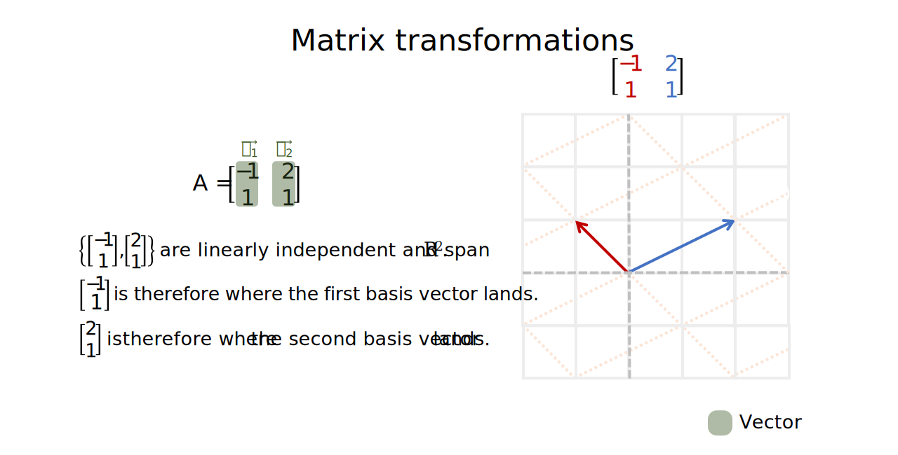

Introduction to matrices
================
Erika Duan
2022-08-15

-   [Matrices](#matrices)
-   [Matrix column space](#matrix-column-space)
-   [Matrix null space](#matrix-null-space)
-   [Resources](#resources)

# Matrices

A matrix with  rows and
 columns can be used to
hold the coefficients from a linear system
.
In other words, each vector

inside matrix  stores
information about where the basis vector for the i-th dimension lands.

# Matrix column space

For any

matrix A, the column space of A, denoted
, is therefore
the subspace of

spanned by the columns i.e. basis vectors

of matrix A.

If we represent
,
then
.

Therefore
.

# Matrix null space

For any

matrix A, the null space of A is the set
 of all
solutions to the homogeneous equation
.

Therefore
.

The null space of A is a subspace of

as the solution set of

can also be expressed in the parametric form

i.e. as

and

is a subspace in
.

**Note:** 
represents the span of all basis vectors of matrix A whereas
 represents
the set of all possible solutions to form matrix A when
.

# Resources

-   A great [YouTube
    series](https://www.youtube.com/watch?v=kYB8IZa5AuE&list=PLZHQObOWTQDPD3MizzM2xVFitgF8hE_ab&index=3)
    on matrices by 3Blue1Brown.
