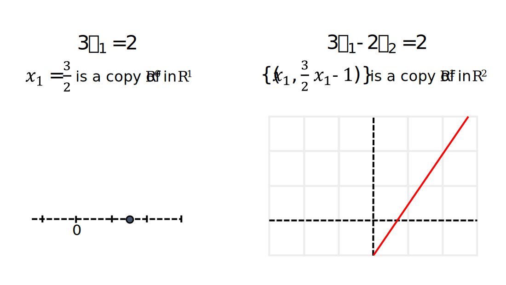

```{r setup, include=FALSE}
# Set up global environment configuration --------------------------------------
knitr::opts_chunk$set(echo=TRUE,
                      results='hide',
                      fig.show='hold',
                      fig.align='center',
                      message=FALSE,
                      warning=FALSE)

knitr::knit_engines$set(python = reticulate::eng_python)
```

```{r, echo=FALSE}
# Install R packages -----------------------------------------------------------
# The native pipe operator requires R version 4.1+ 
packages <- c("ggplot2",
              "dplyr")

installed_packages <- packages %in% rownames(installed.packages())

if (any(installed_packages == FALSE)) {
  install.packages(packages[!installed_packages])
}

# Attach R packages to the global environment
library("dplyr")
library("ggplot2")

# Check version of Python used by reticulate -----------------------------------
reticulate::py_config()
```


# Vectors    

```{r, echo=FALSE, results='markup', out.width="90%"}

```


# Resources  

+ A great [YouTube](https://www.youtube.com/watch?v=fNk_zzaMoSs) series on vectors.    
  