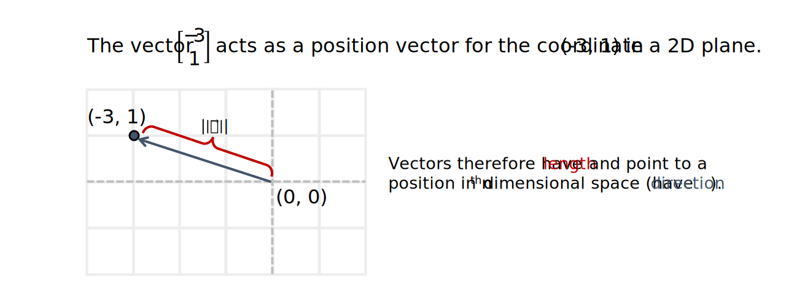
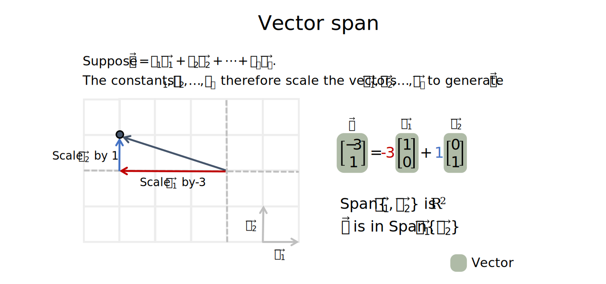

```{r setup, include=FALSE}
# Set up global environment configuration --------------------------------------
knitr::opts_chunk$set(echo=TRUE,
                      results='hide',
                      fig.show='hold',
                      fig.align='center',
                      message=FALSE,
                      warning=FALSE,
                      out.width='80%')

knitr::knit_engines$set(python = reticulate::eng_python)
```

```{r, echo=FALSE}
# Install R packages -----------------------------------------------------------
# The native pipe operator requires R version 4.1+ 
packages <- c("ggplot2",
              "dplyr")

installed_packages <- packages %in% rownames(installed.packages())

if (any(installed_packages == FALSE)) {
  install.packages(packages[!installed_packages])
}

# Attach R packages to the global environment
library("dplyr")
library("ggplot2")

# Check version of Python used by reticulate -----------------------------------
reticulate::py_config()
```


# Vectors   
Vectors are an important way to represent values as positions within n-th dimensional space. Vector operations and matrix-vector operations enable us to transform values in useful ways.    

A column vector $\vec u$ is an $m \times 1$ matrix where $\vec u \in \mathbb{R}^m$. Two vectors are equal if they have the same number of rows and their corresponding entries are equal.  

**Note:** Do not confuse the zero vector $\vec 0$ with the scalar value of 0 when writing vector operations.   

```{r, echo=FALSE, results='markup'}

```

Key vector operations are:  

+ Scalar multiplication - when a vector is scaled by a constant $c$ where $c \in \mathbb{R}$.   
+ Vector addition - when two vectors with the same dimensions are added to form a new vector i.e. $\vec u + \vec v = \vec w$. This is equivalent to creating a new position in n-th dimensional space.    
+ Vector multiplication - used to calculate how far apart two vectors are with respect to each other, by superimposing the position and length of one vector along the axis of the other.    


# Vector scalar multiplication   
Vector scalar multiplication is used to scale the length of a vector and can change its direction (i.e. vector direction can be reversed by multiplication with a negative constant).   

Vector scalar multiplication is denoted as $c\vec u$ where $c \in \mathbb{R}$.  

```{r, echo=FALSE, results='markup'}
knitr::include_graphics("../figures/linear_systems-vector_scalar_multiplication.svg")  
```

**Note:** The reverse of $\vec u$ is represented as $-\vec u$.   


# Vector addition   
Two vectors with the same dimensions can be added entry-wise. This produces a new vector with a new length and direction in $\mathbb{R}^m$.    

Vector addition is denoted as $\vec u + \vec v = \vec{(u+v)}$. Geometrically, in a 2D plane, vector addition corresponds to the 4th vertex of the parallelogram whose other vertices are $\vec 0, \vec u,$ and $\vec v$.        

```{r, echo=FALSE, results='markup'}
  
```

**Note:** Vector subtraction is equivalent to the addition of a vector scaled by -1 i.e. $\vec u - \vec v = \vec u + (-1)(\vec v)$.   


# Vector span  
Let vector $\vec b$ be the linear combination of $c_1\vec v_1 + c_2\vec v_2 + \cdots + c_p\vec v_p$. In other words, the constants $c_1, c_2, \cdots, c_p$ act as scalars of the base vectors $\vec v_1, \vec v_2, \cdots, \vec v_p$ to form $\vec b$. We can also describe this by stating that $\vec b$ is in $Span\{\vec v_1, \vec v_2, \cdots, \vec v_p\}$ or in the subspace of $\mathbb{R}^m$ generated by $\vec v_1, \vec v_2, \cdots, \vec v_p$.  

```{r, echo=FALSE, results='markup'}
  
```

We can therefore rewrite our linear system of equations $A\vec x = \vec b$ in the vector form $x_1\vec a_1 + x_2\vec a_2 + \cdots + x_n\vec a_n = \vec b$. This highlights that $\vec b$ can be generated by a linear combination of $\vec a_1, \vec a_2, \cdots, \vec a_n$ as long as a solution to the linear system exists.      

The set of linear combinations of $\vec a_1, \vec a_2, \cdots, \vec a_n$ which can generate $\vec b$ is called the subset of $\mathbb{R}^m$ generated or spanned by $\vec a_1, \vec a_2, \cdots, \vec a_n$. This is also written as $Span\{\vec a_1, \vec a_2, \cdots, \vec a_n\}$.   

Asking whether $\vec b$ is in $Span\{\vec a_1, \vec a_2, \cdots, \vec a_n\}$ is therefore equivalent to asking whether there is a consistent solution to the linear system $x_1\vec a_1 + x_2\vec a_2 + \cdots + x_n\vec a_n = \vec b$ and then solving for the vector coefficients $\vec x$ which scale $Span\{\vec a_1, \vec a_2, \cdots, \vec a_n\}$ to form $\vec b$.   

**Note:** For homogeneous linear systems, $\vec 0$ is always in $Span\{\vec a_1, \vec a_2, \cdots, \vec a_n\}$ as $x_1\vec a_1 + x_2\vec a_2 + \cdots + x_n\vec a_n = \vec 0$ when $x_1 = x_2 = \cdots = x_n = 0$.   


# Linear independence and vectors   
When a homogeneous linear system $x_1\vec a_1 + x_2\vec a_2 + \cdots + x_n\vec a_n = \vec 0$ only has a single trivial solution $x_1 = x_2 = \cdots = x_n$, we conclude that the vectors $\vec v_1, \vec v_2, \cdots, \vec v_n$ are linearly independent. The geometric intuition for this is that $\vec v_1, \vec v_2, \cdots, \vec v_n$ are not in the span of each other i.e. $\vec v_i$ is not formed from a linear combination of the other vectors. As a result, there is no scalar combination of one or more vectors which can sum back to $\vec 0$.      

When a homogeneous linear system has infinite solutions, we conclude that the vectors $\vec v_1, \vec v_2, \cdots, \vec v_n$ are linearly dependent. The geometric intuition for this is that a non-trivial linear combination of $x_1\vec v_1 + x_2\vec v_2 + \cdots + x_n\vec v_n$ exists which sums back to $\vec 0$.      

Another way to describe linear dependence is to consider any set of linearly independent vectors $\{\vec v_1, \vec v_2, \cdots, \vec v_n  | \vec v \in \mathbb{R}^m\}$. Let a new vector $\vec w \in \mathbb{R}^m$ be any vector that is not in the set of the linearly independent vectors. The set $\{\vec v_1, \vec v_2, \cdots, \vec v_n, \vec w\}$ is only linearly dependent if $\vec w \in Span\{\vec v_1, \vec v_2, \cdots, \vec v_n\}$.  

```{r, echo=FALSE, results='markup'}
knitr::include_graphics("../figures/linear_systems-linear_dependence_b.svg")  
```

**Note:** A set of two or more vectors $\{\vec v_1, \vec v_2, \cdots, \vec v_n\}$ is linearly independent if removing a vector decreases the span of the set. A set of linearly independent vectors can also be extended to form a larger set of linearly independent vectors if the new vector is not in the span of the original set.  

We can also use the properties of linear independence to prove that every matrix A only has one reduced echelon form. Matrix A, B and C are equivalent if a finite sequence of elementary row operations (EROs) exists which transforms A to B and A to C. Therefore, we can prove that a finite sequence of EROs also exist which transforms B to C and that B and C are row equivalent.  

If matrix B and C are row equivalent, their columns must satisfy the same linear dependence equations and B and C must contain the same number of pivot columns.  

```{r, echo=FALSE, results='markup'}
knitr::include_graphics("../figures/linear_systems-reduced_echelon_form_proof.svg")  
```

+ Pivot columns in a reduced echelon form matrix cannot be written as a linear combination of all pivot columns to its left.  
+ Non-pivot columns in a reduced echelon form matrix can be written using a unique linear combination of all pivot columns to its left.   

As the columns of B and C must satisfy the same linear dependence equations, the pivot columns of the reduced echelon form of B and C must be identical and the non-pivot columns of the reduced echelon form of B and C must also be identical. Therefore B and C have the same reduced echelon form.         


# Vector subspaces   
A vector subspace is simply a closed vector space that exists inside a larger closed vector space. For example, the span of vectors $\{\vec v_1, \vec v_2, \vec v_3\}$, represented as subset $H$, is a vector subspace inside $\mathbb{R}^n$ if the following properties are true:  

+ $Span(\vec v_1, \vec v_2, \vec v_3)$ contains the zero vector.    
+ If vectors $\vec v_1, \vec v_2$ are in the subspace, so is $\vec v_1 + \vec v_2$. This is also known as being closed under vector addition.  
+ If vector $\vec v_1$ is in the subspace, so is $c\vec v_1$ where $c \in \mathbb{R}$. This is also known as being closed under scalar multiplication.   

Any subspace of $\mathbb{R}^n$ is therefore also the span of a finite set of vectors $\{\vec v_1, \cdots, \vec v_p \}$.  

```{r, echo=FALSE, results='markup'}
knitr::include_graphics("../figures/linear_systems-vector_subspaces.svg")  
```


# Basis vectors  
We are interested in describing subspaces of $\mathbb{R}^{n}$ as the span of a set of vectors $\{\vec v_1, \cdots, \vec v_p \}$. Defining a vector subspace allows us to narrow the search space for an optimal solution to a linear system.     

For any vector $\vec w$ in $Span\{\vec v_1, \cdots, \vec v_p \}$, a unique list of scalars $c_1, \cdots, c_p$ exists such that $c_1 \vec v_1 + \cdots + c_p \vec v_p = \vec w$.   

A set of vectors are the **basis vectors** for a subspace H if:   

+ The set of vectors $\{\vec v_1, \cdots, \vec v_p \}$ are linearly independent and spans subspace H.   
+ The set of vectors $\{\vec v_1, \cdots, \vec v_p \}$ span subspace H.   
+ This means that the number of basis vectors for subspace H also determines the dimensions of subspace H.   

```{r, echo=FALSE, results='markup'}
knitr::include_graphics("../figures/linear_systems-basis_vectors.svg")   
```

Geometrically, we can think of basis vectors as the unit vectors of the coordinate grid of subspace H.  

```{r, echo=FALSE, results='markup'}
   
```

The set $\epsilon_n = \{\vec e_1, \vec e_2, \cdots, \vec e_n\}$ is called the standard basis for $\mathbb{R}^{n}$ where $\vec e_1 = \begin{bmatrix}1\\0\\\vdots\\0\end{bmatrix}$.     

As basis vectors are a set of linearly independent vectors, they are equivalent to the pivot columns of a coefficient matrix $A = \begin{bmatrix} \vec a_1 & \vec a_2 & \cdots & \vec a_n \end{bmatrix}$.   

If we reduce matrix A into its echelon form i.e. to matrix B, the position of the pivot columns in matrix B are equivalent to the position of pivot columns in matrix A and can be used to locate the basis vectors of matrix A.    

```{r, echo=FALSE, results='markup'}
   
```

**Note:** For a linearly dependent linear system with $m$ observations and $n$ unknown variables, the basis vectors correspond to columns in the coefficient matrix A that contain a pivot column. There the number of basis vectors for linearly dependent linear systems is less than $n$.  


# Coordinate systems  

Let $\mathcal{B} = \{\vec v_1, \cdots, \vec v_p \}$ be a basis for subspace H. This means that every vector $\vec w$ in subspace H can be formed from one unique linear combination of $\{\vec v_1, \cdots, \vec v_p \}$ i.e. $\vec w = c_1\vec v_1 + \cdots + c_p \vec v_p$.    

The unique list of scalars $\{c_1, \cdots, c_p\}$ therefore acts as the list of coordinates of $\vec w$ with respect to the set of basis vectors $\mathcal{B}$.  

```{r, echo=FALSE, results='markup'}
knitr::include_graphics("../figures/linear_systems-coordinates.svg")   
```

**Note:** The unique list of coordinates used to generate $\vec w$ with respect to $\mathcal{B}$ can be written as the coordinate vector $\begin{bmatrix}c_1\\\vdots\\c_p\end{bmatrix}_\mathcal{B}$.   

 
# Resources  
+ A great [YouTube series](https://www.youtube.com/watch?v=fNk_zzaMoSs) on vectors by 3Blue1Brown.    
+ A [YouTube series](https://www.youtube.com/watch?v=tM4TDL9Hj8U) on vectors by Professor Dave Explains.   