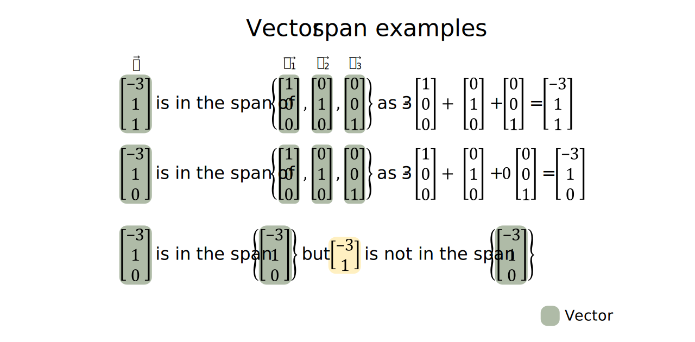
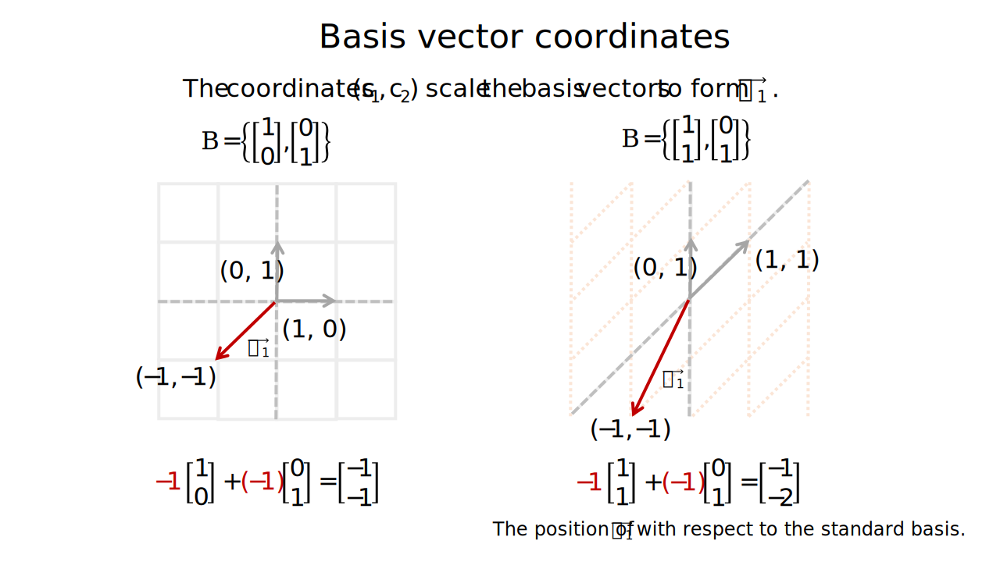

```{r setup, include=FALSE}
# Set up global environment configuration --------------------------------------
knitr::opts_chunk$set(echo=TRUE,
                      results='hide',
                      fig.show='hold',
                      fig.align='center',
                      message=FALSE,
                      warning=FALSE,
                      out.width='80%')

knitr::knit_engines$set(python = reticulate::eng_python)
```

```{r, echo=FALSE}
# Check version of Python used by reticulate -----------------------------------
reticulate::py_config()
```


# Vectors   

Vectors are an important way to represent values as positions in $\mathbb{R}^n$. Vector operations and matrix-vector operations enable us to transform vectors to find solutions to consistent linear systems.       

A column vector $\vec u$ is an $m \times 1$ matrix where $\vec u \in \mathbb{R}^m$. Two vectors are equal if they have the same number of rows and their corresponding entries are equal.  

**Note:** Do not confuse the zero vector $\vec 0$ with the scalar value of 0 when writing vector operations.   

```{r, echo=FALSE, results='markup'}
knitr::include_graphics("../figures/linear_systems-vectors.svg")
```

Key vector operations are:  

+ Scalar multiplication - when a vector is scaled by a constant $c$ where $c \in \mathbb{R}$.   
+ Vector addition - when two vectors with the same dimensions are added to form a new vector i.e. $\vec u + \vec v = \vec w$. This is equivalent to creating a new position in $\mathbb{R}^m$.    
+ Vector multiplication - used to calculate how far apart two vectors are with respect to each other, by superimposing the position and length of one vector along the axis of the other vector.    


# Vector scalar multiplication   

Vector scalar multiplication is used to scale the length of a vector and can change its direction (i.e. vector direction can be reversed by multiplication with a negative constant).   

Vector scalar multiplication is denoted as $c\vec u$ where $c \in \mathbb{R}$.  

```{r, echo=FALSE, results='markup'}
knitr::include_graphics("../figures/linear_systems-vector_scalar_multiplication.svg")  
```

**Note:** The reverse of $\vec u$ is represented as $-\vec u$.   


# Vector addition   

Two vectors with the same dimensions can be added entry-wise. This usually produces a new vector with a new length and direction in $\mathbb{R}^m$.    

Vector addition is denoted as $\vec u + \vec v = \vec{(u+v)}$. Geometrically, in a 2D plane, vector addition corresponds to the 4th vertex of the parallelogram whose other vertices are $\vec 0, \vec u,$ and $\vec v$.        

```{r, echo=FALSE, results='markup'}
knitr::include_graphics("../figures/linear_systems-vector_addition.svg")  
```

**Note:** Vector subtraction is equivalent to the addition of a vector scaled by -1 i.e. $\vec u - \vec v = \vec u + (-1)(\vec v)$.   


# Vector span   

Let vector $\vec b$ be formed by the linear combination of $c_1\vec v_1 + c_2\vec v_2 + \cdots + c_p\vec v_p$, where $\vec b$ also has the dimensions $m \times 1$. In other words, the constants $c_1, c_2, \cdots, c_p$ act as scalars of the base vectors $\vec v_1, \vec v_2, \cdots, \vec v_p$ to form $\vec b$.    

We can also describe this by stating that $\vec b$ is in $Span\{\vec v_1, \vec v_2, \cdots, \vec v_p\}$ or in the subspace of $\mathbb{R}^m$ generated by $\{\vec v_1, \vec v_2, \cdots, \vec v_p\}$.   

```{r, echo=FALSE, results='markup'}
knitr::include_graphics("../figures/linear_systems-vector_span.svg")  
```

We can therefore rewrite our linear system of equations $A\vec x = \vec b$ in the vector form $x_1\vec a_1 + x_2\vec a_2 + \cdots + x_n\vec a_n = \vec b$. This highlights that $\vec b$ can be generated by $Span\{\vec a_1, \vec a_2, \cdots, \vec a_n\}$ as long as a solution to the linear system exists.  

Asking whether $\vec b$ is in $Span\{\vec a_1, \vec a_2, \cdots, \vec a_n\}$ is therefore equivalent to asking whether there is a consistent solution to the linear system $A\vec x = \vec b$ and then solving for the coefficients vector $\vec x$ which scales $\{\vec a_1, \vec a_2, \cdots, \vec a_n\}$ to form $\vec b$.   

```{r, echo=FALSE, results='markup'}
   
```

**Note:** For homogeneous linear systems, $\vec 0$ is always in $Span\{\vec a_1, \vec a_2, \cdots, \vec a_n\}$ as $x_1 = x_2 = \cdots = x_n = 0$ for both the single trivial solution and for infinite solutions.    

**Note:** The set of vectors ${\vec v_1, \vec v_2, \cdots, \vec v_p}$ which span $\vec b$ do not need to be linearly independent. If the number of vectors exceeds the number of linear equations i.e. $p>m$ and there are more columns than rows in the augmented matrix form of $A\vec cx = \vec b$, the set of vectors are always linearly dependent.    


# Linear independence versus linear dependence    

When a homogeneous linear system $x_1\vec a_1 + x_2\vec a_2 + \cdots + x_n\vec a_n = \vec 0$ only has a single trivial solution $x_1 = x_2 = \cdots = x_n = 0$, we conclude that the vectors $\vec v_1, \vec v_2, \cdots, \vec v_n$ are linearly independent. The geometric intuition for this is that $\vec v_1, \vec v_2, \cdots, \vec v_n$ are not in the span of each other i.e. $\vec v_i$ is not formed from a linear combination of the other vectors. As a result, there is no scalar combination of one or more vectors which can sum back to $\vec 0$.      

When a homogeneous linear system has infinite solutions, we conclude that the vectors $\vec v_1, \vec v_2, \cdots, \vec v_n$ are linearly dependent. The geometric intuition for this is that multiple non-trivial linear combinations of $x_1\vec v_1 + x_2\vec v_2 + \cdots + x_n\vec v_n$ exist which sum to $\vec 0$.      

Another way to describe linear dependence is to consider any set of linearly independent vectors $\{\vec v_1, \vec v_2, \cdots, \vec v_p  | \vec v \in \mathbb{R}^m\}$. Let a new vector $\vec w \in \mathbb{R}^m$ be any vector that is not in the set of the linearly independent vectors. The set $\{\vec v_1, \vec v_2, \cdots, \vec v_p, \vec w\}$ is only linearly dependent if $\vec w \in Span\{\vec v_1, \vec v_2, \cdots, \vec v_p\}$.   

```{r, echo=FALSE, results='markup'}
knitr::include_graphics("../figures/linear_systems-linear_dependence_b.svg")  
```

We can also use the properties of linear independence to prove that every matrix A only has one reduced echelon form. Matrix A, B and C are equivalent if a finite sequence of elementary row operations (EROs) exists which transforms A to B and A to C. As EROs are reversible, a finite sequence of EROs exists which transforms B to C and B and C are therefore row equivalent.  

If matrix B and C are row equivalent, their columns must be in the same span and satisfy the same linear dependence equations. Therefore B and C must contain the same number of pivot columns and non-pivot columns.    

```{r, echo=FALSE, results='markup'}
  
```

This is because:  

+ Any pivot columns in a reduced echelon form matrix cannot be written as a linear combination of all pivot columns to its left.  
+ Any non-pivot columns in a reduced echelon form matrix can be written using a unique linear combination of all pivot columns to its left.   

Therefore, B and C must have the same reduced echelon form.     

**Note:** A set of three linearly independent vectors with dimensions $3 \times 1$ will span 3D space. A set of two linearly independent vectors with dimensions $3 \times 1$ will span a 2D plane in 3D. A single vector with dimensions $3 \times 1$ will span a 1D line in 3D.  

**Note:** A set of two or more vectors $\{\vec v_1, \cdots, \vec v_n\}$ is therefore linearly independent if removing a vector decreases the span of the vector set. A set of linearly independent vectors can also be extended to form a larger set of linearly independent vectors if the new vector is not in the span of the original set.   


# Vector subspaces   

A vector subspace is simply a closed vector space that exists inside $\mathbb{R}^m$. For example, take the set of vectors $\{\vec v_1, \vec v_2, \vec v_3\}$, where each vector has dimensions $m \times 1$. 

$Span\{\vec v_1, \vec v_2, \vec v_3\}$ is a 3D vector subspace, denoted as subspace H where $H \in \mathbb{R}^m$, if the following properties are true:  

+ $Span(\vec v_1, \vec v_2, \vec v_3)$ contains the zero vector $\vec 0$.     
+ If vectors $\vec u_1, \vec u_2$ are in subspace H, so is $\vec u_1 + \vec u_2$. This is also known as being closed under vector addition.  
+ If vector $\vec u_1$ is in the subspace, so is $c \vec u_1$ where $c \in \mathbb{R}$. This is also known as being closed under scalar multiplication.   

Therefore, any subspace in $\mathbb{R}^m$ is also the span of a finite set of vectors $\{\vec v_1, \cdots, \vec v_p \}$, where $\{\vec v_1, \cdots, \vec v_p \}$ can be a set of either linearly dependent or linearly independent column vectors with dimensions $m \times 1$.        

```{r, echo=FALSE, results='markup'}
knitr::include_graphics("../figures/linear_systems-vector_subspaces.svg")  
```

```{r, echo=FALSE, results='markup'}
  
```


# Basis vectors  

We can describe a subspace of $\mathbb{R}^{n}$ as the span of a set of vectors $\{\vec v_1, \cdots, \vec v_p \}$. Defining a vector subspace allows us to define the search space for an optimal solution to a linear system.   

For any vector $\vec w$ in $Span\{\vec v_1, \cdots, \vec v_p \}$, a unique list of scalars $c_1, \cdots, c_p$ exists such that $c_1 \vec v_1 + \cdots + c_p \vec v_p = \vec w$.   

A set of vectors are the **basis vectors** or **a basis** for subspace H if:    

+ The set of vectors $\{\vec v_1, \cdots, \vec v_p \}$ are linearly independent.     
+ The $Span\{\vec v_1, \cdots, \vec v_p \}$ forms subspace H i.e. $\{\vec v_1, \cdots, \vec v_p \} \in \mathbb{R^m}$ and $H \in \mathbb{R^m}$.    
+ This means that the number of basis vectors for subspace H determines the dimensions of subspace H itself.       

```{r, echo=FALSE, results='markup'}
knitr::include_graphics("../figures/linear_systems-basis_vectors.svg")   
```

Geometrically, we can think of basis vectors as the unit vectors of the coordinate grid of subspace H.  

```{r, echo=FALSE, results='markup'}
knitr::include_graphics("../figures/linear_systems-basis_vector_examples.svg")   
```

The set $\epsilon_n = \{\vec e_1, \vec e_2, \cdots, \vec e_n\}$ is called the standard basis for $\mathbb{R}^{n}$ where $\vec e_1 = \begin{bmatrix}1&0&\cdots&0\end{bmatrix}^T$ with dimensions $n \times 1$.    

As basis vectors are a set of linearly independent vectors, they are equivalent to the pivot columns of a coefficient matrix $A = \begin{bmatrix} \vec a_1 & \vec a_2 & \cdots & \vec a_n \end{bmatrix}$.   

If we reduce matrix A into its echelon form i.e. to matrix B, the position of the pivot columns in matrix B are equivalent to the position of pivot columns in matrix A and can be used to locate the basis vectors in matrix A.    

```{r, echo=FALSE, results='markup'}
knitr::include_graphics("../figures/linear_systems-locating_basis_vectors.svg")   
```

**Note:** If $\{\vec v_1, \cdots, \vec v_p \}$ span subspace H, $\{\vec v_1, \cdots, \vec v_p \}$ can be either linearly independent or linearly dependent. However, if ${\vec v_1, \cdots, \vec v_p \}$ are basis vectors (or are a basis) for subspace H, then ${\vec v_1, \cdots, \vec v_p \}$ must be linearly independent.   

**Note:** For a linearly dependent set of vectors, the number of basis vectors corresponds to the number of columns in the coefficient matrix A that contain a pivot column. Therefore for a linearly dependent set of vectors, the number of basis vectors is always less than the number of column vectors in A.     


# Coordinate systems  

Let $\mathcal{B} = \{\vec v_1, \cdots, \vec v_p \}$ be a basis for subspace H. This means that every vector $\vec w$ in subspace H can be formed from one unique linear combination of $\{\vec v_1, \cdots, \vec v_p \}$ i.e. $\vec w = c_1\vec v_1 + \cdots + c_p \vec v_p$.    

The unique list of scalars $\{c_1, \cdots, c_p\}$ therefore acts as the list of coordinates of $\vec w$ with respect to the basis vectors $\mathcal{B}$.  

```{r, echo=FALSE, results='markup'}
   
```

**Note:** The unique list of coordinates used to generate $\vec w$ with respect to $\mathcal{B}$ can be written as the coordinate vector $\begin{bmatrix}c_1\\\vdots\\c_p\end{bmatrix}_\mathcal{B}$.   

 
# Resources   

+ A great [YouTube series](https://www.youtube.com/watch?v=fNk_zzaMoSs) on vectors by 3Blue1Brown.    
+ A [YouTube series](https://www.youtube.com/watch?v=tM4TDL9Hj8U) on vectors by Professor Dave Explains.   