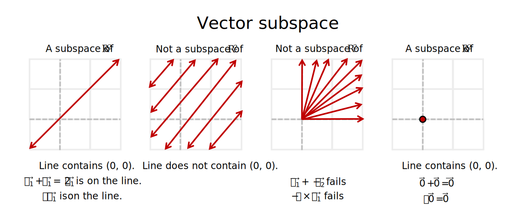
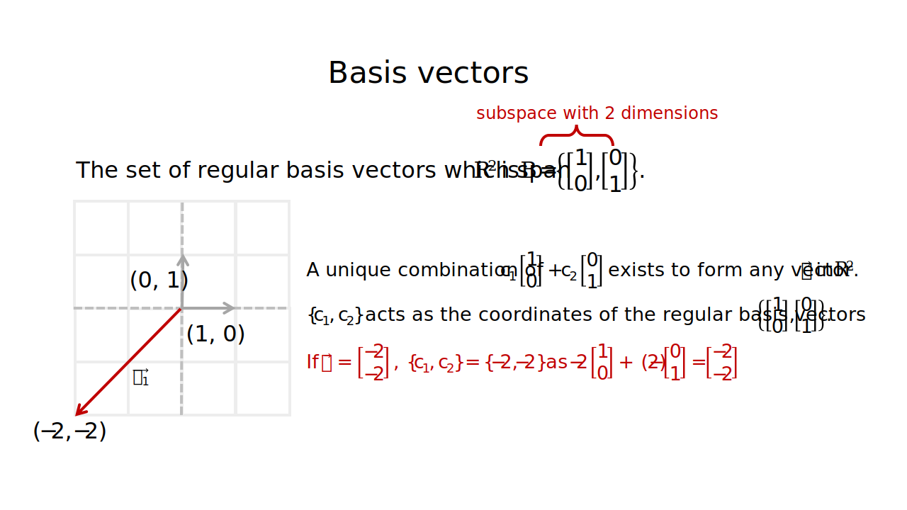

Introduction to vectors
================
Erika Duan
2022-08-28

-   [Vectors](#vectors)
-   [Vector scalar multiplication](#vector-scalar-multiplication)
-   [Vector addition](#vector-addition)
-   [Vector span](#vector-span)
-   [Linear independence versus linear
    dependence](#linear-independence-versus-linear-dependence)
-   [Vector subspaces](#vector-subspaces)
-   [Basis vectors](#basis-vectors)
-   [Coordinate systems](#coordinate-systems)
-   [Resources](#resources)

# Vectors

Vectors are an important way to represent values as positions in
.
Vector operations and matrix-vector operations enable us to transform
values in useful ways.

A column vector
 is
an

matrix where
.
Two vectors are equal if they have the same number of rows and their
corresponding entries are equal.

**Note:** Do not confuse the zero vector

with the scalar value of 0 when writing vector operations.

Key vector operations are:

-   Scalar multiplication - when a vector is scaled by a constant
     where
    .  
-   Vector addition - when two vectors with the same dimensions are
    added to form a new vector
    i.e. .
    This is equivalent to creating a new position in
    .  
-   Vector multiplication - used to calculate how far apart two vectors
    are with respect to each other, by superimposing the position and
    length of one vector along the axis of the other.

# Vector scalar multiplication

Vector scalar multiplication is used to scale the length of a vector and
can change its direction (i.e. vector direction can be reversed by
multiplication with a negative constant).

Vector scalar multiplication is denoted as

where
.

**Note:** The reverse of
 is
represented as
.

# Vector addition

Two vectors with the same dimensions can be added entry-wise. This
produces a new vector with a new length and direction in
.

Vector addition is denoted as
}").
Geometrically, in a 2D plane, vector addition corresponds to the 4th
vertex of the parallelogram whose other vertices are

and
.

**Note:** Vector subtraction is equivalent to the addition of a vector
scaled by -1
i.e. (\vec v)").

# Vector span

Let vector
 be
the linear combination of
,
where

has the dimensions
.
In other words, the constants

act as scalars of the base vectors

to form
.

We can also describe this by stating that
 is
in

or in the subspace of

generated by
.

We can therefore rewrite our linear system of equations

in the vector form
.
This highlights that

can be generated by a linear combination of

as long as a solution to the linear system exists.

The set of linear combinations of

is called the subset of

generated or spanned by
.
This is also written as
.

Asking whether
 is
in

is therefore equivalent to asking whether there is a consistent solution
to the linear system

and then solving for the coefficients vector

which scales

to form
.

**Note:** For homogeneous linear systems,
 is
always in

as

for both the single trivial solution and for infinite solutions.

# Linear independence versus linear dependence

When a homogeneous linear system

only has a single trivial solution
,
we conclude that the vectors

are linearly independent. The geometric intuition for this is that

are not in the span of each other
i.e. 
is not formed from a linear combination of the other vectors. As a
result, there is no scalar combination of one or more vectors which can
sum back to
.

When a homogeneous linear system has infinite solutions, we conclude
that the vectors

are linearly dependent. The geometric intuition for this is that a
non-trivial linear combination of

exists which sums back to
.

Another way to describe linear dependence is to consider any set of
linearly independent vectors
.
Let a new vector

be any vector that is not in the set of the linearly independent
vectors. The set

is only linearly dependent if
.

We can also use the properties of linear independence to prove that
every matrix A only has one reduced echelon form. Matrix A, B and C are
equivalent if a finite sequence of elementary row operations (EROs)
exists which transforms A to B and A to C. Therefore, we can prove that
a finite sequence of EROs also exist which transforms B to C and that B
and C are row equivalent.

If matrix B and C are row equivalent, their columns must be in the same
span and satisfy the same linear dependence equations. Therefore B and C
must contain the same number of pivot columns.

-   Any pivot columns in a reduced echelon form matrix cannot be written
    as a linear combination of all pivot columns to its left.  
-   Any non-pivot columns in a reduced echelon form matrix can be
    written using a unique linear combination of all pivot columns to
    its left.

As the columns of B and C must satisfy the same linear dependence
equations, the pivot columns of the reduced echelon form of B and C must
be identical and the non-pivot columns of the reduced echelon form of B
and C must also be identical. Therefore B and C have the same reduced
echelon form.

**Note:** A set of three linearly independent vectors with dimensions

will span 3D space. A set of two linearly independent vectors with
dimensions

will span a 2D plane in 3D. A single vector with dimensions

will span a 1D line in 3D.

**Note:** Therefore, a set of two or more vectors

is linearly independent if removing a vector decreases the span of the
vector set. A set of linearly independent vectors can also be extended
to form a larger set of linearly independent vectors if the new vector
is not in the span of the original set.

# Vector subspaces

A vector subspace is simply a closed vector space that exists inside a
larger closed vector space. For example, the span of vectors
,
represented as subset ,
is only a vector subspace inside

if the following properties are true:

-   The vectors
    
    each have dimensions
    .  
-   ")
    contains the zero vector
    .  
-   If vectors
    
    are in the subspace, so is
    .
    This is also known as being closed under vector addition.  
-   If vector
    
    is in the subspace, so is
    
    where
    .
    This is also known as being closed under scalar multiplication.

As a result, any subspace of

is also the span of a finite set of vectors
.

# Basis vectors

We can describe a subspace of

as the span of a set of vectors
.
Defining a vector subspace allows us to define the search space for an
optimal solution to a linear system.

For any vector
 in
,
a unique list of scalars

exists such that
.

A set of vectors are the **basis vectors** or **a basis** for subspace H
if:

-   The set of vectors
    
    are linearly independent.  
-   The set of vectors
    
    span subspace H.  
-   This means that the number of basis vectors for subspace H
    determines the dimensions of subspace H itself.

Geometrically, we can think of basis vectors as the unit vectors of the
coordinate grid of subspace H.

The set

is called the standard basis for

where
.

As basis vectors are a set of linearly independent vectors, they are
equivalent to the pivot columns of a coefficient matrix
.

If we reduce matrix A into its echelon form i.e. to matrix B, the
position of the pivot columns in matrix B are equivalent to the position
of pivot columns in matrix A and can be used to locate the basis vectors
in matrix A.

**Note:** If

span subspace H,

can be either linearly independent or linearly dependent. However, if

are basis vectors (or are a basis) for subspace H, then

must be linearly independent.

**Note:** For a linearly dependent set of vectors, the number of basis
vectors corresponds to the number of columns in the coefficient matrix A
that contain a pivot column. Therefore for a linearly dependent set of
vectors, the number of basis vectors is always less than the number of
column vectors in A.

# Coordinate systems

Let

be a basis for subspace H. This means that every vector
 in
subspace H can be formed from one unique linear combination of

i.e. .

The unique list of scalars

therefore acts as the list of coordinates of

with respect to the basis vectors
.

**Note:** The unique list of coordinates used to generate

with respect to

can be written as the coordinate vector
.

# Resources

-   A great [YouTube
    series](https://www.youtube.com/watch?v=fNk_zzaMoSs) on vectors by
    3Blue1Brown.  
-   A [YouTube series](https://www.youtube.com/watch?v=tM4TDL9Hj8U) on
    vectors by Professor Dave Explains.
