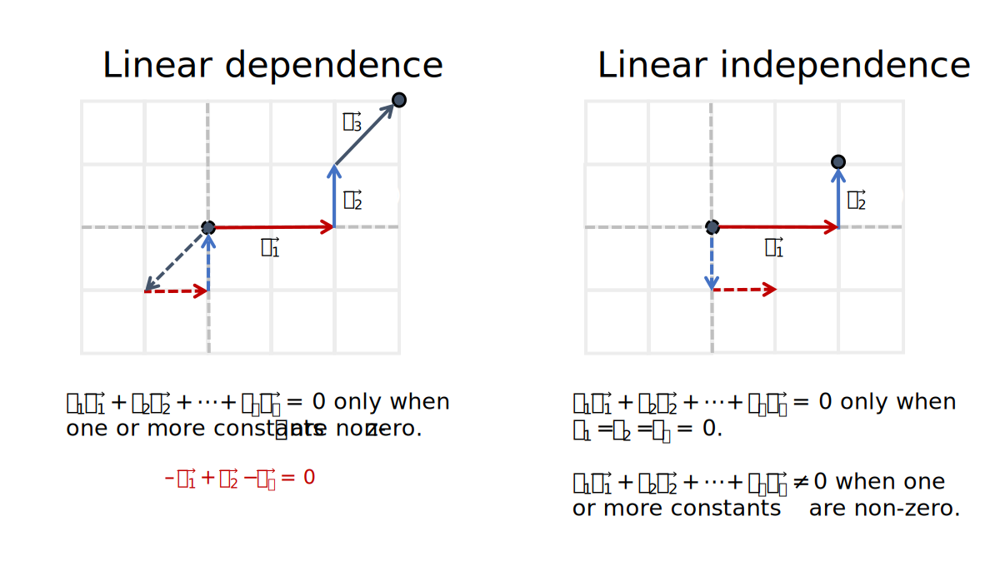

Introduction to vectors
================
Erika Duan
2022-08-09

-   [Vectors](#vectors)
-   [Vector scalar multiplication](#vector-scalar-multiplication)
-   [Vector addition](#vector-addition)
-   [Vector span](#vector-span)
-   [Linear independence and vectors](#linear-independence-and-vectors)
-   [Vector subspaces](#vector-subspaces)
-   [Basis vectors](#basis-vectors)
-   [Resources](#resources)

# Vectors

Vectors are an important form used to convey object position in
dimensional space and vector operations enable us to transform vectors
in useful ways.

A column vector
 is
an

matrix where
.
Two vectors are equal if they have the same number of rows and their
corresponding entries are equal.

**Note:** Do not confuse the zero vector

with the scalar 0 when performing vector operations.

Key vector operations are:

-   Scalar multiplication - when a vector is scaled by a constant
     where
    .  
-   Vector addition - when two vectors of the same dimensions are added
    to form a new vector (with a new length and direction).  
-   Vector multiplication - used to calculate how far apart two vectors
    are with respect to each other, by superimposing one vector along
    the axis of the other.

# Vector scalar multiplication

Vector scalar multiplication is used to scale the length of the vector
and to change its direction (i.e. vector direction can be reversed by
multiplication with a negative constant).

Vector scalar multiplication is denoted as

where
.

**Note:** The reverse of
 is
denoted as
.

# Vector addition

Two vectors of the same dimensions can be added entry-wise. This
produces a new vector with a new length and direction in dimensional
space.

Vector addition is denoted as
}").
Geometrically, in 2D space, vector addition corresponds to the 4th
vertex of the parallelogram whose other vertices are

and
.

**Note:** Vector subtraction is equivalent to the addition of a vector
scaled by -1
i.e. (\vec v)").

# Vector span

Let vector
 be
the linear combination of
.
In other words, the constants

act as scalars of the basis vectors

to form
.
We can also describe this by stating that
 is
in

or in the subspace of

generated by
.

We can therefore rewrite our linear system of equations in the vector
form
.
This highlights that

can be generated by a linear combination of
,
as long as a consistent solution to the linear equation exists.

The set of linear combinations of

which can generate
 is
called the subset of

spanned by
.
This is also written as

and represents either a single solution or infinite possible solutions.

Asking whether
 is
in

is therefore equivalent to asking whether there is a consistent solution
(including trivial solution) to the linear system
.

**Note:** When a linear solution for a homogeneous linear system exists,
 is
also in

as

when
.

# Linear independence and vectors

When a homogeneous linear system only has a single trivial solution, we
conclude that the vectors

are linearly independent. The geometric intuition for this is that

are not in the span of each other
i.e. 
is not formed from a linear combination of the other vectors.

When a homogeneous linear system has infinite solutions, we conclude
that the vectors

are linearly dependent. The geometric intuition for this is that a
linear combination of

exists which sums to

when one or more constants are non-zero.

Another way to describe linear dependence is to consider any set of
linearly independent vectors
.
Let a new vector

be any vector that is not in the set of the linearly independent
vectors. The set

is only linearly dependent if
.

**Note:** A set of two or more vectors

is linearly independent if removing a vector decreases the span of the
set. A set of linearly independent vectors can be extended to form a
larger set of linearly independent vectors if the new vector is not in
the span of the original set.

# Vector subspaces

A vector subspace is simply a closed vector space that exists inside a
larger vector space. For example, the set of vectors
,
represented as subset ,
is a vector subspace inside

if the following properties are true:

-   ")
    contains the zero vector.  
-   If vectors
    
    are in the subspace, so is
    .
    This is also known as being closed under vector addition.  
-   If vector
    
    is in the subspace, so is
    
    where
    .
    This is also known as being closed under scalar multiplication.

# Basis vectors

# Resources

-   A great [YouTube
    series](https://www.youtube.com/watch?v=fNk_zzaMoSs) on vectors by
    3Blue1Brown.  
-   A [YouTube series](https://www.youtube.com/watch?v=tM4TDL9Hj8U) on
    vectors by Professor Dave Explains.
