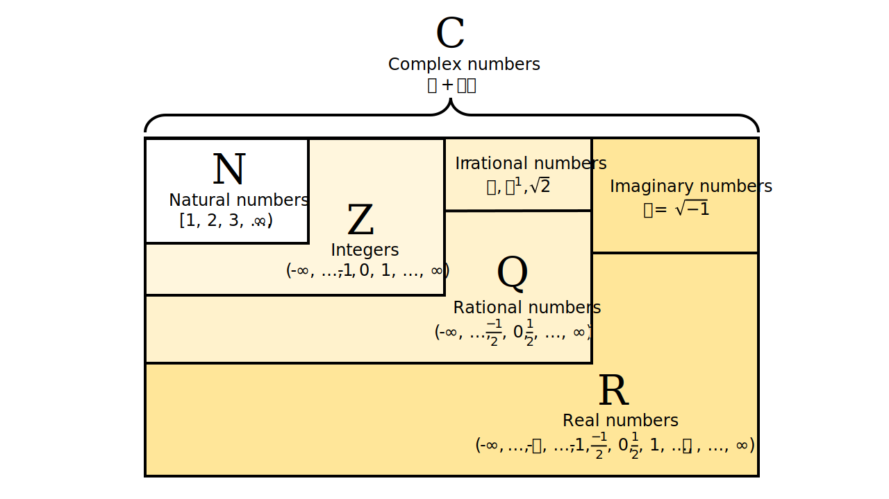
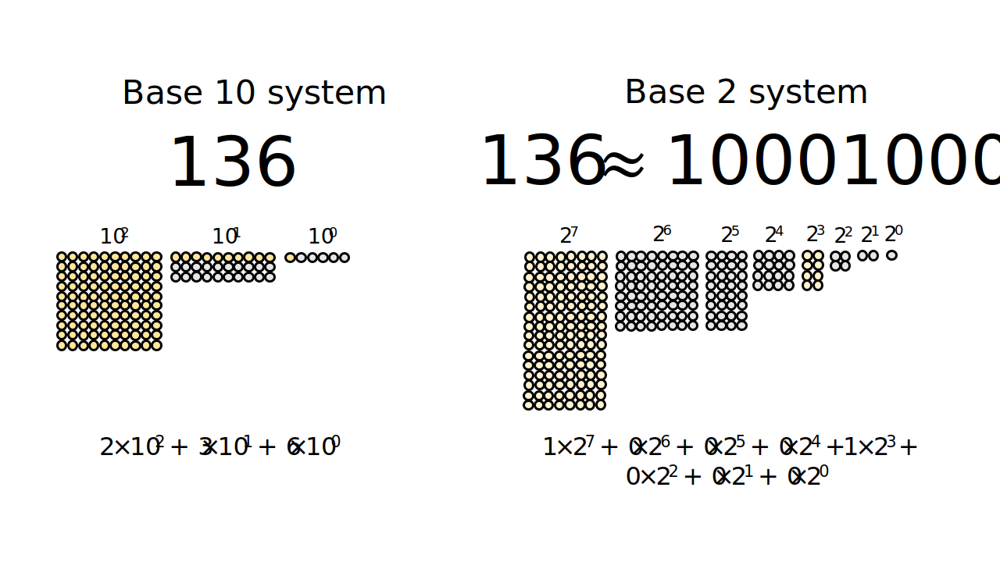

Introduction to numbers
================
Erika Duan
2/26/23

-   <a href="#numbers" id="toc-numbers">Numbers</a>
-   <a href="#natural-numbers" id="toc-natural-numbers">Natural numbers</a>
-   <a href="#integers" id="toc-integers">Integers</a>
-   <a href="#real-numbers" id="toc-real-numbers">Real numbers</a>
-   <a href="#complex-numbers" id="toc-complex-numbers">Complex numbers</a>
-   <a href="#resources" id="toc-resources">Resources</a>

<div>

> **Summary**
>
> This tutorial describes the properties of number classes. Number class
> annotation, such as
> ,
> is commonly used in mathematical formulas to describe the properties
> of functions.
>
> This tutorial also introduces the concept of the binary number system
> and illustrates how it differs to the decimal (counting) number
> system. The binary number system is used by modern computer
> applications, which describes applications as being either 32-bit or
> 64-bit.

</div>

# Numbers

Numbers are used to:

-   Count objects. *For example, I have 10 tutorials to read.*
-   Describe object behaviour. *For example, the area of a unit circle
    is*
    
    where
    .
-   Solve problems, often by introducing simple assumptions. *For
    example, if 5 bees can pollinate a*
    
    field in 10 minutes, how many bees are required to pollinate a 350
     field?
    Assume that pollination efficiency scales perfectly and is not
    impacted by land shape.
-   Represent complex abstractions. *For example, how can individual
    words be represented in an n-dimensional feature space?*

Numbers can be classified into different categories according to their
properties. A number can belong to multiple categories. For example, the
number 2 is a **count** (a natural number) and a **whole number** (an
integer), and can be represented as a **fraction**
i.e. 
(a rational number) and a **complex number**
i.e. .

Number classifications have an elegant hierarchical property:

-   All natural numbers are integers.
-   All integers are rational numbers
    i.e. .
-   All rational numbers are complex numbers
    i.e. .



# Natural numbers

Natural numbers
()
are whole positive numbers. They are most commonly used for describing
the dimensions of mathematical space (also known as a [feature
space](https://stats.stackexchange.com/questions/46425/what-is-feature-space)).
For example, the Cartesian plane is an example of an

feature space.

An extension of natural numbers is the need to partition them into
consistent bundles, to represent and count very large natural numbers.
For example, the **base 10** or **decimal** system represents 136 as
 + (3\times 10^1) + (6\times 10^0)")
whereas the **base 2** or **binary** system represents 136 as
 + (0\times 2^6) + (0\times 2^5) + (0\times 2^4) + (1\times 2^3) + (0\times 2^2) + (0\times 2^1) + (0\times 2^0)").



The binary number system is a more cumbersome representation, but its
binary expression range (as a series of logic gates outputting 0s or 1s)
underlies its adoption by computer-based systems.

# Integers

Integers
()
are whole numbers that can be either positive or negative.

<div class="panel-tabset">

## R

In R, we assign a whole number as an `integer` type by either denoting
an `L` after the number or using `as.integer()`. If we assign a whole
number without `L`, R assigns the number as a `double` type instead.
Both `integer` and `double` data types belong to the `numeric` class.

``` r
# Check integer type in R ------------------------------------------------------
# Be careful of the difference between class() and typeof()
# https://adv-r.hadley.nz/base-types.html 

typeof(3L)
#> [1] "integer"

typeof(3)
#> [1] "double" 

class(3L)
#> [1] "integer" 

class(3)
#> [1] "numeric"   
```

## Python

In Python, we assign a whole number as an `integer` type by default.
There is no limit on how long an integer can be in Python.

``` python
# Check integer type in Python -------------------------------------------------
type(3)
#> <class 'int'>  
```

## Julia

In Julia, [multiple integer types
exist](https://docs.julialang.org/en/v1/manual/integers-and-floating-point-numbers/)
and the default type is `Int64` or `Int32` depending on whether your
computer system has a 64-bit or 32-bit architecture.

``` julia
# Check integer type in Julia --------------------------------------------------
typeof(3)
#> Int64  

# Check minimum and maximum possible integers
(typemin(Int8), typemax(Int8))
#> (-128, 127)  

(typemin(Int64), typemax(Int64))
#> (-9223372036854775808, 9223372036854775807)  
```

</div>

# Real numbers

A real number
()
represents any number along the 1D number line, including values such as
recurring decimals
i.e. ,
the natural exponent 
and . This is
why the domain and co-domain of functions like

is defined as
.
We will further explore concepts like domain and co-domain in [another
tutorial](./tutorials/functions-introduction.md).

<div class="panel-tabset">

## R

In R, we assign decimals as a `double` type. Both `integer` and `double`
data types belong to the `numeric` class and we can convert integers to
doubles, but should avoid doing so the other way around.

[To quote from the R
FAQ](https://cran.r-project.org/doc/FAQ/R-FAQ.html#Why-doesn_0027t-R-think-these-numbers-are-equal_003f),
only integers and fractions whose denominator is a power of 2 are
represented accurately. All other numbers are internally rounded to \~53
binary digits accuracy.

``` r
# Check double type in R -------------------------------------------------------
typeof(3.0)
#> [1] "double"   

typeof(1.23e2)
#> [1] "double"   

as.double(3L)
#> [1] 3 

# Do not cast doubles into integers as decimal numbers are floored not rounded   
c(as.integer(3.4), as.integer(3.8))
#> [1] 3 3

# R rounds reoccurring decimals   
c(1/3, 10/3) 
#> [1] 0.3333333 3.3333333  
```

## Python

In Python, we assign decimals as a float (or floating point number)
type. Similar to R, we can convert integers to floats, but should avoid
doing so the other way around. [As most decimal fractions cannot be
represented precisely by binary
fractions](https://docs.python.org/3/tutorial/floatingpoint.html), the
binary floats stored in Python also only approximate our input decimal
floats.

``` python
# Check float type in Python ---------------------------------------------------
type(3.0)
#> <class 'float'>  

float(3)
#> 3.0

# Do not cast doubles into integers as decimal numbers are floored not rounded  

(int(3.4), int(3.8))
#> (3, 3)  

# Python also rounds reoccurring decimals  

(1/3, 10/3)
#> (0.3333333333333333, 3.3333333333333335)    
```

## Julia

In Julia, we also assign decimals as a float type, with the distinctions
that Julia has `Float16`, `Float32` and `Float62` types. Although Julia
is considered to be a [dynamically typed
language](https://stackoverflow.com/questions/28078089/is-julia-dynamically-typed),
it is stricter than R and Python in that conversion of floats to
integers is not permitted.

``` julia
# Check float type in Julia ----------------------------------------------------
typeof(3.0)
#> Float64    

typeof(1.23e2)
#> Float64   

convert(Float64, 3)
#> 3.0  

# Julia does not permit conversion of a float type into an integer type  
# convert(Int64, 3.2) produces an inexact error  
```

</div>

# Complex numbers

Complex numbers
(;
) are
represented by two components which cannot be further simplified:

-   The term  represents
    a real number.
-   The term 
    represents the product of a real number and an imaginary number,
    where
    .

Because the terms  and
 occupy completely
different number plans (a real plane versus an imaginary plane), we can
think of the combination of
 as the sum
of two vectors in 2D space. This 2D space is different to the Cartesian
plane as its basis vectors are
, (0, i)\}").

There is therefore duality between complex number addition and scalar
multiplication and vector addition and scalar multiplication.


<div class="panel-tabset">

## R

In R, complex numbers are automatically defined by the presence of the
 imaginary term and
assigned as a complex type.

``` r
# Create complex numbers in R --------------------------------------------------
typeof(2 + 4i)
#> [1] "complex"     

as.complex(3)
#> [1] 3+0i     

(1 + 2i) + (1 - 1i)
#> [1] 2+1i  

# sqrt() works on complex numbers but not negative integers  

sqrt(-1)
#> Warning: NaNs produced
#> [1] NaN   

sqrt(-1+0i)
#> [1] 0+1i    
```

## Python

In Python, complex numbers are created using `complex(a, b)` with the
real term accessed via the `.real` method and the imaginary term
accessed via `.imag` method. Complex numbers are also assigned as a
complex type.

``` python
# Create complex numbers in Python ---------------------------------------------
import cmath
import numpy as np

c = complex(-1, 0)   

type(c)
#> <class 'complex'>  

(c.real, c.imag)
#> (-1.0, 0.0) 

c**2 
#> (1-0j)

# np.sqrt() works on complex numbers but not negative integers  

np.sqrt(-1)
#> Runtime Warning: invalid value encountered in sqrt
#> nan

np.sqrt(c)
#> 1j  
```

## Julia

In Julia, complex numbers are automatically defined by the presence of
the  imaginary term,
with `i` denoted by `im` in Julia.

``` julia
# Create complex numbers in Julia ----------------------------------------------
typeof(0 + 1im)
#> Complex{Int64}  

(0 + 1im)^2
#> -1 + 0im  

# sqrt(-1)
# sqrt(-1) produces a domain error   

sqrt(-1 + 0im)
#> 0.0 + 1.0im   
```

</div>

# Resources

-   The [Wikipedia
    article](https://en.wikipedia.org/wiki/Number#Main_classification)
    on the number system.  
-   The [Numberphile YouTube
    video](https://www.youtube.com/watch?v=NHZt8eBKcRA) on numbers.  
-   Introduction to number systems and binary numbers from [Khan
    Academy](https://www.youtube.com/watch?v=ku4KOFQ-bB4).  
-   Introduction to rational and irrational numbers from [Khan
    Academy](https://www.youtube.com/watch?v=cLP7INqs3JM).
