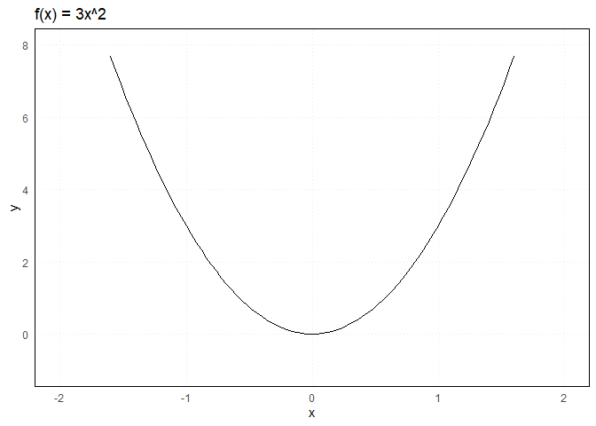
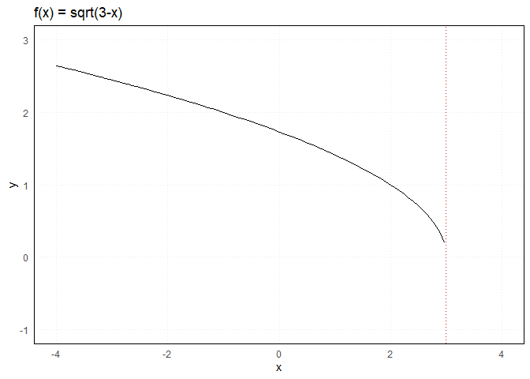

Introduction to numbers
================
Erika Duan
2022-07-31

-   [Numbers](#numbers)
-   [Natural numbers](#natural-numbers)
-   [Real numbers](#real-numbers)
-   [Complex numbers](#complex-numbers)
-   [Resources](#resources)

# Numbers

Numbers are used to:  
+ Count objects. For example, I have 1 :apple:.  
+ Describe object behaviour. For example, the area of a :white_circle:
is
.  
+ Solve problems, often by introducing simple assumptions. For example,
if 5 :bee: can pollinate a 100
 field in 10
minutes, how many :bee: are required to pollinate a 350
 field? Assume
that pollination efficiency scales perfectly and is not impacted by land
shape.  
+ Represent complex abstractions. For example, how can individual words
be represented in an n-dimensional feature space?

Numbers can be classified into different categories according to their
properties. A number can belong to multiple categories. For example, the
number 2 is a count (a natural number) and a whole number (an integer),
and can also be represented as a fraction
i.e. 
(a rational number) and a complex number
i.e. .

Number classifications have an elegant hierarchical property. All
natural numbers are integers. All integers are rational numbers
i.e. .
All rational numbers are complex numbers
i.e. .


**Question:** Can you think of different ways to classify the number 2
compared to the number
?

# Natural numbers

Natural numbers
()
are useful for describing the dimensions of a [feature
space](https://stats.stackexchange.com/questions/46425/what-is-feature-space).
For example, the Cartesian plane is an example of an

feature space where
.

# Real numbers

Real numbers are used to provide geometric intuition for how we envision
the vector space.

| Notation                                                                                                                                                                           | Dimension                               | Position in vector space         |
|:-----------------------------------------------------------------------------------------------------------------------------------------------------------------------------------|:----------------------------------------|:---------------------------------|
|  or 1                                                                                   | a single point                          | a fixed number                   |
|  or  | number line                             | a single coordinate along a line |
|                                                                                         | Euclidean 2D plane i.e. Cartesian plane | 2 coordinates                    |
|                                                                                         | Euclidean 3D space                      | 3 coordinates                    |

Real numbers can also be useful for describing the domain or range of a
function ").
The domain (D) represents all possible values that
 can take and the range
(R) represents all possible values that
") or
 can take.

When
=3x^2"):  
+ The domain of
") is
").  
+ This can also be represented as
.  
+ The range of
") is
").  
+ This can also be represented as
.

``` r
# Plot the domain of f(x) = 3x^2 in R ------------------------------------------
set.seed(111)

ggplot(data.frame(x = runif(1000, -3, 3)), aes(x)) +
  geom_function(fun = ~ 3*(.x)^2) +
  xlim(-2, 2) + 
  ylim(-1, 8) + 
  labs(title = "f(x) = 3x^2") +  
  theme_minimal() + 
  theme(panel.border = element_rect(fill = NA),
        panel.grid.minor = element_blank(),
        panel.grid.major = element_line(linetype = "dotted")) 
```



When
=\sqrt{3-x}"):  
+ The domain of
") is
![D:\\;(-\\infty,3\]](https://latex.codecogs.com/svg.format?D%3A%5C%3B%28-%5Cinfty%2C3%5D "D:\;(-\infty,3]").  
+ This can also be represented as
.  
+ The range of
") is
").  
+ This can also be represented as
.

``` r
# Plot the domain of f(x) = sqrt(3-x) in R -------------------------------------
set.seed(111)

ggplot(data.frame(x = runif(1000, -3, 3)), aes(x)) +
  geom_function(fun = ~ sqrt(3-(.x))) +
  geom_vline(xintercept = 3, colour = "firebrick", linetype = "dotted") + 
  xlim(-4, 4) + 
  ylim(-1, 3) + 
  labs(title = "f(x) = sqrt(3-x)") +  
  theme_minimal() + 
  theme(panel.border = element_rect(fill = NA),
        panel.grid.minor = element_blank(),
        panel.grid.major = element_line(linetype = "dotted")) +
  annotate("text", x = 2.2, y = 3.6, label = "D: (-infinity, 3]")
```



# Complex numbers

Complex numbers
( or
)
are represented by two components which cannot be further simplified:  
+ The term  represents
a real number.  
+ The term 
represents the product of a real number and an imaginary number, where
.

Because the terms  and
 occupy completely
different number planes (a real plane versus an imaginary plane), we can
think of  as
the sum of two special vectors in a special 2D space.

The vector space for a complex number is different to the 2D Cartesian
plane as its basis is
, (0, i)\}").
However, the same principles of vector addition apply.

Complex numbers therefore allow us to think about the additive and
scalar multiplicative properties of vectors in
.
For example, the multiplication of a complex number by a scalar
 also scales its
position in space by 
times.


Note that complex number multiplication does not behave like vector
multiplication as

implies that the basis vectors
, (0, i)\}")
are not orthogonal with respect to each other.

# Resources

-   A great
    [Wikipedia](https://en.wikipedia.org/wiki/Number#Main_classification)
    explanation of the number system.  
-   Introduction to number systems and binary numbers from [Khan
    Academy](https://www.youtube.com/watch?v=ku4KOFQ-bB4).  
-   Introduction to rational and irrational numbers from [Khan
    Academy](https://www.youtube.com/watch?v=cLP7INqs3JM).  
-   Numbers classification from
    [Nerdstudy](https://www.youtube.com/watch?v=vbPUS-0Wbv4).
