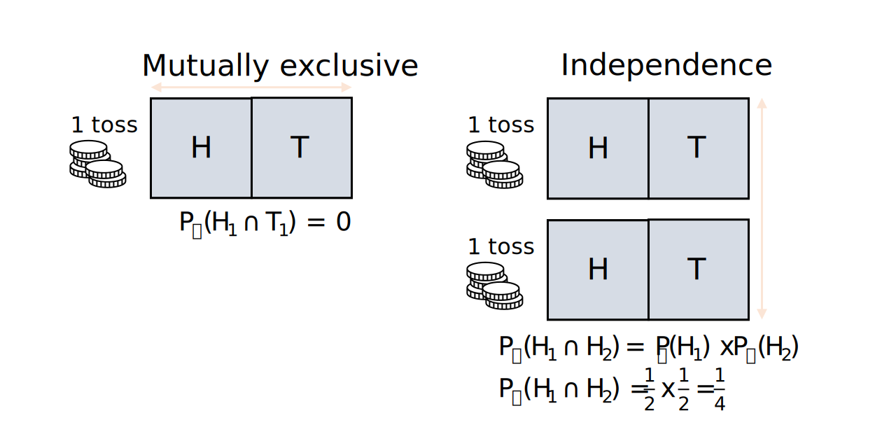

---
title: Probability theory - conditional probability
author: Erika Duan
date: "`r Sys.Date()`"
output:
  github_document:
    html_preview: FALSE
    toc: true
    toc_depth: 2
    math_method:
      engine: webtex
      url: https://latex.codecogs.com/svg.format?
---  

```{r setup, include=FALSE}
# Set up global environment configuration --------------------------------------
knitr::opts_chunk$set(echo=TRUE, results='hide', fig.align='center')
knitr::knit_engines$set(python = reticulate::eng_python)
```

```{r, echo=FALSE, message=FALSE, warning=FALSE}
# Load required R packages -----------------------------------------------------
if (!require("pacman")) install.packages("pacman")
p_load(tidyverse,
       RColorBrewer,
       scales,
       reticulate,
       knitr)

# Check version of Python used by reticulate -----------------------------------
reticulate::py_config()
```


# Independent events       

We previously learnt that two events can have overlapping elements or be mutually exclusive (also known as being disjointed).  

An example of two events being mutually exclusive is the observation that a coin can only land on either heads or tails when tossed. Mutual exclusivity therefore refers to the observation that only one or another distinct event is possible in a single outcome, which is different to the concept of independent events.     

When events are independent of each other, two or more events have occurred where the occurrence of one event does not impact the occurrence of another event i.e. the occurrence of one event does not change the probability of another event occurring).  

An example of independent events is the observation that the outcomes from two coin tosses are independent of each other. The observation that the first coin lands on heads does not increase the probability that the second coin also lands on heads, because each coin toss has a set probability of landing on either heads or tails.      

```{r, echo=FALSE, results='markup', out.width="70%"}

```

**Note:** To check whether event A and B are independent, we can check whether $P(A\cap B)=P(A)\times P(B)$.   

```{r}
# Check event independence -----------------------------------------------------

```

```{python}
# Check event independence -----------------------------------------------------
```


# Conditional probability  

The opposite of the concept of independent events is conditional probability. The conditional probability of rain when the weather is cloudy or sunny is denoted as $P(rain|cloudy)$ or $P(rain|sunny)$. We instinctively understand that we are interested in predicting the probability of rain when we have observed that it is either cloudy or sunny and that these two probabilities may be very different i.e. $P(rain|cloudy) > P(rain|sunny)$.  

This example illustrates the two properties of conditional probabilities:   

+ It describes the probability of event A occurring.         
+ It is known that event B has occurred and the occurrence of event B changes the probability of event A occurring.        

```{r, echo=FALSE, results='markup', out.width="70%"}
knitr::include_graphics("../figures/probability-conditional_probability-weather_conditions.svg")
```


# Mathematical definitions  


# Tree diagrams 


# Acknowledgements  

The source materials for this tutorial are:   

+ [StackExchange answer](https://math.stackexchange.com/questions/941150/what-is-the-difference-between-independent-and-mutually-exclusive-events) on the difference between mutually exclusive and independent events    
+ Introductory Statistics [online textbook](https://saylordotorg.github.io/text_introductory-statistics/s07-03-conditional-probability-and-in.html) by Saylor Academy     
+ Independence and conditional probability [Youtube series](https://www.khanacademy.org/math/ap-statistics/probability-ap/stats-conditional-probability/v/testing-independence-from-experimental-data) from Khan academy   
+ The [Probability for Data Science textbook](https://probability4datascience.com/) by Stanley H Chan, specifically [Chapter 2](https://drive.google.com/file/d/1v9jLsbwG5Tl5d7XfLCfmhHuOkZZUOVNa/view) on probability     
+ Introduction to probability theory [GitHub resource](https://betanalpha.github.io/assets/case_studies/probability_theory.html) by Michael Betancourt   
+ Introduction to probability theory [Youtube series](https://www.youtube.com/playlist?list=PLUl4u3cNGP60hI9ATjSFgLZpbNJ7myAg6) from MIT   