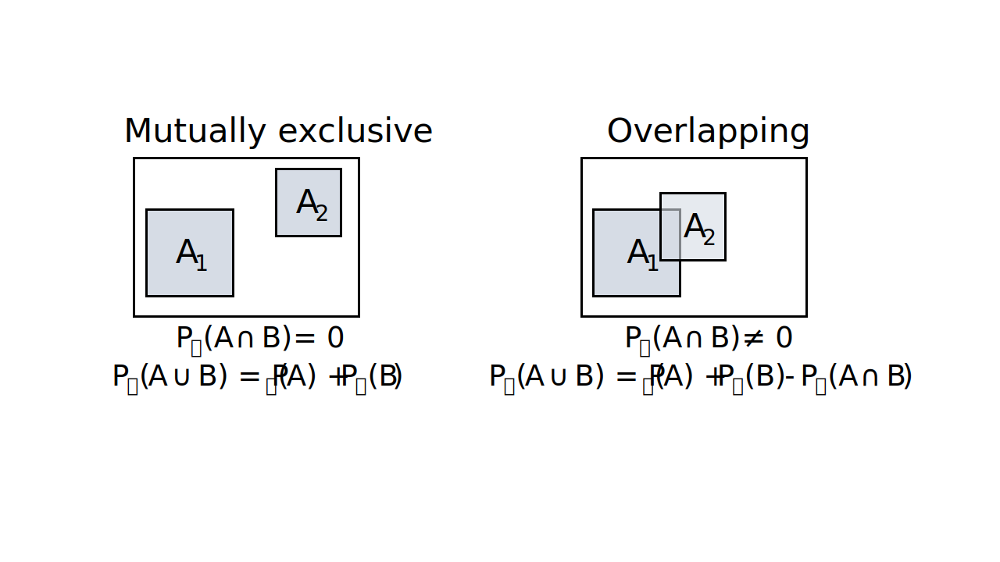

---
title: Probability theory - conditional probability
author: Erika Duan
date: "`r Sys.Date()`"
output:
  github_document:
    html_preview: FALSE
    toc: true
    toc_depth: 2
    math_method:
      engine: webtex
      url: https://latex.codecogs.com/svg.format?
---  

```{r setup, include=FALSE}
# Set up global environment configuration --------------------------------------
knitr::opts_chunk$set(echo=TRUE, results='hide', fig.align='center')
knitr::knit_engines$set(python = reticulate::eng_python)
```

```{r, echo=FALSE, message=FALSE, warning=FALSE}
# Load required R packages -----------------------------------------------------
if (!require("pacman")) install.packages("pacman")
p_load(tidyverse,
       RColorBrewer,
       scales,
       reticulate,
       knitr)

# Load Anaconda environment with Python 3.9 ------------------------------------
use_condaenv("python_3_9")
```


# Independent events       

We previously learnt that two events can have overlapping elements or be mutually exclusive. This is distinct to the concept of independent events.  

```{r, echo=FALSE, results='markup', out.width="70%"}

```


# Conditional probability  


# Acknowledgements  

The source materials for this tutorial are:   

+ https://math.stackexchange.com/questions/941150/what-is-the-difference-between-independent-and-mutually-exclusive-events  
+ The [Probability for Data Science textbook](https://probability4datascience.com/) by Stanley H Chan, specifically [Chapter 2](https://drive.google.com/file/d/1v9jLsbwG5Tl5d7XfLCfmhHuOkZZUOVNa/view) on probability     
+ Introduction to probability theory [GitHub resource](https://betanalpha.github.io/assets/case_studies/probability_theory.html) by Michael Betancourt   
+ Introduction to probability theory [Youtube series](https://www.youtube.com/playlist?list=PLUl4u3cNGP60hI9ATjSFgLZpbNJ7myAg6) from MIT   