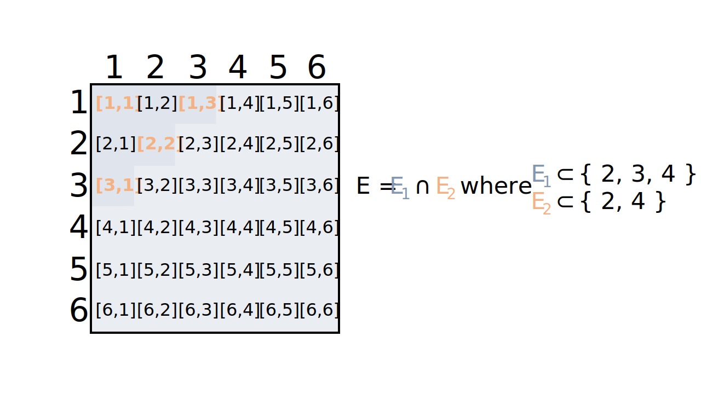
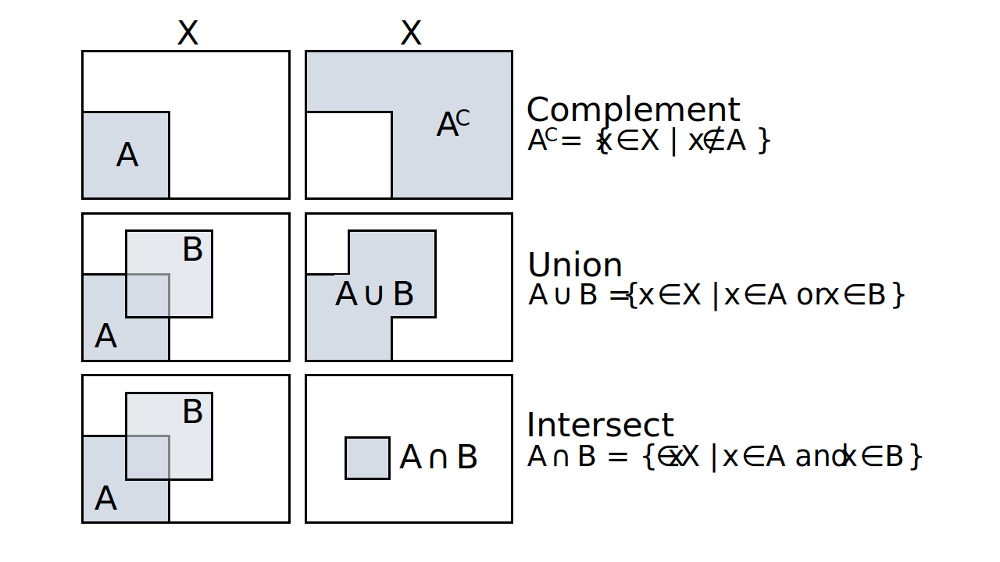

---
title: Probability theory - introduction
author: Erika Duan
date: "`r Sys.Date()`"
output:
  github_document:
    html_preview: FALSE
    toc: true
    toc_depth: 2
    math_method:
      engine: webtex
      url: https://latex.codecogs.com/svg.format?
---  

```{r setup, include=FALSE}
# Set up global environment configuration --------------------------------------
knitr::opts_chunk$set(echo=TRUE, results='hide', fig.align='center')
knitr::knit_engines$set(python = reticulate::eng_python)
```

```{r, echo=FALSE, message=FALSE, warning=FALSE}
# Load required R packages -----------------------------------------------------
if (!require("pacman")) install.packages("pacman")
p_load(tidyverse,
       RColorBrewer,
       scales,
       reticulate,
       knitr)

# Load Anaconda environment with Python 3.9 ------------------------------------
use_condaenv("python_3_9")
```


# Introduction to probability  

Probability is an abstract concept. The frequentist approach considers probability as the relative frequency of a specific outcome, observed from a sample of the true population. The Bayesian approach considers probability as a subjective possibility space dependent on the prior hypothesis and the observed evidence.  

Probability can be best thought of as the size of a mathematical set (which can also be represented in 2D as a proportion of the total area depicted).  

## Scenario 1  

Imagine that we simultaneously roll two fair dice. What is the probability that the sum of two dice equals 5?   

+ We would first need to calculate all possible combinations of the dice rolls. The total number of possible combinations is the **sample space** i.e. the set of all possible outcomes. As there are 6 faces on one dice and we are rolling two dice, the sample space is $6\times6$ or $6^2$ possible outcomes.    
+ We would then calculate all possible combinations of dice rolls which sum to 5. This is the **event**, which is a smaller subset of the sample space.  
+ The **probability** of the event occurring is therefore the ratio of the event relative to the sample space.  
+ In this scenario, the probability that the sum of two dice equals 5 is $\frac{4}{36}$ or approximately 0.11.  

```{r, echo=FALSE, results='markup', out.width="60%"}
knitr::include_graphics("../figures/probability-introduction_to_probability-scenario_1.svg")
```

## Scenario 2  

Imagine that we simultaneously roll two fair dice. What is the probability that the sum of two dice is less than 5 and an odd number?

+ The sample space is still the same, as the total number of possible dice roll combinations is fixed.  
+ The event subset has changed as we are interested in the intersection of $E_1 \subset \{2, 3, 4\}$ and $E_2 \subset \{2, 4\}$ or $E= E_1 \cap E_2 = \{2, 4\}$.  
+ In this scenario, the probability that the sum of two dice is less than 5 and an odd number is $\frac{4}{36}$ or approximately 0.11.  

```{r, echo=FALSE, results='markup', out.width="70%"}

```


# Set notations  

Sets are used to denote object belonging. The statement "the set of elements $x$ in the space $X$ such that condition $f(x) > 0$ holds" is represented by the notation $S = \{x \in X \vert f(x) > 0\}$.  

```{r, echo=FALSE, results='markup', out.width="70%"}
knitr::include_graphics("../figures/probability-introduction_to_probability-set_notations.svg")
```

Examples of sets include:   

+ The set $A_1 = \{x \in \mathbb{N} \vert 1 \leq x \leq 5 \}$ is a finite set with a finite closed interval on the set of all natural numbers.  
+ The set $A_2 = \{x \in \mathbb{R} \vert -5 \leq x \leq 1 \}$ is an infinite set with a finite closed interval on the set of all real numbers.  
+ The set $F = \{f: \mathbb{R} \to \mathbb{R} \vert f(x) = ax + b, \; a,b \in \mathbb{R} \}$ is an infinite set of all straight lines in 2D as $f$ takes the specific form $f(x) = ax+b$.  

In probability theory, the event can be viewed as a subset within the set of the sample space, where the total number of possible events is represented by the power set of the sample space and the probability of the sample space is 1.  


# Set operations  

Set operations are methods for manipulating sets and are useful tools for describing the properties of the probability space.   

+ The set **complement** is defined as all the elements that do not belong in the specified set. The set complement can be used to describe the probability that an event does not occur.  
+ The **union** of two sets is defined as the set of elements that are included in either set. The union of two sets can be used to describe the probability of either event A or event B occurring.  
+ The **intersection** of two sets is defined as the set of elements that are included in both sets. The intersection of two sets can be used to describe the probability that event A and event B both occurs.   

```{r, echo=FALSE, results='markup', out.width="70%"}

```

```{r}
# Perform set operations in R --------------------------------------------------
a <- c(1, 2, 3)
b <- c(2, 4) 

union(a, b)
#> [1] 1 2 3 4

intersect(a, b)  
#> [1] 2 

setdiff(a, b)
#> [1] 1 3 

setequal(a, b) 
#> [1] FALSE
```

```{python}
# Perform set operations in Python ---------------------------------------------
# Variables in the R environment can be accessed in Python via R.variable
# Atomic vectors in R are automatically converted into Python lists

a = set(r.a)
b = set(r.b)

a.union(b) # Can also be evaluated as a | b
#> {1.0, 2.0, 3.0, 4.0} 

a.intersection(b)
#> {2.0} # Can also be evaluated as a & b

a.difference(b)
#> {1.0, 3.0}

a.symmetric_difference(b) # Can also be evaluated as a ^ b
#> {1.0, 3.0, 4.0}
```

Revisiting scenario 2, 


# General rules of probability  


# Resources  
+ The [Probability for Data Science textbook](https://probability4datascience.com/) by Stanley H Chan, specifically [Chapter 2](https://drive.google.com/file/d/1v9jLsbwG5Tl5d7XfLCfmhHuOkZZUOVNa/view) on probability     
+ Introduction to probability theory [GitHub resource](https://betanalpha.github.io/assets/case_studies/probability_theory.html) by Michael Betancourt   
+ Introduction to probability theory [Youtube series](https://www.youtube.com/playlist?list=PLUl4u3cNGP60hI9ATjSFgLZpbNJ7myAg6) from MIT   
  
