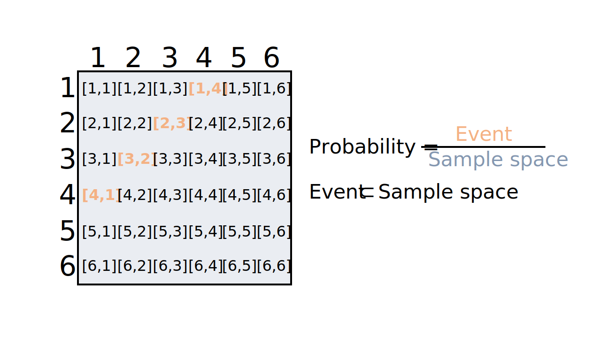
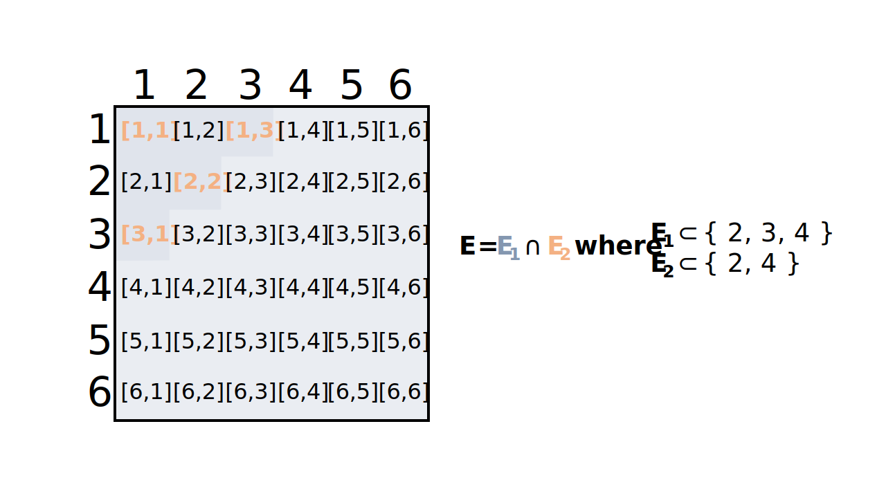
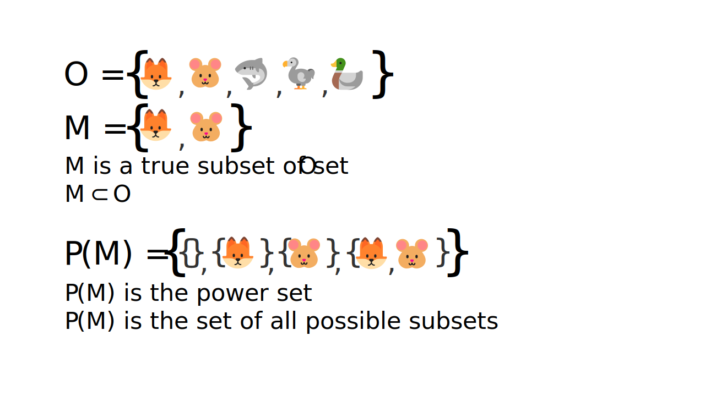
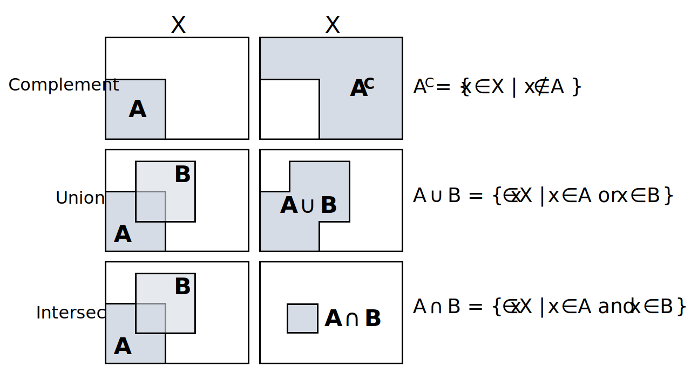

Probability theory - introduction
================
Erika Duan
2022-03-27

-   [Introduction to probability](#introduction-to-probability)
    -   [Scenario 1](#scenario-1)
    -   [Scenario 2](#scenario-2)
-   [Set notations](#set-notations)
-   [Set operations](#set-operations)
-   [General rules of probability](#general-rules-of-probability)
-   [Resources](#resources)

# Introduction to probability

Probability is an abstract concept. The frequentist approach considers
probability as the relative frequency of a specific outcome, observed
from a sample of the true population. The Bayesian approach considers
probability as a subjective possibility space dependent on the prior
hypothesis and the observed evidence.

Probability can be best thought of as the size of a mathematical set
(which can also be represented in 2D as a proportion of the total area
depicted).

## Scenario 1

Imagine that we simultaneously roll two fair dice. What is the
probability that the sum of two dice equals 5?

-   We would first need to calculate all possible combinations of the
    dice rolls. The total number of possible combinations is the
    **sample space** i.e. the set of all possible outcomes. As there are
    6 faces on one dice and we are rolling two dice, the sample space is
    
    or 
    possible outcomes.  
-   We would then calculate all possible combinations of dice rolls
    which sum to 5. This is the **event**, which is a smaller subset of
    the sample space.  
-   The **probability** of the event occurring is therefore the ratio of
    the event relative to the sample space.  
-   In this scenario, the probability that the sum of two dice equals 5
    is
    
    or approximately 0.11.



## Scenario 2

Imagine that we simultaneously roll two fair dice. What is the
probability that the sum of two dice is less than 5 and an odd number?

-   The sample space is still the same, as the total number of possible
    dice roll combinations is fixed.  
-   The event subset has changed as we are interested in the
    intersection of
    
    and
    
    or
    .  
-   In this scenario, the probability that the sum of two dice is less
    than 5 and an odd number is
    
    or approximately 0.11.



# Set notations

Sets are used to denote object belonging. The statement “the set of
elements  in the space
 such that condition
 > 0")
holds” is represented by the notation
 > 0\}").



Examples of sets include:

-   The set
    
    is a finite set with a finite closed interval on the set of all
    natural numbers.  
-   The set
    
    is an infinite set with a finite closed interval on the set of all
    real numbers.  
-   The set
     = ax + b, \; a,b \in \mathbb{R} \}")
    is an infinite set of all straight lines in 2D as
     takes the specific
    form
     = ax+b").

In probability theory, the event can be viewed as a subset within the
set of the sample space, where the total number of possible events is
represented by the power set of the sample space and the probability of
the sample space is 1.

# Set operations

Set operations are methods for manipulating sets and are useful tools
for describing the properties of the probability space.

-   The set **complement** is defined as all the elements that do not
    belong in the specified set. The set complement can be used to
    describe the probability that an event does not occur.  
-   The **union** of two sets is defined as the set of elements that are
    included in either set. The union of two sets can be used to
    describe the probability of either event A or event B occurring.  
-   The **intersection** of two sets is defined as the set of elements
    that are included in both sets. The intersection of two sets can be
    used to describe the probability that event A and event B both
    occurs.



``` r
# Perform set operations in R --------------------------------------------------
a <- c(1, 2, 3)
b <- c(2, 4) 

union(a, b)
#> [1] 1 2 3 4

intersect(a, b)  
#> [1] 2 

setdiff(a, b)
#> [1] 1 3 

setequal(a, b) 
#> [1] FALSE
```

``` python
# Perform set operations in Python ---------------------------------------------
# Variables in the R environment can be accessed in Python via R.variable
# Atomic vectors in R are automatically converted into Python lists

a = set(r.a)
b = set(r.b)

a.union(b) # Can also be evaluated as a | b
#> {1.0, 2.0, 3.0, 4.0} 
```

``` python
a.intersection(b)
#> {2.0} # Can also be evaluated as a & b
```

``` python
a.difference(b)
#> {1.0, 3.0}
```

``` python
a.symmetric_difference(b) # Can also be evaluated as a ^ b
#> {1.0, 3.0, 4.0}
```

Revisiting scenario 2,

# General rules of probability

# Resources

-   The [Probability for Data Science
    textbook](https://probability4datascience.com/) by Stanley H Chan,
    specifically [Chapter
    2](https://drive.google.com/file/d/1v9jLsbwG5Tl5d7XfLCfmhHuOkZZUOVNa/view)
    on probability  
-   Introduction to probability theory [GitHub
    resource](https://betanalpha.github.io/assets/case_studies/probability_theory.html)
    by Michael Betancourt  
-   Introduction to probability theory [Youtube
    series](https://www.youtube.com/playlist?list=PLUl4u3cNGP60hI9ATjSFgLZpbNJ7myAg6)
    from MIT
