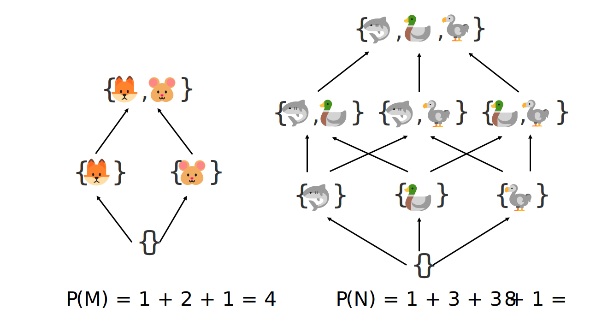
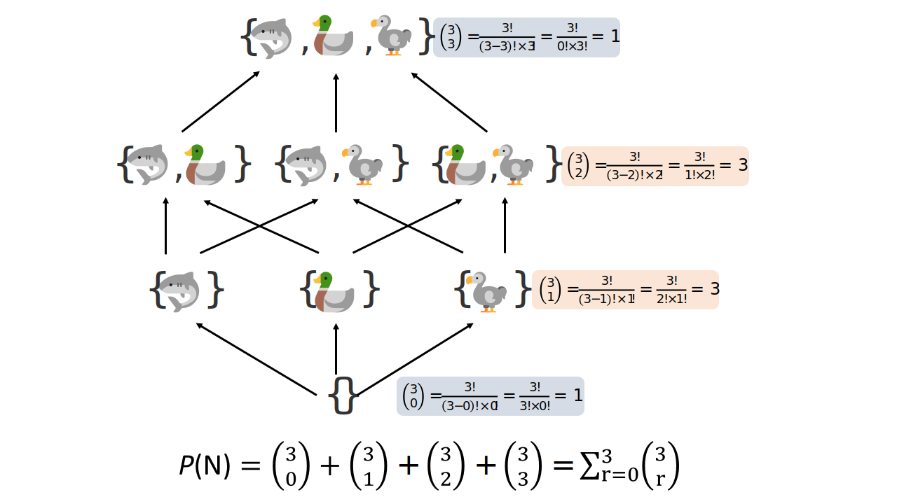
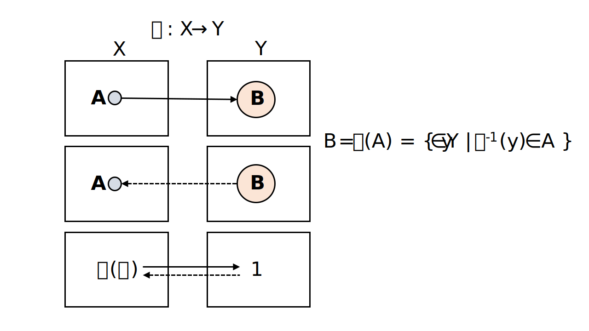

Probability theory - introduction
================
Erika Duan
2022-04-18

-   [Introduction to probability](#introduction-to-probability)
    -   [Scenario 1](#scenario-1)
    -   [Scenario 2](#scenario-2)
-   [Set notations](#set-notations)
    -   [The power set](#the-power-set)
-   [Set operations](#set-operations)
-   [General rules of probability](#general-rules-of-probability)
-   [Acknowledgements](#acknowledgements)

# Introduction to probability

Probability is an abstract concept. The frequentist approach considers
probability as the relative frequency of a specific outcome, observed
from a sample of the true population. The Bayesian approach considers
probability as a subjective possibility space dependent on the prior
hypothesis and the observed evidence.

Probability can be best thought of as the size of a mathematical set
(which can be represented in 2D as a proportion of the total area).

## Scenario 1

Imagine that we simultaneously rolled two fair dice. What is the
probability that the sum of two dice equals 5?

-   From our understanding of the properties of fair dice, we know that
    the outcome of one dice throw is independent of another.  
-   We need to calculate all possible combinations of two independent
    dice rolls. The total number of possible combinations is the
    **sample space** i.e. the set of all possible outcomes. As there are
    6 faces on one dice and we are rolling two dice, the sample space is
    
    or 
    possible outcomes.  
-   We would then calculate all possible combinations of dice rolls
    which sum to 5. This is the **event**
    (), which is a
    smaller subset of the sample space.  
-   The **probability** of the event occurring is therefore the ratio of
    the event relative to the sample space.  
-   In this scenario, the probability that the sum of two dice equals 5
    is
    
    or approximately 0.11.


## Scenario 2

Imagine that we simultaneously rolled two fair dice. What is the
probability that the sum of two dice is less than 5 **and** an odd
number?

-   The sample space is still the same, as the total number of possible
    dice roll combinations is fixed.  
-   The event subset has changed as we are interested in the
    intersection of
    
    and
    
    i.e. .  
-   In this scenario, the probability that the sum of two dice is
    
    is
    
    or approximately 0.11.


# Set notations

Sets are used to denote object belonging under a specific condition. The
statement “the set of elements
 in the space
 such that condition
>0")
holds” is represented by the notation
>0\}").


Examples of sets include:

-   The set
    
    is a finite set with a finite closed interval on the set of all
    natural numbers.  
-   The set
    
    is an infinite set with a finite closed interval on the set of all
    real numbers.  
-   The set
    =ax+b,\;a,b\in\mathbb{R}\}")
    is an infinite set of all straight lines in 2D as
     takes the specific
    form
    =ax+b").

In probability theory, the event can be viewed as a subset within the
set of the sample space, where the total number of possible event types
(or total possible event combinations) is represented by the power set
of the sample space.

## The power set

When the elements inside a set are finite and countable, we can
calculate the total number of possible event types in two elegant ways.

Consider the graphical approach drawn below. We can map all possible
element combinations for every possible subset size. Doing so highlights
the existence of graph symmetry where, for example, the smallest and
largest subsets contain the same number of element combinations i.e. 1.
The graphical approach, however, is cumbersome for large sets.



We can then consider the numerical approach. For each subset size, we
must calculate how many unique element combinations exist. We do not
care about element order and element repetition also cannot occur.

When a set has 3 elements, the combinations of a subset containing 2
elements is
!\times 2!}")
or
.  
For the same set of 3 elements, the combinations of a subset containing
1 element is
!\times 1!}")
or
.

**Note:** The graph symmetry of a power set can be explained by the
observation that
!\times 2!}= \frac{3!}{(3-1)!\times 1!} = \frac{3!}{2!}").



The power set, or total number of possible event types, is therefore the
sum of all possible subset combinations. A quick [mathematical
proof](https://www.youtube.com/watch?v=wM9T--A1gQA) using the binomial
theorem shows how the power set can be calculated as
, where n is
the size of the set.

# Set operations

Set operations are methods for manipulating sets and are useful tools
for describing the properties of the probability space.

-   The set **complement** is defined as all the elements that do not
    belong in the specified set. The set complement can be used to
    describe the probability that an event does not occur.  
-   The **union** of two sets is defined as the set of elements that are
    included in either set. The union of two sets can be used to
    describe the probability of either event A or event B occurring.  
-   The **intersection** of two sets is defined as the set of elements
    that are included in both sets. The intersection of two sets can be
    used to describe the probability that event A and event B both
    occurs.


``` r
# Perform set operations in R --------------------------------------------------
a <- c(1, 2, 3)
b <- c(2, 4) 

union(a, b)
#> [1] 1 2 3 4

intersect(a, b)  
#> [1] 2 

setdiff(a, b)
#> [1] 1 3 

setequal(a, b) 
#> [1] FALSE
```

``` python
# Perform set operations in Python ---------------------------------------------
# Variables in the R environment can be accessed in Python via R.variable
# Atomic vectors in R are automatically converted into Python lists

a = set(r.a)
b = set(r.b)

a.union(b) # Can also be evaluated as a | b
#> {1.0, 2.0, 3.0, 4.0} 
```

``` python
a.intersection(b) # Can also be evaluated as a & b
#> {2.0} 
```

``` python
a.difference(b)
#> {1.0, 3.0}
```

``` python
a.symmetric_difference(b) # Can also be evaluated as a ^ b
#> {1.0, 3.0, 4.0}
```

Revisiting [scenario 2](#Scenario%202), the probability that the sum of
two dice is less than 5 **and** an odd number is the intersection of

and

or
.

If we were asked to find the probability that the sum of two dice is
less than 5 **or** an odd number, this would be
,
which is a very different subset of the sample space.

# General rules of probability

We can think of a function as a relation that associates a set of
elements in the input space (subset A in X) to a set of elements in the
output space (subset B in Y). A function induces this mapping of
 by
applying itself to each individual element in the input space. The act
of being a relation implies that an inverse function also exists, which
maps the set of elements in the output space back to the set of elements
in the input space
i.e. ").

A probability distribution can be thought of as the function which maps
a set of events to their set of probabilities.



Consider the set 
as a subset of the sample space X, where
")
is the probability assigned to
 by the
probability distribution
:  
+ The probability of X is the probability of all events (or all possible
subsets) occurring
i.e. =1").
Since probability is the ratio of the event to the sample space, we can
define
=1")
for simplicity.  
+ The complement of
=1")
is the probability of an impossible event
i.e. =0").  
+ The range of possible probabilities for
 is therefore
\leq1")
and
=1-P_{\pi}(A_1^C)").


Consider the set 
as a different subset of the sample space X:  
+ If  and
 are mutually
exclusive (elements in
 and
 do not overlap),
the intersection of
 and
 is 0
i.e.  = 0")
and the probability of
 or
 occurring is
 = P_\pi(A_1) + P_\pi(A_2)").  
+ If  and
 are not mutually
exclusive (elements in
 and
 overlap), the
probability of 
or  occurring is
 = P_\pi(A_1) + P_\pi(A_2) - P_\pi(A_1\cap A_2)").

**Note**: The term mutually exclusive refers to the property of whether
elements in two or more subsets overlap with each other.

# Acknowledgements

The source materials for this tutorial are:

-   The [Probability for Data Science
    textbook](https://probability4datascience.com/) by Stanley H Chan,
    specifically [Chapter
    2](https://drive.google.com/file/d/1v9jLsbwG5Tl5d7XfLCfmhHuOkZZUOVNa/view)
    on probability  
-   Introduction to probability theory [GitHub
    resource](https://betanalpha.github.io/assets/case_studies/probability_theory.html)
    by Michael Betancourt  
-   Introduction to probability theory [Youtube
    series](https://www.youtube.com/playlist?list=PLUl4u3cNGP60hI9ATjSFgLZpbNJ7myAg6)
    from MIT  
-   [General probability rules from
    STAT800](https://online.stat.psu.edu/stat800/lesson/general-probability-rules)
    from Penn State Eberly College of Science
